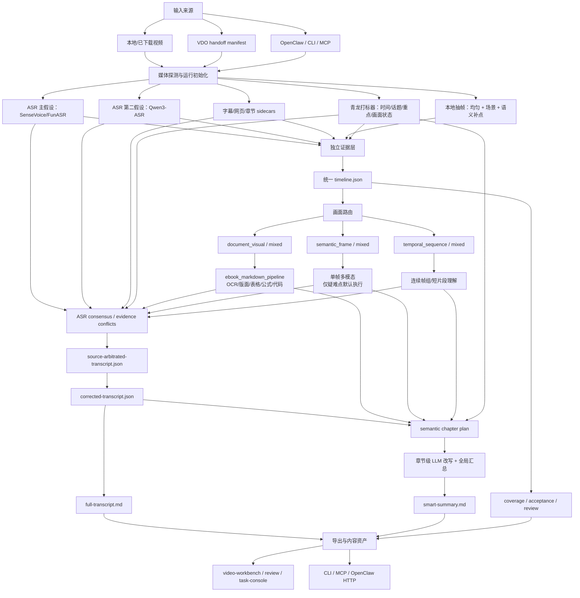

# VKP 架构与开源代码复用审计

## 更新记录

- 2026-07-10 16:03:16 | Codex / GPT-5 | 基于 VKP 当前源码、历史复用文档、本地拉取的真实开源源码和官方仓库检索，重建项目架构图，核对外部代码复用状态，并给出下一阶段的源码复用优先级。
- 2026-07-10 17:17:52 | Codex / GPT-5 | 根据 WorkBuddy 的独立复核，补充“得到大脑”术语定义、工程成熟度与内容质量边界、待新增文件标记及源码清单范围说明。
- 2026-07-10 17:20:42 | Codex / GPT-5 | 根据用户确认，修正产品沿革：“得到大脑”是“get笔记”更名后的产品。

## 1. 审计目标与方法

这次审计回答四个问题：

1. `video-knowledge-pipeline` 当前到底由哪些层组成，数据怎样流动。
2. 过去参考过的开源项目中，哪些代码已经真正复用，哪些只是借鉴思路。
3. 现有架构还缺哪些成熟底座，是否有新的开源模块可以直接接入。
4. 下一阶段怎样继续复用，而不是继续扩大自研代码面积。

证据来源：

- 当前仓库的 `src/video_knowledge_pipeline`、`config/video-knowledge-pipeline.json`、`README.md`、`AGENT_DISCOVERY.md` 和测试。
- `docs/external-code-*`、`docs/*source-review*`、`docs/open-source-asr-vlm-code-review.md` 等历史复用记录。
- `%WORKSPACE_ROOT%\tool-source-review` 中已拉取的真实源码。
- 本轮通过 agent-reach 的 Exa 搜索、GitHub 官方仓库和论文官方代码做的补充检索。

术语说明：本文所称“得到大脑”，是“get笔记”更名后的产品；它只用于质量评测对照，不进入 VKP 的生产纠错证据链。

本报告区分以下复用等级：

| 等级 | 定义 |
| --- | --- |
| 运行时直接复用 | VKP 直接调用开源包、CLI、HTTP 服务或本地项目稳定接口。 |
| 代码适配复用 | 从外部源码提取低耦合模块，改造成 VKP 模块并有测试。 |
| 契约/算法复用 | 沿用外部项目的数据结构或算法，但由 VKP 重新实现。 |
| UI/流程参考 | 只吸收交互或工作流，不复用其运行代码。 |
| 仅研究/计划 | 已审源码，但尚未进入默认处理链。 |

## 2. 结论摘要

### 2.1 架构方向

当前方向基本正确。VKP 已经形成“证据抽取和融合平台”，不再只是视频摘要器：

- 下载与平台访问交给 `video-download-orchestrator`。
- ASR、字幕、网页上下文、青龙打标、抽帧、OCR、单帧视觉和多帧视觉先独立完成。
- 所有证据进入统一 `timeline.json`，再做冲突检测、逐字稿纠正、语义章节和智能总结。
- `knowledge-note.md` 保留证据审计；`full-transcript.md` 负责逐字稿；`smart-summary.md` 负责成品总结。
- 静态 WebUI、CLI、MCP 和 OpenClaw bridge 共享同一个 bundle/manifest 契约。

### 2.2 主要问题

当前最大问题不是模块缺失，而是以下能力仍有较多自研实现或编排债务：

1. 双 ASR 目前主要按时间重叠和 `SequenceMatcher` 对齐，词级差异定位与局部补丁还不够成熟。
2. 抽帧已有长视频均匀覆盖和疑难点补帧，但场景切分仍是自有轻量实现，没有直接采用成熟场景检测库。
3. 质量基准和人工标注 UI 已能用，但 CER/说话人/对齐评测、波形分段编辑仍比专业工具弱。
4. `acceptance-run`、逐字稿证据纠正、语义章节和章节级 LLM 是几条相互衔接但独立的编排脊柱；还没有一个闭合的质量优先总编排器。
5. `timeline.json` 是视觉证据工作集，最终逐字稿又位于 sidecar；这是合理的双层设计，但消费者若忽略 manifest 优先级和 quality gate，容易读到旧 transcript。
6. CLI/MCP 公开面已经很大，存在命令和 `_tool` 别名并行、发现文档过长的问题。下一阶段应收敛推荐入口，而不是继续无限增加顶层工具。

### 2.3 下一批最值得直接复用的项目

| 优先级 | 项目 | 应复用模块 | 预期收益 |
| --- | --- | --- | --- |
| P0 | [transcribe-critic](https://github.com/ringger/transcribe-critic) | 多 ASR 词级差异、匿名仲裁、局部补丁、checkpoint、重复幻觉检测 | 直接加强 Phase 17 的双 ASR 仲裁，减少整段 LLM 自由改写。 |
| P0 | [PySceneDetect](https://github.com/Breakthrough/PySceneDetect) | `SceneManager`、`AdaptiveDetector`、`ContentDetector`、可选 `TransnetV2Detector` | 用成熟场景边界替代轻量自研 scene-change 逻辑，同时保留全片均匀采样。 |
| P0 | [Label Studio](https://github.com/HumanSignal/label-studio) | 社区版 Audio waveform、segment、Video/Audio/Paragraphs sync、导入导出 JSON | 不再继续扩写自有人工金标 UI，改做 VKP 与专业标注工具的适配器。 |
| P0 | [MeetEval](https://github.com/fgnt/meeteval) | cpWER、ORC-WER、时间约束 WER、STM/RTTM/SegLST | 让 24 段人工基准覆盖多人语音、说话人和时间对齐，而不只看自写 CER。 |
| P1 | [ASR.lab](https://github.com/berangerthomas/ASR.lab) | 多引擎注册、CER/WER/RTF、交互式 HTML 对比报告 | 可选择性吸收报告和 engine plugin，不建议整体依赖。 |
| P1 | [DeepVideoDiscovery](https://github.com/microsoft/DeepVideoDiscovery) | 全局浏览 -> 检索片段 -> 帧复核 -> 二次确认的工具循环 | 把当前 VideoRAG 和视觉疑难复核串成可审计的迭代查询。 |
| P1 | [VideoLucy](https://github.com/worldbench/VideoLucy) | coarse/fine/super-fine memory 和按问题逐层回看 | 加强长视频 RAG 和疑难点回溯，不用于默认全片重跑。 |
| P1 | [Lhotse](https://github.com/lhotse-speech/lhotse) | Recording/Supervision/Cut/Alignment manifest | 统一人工基准、音频切片、说话人和 word alignment 的离线数据契约。 |
| P1 | [Instructor](https://github.com/567-labs/instructor) | Pydantic structured output、重试和校验 | 替换部分自写 JSON repair，但只放在现有 LiteLLM/provider 之后。 |

## 3. 当前总体架构



关键原则：第一轮证据互相独立，融合发生在证据保存之后；本地多抽帧不等于把所有帧发送到在线多模态。

## 4. 代码层模块地图

| 层 | 当前主文件 | 主要输入 | 主要输出 | 当前判断 |
| --- | --- | --- | --- | --- |
| 配置与入口 | `config.py`、`cli.py`、`mcp_server.py`、`config/video-knowledge-pipeline.json` | CLI/MCP 参数、统一配置 | 任务参数、provider profile、端口契约 | 成熟；统一配置源已建立。 |
| VDO/OpenClaw 接力 | `vdo_handoff.py`、`openclaw_integration.py`、`openclaw_http.py` | URL、VDO manifest、本地媒体 | preview/ingest workspace、operator boundary | 成熟；下载边界清楚。 |
| 本地视频准备 | `local_video_run.py`、`media_tools.py`、`video_source.py` | 视频和可选 transcript | run report、初始 bundle | 成熟。 |
| 抽帧与补帧 | `orchestrator.py`、`video.py`、`supplemental_frame_sampling.py`、`frame_recapture.py` | 时长、模式、ASR、疑难点 | frame paths、sampling plan | 已支持 balanced/dense/triage；缺成熟 scene detector。 |
| ASR 执行 | `funasr_python_runner.py`、`qwen3_asr_python_runner.py`、`asr_runner.py`、`asr_execution.py` | 音频、ASR preset | raw/normalized transcript、SRT | SenseVoice 主线稳定；Qwen3-ASR 已 smoke，默认切换仍受基准门禁。 |
| ASR 对齐/共识 | `asr_consensus.py`、`whisperx_alignment.py`、`transcript_sidecar.py` | 两套 ASR、时间戳 | agreement/conflict windows、alignment evidence | 已可用，但词级对齐与补丁链仍偏自研。 |
| 青龙打标 | `tagger_import.py` | tagger JSON/时间轴 | tags、quality issues、时间轴证据 | 已进入 timeline 和 triage 权重。 |
| 视觉路由 | `video_frame_router.py`、`vision_review_triage.py` | transcript、frame、OCR、tags | document/semantic/temporal queues | 已成主分流器。 |
| 图文结构 | `visual_structure.py`、`high_res_tile_plan.py`、`tile_result_*` | document frame/tile | `visual_text`、`structured_visual` | 主要复用 ebook pipeline，方向正确。 |
| 单帧视觉 | `multimodal_frame_analyzer.py`、`vision_api.py`、`vision_preflight.py` | 疑难帧 | `visual_understanding` | provider 层成熟；默认疑难点优先。 |
| 连续视觉 | `temporal_frame_groups.py`、`temporal_visual_analyzer.py` | 5-12 帧组 | event/state/action chain | 可用；未来可接长视频逐层回看。 |
| 证据冲突与纠正 | `evidence_conflict_index.py`、`transcript_source_arbitration.py`、`transcript_evidence_correction_pipeline.py` | ASR/字幕/OCR/标签/视觉 | source-arbitrated、corrected transcript | 主方向正确；需复用成熟多假设差异算法。 |
| 质量基准 | `quality_benchmark.py`、`quality_console.py`、`transcript_quality_gate.py` | 人工真值、ASR 变体 | CER/标点/实体/时间戳报告 | 24 段框架已建，金标未完成；指标层应复用 MeetEval。 |
| 章节与总结 | `semantic_chapter_plan.py`、`smart_summary_*` | corrected transcript + evidence | chapter JSON、course map、smart summary | 语义章节已落地；最终质量仍依赖真实 LLM 和盲评。 |
| 审核与 UI | `review_session.py`、`transcript_editor.py`、`video_workbench.py`、`task_console.py` | bundle/runs/review rows | 静态 HTML、review notes | 功能广；专业音频金标不应继续自研。 |
| RAG/内容资产 | `video_rag_*`、`video_moment_index.py`、`long_video_memory_pack.py`、`knowledge_note_export.py` | timeline/chapters/evidence | 检索单元、素材卡、Markdown | 本地 keyword/sqlite 可用；向量/迭代复核仍较轻。 |

表中的“成熟”“可用”等描述只表示实现、接口和测试契约的工程成熟度，不代表逐字稿或智能总结已经达到目标准确率。内容质量仍以 24 段人工真值、三视频盲评及相应 CER、实体/数字、时间戳指标为准；当前基准尚未闭合。

## 5. 核心数据产物

| 产物 | 角色 | 是否允许被覆盖 |
| --- | --- | --- |
| `raw-asr-output.json` | 原始 ASR 证据 | 不覆盖。 |
| `normalized-transcript.json/.srt` | 单个 ASR 的标准化输出 | 新运行生成新产物，不抹掉原始。 |
| `asr-consensus.json` | 双 ASR 一致区、冲突区、遗漏区 | 仅证据，不直接替换主稿。 |
| `timeline.json` | ASR、帧、OCR、视觉、标签和人审的统一时间轴 | 只能通过受控导入/执行器更新。 |
| `source-arbitrated-transcript.json` | 多源证据仲裁后的事实层 | 仅通过高置信补丁写入。 |
| `corrected-transcript.json` | 事实纠正后再做标点、断句和段落化的最终逐字稿源 | `full-transcript.md` 应优先读取它。 |
| `semantic-chapter-plan.json` | 主题/停顿/标签/视觉变化综合章节 | 章节 LLM 的导航骨架。 |
| `smart-summary-chapters.json` | 每章结构化总结和引用 | 全片汇总只消费章节结果，不重新吃 raw ASR。 |
| `exports/full-transcript.md` | 人类可读逐字稿 | 导出产物。 |
| `exports/smart-summary.md` | 人类可读成品总结 | 只有通过质量门禁的 LLM 版本才应视为 final。 |
| `exports/knowledge-note.md` | 证据、缺口、视觉和审计层 | 不承担自然成品总结。 |

## 6. 历史开源项目复用审计

### 6.1 已经真正进入运行链的底座

| 项目 | 本地源码/版本证据 | VKP 落点 | 复用类型 | 结论 |
| --- | --- | --- | --- | --- |
| [FunASR](https://github.com/modelscope/FunASR) / [SenseVoice](https://github.com/FunAudioLLM/SenseVoice) | `tool-source-review/FunASR`、`SenseVoice`；运行环境已安装 | `funasr_python_runner.py`、`asr_environment.py`、`asr_runner.py` | 运行时直接复用官方包 | 中文 ASR 主底稿；继续使用 VAD/ITN/punc，不能把其片段时间当精确词级对齐。 |
| [Qwen3-ASR](https://github.com/QwenLM/Qwen3-ASR) | 本地 `7c6daf7`；官方 `qwen-asr` 包；1.7B/ForcedAligner 已本机 smoke | `qwen3_asr_python_runner.py`、`asr_consensus.py`、quality profile | 运行时直接复用官方包 | 作为独立第二 ASR；必须等 24 段基准通过才可切换默认。 |
| [LiteLLM](https://github.com/BerriAI/litellm) | `pyproject.toml` 的 `online` / `hybrid` extra 锁定 `litellm[proxy]>=1.81.7,<2`；本机验证版本 `1.81.7` | `model_gateway.py`、`model_runtime_client.py`、`online_model_gateway.py` | 运行时直接复用 | 复用 Proxy 的 provider 协议、正式 chat/ASR/OCR 端点和同一远程池内有序 fallback；VKP 保留 consent、目的地白名单、任务语义和产物写回。 |
| `ebook_markdown_pipeline` | 本机注册工具和 MCP/HTTP 契约 | `visual_structure.py` | 稳定本地工具直接复用 | 图文截图主通道；MinerU/Marker/RapidOCR 由 ebook 项目负责，VKP 不重写。 |
| [PrideWood/bilinote](https://github.com/PrideWood/bilinote) | 本地提交 `25ee9ba` | `bilinote_transcript_tools.py`、`bilinote_summary_tools.py`、`transcript_correction_pack.py`、transcript/section editor | 代码适配复用 | 字幕解析、清洗、短句合并、固定 index 校对契约和 UI 交互已落地。 |
| [vsummary](https://github.com/alpha03123/vsummary) | 本地提交 `1b8ac39` | `text_llm_gateway.py`、`stage_cache.py`、`run_artifact_registry.py`、`cuda_runtime.py`、task/workbench seek | 代码适配复用 | provider、JSON repair、run artifact、CUDA discovery 和视频 seek 已进入实际模块；`StageCache` 目前主要是模块和测试，尚未广泛接入 ASR/OCR/summary 生产调用。未搬整套 React/FastAPI。 |

### 6.2 已形成适配器或本地能力，但不是直接运行外部源码

| 项目 | VKP 落点 | 实际复用等级 | 还可做什么 |
| --- | --- | --- | --- |
| [Peepshow](https://github.com/t0mtaylor/peepshow) `17d9d24` | `peepshow_adapter.py`、vision review/task-console | 契约和 UI/报告参考 | 保留可选 evidence extractor；不替代 ebook、多模态和 timeline fusion。 |
| [VideoRAG](https://github.com/HKUDS/VideoRAG) `c412a09` | `video_rag_pack.py`、`video_rag_search.py`、`video_rag_http.py` | 数据契约/算法复用 | 当前只有 keyword/sqlite；不要整体引入其重型视觉图谱和非商用 ImageBind 路线。 |
| [VTimeLLM](https://github.com/huangb23/VTimeLLM) `c34ae56` | `video_moment_index.py`、`timeline_alignment_audit.py` | 时间定位思想复用 | 当前不运行模型源码。 |
| [MovieChat](https://github.com/wenhaochai/MovieChat) `ba9bb80` | `long_video_memory_pack.py` | short/long memory 思想复用 | 可被 VideoLucy 式 coarse/fine/super-fine 回看替代或增强。 |
| [Qwen2.5-VL](https://github.com/QwenLM/Qwen2.5-VL)、[InternVL](https://github.com/OpenGVLab/InternVL)、[LLaVA-NeXT](https://github.com/LLaVA-VL/LLaVA-NeXT) | `vlm_preprocess.py`、`local_vlm_server_adapter.py`、tile/import 模块 | 预处理算法和服务契约复用 | 主流程不 import 模型仓库；只调用已启动 OpenAI-compatible 服务。 |
| [Speaches](https://github.com/speaches-ai/speaches) | `local_asr_service_adapter.py` | API 契约参考 | 适合作为 agent 共用本地 ASR 服务，但当前不是默认 ASR 后端。 |
| [WhisperX](https://github.com/m-bain/whisperX) | `whisperx_alignment.py` | 入口/证据契约已建，运行尚未完全验收 | 只用于对齐和说话人，不作为第二 ASR。 |
| [faster-whisper](https://github.com/SYSTRAN/faster-whisper) / AI-Video-Transcriber `ade833b` | `faster_whisper_python_runner.py`、`cuda_runtime.py` | 运行时包契约和参数参考 | 保留跨语种 fallback；没有搬 AI-Video-Transcriber 整套 UI。 |
| [CaptiOCR](https://github.com/carlosacchi/captiocr) | `captiocr_resolver.py`、`ocr_backfill.py` | 本地 checkout 适配器 | 只作小 UI 文字 fallback；需要补真实失败和 fixture 测试。 |
| Docling / Marker / PaddleOCR / RapidOCR | `visual_structure.py`、`tile_result_import_builder.py` | ebook 间接调用或输出 shape 兼容 | 不能表述为 VKP 已直接嵌入这些仓库；主通道仍是 ebook pipeline。 |

### 6.3 主要是参考，不能再称为“已复用代码”

| 项目 | 已吸收内容 | 当前判断 |
| --- | --- | --- |
| [Chapter-Llama](https://github.com/lucas-ventura/chapter-llama) / 本地 HF 提交 `cdb5967` | transcript 引导章节、时间标题 prompt | 当前 `semantic_chapter_plan.py` 是 VKP 自己的实现；没有直接运行 Chapter-Llama 模型。 |
| [ARC-Chapter](https://github.com/TencentARC/ARC-Chapter) `fdf5f1e` | ASR + OCR/视觉按时间交织、多级章节 | 官方仓库当前只有 README/图和许可证，没有可复用实现代码，只能作为方法参考。 |
| [CoE](https://github.com/youxiaoxing/CoE) `924ed7d` | event chain、entity consistency | 源码面向新闻事件、MongoDB 和 OpenAI-compatible 服务；不适合整体迁移。 |
| MetaNote / Lecture2Notes / DeLive | 视频笔记、slide OCR、transcript alignment、Streamlit UI | 历史架构参考；没有成为 VKP 默认运行依赖。 |
| AI-Video-Transcriber `ade833b`、Whisper-WebUI、Buzz | faster-whisper 参数面板、桌面转写 UX、音频处理设置 | UI/参数参考；当前没有直接复用其完整 UI。 |
| VidClaude | frame report/视觉样例 | adapter/fixture 参考，不是主处理器。 |

## 7. 本轮新增源码审查

### 7.1 transcribe-critic：最匹配当前逐字稿质量目标

本地源码：`%WORKSPACE_ROOT%\tool-source-review\transcribe-critic`，提交 `e8d5b5b`。

已核对：

- `src/transcribe_critic/merge.py`
  - `_build_wdiff_alignment` 建立不同转写间的词位置映射。
  - `_extract_aligned_chunk` 按共同锚点切出真正对齐的多源片段。
  - `_compute_chunk_diffs` 匿名呈现来源，减少模型对来源品牌的偏见。
  - chunk checkpoint 支持失败恢复。
- `src/transcribe_critic/transcription.py`
  - 多 ASR ensemble。
  - `detect_repetition_loops` / `collapse_repetition_loops` 处理 ASR 重复幻觉。
- `prompts/ensemble.toml`
  - LLM 只能在 A/B/C 实际候选中选择，不允许自由重写争议外内容。
- `eval/*`
  - 可评估 WER、说话人和多 hypothesis。

与 VKP 的接入方式：

```text
SenseVoice + Qwen3-ASR
-> transcript-diff-engine
-> 词级争议 clusters
-> 匿名候选选择
-> correction patches
-> 现有 validator / entity-number protection
-> source-arbitrated-transcript.json
```

不能原样搬入的原因：其核心依赖 GNU `wdiff`，本机当前 `wdiff` 不存在。建议复用其数据结构、checkpoint、匿名选择和补丁算法，将底层词对齐替换为纯 Python `difflib`/MeetEval/稳定序列对齐实现。不要把其下载逻辑和 external human transcript 导入 VKP；得到大脑仍只能作为评测对照，不能成为纠错证据。

### 7.2 PySceneDetect：应直接接入抽帧层

本地源码：`%WORKSPACE_ROOT%\tool-source-review\PySceneDetect`，提交 `c1fcb79`。

可直接使用：

- `scenedetect.scene_manager.SceneManager`
- `scenedetect.detectors.AdaptiveDetector`
- `scenedetect.detectors.ContentDetector`
- `scenedetect.detectors.TransnetV2Detector`（可选重模型）

建议新增 `scene_detection_adapter.py`，输出标准时间点列表供现有 `merge_timepoints` 使用。它只提供镜头/视觉变化候选，不替代均匀覆盖、ASR 语义点、青龙标签和后续语义章节。

### 7.3 Label Studio：做外部人工金标工作台，不搬 UI

本轮按 GitHub commit `63fdee0` 读取指定源码 blob（大型仓库的完整浅克隆中断后已清理），核对了：

- `docs/source/templates/automatic_speech_recognition_segments.md`
- `web/libs/editor/src/tags/object/Audio/model.js`
- `web/libs/editor/src/tags/object/Audio/view.tsx`

社区版已支持：

- waveform 音频播放和缩放；
- region 创建、更新、删除；
- 每个 region 的 transcript；
- speed/seek/hotkeys；
- Audio 与 Video/Paragraphs 的同步。

高级长时音频专用 UI 属于 Enterprise，因此不应该假设社区版已经拥有全部高效转写能力。最合理的复用方式是新增 `label-studio-export` / `label-studio-import`：VKP 生成 24 段任务 JSON 和预标注，Label Studio 负责人审，VKP 再导入结果。不要复制其 React/MobX 组件到静态 WebUI。

### 7.4 MeetEval、Lhotse 和 ASR.lab：补齐基准底座

#### MeetEval

直接用包计算 cpWER、ORC-WER、tcpWER、DER，并使用 STM/RTTM/SegLST。中文需要固定字符级或分词规范。

#### Lhotse

本地源码：`%WORKSPACE_ROOT%\tool-source-review\lhotse`，提交 `cfc429b`。

值得复用：

- `Recording` 描述音视频源。
- `SupervisionSegment` 保存 start/duration/text/speaker/alignment。
- `AlignmentItem` 保存词或音素时间范围。
- `CutSet` 生成可复现音频切片。

建议只作为 `quality-benchmark` 的可选 dev 依赖，不替换 VKP 的生产 bundle/timeline schema。

#### ASR.lab

本地源码：`%WORKSPACE_ROOT%\tool-source-review\ASR.lab`，提交 `f2686d7`。

值得吸收：

- `engines/base.py` 与 engine registry。
- `metrics/cer.py`、WER/MER/WIL/WIP/RTF。
- `analysis/report_interactive.py` 的 reference/hypothesis diff 和筛选报告。

它目前成熟度低于 MeetEval，不宜整体作为生产依赖；可参考其插件和报告前端，指标实现优先用 MeetEval/jiwer。

### 7.5 DeepVideoDiscovery：把 RAG 和视觉复核串成工具循环

本地源码：`%WORKSPACE_ROOT%\tool-source-review\DeepVideoDiscovery`，提交 `64414b2`。

值得复用的不是 Azure 配置，而是 `dvd/build_database.py` 与 `dvd/dvd_core.py` 的工具分层：

1. `global_browse_tool` 获取全局文本概览。
2. `clip_search_tool` 搜索相关时间段。
3. `frame_inspect_tool` 只对候选片段做密集视觉检查。
4. 得出答案前再次用 frame inspection 确认。

VKP 可在现有 `video_rag_search`、`video_moment_index`、`vision_execution_preflight` 上增加只读 `video-evidence-query-plan`，不要复制其下载逻辑、Azure endpoint 列表和全局 API key 配置。

### 7.6 VideoLucy：增强长视频的逐层回看

本地源码：`%WORKSPACE_ROOT%\tool-source-review\VideoLucy`，提交 `2921f93`。

`demo.py` 实现：

```text
全片 coarse memory
-> 判断是否已足够
-> 选择相关时间段
-> fine memory
-> 仍不够时进入 super-fine memory
-> 合并已有层级记忆再作答
```

这比当前 `long_video_memory_pack.py` 的静态短/长记忆更适合疑难查询。建议只移植 memory state schema 和逐层回看控制器，继续调用 VKP 已有帧组和 provider；不直接运行其 7B VLM，不让它下载 B 站视频。

### 7.7 Chapter-Llama、ARC-Chapter、CoE 的真实可复用边界

- Chapter-Llama 的 `src/data/prompt.py` 和 `src/data/chapters.py` 适合校验章节输出格式、时间单位和评价，但其主逻辑仍是“完整 transcript -> LLM 章节时间和标题”，不比 VKP 当前多证据语义章节更完整。
- ARC-Chapter 的“ASR + OCR/视觉 caption 交织后再做多级章节”与 VKP 方向一致，但官方仓库当前无实现代码，不能标记为代码复用。
- CoE 的 event/entity/relation 提取值得用于总结评测，但源码针对新闻、MongoDB 和全量 LLM 图构建。建议只吸收其实体一致性指标，不接其数据库和图构建主线。

## 8. 新候选接入决策

### P0：下一阶段应做

#### 8.1 多 ASR 差异仲裁适配器

待新增建议（以下文件当前不存在）：

- `[待新增] src/video_knowledge_pipeline/transcript_diff_engine.py`
- `[待新增] src/video_knowledge_pipeline/transcript_patch_validator.py`
- `[待新增] tests/test_transcript_diff_engine.py`

复用 `transcribe-critic` 的：

- 多源匿名标签；
- 只处理差异 clusters；
- 只允许从候选读法中选择；
- chunk checkpoint；
- 重复幻觉检测；
- 争议外文本不可修改。

保留 VKP 的：

- 时间轴和证据引用；
- OCR/青龙/视觉/网页上下文；
- 数字、实体和高置信写回门禁；
- 得到大脑只作 evaluation reference。

#### 8.2 PySceneDetect adapter

待新增建议：

- optional extra：`scene = ["scenedetect[opencv]"]`
- `[待新增] scene_detection_adapter.py`
- sampling plan 记录 detector、threshold、scene count、fallback reason。

默认先用 `AdaptiveDetector`；只有固定视频基准证明收益后再启用 `TransnetV2Detector`。

#### 8.3 Label Studio benchmark round-trip

新增建议：

- `quality-benchmark label-studio-export`
- `quality-benchmark label-studio-import`
- `docs/label-studio-quality-benchmark.md`

第一版只服务 24 段人工金标，不取代整个 VKP review/workbench。

#### 8.4 MeetEval 指标层

将当前自写 CER 保留为快速 smoke，但正式报告使用 MeetEval/jiwer，并明确：

- 中文 normalization；
- 标点是否计分；
- 数字统一规则；
- 说话人 permutation；
- 时间约束容差。

### P1：P0 基准稳定后做

1. `video-evidence-query-plan`：复用 DeepVideoDiscovery 的全局 -> 检索 -> 帧复核 -> confirm 工具循环。
2. `hierarchical-memory-backtrack`：复用 VideoLucy 的 coarse/fine/super-fine 状态机。
3. Instructor 可选 structured-output backend：只负责 schema 校验和有限重试。
4. Lhotse dev adapter：统一 benchmark cuts/supervisions/alignments。
5. `ruptures` 可选章节边界候选：对 transcript embedding、OCR 标题变化和视觉 novelty 序列做变化点检测，但不直接决定最终章节。

### P2：暂不进入主环境

| 项目/方向 | 原因 |
| --- | --- |
| LongVU、InternVL 大模型、重型视频模型 | 本机 12GB 显存和 Windows 依赖使主环境维护成本过高；继续走外部服务 adapter。 |
| 完整 VideoRAG/图数据库 | 当前单机个人工具先把逐字稿、章节和证据检索做准，避免引入 ImageBind/图存储。 |
| 整套 vsummary/BiliNote/Label Studio UI 搬迁 | 会形成第二套后端、任务状态和数据模型；应做跳转或导入导出。 |
| ARC-Chapter 模型接入 | 当前官方仓库没有可执行源码。 |
| CoE 全图构建 | 新闻领域假设和 MongoDB 依赖不适合课程视频主线。 |

## 9. 不要重复建设的部分

1. 不再自写新的 ASR 模型推理框架；通过 official runner 或 OpenAI-compatible local service 接入。
2. 不再增加新的下载器；链接、cookie、平台下载继续归 VDO。
3. 不再复制 MinerU/Marker/PaddleOCR 到 VKP；继续通过 ebook pipeline 或隔离 worker。
4. 不再扩写专业音频波形标注器；优先 Label Studio/Subtitle Edit 等外部工具 round-trip。
5. 不再为每个在线模型单写一套 provider；继续 LiteLLM + built-in OpenAI-compatible/Gemini fallback。
6. 不把“参考了论文”写成“复用了代码”；ARC-Chapter、CoE、Chapter-Llama 等必须按真实接入等级记录。
7. 不把所有本地帧发送给云视觉；云视觉仍只处理 triage 后的疑难点和有限批次。

## 10. 推荐实施顺序与验收

### 阶段 A：逐字稿质量底座

1. 完成 24 段人工金标。
2. 接入 Label Studio export/import 和 MeetEval。
3. 用固定样本比较当前 `asr_consensus` 与 transcribe-critic 式词级差异定位。
4. 只有 CER、专名/数字、过度纠错率和时间戳指标提升，才切换默认仲裁器或 ASR。

### 阶段 B：视觉采样底座

1. 接 PySceneDetect `AdaptiveDetector`。
2. 对 3 个视频比较旧 scene points 与 PySceneDetect：全片覆盖、重复帧、课件标题变化召回、处理时间。
3. 保留 balanced/dense/triage 三种模式；scene points 只占补充预算。

### 阶段 C：长视频查询与总结

1. 在现有 VideoRAG 上增加 DeepVideoDiscovery 式 query plan。
2. 用 VideoLucy 式 memory backtracking 对高风险问题补充细粒度帧组。
3. semantic chapter 和 smart summary 继续只吃 corrected transcript + evidence pack。

### 最小质量门禁

| 能力 | 门禁 |
| --- | --- |
| 第二 ASR/仲裁器 | 24 段人工真值齐全；相对基线 CER 至少下降 20%；专名/数字错误至少下降 30%；过度纠错不超过 1%。 |
| 场景切分 | 不降低全片覆盖；重要课件/操作变化召回提高；假切点和重复帧可控。 |
| 人工标注 round-trip | 时间、文本、说话人和样本 ID 无损往返；金标绝不进入生产纠错证据。 |
| 智能总结 | 只消费 corrected transcript；章节覆盖全时长；实体/数字一致；视觉未执行必须显示边界。 |
| 长视频 RAG | 每个答案保留时间段和证据路径；视觉确认失败不得伪装成已确认。 |

## 11. 源码审查清单

本表只列本轮架构与视频知识提取复用审计直接涉及的项目，不是 `%WORKSPACE_ROOT%\tool-source-review` 全目录清单；其他与本任务无关的本地源码项目不在此展开。

| 项目 | 本地路径 | 审查提交/状态 |
| --- | --- | --- |
| Qwen3-ASR | `%WORKSPACE_ROOT%\tool-source-review\Qwen3-ASR` | `7c6daf7` |
| vsummary | `%WORKSPACE_ROOT%\tool-source-review\vsummary` | `1b8ac39` |
| PrideWood/bilinote | `%WORKSPACE_ROOT%\tool-source-review\PrideWood-bilinote` | `25ee9ba` |
| Peepshow | `%WORKSPACE_ROOT%\tool-source-review\peepshow` | `17d9d24` |
| VideoRAG | `%WORKSPACE_ROOT%\tool-source-review\VideoRAG` | `c412a09` |
| VTimeLLM | `%WORKSPACE_ROOT%\tool-source-review\VTimeLLM` | `c34ae56` |
| MovieChat | `%WORKSPACE_ROOT%\tool-source-review\MovieChat` | `ba9bb80` |
| Chapter-Llama HF | `%WORKSPACE_ROOT%\tool-source-review\Chapter-Llama-HF` | `cdb5967` |
| CoE | `%WORKSPACE_ROOT%\tool-source-review\CoE` | `924ed7d` |
| transcribe-critic | `%WORKSPACE_ROOT%\tool-source-review\transcribe-critic` | `e8d5b5b` |
| Lhotse | `%WORKSPACE_ROOT%\tool-source-review\lhotse` | `cfc429b` |
| PySceneDetect | `%WORKSPACE_ROOT%\tool-source-review\PySceneDetect` | `c1fcb79` |
| ARC-Chapter | `%WORKSPACE_ROOT%\tool-source-review\ARC-Chapter` | `fdf5f1e`，仓库无实现代码 |
| ASR.lab | `%WORKSPACE_ROOT%\tool-source-review\ASR.lab` | `f2686d7` |
| DeepVideoDiscovery | `%WORKSPACE_ROOT%\tool-source-review\DeepVideoDiscovery` | `64414b2` |
| VideoLucy | `%WORKSPACE_ROOT%\tool-source-review\VideoLucy` | `2921f93` |
| Label Studio | GitHub 按需 blob 审查，未保留不完整本地 checkout | `63fdee0`，读取 Audio/template 源码 |

## 12. 最终判断

VKP 不需要再寻找一个“大而全”的开源仓库整体替换。应该保留自己的 timeline、evidence、review、export、CLI/MCP/OpenClaw 调度层，同时停止扩写已有成熟底座能够解决的局部能力。

下一阶段的最佳投入顺序是：

```text
专业人工金标与指标
-> 成熟多 ASR 差异仲裁
-> 成熟场景切分
-> 迭代式长视频证据查询
-> 层级记忆和总结增强
```

其中前三项都可以通过复用现成开源模块完成，不需要重新设计底层算法；后两项应继续保持 adapter/工具层集成，避免把重型研究仓库耦合进主流程。
