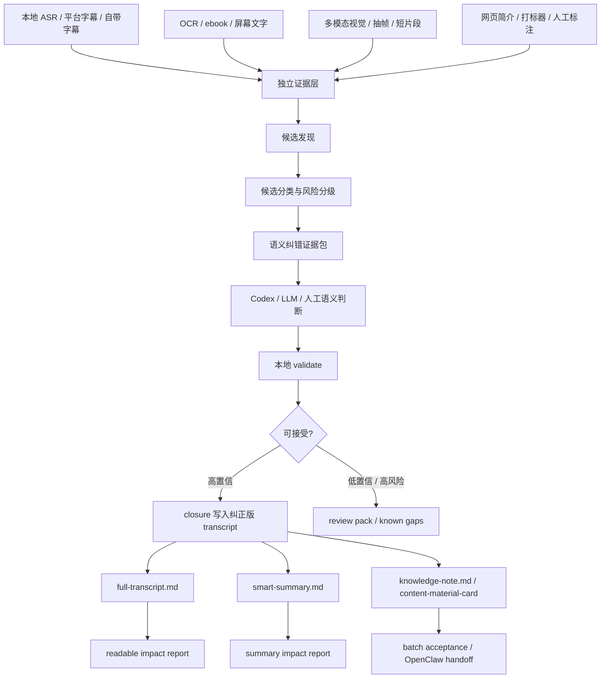

# 所有 ASR / 字幕疑似错词的通用语义纠错闭环

更新时间：2026-07-07 16:38:42
执行者：Codex / GPT-5
项目：`video-knowledge-pipeline`
关联文档：

- `docs/general-asr-subtitle-semantic-correction-loop-2026-07-06.md`
- `docs/asr-subtitle-semantic-correction-loop-goal-detailed-2026-07-07.md`
- `docs/general-asr-subtitle-semantic-correction-loop-detailed-spec-2026-07-07.md`
- `docs/transcript-semantic-correction-to-smart-summary-goal-2026-07-06.md`

## 1. 目标一句话

把 VKP 从“局部术语纠错”升级为一条通用的 **转写语义纠错闭环**：

> 只要 ASR、平台字幕、自带字幕或导入字幕中的任意词、数字、专名、动作、断句、标点或语义表达被其他证据证明“可能错了”，就进入候选；只要多源证据能高置信证明“应该改成什么”，就写入纠正版 transcript；纠正版 transcript 必须真实影响最终人类可读文件。

最终验收标准不是“生成了一个纠错建议文件”，而是：

```text
已接受的原错词，不再残留在 full-transcript.md、smart-summary.md、knowledge-note.md、content-material-card 和下游 handoff 中。
```

## 2. 为什么这不是普通字幕润色

普通字幕润色关注“读起来顺”。VKP 需要解决的是“知识提取不能被错误转写污染”。

典型污染链路：

```text
ASR / 字幕错词
  -> timeline 文本错
  -> full-transcript.md 错
  -> smart-summary.md 主题和结论错
  -> 行动清单、知识卡、内容素材卡错
  -> 后续搜索、RAG、复习、创作复用都错
```

因此这条闭环是最终人类可读输出质量的上游质量门。它不是替代 ASR、OCR、VLM 或人工审核，而是把这些证据综合起来，对转写文本做可审计的语义纠正。

## 3. 覆盖范围

### 3.1 必须覆盖的疑似错词类型

| 类型 | 示例 | 风险 | 默认处理 |
| --- | --- | --- | --- |
| 工具名 / 产品名 | `play right m c p` -> `Playwright MCP` | 影响工具横评、检索和复用 | 高置信可自动纠正 |
| 品牌 / 公司 / 人名 / 平台名 | 讲师名、公司名、项目名、平台名 | 影响事实核查和引用 | 高置信纠正，必要时复核 |
| 行业术语 / 课程概念 | 保险、外贸、跨境、量化、浏览器自动化 | 影响课程主线和总结结构 | 高置信纠正 |
| 数字 / 金额 / 比例 / 年份 | `16k`、`1w刀`、`1500万`、年份、步骤编号 | 事实误导风险高 | 强证据才自动纠正 |
| 操作动作 / 步骤词 | 点击、导入、注册、开通、成交动作 | 影响教程动作清单 | 结合画面和上下文纠正 |
| 普通 ASR 错词 | 同音错、近音错、语义不通词 | 改变句义 | 高置信纠正，低置信复核 |
| 指代词和低信息词 | 这里、这个、它、这样、上面 | 可能丢失屏幕关键信息 | 触发视觉/OCR/人工补证 |
| 标点 / 断句 / 段落边界 | 因果、转折、列表、问答 | 影响可读性和智能总结 | 进入 transcript 后处理 |
| 平台字幕错误 | B 站字幕、自带字幕也可能是 ASR | “有字幕”不等于真实 | 与 ASR/OCR/语义互证 |

### 3.2 不做的事情

- 不修改原始 ASR 输出。
- 不修改平台字幕、自带字幕、导入字幕原文件。
- 不修改原始 OCR、ebook、多模态或抽帧证据。
- 不把低置信猜测写成事实。
- 不自动发布内容。
- 不绕过人工复核。
- 不把在线 LLM 结果直接当最终真相；LLM 只做语义判断，最终由本地 schema、置信规则和影响报告验收。

## 4. 核心原则

### 4.1 第一轮证据相互独立

多个角度分析时，第一轮必须互相独立，不能提前互相污染。

| 证据源 | 第一轮输出 | 进入融合时的角色 |
| --- | --- | --- |
| 本地 ASR | 原始转写、时间戳、置信信息、模型信息 | 主要语音证据 |
| 平台字幕 / 自带字幕 | 字幕文本、时间戳、来源类型 | 可对比证据，不默认权威 |
| OCR / ebook | 屏幕文字、课件、表格、代码、公式 | 强文本证据 |
| 多模态视觉 | 对象、动作、界面状态、空间关系、讲师指向 | OCR 失败或非文字画面的补证 |
| 打标器 / 时间线 | 重点、疑难、工具名、价格、步骤、案例、结论、操作演示 | 候选排序和补帧优先级 |
| 网页标题 / 简介 / 元数据 | 标题、简介、标签、作者、平台 | 专名、课程名、主题词证据 |
| 人工标注 | 用户确认、保留原文、纠正建议 | 最高优先级证据 |

正确链路：

```text
独立证据生成
  -> evidence pack
  -> 候选发现
  -> Codex / LLM / 人工语义判断
  -> 本地 validate
  -> closure 写入纠正版 transcript
  -> export 刷新
  -> impact report 证明最终输出已吸收
```

### 4.2 原始证据不可覆盖

闭环只能写派生产物：

- `source-arbitrated-transcript.json`
- `source-arbitrated-transcript.srt`
- `source-arbitrated-transcript.md`
- `transcript-semantic-correction-*.json/md`
- `transcript-semantic-*-impact-report.json/md`
- `exports/full-transcript.md`
- `exports/smart-summary.md`
- `exports/knowledge-note.md`
- `exports/content-material-card.*`

原始 ASR、字幕、OCR、视觉证据保留为可回溯 source of record。

### 4.3 高置信纠正自动进入纠正版 transcript

用户目标不是“列出建议给人看”，而是最终人类可读文件不要继续继承已确认错词。

因此：

- 高置信、低风险纠正：可写入 `source-arbitrated-transcript.*`。
- 高风险字段，例如金额、比例、年份、事实判断：需要更高证据阈值。
- 低置信冲突：进入 review pack 或 known gaps，不阻塞整个视频可用性。
- 人工复核是可选增强，不应成为全流程硬阻塞。

### 4.4 Codex 可以暂时代替在线 LLM，但流程必须兼容在线 LLM

现阶段 Codex 可以充当语义判断层：

```text
evidence pack -> Codex 读取 -> 输出结构化 decisions -> VKP validate -> closure
```

后续接在线 LLM 时，只替换 `semantic_decision` 层，不改变证据包、校验、写回、影响报告和 UI。

## 5. 总体架构



## 6. 证据包设计

每个疑似错词候选都必须带证据，而不是只带“原词 -> 新词”。

### 6.1 候选字段

| 字段 | 含义 |
| --- | --- |
| `candidate_id` | 稳定候选 ID |
| `bundle_id` | 所属 bundle |
| `timeline_index` | 对应 timeline item |
| `start_seconds` / `end_seconds` | 时间范围 |
| `source_text` | 原 ASR / 字幕文本片段 |
| `suspect_text` | 疑似错词 |
| `suggested_text` | 候选纠正文本，可为空 |
| `candidate_type` | `term`、`number`、`action`、`proper_noun`、`ordinary_asr_error`、`punctuation`、`segment_boundary` 等 |
| `risk_level` | `low`、`medium`、`high` |
| `evidence_refs` | OCR、视觉、字幕、网页、人工、打标器证据索引 |
| `reason` | 为什么怀疑它错 |
| `priority` | 复核优先级 |
| `decision_status` | `pending`、`accepted`、`rejected`、`needs_review` |

### 6.2 证据字段

| 证据类型 | 关键字段 |
| --- | --- |
| ASR | source、model、segment text、timestamp、confidence |
| 字幕 | source type、text、timestamp、是否平台自动字幕 |
| OCR/ebook | frame path、visual text、structured visual、confidence |
| 多模态 | frame paths、visual understanding、temporal understanding、confidence |
| 打标器 | tag、importance、疑难、工具名、步骤、结论 |
| 网页元数据 | title、description、platform、author |
| 人工标注 | reviewer、decision、note、时间 |

## 7. 候选发现策略

### 7.1 基于多源冲突

触发条件：

- ASR 和平台字幕在同一时间段对专名、数字、工具名不一致。
- OCR/ebook 出现高置信文本，但 ASR/字幕中没有对应概念。
- 标题/简介中出现课程名、品牌名、工具名，但 ASR 中被识别成近音词。
- 多模态识别出界面状态或工具名，但 ASR/字幕缺失或冲突。

### 7.2 基于语义异常

触发条件：

- 句子语义明显不通。
- 上下文中同一概念多次出现不同写法。
- 前后逻辑矛盾。
- 动作链缺失关键对象，例如“点击这个”但没有“这个”是什么。
- 课程主线、章节标题、总结里出现低信息词堆叠。

### 7.3 基于类型高风险

默认提高优先级：

- 数字、金额、比例、时间。
- 工具名、产品名、品牌名。
- 操作步骤。
- 结论句。
- 课程框架、方法论名称。
- 讲师明确说“重点”“记住”“这里看一下”的片段。

### 7.4 基于打标器权重

打标器不是最终真相，但很适合做优先级加权：

| 标签 | 作用 |
| --- | --- |
| 工具名 | 提高专名纠错优先级 |
| 价格 / 数字 | 提高高风险事实纠错优先级 |
| 步骤 / 操作演示 | 触发视觉或短片段复核 |
| 案例 / 结论 | 提高智能总结吸收检查优先级 |
| 重点 / 疑难 | 提高候选排序 |
| 闲聊 / 过渡 / 重复 | 降低优先级 |

## 8. Codex / LLM 语义判断

### 8.1 输入

Codex 或在线 LLM 只能读取 evidence pack 和明确授权的上下文：

- 候选原文和时间范围。
- 多源证据摘要。
- 相邻上下文。
- OCR/视觉/网页证据。
- 风险级别和建议输出 schema。

不应让 LLM 直接改原始 transcript，也不应让 LLM 自由生成最终 transcript。

### 8.2 输出

LLM/Codex 输出必须是可校验 JSON：

```json
{
  "schema": "video_knowledge_pipeline.transcript_semantic_correction.decisions.v1",
  "decisions": [
    {
      "candidate_id": "c001",
      "decision": "accept",
      "replacement_text": "Playwright MCP",
      "confidence": 0.94,
      "risk_level": "low",
      "rationale": "OCR 和上下文均指向 Playwright MCP，原 ASR 为近音拆分。",
      "evidence_indexes": [1, 3, 7],
      "apply_scope": "segment"
    }
  ]
}
```

### 8.3 禁止项

- 没有 evidence index 的接受决策。
- 低置信数字自动改写。
- 把整段字幕重写成摘要。
- 把“可能是”写成高置信结论。
- 输出无法追溯的自由文本。

## 9. 本地校验规则

`validate-transcript-semantic-correction` 必须执行本地校验：

| 校验项 | 规则 |
| --- | --- |
| schema | JSON schema 必须匹配 |
| candidate_id | 必须存在于 pack |
| evidence_indexes | 必须引用 pack 中存在证据 |
| replacement_text | 接受决策必须有替换文本 |
| confidence | 低于阈值不能自动写入 |
| risk_level | 高风险类型需要更高阈值 |
| 数字纠错 | 必须有强证据，不允许纯语义猜测 |
| apply_scope | 只能是允许的范围 |
| duplicate decisions | 重复候选必须合并或拒绝 |

校验失败时，只生成报告，不写 closure。

## 10. 闭环写入

`transcript-semantic-correction-closure` 的职责：

1. 读取原始 transcript 和 validated decisions。
2. 生成 `source-arbitrated-transcript.json/srt/md`。
3. 在 manifest 中记录 corrected transcript 路径。
4. 写入纠错日志和状态。
5. 可选 `--refresh-exports` 刷新最终人类可读文件。

写入原则：

- 只替换已接受的候选。
- 保留每条替换的证据链。
- 原始文本可追溯。
- 低置信项进入 review/known gaps。
- 不改原始 ASR/字幕文件。

## 11. 最终输出影响

### 11.1 `full-transcript.md`

必须优先读取纠正版 transcript。

要求：

- 时间戳完整。
- 已接受错词不残留。
- 可标注“此处由语义纠错修正”。
- 低置信段落可显示“待复核”。

### 11.2 `smart-summary.md`

必须基于纠正版 transcript 生成。

要求：

- 不再继承已接受的错词。
- 方法论、工具名、数字、步骤应使用纠正后文本。
- 如果视觉证据未执行，不能伪装成已视觉理解。
- 如果 summary 仍残留 accepted original text，状态不能视为 final。

### 11.3 `knowledge-note.md`

保留证据链和风险，不只输出顺滑文本。

要求：

- 显示语义纠错状态。
- 列出主要已纠正项。
- 列出低置信残留风险。
- 链接 impact report。

### 11.4 `content-material-card.*`

内容素材卡只能继承已验收的纠正结果。

要求：

- `allowed_as_inspiration=true` 也不等于事实可用。
- `allowed_as_fact=false` 时不得把低置信纠正包装成事实。
- `publication_allowed=false` 保持不变。

## 12. 影响报告和验收

闭环必须有三层 impact 证明。

| 报告 | 证明内容 |
| --- | --- |
| `transcript-semantic-correction-impact-report` | 纠正版 transcript 是否吸收 accepted decisions |
| `transcript-semantic-readable-impact-report` | `full-transcript.md`、`knowledge-note.md` 是否仍残留原错词 |
| `transcript-semantic-summary-impact-report` | `smart-summary.md` 是否真正吸收纠正 |

通过条件：

```text
accepted original residual = 0
summary residual = 0
readable residual = 0
corrected hit count > 0 或没有 accepted correction
low-confidence items only in review/known gaps
```

## 13. 单视频和批量状态机

### 13.1 单视频状态

| 状态 | 含义 | 下一步 |
| --- | --- | --- |
| `missing_pack` | 未生成纠错证据包 | `transcript-semantic-correction-pack` |
| `needs_candidate_discovery` | 候选不足或未召回 | `transcript-semantic-candidate-discovery-pack` |
| `needs_semantic_decision` | 有候选但未判断 | Codex/LLM/人工判断 |
| `needs_validation` | 有结果但未校验 | `validate-transcript-semantic-correction` |
| `needs_closure` | 有 accepted decisions 但未写纠正版 transcript | `transcript-semantic-correction-closure` |
| `needs_impact_report` | 已 closure 但未证明输出吸收 | impact reports |
| `needs_summary_impact_report` | smart-summary 吸收未证明 | `transcript-semantic-summary-impact-report` |
| `needs_review` | 低置信或高风险待复核 | review pack，可选 |
| `accepted` | 已闭环，accepted 原错词无残留 | 可交付 |

### 13.2 批量状态

批量验收至少面向 3-5 个真实知识视频：

- 每个 bundle 给出 acceptance state。
- 每个 bundle 给出 next action。
- 已 accepted 的 bundle 不因可选人工复核阻塞。
- 低置信项集中到 batch review pack。
- 本地安全动作可以由 repair queue 批量推进。
- 云 LLM、云视觉、ASR 重跑、下载都必须显式允许。

## 14. UI / Task Console 要求

UI 需要把这条闭环变成可操作流程，而不是只显示文件链接。

至少显示：

- 当前语义纠错状态。
- pack 是否存在。
- 候选数量和类型分布。
- candidate discovery 状态。
- Codex/LLM draft 是否存在。
- validate 是否通过。
- accepted / review / rejected 数量。
- closure 是否写出 corrected transcript。
- readable impact 是否通过。
- summary impact 是否通过。
- batch repair queue 的下一步动作。
- 人工 review pack 入口。
- 已接受纠正对最终输出的影响证明。

按钮或命令区：

- 生成 evidence pack。
- 生成 candidate discovery pack。
- 生成 Codex draft。
- 预览 LLM draft。
- 校验结果。
- 写入 closure。
- 刷新导出。
- 生成 impact reports。
- 单视频验收。
- 批量验收。
- 批量修复队列。

## 15. CLI / MCP 入口

### 15.1 单视频主链路

```powershell
.\scripts\video-knowledge.ps1 transcript-semantic-correction-pack <bundle>
.\scripts\video-knowledge.ps1 transcript-semantic-candidate-discovery-pack <bundle>
.\scripts\video-knowledge.ps1 transcript-semantic-correction-codex-draft <bundle>
.\scripts\video-knowledge.ps1 validate-transcript-semantic-correction <bundle> --input-json <result>
.\scripts\video-knowledge.ps1 transcript-semantic-correction-closure <bundle> --input-json <result> --refresh-exports
.\scripts\video-knowledge.ps1 transcript-semantic-correction-impact-report <bundle>
.\scripts\video-knowledge.ps1 transcript-semantic-readable-impact-report <bundle>
.\scripts\video-knowledge.ps1 transcript-semantic-summary-impact-report <bundle>
.\scripts\video-knowledge.ps1 transcript-semantic-acceptance <bundle>
```

### 15.2 批量链路

```powershell
.\scripts\video-knowledge.ps1 transcript-semantic-batch-acceptance <batch-input>
.\scripts\video-knowledge.ps1 transcript-semantic-repair-queue <batch-input>
.\scripts\video-knowledge.ps1 transcript-semantic-repair-run <batch-input> --execute-safe-actions
.\scripts\video-knowledge.ps1 transcript-semantic-batch-review-pack <batch-input>
.\scripts\video-knowledge.ps1 transcript-semantic-batch-import-review-notes <review-json>
```

### 15.3 MCP 命名

MCP 工具使用下划线命名：

- `transcript_semantic_correction_pack`
- `transcript_semantic_candidate_discovery_pack`
- `transcript_semantic_correction_codex_draft`
- `transcript_semantic_correction_llm_draft`
- `validate_transcript_semantic_correction`
- `transcript_semantic_correction_closure`
- `transcript_semantic_correction_impact_report`
- `transcript_semantic_readable_impact_report`
- `transcript_semantic_summary_impact_report`
- `transcript_semantic_acceptance`
- `transcript_semantic_batch_acceptance`
- `transcript_semantic_repair_queue`
- `transcript_semantic_repair_run`

## 16. 安全边界

默认安全动作：

- 读 bundle。
- 生成 evidence pack。
- 生成本地 Codex draft。
- 校验结果。
- 生成状态报告。
- 生成 impact report。
- 生成 batch review pack。

需要显式允许：

- 在线 LLM 调用。
- 云视觉调用。
- ASR 重跑。
- 视频下载。
- closure 写入 corrected transcript。
- 写回 Logseq / Obsidian / 外部系统。
- 自动发布或内容分发。

绝对禁止：

- 把 API key 写入 manifest、docs、报告或提交。
- 把 cookie、token、登录态写入产物。
- 把低置信猜测当事实。
- 自动覆盖原始证据文件。

## 17. 与现有模块的关系

| 模块 | 角色 |
| --- | --- |
| `term-arbitration-codex` | 工具名/术语子链路，是通用纠错的一个子集 |
| `transcript-source-arbitration` | 多字幕/ASR 来源仲裁，可作为 corrected transcript 基础 |
| `transcript-semantic-correction-pack` | 通用疑似错词 evidence pack |
| `transcript-semantic-candidate-discovery-pack` | 候选召回补漏 |
| `transcript-semantic-correction-codex-draft` | Codex 暂代 LLM 判断 |
| `transcript-semantic-correction-llm-draft` | 在线 LLM 判断预留层 |
| `validate-transcript-semantic-correction` | 本地 schema 和安全校验 |
| `transcript-semantic-correction-closure` | 写入纠正版 transcript |
| `transcript-semantic-summary-impact-report` | 证明智能总结是否吸收纠正 |
| `transcript-semantic-acceptance` | 单视频只读验收证明 |
| `transcript-semantic-batch-acceptance` | 多视频验收证明 |
| `transcript-semantic-repair-run` | 批量安全修复编排 |

## 18. 当前完成度判断

截至本文档创建时，VKP 已经部分落地：

- 术语/工具名仲裁链路。
- 通用语义纠错 pack。
- Codex draft。
- validate。
- closure。
- readable impact。
- summary impact。
- 单视频 acceptance。
- 批量 acceptance。
- repair queue / repair run。
- Task Console 局部入口。

但完整目标还需要继续验证：

- 更充分的候选召回，尤其是普通 ASR 错词、数字、动作词、断句。
- 3-5 个真实长视频的批量验收。
- UI 中完整展示每个状态和下一步。
- 高置信纠正稳定进入 smart-summary 最终输出。
- 低置信项不阻塞，但在 review pack 和 known gaps 中可见。

## 19. 完成标准

这个目标只有在以下条件同时满足时才算完成：

1. 任意 bundle 可以生成通用语义纠错 evidence pack。
2. 候选覆盖不局限于工具名/术语。
3. Codex 或在线 LLM 能基于 evidence pack 输出结构化 decisions。
4. 本地 validate 能拒绝低置信、高风险、无证据的纠正。
5. closure 能写入 `source-arbitrated-transcript.*`，且不改原始证据。
6. `full-transcript.md` 优先读取纠正版 transcript。
7. `smart-summary.md` 优先读取纠正版 transcript。
8. impact reports 能证明 accepted 原错词无残留。
9. 单视频 acceptance 能给出 `accepted` 或明确 next action。
10. 批量 acceptance 能覆盖 3-5 个真实 bundle。
11. repair queue 能自动推进本地安全动作。
12. 低置信和高风险项进入 review/known gaps，不阻塞整体交付。
13. UI/Task Console 能显示状态、进度、失败原因和重试按钮。
14. 所有云调用、下载、重 ASR、写回外部系统都需要显式确认。

## 20. 推荐下一步

1. 把本文档设为通用语义纠错目标入口。
2. 在 README / AGENT_DISCOVERY 中保留指向本文档和详细规格文档的链接。
3. 对当前真实 bundle 跑：

```powershell
.\scripts\video-knowledge.ps1 transcript-semantic-acceptance <bundle>
```

4. 对 3-5 个 bundle 跑：

```powershell
.\scripts\video-knowledge.ps1 transcript-semantic-batch-acceptance <batch-input>
```

5. 对未闭合项跑 preview：

```powershell
.\scripts\video-knowledge.ps1 transcript-semantic-repair-queue <batch-input>
```

6. 只对本地安全动作执行：

```powershell
.\scripts\video-knowledge.ps1 transcript-semantic-repair-run <batch-input> --execute-safe-actions
```

7. 把仍需要语义判断的候选交给 Codex 或在线 LLM；通过 validate 后再 closure。

## 21. 关键判断

这条闭环的本质不是“纠错工具”，而是 VKP 的 **转写事实一致性层**。

它负责回答：

```text
视频里到底说的是哪个词？
这个词有没有被其他证据证明错了？
如果错了，我们是否有足够证据纠正？
纠正是否真的进入最终人类可读文件？
低置信残留是否清楚暴露给用户？
```

只有这五个问题都能被机器产物和人工抽样共同回答，VKP 才算真正完成“所有 ASR/字幕疑似错词的通用语义纠错闭环”。

## 22. 2026-07-07 17:21:29 | Codex / GPT-5：单真实长视频闭环更新

本目标已有一个真实长视频 bundle 完成端到端闭环：

```text
openclaw-runs\knowledge\tongyi-teacher-20260624-live-replay\webui-bundle
```

已验证结果：

- 通用 pack 覆盖 `number / segment_boundary / proper_noun / punctuation / ordinary_word / action`。
- Codex-substitute 只自动接受安全项：TikTok、SEO、app、SKU、WhatsApp、AI、Shopify。
- 不确定缩写如 GPD、HTTML、HQB、VES、AEI 不自动接受。
- closure 写入 `source-arbitrated-transcript.*`，不改原始 ASR/字幕。
- `full-transcript.md` 和 `smart-summary.md` 最终 impact 均通过。
- `transcript-semantic-acceptance` 返回 `accepted`。

当前仍未把总目标标记为完成，因为还缺 3-5 个真实 bundle 的批量验收、UI 完整状态展示，以及更多数字/动作/断句/普通错词的 LLM/人工语义判断闭环。

## 23. 2026-07-07 17:34:57 | Codex / GPT-5：4 个真实 bundle 批量验收与 UI 状态验收

本轮已完成此前第 22 节提到的两个主要缺口：3-5 个真实 bundle 批量验收、Task Console 状态展示。

批量验收命令：

~~~powershell
$env:PYTHONDONTWRITEBYTECODE='1'
$env:PYTHONPATH='src'
python -m video_knowledge_pipeline.cli transcript-semantic-batch-acceptance openclaw-runs\knowledge --target-bundle-count 3 --limit 4
~~~

输出产物：

~~~text
openclaw-runs\knowledge\transcript-semantic-batch-acceptance.json
openclaw-runs\knowledge\transcript-semantic-batch-acceptance.md
~~~

验收结果：

- status = accepted
- ok = true
- bundle_count = 4
- accepted_count = 4
- not_accepted_count = 0
- candidate_count = 411
- accepted_decision_count = 22
- review_required_count = 1
- final_residual_error_total = 0
- by_acceptance_state = accepted: 4
- by_semantic_status = impact_passed: 4

覆盖的真实 bundle：

- openclaw-runs\knowledge\BV134Ei6KEaJ-browser-automation\webui-bundle
- openclaw-runs\knowledge\tiktok-crossborder-day2\webui-bundle
- openclaw-runs\knowledge\tongyi-teacher-20260624-live-replay-rerun-current\webui-bundle
- openclaw-runs\knowledge\tongyi-teacher-20260624-live-replay\webui-bundle

Task Console 验收 bundle：

~~~text
openclaw-runs\knowledge\tongyi-teacher-20260624-live-replay\webui-bundle
~~~

重新导出命令：

~~~powershell
python -m video_knowledge_pipeline.cli export-task-console openclaw-runs\knowledge\tongyi-teacher-20260624-live-replay\webui-bundle --no-refresh
~~~

已确认 task-console.html 包含：

- 通用语义纠错闭环进度摘要
- 自动候选 / 需人工候选
- 通用语义纠错修复/重试队列
- summary impact
- readable impact
- 重试入口和本机安全动作 bridge 区域

因此，第 19 节完成标准中的批量 acceptance、repair queue、Task Console 状态展示已经有真实产物证明。仍然需要注意：低置信候选不会阻塞交付，但必须继续保留在 review/known gaps 中；在线 LLM 批量调用仍需要显式确认和限量。
