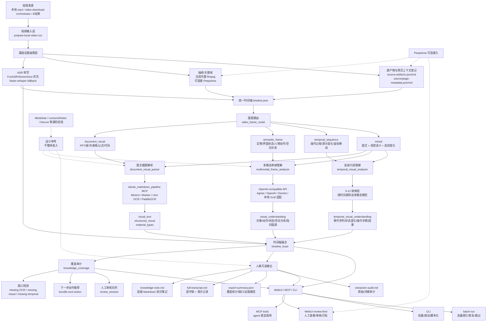

# 视频知识提取架构

## Update Record

- 2026-06-08 11:21:56 | Codex (GPT-5) | Created the concrete architecture note after reviewing current implementation status and real open-source source code findings.
- 2026-06-11 23:20:00 | Codex (GPT-5) | Added the Phase 3 stabilization plan link after the real bundle reached 10 semantic and 3 temporal visual-understanding items.
- 2026-06-11 12:05:00 | Codex (GPT-5) | Documented Peepshow as an optional source-evidence attachment path, not a replacement for routing/OCR/multimodal/temporal analysis.
- 2026-06-11 14:05:00 | Codex (GPT-5) | Added the Phase 6 acceptance and provider recovery plan after provider health became a first-class blocker.
- 2026-07-21 13:00:44 | Codex (GPT-5.6) | Added the local-only webpage/source metadata evidence layer and its weak-context consumers.

## Development Plans

- `docs/plans/2026-06-09-next-stage-video-knowledge-pipeline.md`: first real-bundle implementation plan for closing visual coverage blockers.
- `docs/plans/2026-06-11-phase-2-development-plan.md`: phase 2 plan for repeatable video knowledge runs.
- `docs/plans/2026-06-11-phase-3-stabilization-and-review-plan.md`: current next-stage plan focused on review round trip, OCR bridge blockers, bundle next action, Markdown quality, and acceptance.
- `docs/plans/2026-06-11-phase-4-quality-acceptance-plan.md`: next plan focused on truthful OCR coverage, acceptance states, controlled vision batches, human-review fallback, and readable final notes.
- `docs/plans/2026-06-11-phase-5-real-provider-and-note-quality-plan.md`: current next-stage plan focused on provider health gates, temporal readiness, acceptance-check, human-review acceptance, and readable lecture-note export.
- `docs/plans/2026-06-11-phase-6-acceptance-provider-recovery-plan.md`: current next-stage plan focused on unified acceptance status, provider recovery, review templates, note quality checks, and WebUI acceptance surface.
- `docs/plans/2026-06-11-phase-7-real-acceptance-and-readable-delivery-plan.md`: next-stage plan focused on precise acceptance states, readable Markdown delivery, WebUI review usability, provider recovery smoke tests, and controlled batch closure.

## 目标边界

本项目不是视频摘要工具，也不是只找重点的讲课笔记工具。目标是把知识类讲解视频中的语音、屏幕文字、图表、公式、代码、板书、界面状态、操作变化和非文字视觉信息尽量不漏地提取出来，并整理成可读、可检索、可复习的结构化 Markdown 资料。

核心原则：

- 能降维成文字的内容尽量转成文字。
- 必须依赖图像、表格、公式、代码、空间关系或动态变化表达的信息保留证据帧。
- 所有模型输出都要能追溯到原始视频、时间轴、帧路径或外部工具产物。
- 现成工具负责专项能力，本项目负责调度、路由、融合、审计、人工审核和最终知识库导出。

## 总体架构



## 分层说明

### 1. 视频输入层

输入可以来自本地视频、`video-download-orchestrator` 下载结果，或其他下载/采集工具。项目入口优先使用 `prepare-local-video-run` 或 `acceptance-run`，避免把下载逻辑和知识提取逻辑混在一起。

本层输出：

- 视频来源记录：`source/video-source-provenance.md/json`
- 可选网页来源上下文：`source/page-metadata.md/json`（由本地 VDO/yt-dlp/acquisition handoff 导入，不在 VKP 内抓网页）
- 初始运行报告：`video-knowledge-run.md/json`
- 可选初始 WebUI bundle

### 2. 基础证据抽取层

这一层只负责让视频变成可引用的证据，不负责最终知识解释。

ASR 主线：

- 中文知识视频优先本地 SenseVoice/FunASR。
- faster-whisper 作为 fallback。
- 输出统一转成 transcript segments、SRT 和 timeline 可用结构。

抽帧主线：

- 当前项目内置 ffmpeg 抽帧与 frame recapture。
- Peepshow 可以作为可选 extractor，用于快速抽帧、去重、OCR、HTML report、tag 和 annotate。
- Peepshow 不替代本项目的 timeline fusion、图文结构化、多模态理解和知识库导出。
- Peepshow 输出可以通过 `attach-peepshow-output` / `attach_peepshow_output` 附着到 WebUI bundle，生成 `peepshow-evidence.json/md` 并刷新 `source-artifacts.json/md`。
- 附着后的 Peepshow OCR、per-frame analysis 和 tags 只作为源证据；必须继续通过 `video_frame_router`、`run_visual_structure_plan`、`run_multimodal_frame_analysis`、`run_temporal_visual_analysis` 或人工审核进入最终知识字段。

源产物登记：

- 所有外部工具产物登记到 `source-artifacts.json/md`。
- `import-page-metadata` 将本地 handoff 中的标题、简介、作者、标签、章节、平台字幕/封面本地路径规范化到 `source/page-metadata.json/md`；VKP 不复制下载、登录、Cookie 或网页抓取。
- 网页文字始终是不可信低权重上下文，只用于热词、ASR 提示、语义纠错和摘要主题/章节提示，不能覆盖逐字稿或视觉证据。
- 当最终笔记可疑时，优先回到原始产物核对。

### 3. 统一时间轴层

`timeline.json` 是主数据结构。ASR、帧、OCR、多模态理解、连续片段理解、人工审核结果都必须落回时间轴。

每个 timeline item 应尽量包含：

- 起止时间
- transcript
- frame paths
- visual route
- visual text / structured visual
- visual understanding
- temporal visual understanding
- quality issues
- human review state

### 4. 画面路由层

`video_frame_router` 负责判断同一时间片应该交给哪个分支处理。

| route | 适用画面 | 后续工具 |
|---|---|---|
| `document_visual` | PPT、板书、表格、公式、代码、文档页 | `run_visual_structure_plan` -> `ebook_markdown_pipeline` |
| `semantic_frame` | 实物、界面状态、人物动作、空间关系、讲师指向 | `run_multimodal_frame_analysis` |
| `temporal_sequence` | 软件操作、实验演示、鼠标移动、流程变化 | `run_temporal_frame_groups` -> `run_temporal_visual_analysis` |
| `mixed` | 同时包含图文、语义画面或连续变化 | 多分支并行处理 |
| `unknown` | 证据不足或低置信度 | 标记 `needs_human_review` |

### 5. 图文截图解析分支

图文型截图不应该靠普通多模态描述来“猜”。它应该尽量结构化解析：

- 屏幕文字
- 表格
- 公式
- 代码
- 板书层级
- PPT 版面结构

主通道是复用 `ebook_markdown_pipeline` MCP，而不是在本项目里重造 OCR/文档解析。

预期回填字段：

- `visual_text`
- `structured_visual`
- `material_types`

### 6. 多模态单帧理解分支

`semantic_frame` 走多模态模型。它处理 OCR 无法覆盖的信息：

- 画面中有哪些对象
- 人物正在做什么
- 软件界面处于什么状态
- 空间关系、位置关系
- 讲师指向、强调、圈画
- 图像中不能直接降维成文字的信息

预期回填字段：

- `visual_understanding`
- evidence frame paths
- confidence
- keep screenshot reason

### 7. 连续片段理解分支

`temporal_sequence` 不能只靠单帧理解。项目先从同一时间段抽取 5-12 帧，再按顺序送入多模态模型。

适用场景：

- 软件操作步骤
- 实验过程
- 鼠标移动与点击
- UI 状态变化
- 流程演示
- 局部动态变化

预期回填字段：

- `temporal_frame_paths`
- `temporal_visual_understanding`
- event sequence
- state changes
- operation steps
- before/after causal links
- possible omissions

### 8. 融合、审计和人工审核

融合层把以下信息合成统一知识证据：

- ASR transcript
- OCR / structured visual
- 多模态单帧理解
- 连续片段理解
- 人工审核/标注
- source artifacts

`knowledge_coverage` 负责判断是否仍有缺口：

- `screen_text`
- `structured_visual`
- `semantic_frame_understanding`
- `temporal_visual_understanding`
- `source_artifacts`
- `time_axis`

`bundle-next-action` 根据 coverage 推荐下一步。真实模型调用必须经过 preflight 和确认 gate，避免一次误调用覆盖大量 timeline。

### 9. 输出层

最终输出不是单个摘要，而是一组可核对的资料：

- `exports/knowledge-note.md`：层级 Markdown 知识笔记。
- `exports/full-transcript.md`：完整逐字稿。
- `exports/export-summary.json`：覆盖率、缺口索引、证据路径。
- `review.html`：WebUI 人工查看、审核、打标。
- MCP args：供 agent 稳定调用。

## 当前整合进度

以真实测试 bundle `real-tests/feishu-video-retry-live-asr/phase2-review-preview-bundle` 为准，当前状态是“单视频验收闭环 + preview-safe 批量入口”。它已经能作为个人工具处理同类视频，但 screen text 小字仍是需要人工/后续 OCR 强化的弱通道。

| 模块 | 当前状态 | 判断 |
|---|---|---|
| ASR | 68/68 时间片有转写；本地 `asr-env-status` 和 30 秒 `asr-smoke` 已验证 | 本地 SenseVoice/FunASR 主线可用 |
| 抽帧/证据帧 | 68/68 时间片有帧，时间轴无空白 | 基础证据链稳定 |
| 画面路由 | 68/68 已分类 | 方向正确 |
| 图文截图解析 | 9/9 通过结构化图文或人工保留图片兜底 | 覆盖闭环，但 screen text 仍弱 |
| 多模态单帧理解 | 61/61 应分析项已覆盖，整体 items_with_visual_understanding 63 | API 写回和证据链已验证 |
| 连续片段理解 | 12/12 应分析项已覆盖，整体 items_with_temporal_understanding 14 | 5-12 帧 temporal 分支可用 |
| 人类可读 Markdown | `knowledge-note.md`、`full-transcript.md`、`extraction-audit.md` 已分层导出 | 主笔记可读，审计细节独立 |
| Review UI | 静态 `review.html` 支持筛选、证据帧、修正字段和 JSON 草稿 | 可进行人工审核而不从零写 JSON |
| Provider 选择 | `vision-provider-matrix` 可推荐通过图像探针的安全 provider 配置 | Agnes 实测通过，密钥不落盘 |
| 批量处理 | `batch-run` 可跳过 accepted bundle、resume、force reexport | preview-safe 批量入口已具备 |
| MCP/CLI/WebUI | MCP args audit 30/30 OK，status/coverage/next action 可生成 | 调度层可给 agent 稳定调用 |

## 开源源码审查后的定位

### Peepshow

真实 npm 包源码确认 Peepshow 具备抽帧、去重、Tesseract OCR、ASR provider、per-frame vision caption、HTML report、tag UI、`report annotate` 和 sink 机制。

结论：

- 适合作为可选视频证据抽取器。
- 适合导入 `manifest.json`、frame paths、report、tag、annotation。
- 不适合替代本项目的知识融合和最终 Markdown 导出。
- OCR 只是 Tesseract 级别，不能替代 `ebook_markdown_pipeline` 的图文/表格/公式/版面结构化能力。

### MetaNote

源码显示它有 FunASR/SenseVoice、Streamlit UI、多模态帧处理和 note generation。

结论：

- 是最接近“视频转知识笔记”的 PoC。
- 可借鉴 prompt、valuable frame 判断、笔记生成思路。
- 不建议整体嵌入；本项目继续保持路由/调度层边界。

### Lecture2Notes

源码显示它有 lecture pipeline、slide OCR、slide structure analysis、transcript alignment 和 structured joined summary。

结论：

- 适合借鉴 PPT/slide 结构化和 transcript 对齐思路。
- 技术栈较旧，主要依赖 Tesseract，不适合直接作为现代中文知识视频主流程。

### DeLive / BiliNote / AI-Video-Transcriber

这些项目更适合借鉴 ASR、UI、转写后处理、思维导图或 review 设计。

结论：

- 可作为 ASR/UI/summary 参考。
- 不能替代视频视觉理解和全量知识库导出主线。

## 方向判断

当前方向没有偏离。源码审查反而强化了当前路线：不要寻找一个“大而全开源项目”直接替换本项目，而是把专项成熟工具接入为可选能力。

正确路线是：

```text
视频证据抽取：内置 ffmpeg / Peepshow / 其他 extractor
ASR：FunASR/SenseVoice / faster-whisper fallback
图文截图：ebook_markdown_pipeline
非文字画面：多模态 API / 本地 VLM adapter
连续变化：5-12 帧 temporal frame groups
总控：本项目 timeline fusion + coverage audit + human review + Markdown export
```

需要警惕的偏移：

- 不要把 Peepshow 当完整知识库生成工具。
- 不要把 MinerU/Marker 当“看视频”的主工具，它只处理图文截图。
- 不要把 ASR 转写和摘要误认为“视频理解完成”。
- 不要继续扩散很多 extractor 计划，而不补当前 coverage 缺口。

## 下一步实现顺序

详细执行计划见：

- `docs/plans/2026-06-09-next-stage-video-knowledge-pipeline.md`
- `docs/plans/2026-06-11-phase-2-development-plan.md`

1. 对更多真实课程视频运行 `batch-run`，观察不同来源、不同画面类型下的稳定性。
2. 继续提升 screen text 弱通道：从当前 crop plan 进入小批量 crop OCR / ebook pipeline 复核。
3. 对 `knowledge-note.md` 做人工质量抽检，继续压缩冗余模型措辞，保留证据链。
4. 将 Peepshow 作为可选 extractor 继续硬化：命令解析、manifest 导入、report/source artifact 登记、不要替代主流程。
5. 评估本地 VLM adapter，但保持主流程通过 provider adapter 解耦模型仓库代码。
6. 完成人工审核/打标闭环：WebUI 标注结果写回 review notes，再进入 coverage 和导出。
