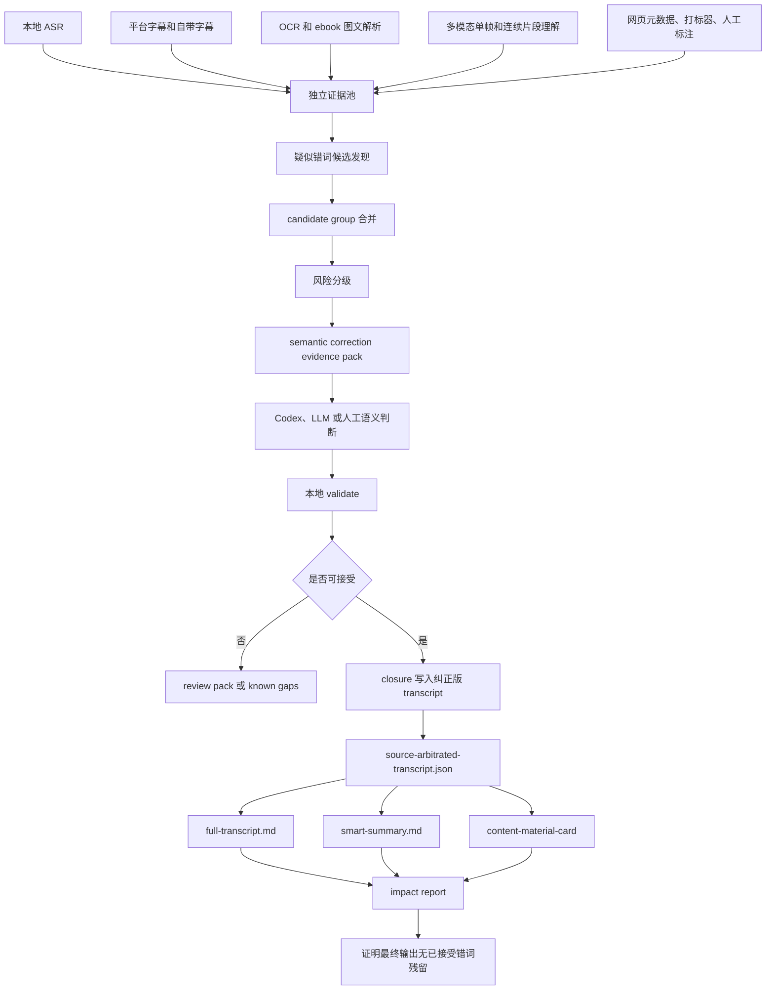

# ASR/字幕疑似错词通用语义纠错闭环设计

更新时间：2026-07-07 18:42:00
执行者：Codex / GPT-5
项目：`video-knowledge-pipeline`
详细工程规格：`docs/general-asr-subtitle-semantic-correction-loop-detailed-spec-2026-07-07.md`
目标跟踪文档：`docs/general-asr-subtitle-semantic-correction-loop-2026-07-06.md`

## 1. 一句话目标

VKP 要做的不是“术语词典”，也不是“字幕润色器”，而是一条覆盖所有 ASR、平台字幕、自带字幕疑似错词的通用语义纠错闭环。

核心目标是：凡是转写文本中可能被听错、断错、识别错、翻译错或被平台字幕误导的词语，只要其他证据能证明它“可能错了”，就进入候选。只要多源证据能高置信说明“应该改成什么”，就写入纠正版 transcript。最终 `full-transcript.md`、`smart-summary.md`、内容素材卡和下游 handoff 必须真实使用纠正版，而不是继续继承原始错词。

最终完成标准不是“生成纠错建议文件”，而是：

```text
已接受的错词不再残留在最终人类可读文件中。
```

## 2. 为什么必须做这条闭环

知识类视频的核心信息大多先经过 ASR 或字幕进入系统。ASR 一旦错了，后面几层都会被污染。

- `full-transcript.md`：错词直接展示给人，后续查找、复习和引用都会被误导。
- `smart-summary.md`：智能总结会围绕错误词组织主题、章节和行动建议。
- 图文和视觉融合：OCR 或多模态明明看到了正确内容，但如果不进入纠错层，最终文本仍然会错。
- 内容素材卡：工具名、价格、金额、人物、案例数据错误会变成传播风险。
- 搜索和 RAG：错词会导致检索不到真实概念，或把同一实体拆成多个错误变体。

所以这条闭环的目标是把“听写文本”升级成“多证据仲裁后的可信 transcript”。它是所有后续可读文件和内容资产的上游质量门。

## 3. 范围

### 3.1 覆盖的错误类型

1. 工具名和产品名。
   - 示例：`play right m c p` 应判断为 `Playwright MCP`，`browser base` 应判断为 `Browserbase`。
   - 主要证据：OCR/ebook、标题、网页简介、上下文、已知工具表。
   - 高置信时可以自动写入纠正版 transcript。

2. 人名、公司名、品牌名、平台名和课程名。
   - 示例：讲师名、项目名、课程名、平台名。
   - 主要证据：标题、简介、PPT 首屏、网页元数据、人工确认。
   - 涉及事实归属时需要更保守。

3. 行业术语和课程概念。
   - 示例：保险术语、外贸术语、浏览器自动化概念、成交方法论。
   - 主要证据：全片主题、章节标题、重复上下文、课件文字。
   - 纠正后应影响章节总结和行动清单。

4. 数字、金额、比例和时间。
   - 示例：`16k`、`1w刀`、`1500万`、年份、步骤编号、价格。
   - 这是最高风险类型。不能只靠“语义上更像”自动改。
   - 必须有 OCR、标题、简介、平台字段、重复上下文或人工确认等强证据。

5. 动作、步骤和操作词。
   - 示例：点击、导入、注册、成交、报价、建联、跟进。
   - 主要证据：视频画面、连续帧、多模态理解、打标器步骤标签。
   - 这类纠正会影响行动清单，默认需要审计。

6. 普通 ASR 错词。
   - 示例：同音错、近音错、孤立无意义词、上下文语义不通词。
   - 这类不一定是专名，必须依赖上下文和模型语义判断。
   - 低置信进入人工复核或 known gaps。

7. 标点、断句和段落边界。
   - 示例：问答边界、列表结构、因果关系、转折关系。
   - 这不是传统错词，但会影响逐字稿可读性和智能总结质量。
   - 只能调整表达结构，不能改变讲者原意。

8. 平台字幕或自带字幕本身的错误。
   - 很多视频网站字幕也是 ASR 生成的，不能默认当真。
   - 必须与本地 ASR、OCR、视觉证据、网页元数据和全片上下文对比。

### 3.2 不做什么

- 不修改原始 ASR、原始字幕、原始 OCR、原始多模态结果。
- 不让 Codex 或 LLM 自由重写整篇 transcript。
- 不把低置信猜测写成事实。
- 不因为人工复核未完成就阻塞整条视频处理，低置信项可以进入 known gaps。
- 不自动发布内容素材，不自动写入正式知识库。
- 不绕过 validate、closure、impact report 直接改最终文件。

## 4. 总体流程



## 5. 第一轮证据必须相互独立

多个角度分析时，第一轮不能互相污染。不能一开始就把 ASR 当主答案，再让 OCR 或视觉只是帮 ASR 找证据。正确做法是每一路证据先独立完成，再进入融合层。

- 本地 ASR：独立产出 `normalized-transcript.json`、`.srt`、句级或词级时间戳。它提供原始听写文本和时间轴，但不能被其他来源提前覆盖。
- 平台字幕和自带字幕：独立保存来源、文本、时间戳和来源类型。它们可以比 ASR 准，也可能同样是错的。
- OCR 和 ebook：独立解析屏幕文字、课件、表格、代码、公式。它们提供强文本证据，但不能直接改 transcript。
- 多模态视觉：独立理解对象、界面状态、动作、空间关系和操作过程。它补充 OCR 失败或非文字画面证据。
- 打标器和时间线：独立输出标签、重点、疑难、工具名、步骤、案例、结论。它们用于候选排序、补帧和复核优先级加权。
- 网页元数据：独立保存标题、简介、来源 URL、作者、章节信息。它支撑课程名、人名、品牌名和主题词。
- 人工标注：独立记录用户确认、保留原文、需复核。人工结果也必须通过 review notes 导入，而不是绕过系统直接改 timeline。

融合只能发生在 evidence pack、语义判断、validate、closure、export 和 impact report 阶段。

## 6. 输入证据层

每个候选错词都应该尽量记录“为什么可疑”和“有哪些证据支持正确写法”。

证据源包括：

- 本地 ASR：`normalized-transcript.json`、`normalized-transcript.srt`。提供原始听写文本和时间戳。
- 平台字幕：平台字幕 sidecar。用于与 ASR 对照，不能单独当真。
- 自带字幕：视频内字幕或外挂字幕。可能是强证据，也可能同样来自 ASR。
- OCR/ebook：`visual_text`、`structured_visual`、ebook pipeline 输出。用于课件文字、表格、代码、数字和工具名。
- 多模态视觉：`visual_understanding`、`temporal_visual_understanding`。用于界面状态、操作动作、空间关系和非文字信息。
- 网页元数据：VDO handoff、标题、简介。用于视频标题、人名、课程名、平台名和主题词。
- 打标器：tag、chapter、重点、疑难。用于复核优先级、时间段定位和主题定位。
- 全片上下文：chapter pack、long-video memory、smart-summary input pack。用于判断局部词是否符合全片主线。
- 人工标注：review notes。用于最终确认、保留原文和人工纠正。

## 7. 候选发现规则

### 7.1 多源冲突

当不同来源给出不同文本时，生成候选。

```text
ASR: play right m c p
OCR: Playwright MCP
网页标题: 浏览器自动化工具横评
候选: play right m c p 替换为 Playwright MCP
```

### 7.2 画面强证据

屏幕、课件、表格、代码、公式、软件界面里出现明确文字，而 ASR 识别成音近词或碎片词。

```text
ASR: 这个 browser base 很好用
OCR/ebook: Browserbase
候选: browser base 替换为 Browserbase
```

### 7.3 全片语义不通

单句看似正常，但放进全片主线不通顺，也要进入候选。

触发信号：

- 句子结构断裂。
- 同一概念反复出现不同写法。
- 关键词与课程主题明显不匹配。
- 章节标题附近出现孤立无意义词。
- 智能总结出现关键词拼接式病句。
- 行动清单出现无法执行的动作词。

### 7.4 数字和事实高风险

数字、金额、年份、比例、收益、价格、客户数量、时间节点都必须保守处理。

自动改写必须满足至少一个条件：

1. OCR/ebook 或画面中有清晰数字。
2. 标题、简介、平台字段和上下文一致。
3. 两个以上独立来源一致。
4. 人工明确确认。

只靠 Codex 或 LLM 觉得“更合理”不能改数字。

### 7.5 动作和步骤

知识类教程里，动作词经常比名词更重要。

示例：

```text
raw: 然后点这个进去
visual: 页面按钮是 Create Session
corrected: 然后点击 “Create Session” 进入下一步
```

这类属于语义补全，不是简单错词替换，默认风险高于专名替换。除非视觉证据强，否则进入人工复核。

### 7.6 重复实体变体

同一实体可能出现多个错写：

```text
Browserbase
browser base
browse base
browser bus
```

这些应合并成 `candidate_group`，统一判断 canonical，再分别写回多个 segment。否则 final export 会出现前面改对、后面还错的问题。

## 8. Candidate Group

Candidate group 是长视频语义纠错的关键。它把同一真实实体、概念、动作或数字的多个错写合并，避免重复人工判断和局部修正。

建议字段：

```json
{
  "candidate_group_id": "semgroup-0001",
  "canonical_hint": "Browserbase",
  "correction_type": "proper_noun",
  "risk_level": "auto_apply_with_audit",
  "candidate_ids": ["semcorr-0001", "semcorr-0007"],
  "variant_texts": ["browser base", "browse base"],
  "suggested_texts": ["Browserbase"],
  "timeline_indexes": [12, 38],
  "evidence_ids": ["ev-ocr-001", "ev-context-003"],
  "evidence_source_types": ["ocr_ebook", "asr_context"],
  "candidate_count": 2,
  "needs_human_review": false
}
```

判读规则：

- group 可以给出统一 canonical。
- 最终必须回到每个 `candidate_id` 输出 action。
- group 内证据冲突时整体降级为 `needs_human_review`。
- 数字类 group 不能仅因“多次重复”自动确认。
- 同一 group 的所有已接受错词都必须被 impact report 检查残留。

## 9. 风险分级和写回策略

- `safe_auto_apply`：多证据一致、低事实风险、置信度高。可写入 `source-arbitrated-transcript`。
- `auto_apply_with_audit`：证据强，但涉及专名、事实、关键动作。可写入，但必须进入 audit 和 impact report。
- `needs_human_review`：证据冲突、置信不足、数字或事实风险高。不自动写回，进入 review pack 或 known gaps。
- `keep_original`：原文可能正确，纠正证据不足。保留原文，并关闭该候选或标记已知缺口。
- `reject`：纠正建议无证据、越权重写、schema 错。拒绝，不写入。

## 10. Evidence Pack Schema

`transcript-semantic-correction-pack.json` 是闭环核心输入。

每个 candidate 至少包含：

```json
{
  "candidate_id": "semcorr-0001",
  "candidate_group_id": "semgroup-0001",
  "correction_type": "proper_noun",
  "risk_level": "auto_apply_with_audit",
  "time_range": {"start": 13.2, "end": 18.5},
  "timeline_indexes": [12],
  "original_text": "browser base",
  "suggested_text": "Browserbase",
  "canonical_hint": "Browserbase",
  "context_before": "这里对比几个浏览器自动化工具",
  "context_after": "它可以直接连接你已经登录的浏览器",
  "why_this_is_suspicious": "ASR phrase is phonetically close to a tool name shown on screen.",
  "evidence": [
    {
      "evidence_id": "ev-ocr-001",
      "source_type": "ocr_ebook",
      "text": "Browserbase",
      "path": "frames/frame-000012.png",
      "timeline_index": 12,
      "confidence": 0.92
    }
  ],
  "conflicts": [
    {"source_type": "asr", "text": "browser base"},
    {"source_type": "ocr_ebook", "text": "Browserbase"}
  ],
  "final_output_impact": ["full_transcript", "smart_summary", "content_material_card"]
}
```

## 11. Codex / LLM 判读边界

Codex 当前可作为在线 LLM 的替身，但它不能自由发挥。它只能判断 pack 中已有候选。

允许：

- 结合上下文判断专名真实写法。
- 给出最小必要替换。
- 判断保留原文。
- 标记需要人工复核。
- 对重复变体给 canonical。
- 判断最终输出会受哪些影响。

禁止：

- 自由重写完整 transcript。
- 添加 pack 外的新事实。
- 静默修改数字、金额、年份。
- 把低置信猜测标为高置信。
- 删除讲者原有信息。
- 只因为“更通顺”就改写原意。

标准输出：

```json
{
  "schema": "video_knowledge_pipeline.transcript_semantic_correction_result.v1",
  "source": "codex_substitute_for_online_llm",
  "decisions": [
    {
      "candidate_id": "semcorr-0001",
      "action": "replace",
      "correction_type": "proper_noun",
      "original_text": "browser base",
      "corrected_text": "Browserbase",
      "canonical": "Browserbase",
      "aliases": ["browser base", "browse base"],
      "confidence": 0.96,
      "safe_to_apply": true,
      "needs_human_review": false,
      "semantic_rationale": "OCR and surrounding context both point to Browserbase.",
      "evidence_ids": ["ev-ocr-001"],
      "timeline_indexes": [12],
      "final_output_policy": "apply_to_corrected_transcript_and_summary"
    }
  ]
}
```

## 12. 本地校验规则

`validate-transcript-semantic-correction` 必须拒绝：

- `missing_candidate_id`：没有 candidate id。
- `unknown_candidate_id`：candidate id 不在 pack 中。
- `missing_evidence`：没有引用证据。
- `unknown_evidence_id`：evidence id 不存在。
- `missing_rationale`：没有语义理由。
- `low_confidence`：置信度低于阈值。
- `unsafe_number_change`：数字、金额、比例、年份缺强证据。
- `overbroad_rewrite`：把局部纠错变成整段改写。
- `changes_unrelated_text`：修改候选以外的信息。
- `schema_error`：JSON 或 Markdown 解析失败，或字段不合格。

校验器是本地可信门禁。Codex 或 LLM 输出永远不能直接写回 transcript。

## 13. Closure 写回规则

`transcript-semantic-correction-closure` 只写通过校验的决策。

写回要求：

1. 原始 ASR 和字幕不被修改。
2. 只写派生文件 `source-arbitrated-transcript.json/md/srt`。
3. 每个 segment 保留 `original_text` 和 `corrected_text`。
4. 每条 correction 保留 `candidate_id`、`evidence_ids`、`confidence`、`rationale`。
5. 高风险但已接受的纠正进入 audit。
6. 未通过候选进入 review 或 known gaps。
7. closure 后必须刷新导出和 impact report。

## 14. 最终输出影响路径

纠错结果必须沿着下面路径真正进入最终文件：

```text
source-arbitrated-transcript.json
  → exports/full-transcript.md
  → exports/smart-summary-input-pack.*
  → exports/smart-summary.md
  → exports/content-material-card.*
  → transcript-semantic-correction-impact-report.*
  → transcript-semantic-readable-impact-report.*
  → transcript-semantic-summary-impact-report.*
```

如果纠错只停在 `result.codex.md`、`result.llm.md` 或 `term-arbitration-glossary.json`，没有影响最终 exports，就不算闭环完成。

## 15. 对三个主要人类可读文件的要求

### 15.1 `full-transcript.md`

逐字稿优先读取：

```text
source-arbitrated-transcript.json
  > corrected transcript sidecar
  > normalized-transcript.json
  > timeline transcript fallback
```

如果纠正版 transcript 存在，逐字稿显示纠正版文本，并在 audit 中保留原文差异。

### 15.2 `smart-summary.md`

智能总结必须优先基于纠正版 transcript。

要求：

- 使用已确认 canonical term。
- 不把低置信候选写成确定事实。
- 数字、金额、时间风险单独列待复核。
- 行动清单不继承错误动作词。
- 章节总结覆盖完整视频。
- 明确视觉证据未执行或低置信的边界。

### 15.3 `content-material-card`

内容素材卡只允许作为灵感和证据候选。固定策略是：

- `review_required=true`
- `publication_allowed=false`
- `allowed_as_fact=false`
- `allowed_as_inspiration=true` 时仍需标注证据和风险

如果语义纠错未完成，素材卡必须透传 `semantic_correction_status` 和剩余风险。

## 16. Impact Report

Impact report 回答四个问题：

1. 已接受的原错词是否仍残留在 `source-arbitrated-transcript`。
2. 已接受的原错词是否仍残留在 `full-transcript.md`。
3. 已接受的原错词是否仍残留在 `smart-summary.md`。
4. 智能总结是否能看出纠正文或纠正语义已被吸收。

建议状态：

- `passed`：已接受错词无残留，纠正文或语义被吸收。
- `needs_fix`：已接受错词仍出现在最终输出。
- `not_proven`：无残留，但无法证明总结吸收了纠正语义。
- `no_accepted_decisions`：没有已接受纠正。
- `missing_export`：缺少可读导出。

## 17. UI 和批量队列

Task Console / Workbench 应把语义纠错做成可操作流程，而不是让用户复制几十条命令。

需要展示：

- correction pack 是否存在。
- 候选数、group 数。
- 按类型统计：term、proper_noun、number、action、ordinary_word、punctuation、segment_boundary。
- 按风险统计：safe、audit、review、reject。
- Codex、LLM、人工判断状态。
- validate、closure、export、impact 状态。
- 失败原因。
- 下一步动作。
- 可重试批次。
- evidence 和视频时间戳入口。

默认安全策略：

- 默认只 preview。
- LLM/API 调用必须显式执行。
- closure 写回必须通过 validate。
- 人工复核是可选增强，不阻塞整体处理。
- 低置信项进入 known gaps。

## 18. CLI / MCP 入口

核心 CLI：

```text
transcript-semantic-correction-pack
transcript-semantic-correction-codex-draft
transcript-semantic-correction-llm-draft
validate-transcript-semantic-correction
import-transcript-semantic-review-notes
transcript-semantic-correction-closure
transcript-semantic-correction-impact-report
transcript-semantic-readable-impact-report
transcript-semantic-summary-impact-report
transcript-semantic-correction-status
transcript-semantic-batch-acceptance
transcript-semantic-repair-queue
transcript-semantic-repair-run
transcript-semantic-batch-review-pack
transcript-semantic-batch-codex-review-draft
transcript-semantic-batch-import-review-notes
```

MCP 工具名保持同义下划线形式。

## 19. 标准执行链路

单 bundle：

```powershell
.\scripts\video-knowledge.ps1 transcript-semantic-correction-pack <webui-bundle>
.\scripts\video-knowledge.ps1 transcript-semantic-correction-codex-draft <webui-bundle>
.\scripts\video-knowledge.ps1 validate-transcript-semantic-correction <webui-bundle> --input-json <result.json-or-md>
.\scripts\video-knowledge.ps1 transcript-semantic-correction-closure <webui-bundle> --input-json <validated-or-result-json>
.\scripts\video-knowledge.ps1 export-knowledge-note <webui-bundle>
.\scripts\video-knowledge.ps1 transcript-semantic-correction-impact-report <webui-bundle>
.\scripts\video-knowledge.ps1 transcript-semantic-readable-impact-report <webui-bundle>
.\scripts\video-knowledge.ps1 transcript-semantic-summary-impact-report <webui-bundle>
.\scripts\video-knowledge.ps1 transcript-semantic-correction-status <webui-bundle>
```

批量：

```powershell
.\scripts\video-knowledge.ps1 transcript-semantic-batch-acceptance <batch-input>
.\scripts\video-knowledge.ps1 transcript-semantic-repair-queue <batch-input>
.\scripts\video-knowledge.ps1 transcript-semantic-batch-review-pack <batch-input>
.\scripts\video-knowledge.ps1 transcript-semantic-batch-codex-review-draft <review-pack-json>
.\scripts\video-knowledge.ps1 transcript-semantic-batch-import-review-notes <review-notes-json>
.\scripts\video-knowledge.ps1 transcript-semantic-repair-run <batch-input> --execute-safe-actions --allow-closure
```

云端 LLM 必须显式：

```powershell
.\scripts\video-knowledge.ps1 transcript-semantic-correction-llm-draft <webui-bundle> --provider-config <json> --execute --limit 50
```

## 20. 完成标准

### 20.1 单视频完成

一个 bundle 只有满足下面条件，才算这条闭环完成：

- 已生成 `transcript-semantic-correction-pack.json`。
- 候选有 evidence ids。
- Codex、LLM 或人工结果通过 validate。
- closure 写入 `source-arbitrated-transcript.json`。
- `full-transcript.md` 使用纠正版。
- `smart-summary.md` 使用纠正版，或明确报告未吸收原因。
- impact、readable impact、summary impact 无已接受错词残留。
- 未确认项进入 review 或 known gaps。
- 内容素材卡透传 semantic correction 状态。

### 20.2 批量完成

生产可用至少需要：

- 3 到 5 个真实 bundle 运行 batch acceptance。
- 每个 bundle 状态明确。
- 可机器处理项进入 repair queue。
- 需要人工项进入 batch review pack。
- 高风险数字和事实没有被无证据自动覆盖。
- OpenClaw / content-asset status 能读到同一状态。
- `smart-summary.md` 前后质量有抽样对比。

## 21. 当前实现状态

截至 2026-07-07，项目已经具备主骨架：

- 通用目标文档：已有，本文件是面向人和 agent 的详细设计文档。
- 详细工程规格：已有 `general-asr-subtitle-semantic-correction-loop-detailed-spec-2026-07-07.md`。
- 候选 evidence pack：已有 `transcript-semantic-correction-pack`。
- Codex 本地草稿：已有 `transcript-semantic-correction-codex-draft` 和批量草稿。
- LLM provider 草稿：已有 `transcript-semantic-correction-llm-draft`，默认 preview，显式 `--execute` 才调用。
- validate：已有本地校验入口。
- closure：已有纠正版 transcript 写入入口。
- readable / summary impact：已有影响检查入口。
- batch acceptance / repair queue / repair run：已有批量验收和安全动作队列。
- UI 状态：Task Console / Workbench 已有部分展示和命令入口。

仍需继续补强：

1. 数字、金额、动作、普通 ASR 错词、复杂断句的真实批量质量验收。
2. UI 中批量执行、失败重试、进度条和 evidence 视频联动。
3. 3 到 5 个真实长视频的 before/after 质量报告。
4. LLM provider 小批量判读质量评估。
5. Windows pytest temp/cache 权限问题导致全量门禁不稳定，需要单独修复。

## 22. 下一阶段开发顺序

1. 强化 status / repair queue：确保 validation 新于 closure 时能重新触发 closure。
2. 跑 3 到 5 个真实 bundle 的批量验收，记录 accepted / review / residual。
3. 补普通错词、数字、动作、断句候选发现的真实样例。
4. 将 batch review pack 和 Codex review draft 固化到 UI。
5. closure 后自动刷新 `full-transcript.md`、`smart-summary.md`、内容素材卡和全部 impact report。
6. 用 smart-summary impact 报告证明纠错确实改善最终智能总结。

## 23. 一句话验收口径

当用户指出“ASR/字幕这里可能错了”时，VKP 应能做到：

1. 找到它所在的 transcript segment 和视频时间。
2. 给出 ASR、字幕、OCR/ebook、视觉、网页、打标器、上下文、人工标注的独立证据。
3. 说明为什么它可疑。
4. 区分可自动纠正、需审计纠正、需人工复核、应保留原文。
5. 把高置信结果写入纠正版 transcript。
6. 让 `full-transcript.md` 和 `smart-summary.md` 实际使用纠正结果。
7. 用 impact report 证明已接受错词无残留。
8. 把不确定项诚实暴露，而不是假装已经解决。

只有这八件事同时成立，才算“所有 ASR/字幕疑似错词的通用语义纠错闭环”真正进入可生产使用状态。
## 24. 字幕不是事实：来源可靠性和投票规则

平台字幕、自带字幕、外挂字幕都只能算“一个证据源”，不能被默认当作真实答案。很多视频网站字幕本身也是 ASR 生成的，可能和本地 ASR 犯同一种错，也可能因为平台模型、自动翻译、断句或专名识别而产生新的错。

因此每个候选都应该生成 `source_support_summary`，记录各来源到底支持候选、支持原文，还是保持中立。

```json
{
  "source_support_summary": {
    "supports_candidate": ["platform_subtitle", "embedded_subtitle"],
    "supports_original": ["asr_or_subtitle", "ocr"],
    "neutral": ["page_metadata"],
    "candidate_weight": 100,
    "original_weight": 110,
    "weight_margin": -10,
    "dominant_side": "original",
    "needs_review_by_source_vote": true,
    "has_source_conflict": true,
    "strong_candidate_sources": [],
    "strong_original_sources": ["ocr"],
    "votes": [
      {
        "source_type": "platform_subtitle",
        "source_weight": 50,
        "vote": "supports_candidate",
        "text_excerpt": "Playright"
      },
      {
        "source_type": "ocr",
        "source_weight": 70,
        "vote": "supports_original",
        "text_excerpt": "Playwright"
      }
    ]
  }
}
```

建议来源权重：

| 来源 | 权重 | 说明 |
| --- | ---: | --- |
| `human_note` | 90 | 人工确认最高，但仍保留 provenance。 |
| `structured_visual` | 75 | ebook/OCR 结构化图文结果，适合课件、表格、代码、公式。 |
| `ocr` | 70 | 屏幕文字强证据，但要防低置信和 wrapper-only。 |
| `visual_understanding` | 65 | 多模态单帧理解，适合非纯文字画面。 |
| `temporal_visual` | 65 | 连续片段理解，适合操作链和状态变化。 |
| `platform_subtitle` | 50 | 中等证据，不能单独压过 OCR/视觉/人工。 |
| `embedded_subtitle` | 50 | 中等证据，需要与其他来源互证。 |
| `asr_or_subtitle` | 40 | 当前主 transcript，默认支持原文。 |
| `tagger` | 30 | 用于优先级和定位，不单独改词。 |
| `page_metadata` | 20 | 标题简介可辅助，但可能营销化或不完整。 |
| `unknown` | 5 | 未知来源只作弱证据。 |

自动写入规则：

- 候选侧权重明显高于原文侧，且存在 OCR、结构化视觉、多模态或人工等强证据时，可以进入自动或审计写入。
- 原文侧存在 OCR、结构化视觉、多模态或人工强证据，而候选侧只有平台字幕或普通 ASR 时，不得自动覆盖。
- 双方权重接近、来源互相冲突、或只有字幕源支持候选时，进入 `needs_human_review` 或 known gaps。
- 数字、金额、时间、人物、事实归属即使候选权重高，也必须经过高风险校验。

这条规则的核心是：**多字幕不是多数决，来源可靠性比来源数量更重要。**

## 25. 通用错词类型的细化处理

### 25.1 专名和工具名

专名纠错是最容易产生可见收益的类型。它通常由 ASR 音近错、空格断开、大小写丢失和英文缩写拆分导致。

典型策略：

- 用 OCR/ebook、网页标题、视频标题、上下文主题、已知工具表生成候选。
- 同一实体的多个变体合并为 candidate group。
- 高置信时统一 canonical，例如 `Playwright MCP`、`Browserbase`、`UI-TARS`。
- 不允许只凭“看起来像英文工具名”自动改，需要至少一个证据源支持。

### 25.2 数字、金额、比例和时间

数字类错误默认高风险。系统可以发现候选，但自动写回必须极保守。

允许自动写入的最低标准：

- 原文和候选都能抽出数字 marker；
- 候选数字在 OCR、结构化视觉、平台字段、内嵌字幕或人工备注中明确出现；
- 候选不是 LLM 自行推理出来的；
- validate 能证明只替换数字 marker，不改整句语义；
- closure 和 impact report 记录该数字修改。

不能自动写入的情况：

- 只有上下文“感觉更合理”；
- 只有单一平台字幕支持，且无画面或人工证据；
- 涉及收入、疗效、投资收益、法律金融结论；
- 原文和候选都合理，但缺乏决定性证据。

### 25.3 动作和步骤

教程视频里动作词会直接影响行动清单。动作纠错必须依赖视觉证据或人工证据。

允许自动写入的最低标准：

- `visual_understanding`、`temporal_visual_understanding`、OCR/ebook 或人工备注明确出现动作；
- 只替换动作 marker，例如 `打开 -> 点击`，不能把整句改成模型描述；
- 连续操作链条复杂时进入 review，不直接自动改。

### 25.4 普通 ASR 错词

普通错词没有固定词典，必须依赖上下文和语义一致性。

候选触发信号：

- 局部句子语义不通；
- 同一段中出现孤立无意义词；
- 与前后章节主题冲突；
- 智能总结出现关键词拼接式病句；
- OCR/视觉/打标器提供了更合理的语义对象。

普通错词默认不应由规则直接写回，应该进入 Codex/LLM 语义判读或人工复核。只有多证据一致且风险低时，才可自动 closure。

### 25.5 标点、断句和段落边界

标点和断句属于 transcript 可读性修复，不等于改词。它应独立标记为 `punctuation` 或 `segment_boundary`。

允许：

- 恢复列表、问答、转折、因果关系；
- 把过长 ASR segment 切成可读段落；
- 把明显断裂的半句合并。

禁止：

- 改变讲者原意；
- 增加未说出的事实；
- 让智能总结反向污染逐字稿。

## 26. UI、批量队列和人工复核形态

这条闭环要进入日常使用，必须出现在 Task Console / Workbench / batch report 里，而不是只藏在 JSON 文件里。

Task Console 应显示：

- 当前状态：`not_started`、`needs_candidate_discovery`、`needs_codex_or_llm_review`、`needs_validation`、`needs_closure`、`needs_export_refresh`、`closed_and_export_checked`。
- 候选总数、自动候选数、人工复核候选数。
- 按类型统计：专名、术语、数字、动作、普通错词、断句。
- 按来源统计：ASR、平台字幕、自带字幕、OCR/ebook、多模态、打标器、人工。
- 来源投票摘要：支持候选、支持原文、冲突数量、需复核数量。
- 已接受、已拒绝、已写入、已导出、仍残留。
- 下一步命令和失败重试按钮。

人工复核页面应显示：

- 视频时间戳和可跳转播放位置；
- 原句、候选改法、证据摘录；
- OCR/ebook 截图或 crop；
- 多模态理解结果；
- 来源投票权重；
- 可选动作：`accept`、`keep_original`、`needs_more_evidence`、`reject`。

人工复核是可选增强，不作为整体阻塞。但人工明确确认的结果要作为最高可靠性证据进入 closure。

## 27. 与 Codex / 在线 LLM 的分工

当前阶段可以先由 Codex 暂时代替在线 LLM，但接口和边界必须按“可替换 LLM provider”设计。

Codex/LLM 负责：

- 判断 pack 中已有候选是否成立；
- 补充语义理由；
- 识别低置信冲突；
- 给出 `replace / keep_original / needs_human_review / reject`；
- 帮助发现规则漏掉的候选，但发现结果仍要导入标准 candidate pack。

Codex/LLM 不负责：

- 自由重写整篇 transcript；
- 凭空创造新事实；
- 直接覆盖原始 ASR 或字幕；
- 绕过 validate 和 closure；
- 静默修改数字、金额、年份、人物、事实归属。

在线 LLM 调用策略：

- 默认 preview，只生成请求计划；
- 显式 `--execute` 才调用；
- 大批量调用必须分批，保留 retry 和失败项；
- provider key 不写入 manifest、docs、report；
- API 结果必须保留 raw output 和 JSON repair 状态。

## 28. 下游可消费状态契约

下游模块不应重新解析所有 evidence，而应读取稳定摘要。

建议 `content_asset_status`、`batch_content_asset_status`、OpenClaw / MCP 返回：

```json
{
  "semantic_correction_status": "closed_and_export_checked",
  "semantic_correction_candidate_count": 18,
  "semantic_correction_accepted_count": 9,
  "semantic_correction_review_count": 4,
  "semantic_correction_final_residual_error_total": 0,
  "semantic_correction_ui_summary": {
    "ui_state": "closed_and_export_checked",
    "auto_candidate_count": 8,
    "human_review_candidate_count": 4,
    "candidate_type_counts": {
      "proper_noun": 5,
      "number": 2,
      "action": 1
    }
  },
  "semantic_correction_source_vote_summary": {
    "source_conflict_count": 3,
    "needs_review_by_source_vote_count": 2,
    "by_dominant_side": {
      "candidate": 7,
      "original": 2,
      "conflict": 3
    }
  }
}
```

下游使用规则：

- `allowed_as_fact=false` 仍是默认内容素材边界。
- `allowed_as_inspiration=true` 也必须附带纠错状态和剩余风险。
- 如果 `final_residual_error_total > 0`，内容素材卡必须标记低置信或待复核。
- 如果 `semantic_correction_status` 不是已闭环状态，朋友圈/内容线程只能把它当灵感草稿，不能当事实结论。

## 29. 分阶段落地标准

### 29.1 MVP

- 能生成 candidate pack。
- 能由 Codex 生成判读草稿。
- 能 validate。
- 能 closure 写入 `source-arbitrated-transcript.json`。
- 能刷新 `full-transcript.md`。
- 能用 readable impact 证明已接受错词无残留。

### 29.2 可用版

- 支持专名、数字、动作、普通错词、断句候选。
- 支持平台字幕和自带字幕 sidecar。
- 支持来源投票和强证据反向保护。
- Task Console 可显示进度和下一步。
- 批量 acceptance 可汇总多个 bundle。
- 低置信项进入 review/known gaps，不阻塞交付。

### 29.3 生产版

- 3 到 5 个真实长视频验收通过。
- 智能总结前后对比能看到准确率改善。
- 在线 LLM provider 和 Codex 替身使用同一 schema。
- OpenClaw / MCP 能稳定读取状态和执行 preview-first repair queue。
- `full-transcript.md`、`smart-summary.md`、`knowledge-note.md`、内容素材卡全都优先使用纠正版 transcript。

## 30. 当前最重要的判断口径

这条目标不是“有没有纠错模块”，而是“纠错是否真的进入人能读到、下游会复用的最终文本”。

因此每次验收都要问五个问题：

1. 疑似错词有没有被发现为 candidate？
2. candidate 有没有独立证据和来源投票？
3. Codex/LLM/人工 decision 有没有通过本地 validate？
4. closure 有没有写入纠正版 transcript，并刷新最终导出？
5. accepted 原错词有没有从 `full-transcript.md`、`smart-summary.md` 和内容素材卡里消失？

只要第 4 或第 5 个问题没有通过，就还只是“建议系统”，不是“闭环系统”。
