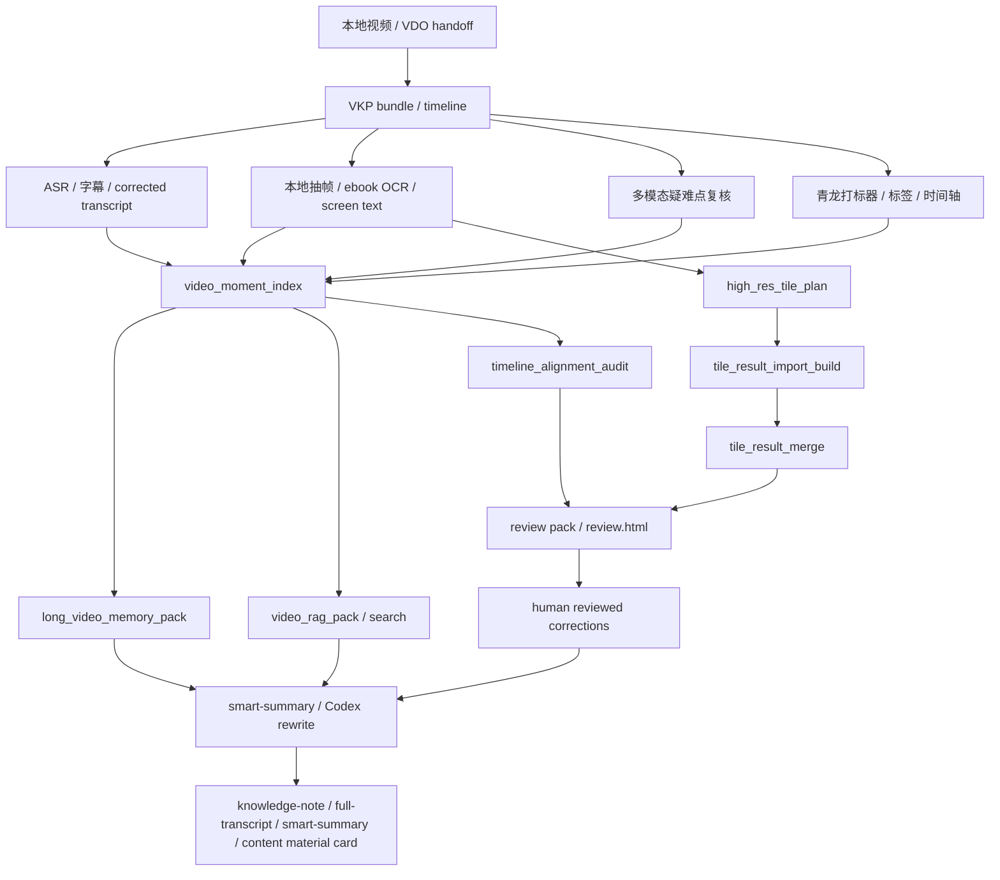

# 外部开源项目代码复用总账

更新时间：2026-07-04 22:53:57 | Codex / GPT-5

## 目的

本文档是 VKP 对外部 AI 视频项目复用工作的阶段性总账。它回答三个问题：

1. 已经从哪些开源项目吸收了哪些能力。
2. 哪些能力已经进入 VKP 的实际 CLI / MCP / WebUI / bundle 产物。
3. 接下来还有哪些模块值得继续榨取，哪些方向不应该再投入。

这里的复用原则是“拆模块，不搬家”：VKP 不把外部项目整套后端、模型服务或下载逻辑搬进来，只吸收低耦合、可验证、能进入现有证据链的能力。

快速入口：如果只需要判断“还该复用什么、哪些不要再搬”，先看 `docs/external-code-reuse-decision-map-2026-07-04.md`。本文档保留详细落地台账和更新记录。

## 总体判断

当前发现过的开源项目里，值得直接继续复用的不是“再找一个完整替代品”，而是五类局部工程能力：

| 能力类型 | 主要参考 | VKP 当前状态 | 价值 |
| --- | --- | --- | --- |
| 长任务状态、缓存、产物注册 | `vsummary` | 已有 `stage_cache`、`run_artifact_registry`、task console 任务历史 | 让 ASR、ebook、多模态、tile、summary 这些长任务可恢复、可重试、可审计 |
| 视频工作台、字幕编辑、总结交互 | `PrideWood/bilinote` | 已有字幕清洗、transcript editor、mind-map prompt、任务控制台部分交互 | 提高人类操作效率，尤其是视频、时间轴、转写、总结联动 |
| 长视频分层记忆和视频 RAG | `MovieChat`、`VideoRAG` | 已有 `video_moment_index`、`long_video_memory_pack`、`video_rag_pack/search/serve` | 支持长视频全片覆盖、术语定位、片段检索、后续问答 |
| 时间定位与审核时间戳质量 | `VTimeLLM`、BiliNote 时间轴 UI | 已有 `timeline_alignment_audit`，并进入 `review.html` / review pack | 解决审核跳转时间不准、ASR/抽帧/打标器冲突的问题 |
| 视觉输入预处理与高分辨率 tile | `Qwen-VL`、`InternVL` | 已有 `vlm_preprocess`、`high_res_tile_plan`、`tile_result_import_build`、`tile_result_merge` | 补小字、表格、软件界面、PPT 局部细节，避免整帧 OCR 失败后断链 |

## 已落地能力地图

### 1. vsummary 方向

已吸收能力：

- OpenAI-compatible 文本模型网关形态；
- 阶段缓存和 atomic artifact 写入；
- Windows CUDA DLL discovery；
- run/artifact registry；
- 任务状态、失败项、重试命令的 UI 化思路。

VKP 落地：

| 模块 | 入口 / 产物 | 状态 |
| --- | --- | --- |
| `text_llm_gateway.py` | `text-llm-provider-smoke` | 可用于后续在线/云端 LLM 接入，不写 secret |
| `stage_cache.py` | 内部缓存模块 | 已可复用到 ASR / ebook / smart-summary chunk |
| `cuda_runtime.py` | `asr-env-status` 中的 CUDA DLL 诊断 | 已接入 ASR 环境检查 |
| `run_artifact_registry.py` | `run-artifact-registry`、`runs/*/run.json/md` | 已接入 vision queue、timeline audit、tile 分支等 |
| task console 任务历史 | `task-console.html` | 已显示 run 状态、失败项、重试命令、产物链接 |

仍可继续榨取：

- 把 ASR、ebook batch、smart-summary chunk 都更完整地接入 stage cache 和 run registry；
- 让 task console 支持更直观的批次重试按钮和失败过滤；
- 给智能总结 section-level rerun 建 run 记录。

### 2. BiliNote 方向

已吸收能力：

- SRT / VTT / plain transcript 解析；
- 字幕清洗、短句合并、长转写分块；
- 转写校对 prompt；
- mind-map JSON prompt 结构；
- transcript editor 工作流；
- 视频 + transcript + 笔记联动的 UI 思路。

VKP 落地：

| 模块 | 入口 / 产物 | 状态 |
| --- | --- | --- |
| `bilinote_transcript_tools.py` | transcript cleanup / merge 内部能力 | 已可用于 transcript correction pack |
| `bilinote_summary_tools.py` | `bilinote-mind-map-prompt-pack` | 只生成 prompt pack，不调用 LLM |
| `transcript_correction_pack.py` | `transcript-correction-pack` | 已用于生成纠错证据包 |
| `transcript_editor.py` | `prepare-transcript-edit-session` / `apply-transcript-edits` | 已支持人工审核后导入 corrected transcript |
| 工作台交互 | `task-console.html`、`review.html` | 已有雏形，但还不是完整一体化视频工作台 |

仍可继续榨取：

- 把视频播放器、transcript row、视觉证据、smart-summary section 进一步合并到同一个工作台；
- 给 corrected transcript 做术语词典、标点恢复、说话人、错词仲裁的 UI；
- 给 smart-summary 增加 section edit / rerun / citation preview。

### 3. MovieChat / VideoRAG / VTimeLLM 方向

已吸收能力：

- 长视频 short memory / long memory 分层；
- segment/chunk 检索；
- evidence chunk JSONL；
- query-to-moment；
- temporal grounding 的 start/end 审计思路。

VKP 落地：

| 模块 | 入口 / 产物 | 状态 |
| --- | --- | --- |
| `video_moment_index.py` | `video-moment-index`，`exports/video-moment-index.*` | 已支持术语/疑难点定位 |
| `long_video_memory_pack.py` | `long-video-memory-pack`，`exports/long-video-memory-pack.*` | 已支持长视频分层总结输入 |
| `video_rag_pack.py` | `video-rag-pack`，`exports/video-rag-chunks.jsonl` | 已支持本地 JSONL RAG 包 |
| `video_rag_search.py` | `video-rag-search` | 已支持本地词法检索 |
| `video_rag_http.py` | `video-rag-service-plan` / `video-rag-serve` | 显式启动，不默认常驻 |
| `timeline_alignment_audit.py` | `timeline-alignment-audit`，review HTML / review pack | 已进入审核闭环 |

仍可继续榨取：

- 把 RAG chunk 拆成 transcript / visual / chapter / review-gap / content-asset 多粒度层；
- 可选接本地向量后端，但默认仍保持 JSONL 和词法检索；
- 把 moment search 结果和 review row、播放器跳转做更紧密联动；
- 用 timeline alignment audit 生成 preview-only 修复建议，不自动改时间轴。

### 4. Qwen-VL / InternVL 方向

已吸收能力：

- 图像缩放、压缩、多图 payload 的统一预处理；
- 动态 tile / high-res crop 思路；
- 本地 VLM 通过 OpenAI-compatible 或 subprocess adapter 接入，而不是嵌模型源码。

VKP 落地：

| 模块 | 入口 / 产物 | 状态 |
| --- | --- | --- |
| `vlm_preprocess.py` | semantic / temporal / provider smoke 共用 | 已统一图片 resize/compress/probe metadata |
| `high_res_tile_plan.py` | `high-res-tile-plan`，`high-res-tiles/` | 已能从 OCR/ebook 弱项生成 tile 证据 |
| `tile_result_import_builder.py` | `tile-result-import-build`，`tile-result-import.json/md` | 已能把 `.json` / `.txt` / `.md` 结果归一化 |
| `tile_result_merge.py` | `tile-result-merge` | 已能回填高置信结果，低质量结果进入 review pack |
| `local_vlm_server_adapter.py` | `local-vlm-adapter-plan` / `local-vlm-serving-smoke` | 已提供本地 VLM adapter/smoke 边界 |

仍可继续榨取：

- `tile-result-import-build` 继续适配真实 OCR/VLM 常见输出结构，例如 RapidOCR、PaddleOCR、OpenAI-compatible、Gemini candidates；
- tile payload 也走 `vlm_preprocess.py`，统一本地/云端多模态输入格式；
- task console 显示 tile plan -> import -> merge -> review 的完整进度。

## 当前完整外部能力链路



## 仍值得继续复用的模块清单

| 优先级 | 模块 | 来源 | 建议落地形态 | 是否需要新模型 |
| --- | --- | --- | --- | --- |
| P0 | task console 批次队列增强 | vsummary / Peepshow / BiliNote | 批次大小、总批数、失败索引、重试按钮、run artifact 汇总 | 否 |
| P0 | review.html 视频工作台增强 | BiliNote / VTimeLLM | 视频、ASR、视觉证据、时间错位、人工修正同屏 | 否 |
| P1 | tile import parser 增强 | RapidOCR / PaddleOCR / OpenAI-compatible / Gemini 输出习惯 | 直接消费真实 OCR/VLM JSON，不要求人工拼 import | 否 |
| P1 | smart-summary section workflow | BiliNote / vsummary / MovieChat | 章节级改写、质量门禁、citation-aware rerun | 可先用 Codex，后续可接 LLM |
| P1 | VideoRAG 多粒度检索 | VideoRAG | transcript/visual/chapter/review-gap/content-asset 多层 chunks | 否，向量后端可选 |
| P2 | transcript 纠错工作台 | BiliNote / WhisperX / FunASR | 术语词典、标点、说话人、错词仲裁 | 可选 |
| P2 | 本地 VLM 能力矩阵 | Qwen / InternVL / LLaVA | provider smoke、显存/输入规格报告、质量对比 | 需要本地服务时才需要 |

## 不建议继续投入的方向

| 方向 | 原因 |
| --- | --- |
| 整体搬 vsummary 后端 | 与 VKP 的 CLI/MCP/OpenClaw/static bundle 架构重复，维护成本高 |
| 整体搬 BiliNote React UI | 交互值得学，但整套搬会打断当前 bundle/review/task-console 渐进路线 |
| 默认运行 VideoRAG 图/向量数据库 | 重依赖，不适合作为 VKP 默认本地工具 |
| 嵌入 Qwen/InternVL/LLaVA 模型源码 | 环境复杂，应通过 provider/adapter 边界接入 |
| 在 VKP 里重写下载/平台字幕抓取 | 下载与平台访问归 `video-download-orchestrator` 或外部 handoff |
| 把大量抽帧默认发送给云多模态 | 本地抽帧可以密，云视觉仍应疑难点优先、小批次、显式执行 |

## 下一步建议

1. 先增强 `tile-result-import-build`，直接解析 RapidOCR/PaddleOCR/OpenAI-compatible/Gemini/VKP vision 常见 JSON 输出。
2. 再把 task console 的 tile / ebook / vision / smart-summary / timeline audit 批次队列统一成“可重试生产线”。
3. 然后做 review.html 的一体化视频工作台增强，让人工审核能直接看视频、时间轴、疑难点、纠错建议。
4. 最后把 smart-summary section workflow 接上 corrected transcript、long memory、RAG chunks 和 citation。

## 验收口径

后续每个外部模块复用都必须满足：

- 有 CLI/MCP 或静态 WebUI 入口；
- 有 bundle 内 JSON/Markdown 产物；
- 有 run artifact 或状态报告；
- 不默认调用云端模型；
- 不自动发布、不自动写正式知识库；
- 失败项能进入 retry 或 review pack；
- 不写入 secret、cookie、token、API key。

## Update - 2026-07-04 23:02:14 | Codex / GPT-5

### Tile result import parser now consumes common OCR/VLM outputs

Continuing the P1 high-res tile reuse track, `tile-result-import-build` has been upgraded from simple `text/confidence` JSON parsing to a real adapter for common tile OCR/VLM output shapes:

- RapidOCR / PaddleOCR style OCR entries: `result`, `ocr_result`, `data`, `items`, `lines`, `blocks`, `rec_texts`, `rec_scores`.
- OpenAI-compatible chat completions: `choices[].message.content` and text content parts.
- Gemini-style outputs: `candidates[].content.parts[].text`.
- VKP / VLM outputs: `visual_understanding` and `structured_visual`.
- Plain `.txt` / `.md` tile result files remain supported.

Confidence handling is explicit:

- OCR entry scores are averaged when available.
- Top-level `confidence` / `score` / `probability` wins.
- `--default-confidence` is applied only to matched result files that do not carry scores, useful for trusted OpenAI/Gemini/manual result folders.
- Pending tile results stay at confidence `0.0` and remain review targets.

Verification smoke:

```powershell
python -m py_compile src\video_knowledge_pipeline\tile_result_import_builder.py tests\test_tile_result_import_builder.py
$env:PYTHONPATH='src'; python -m video_knowledge_pipeline.cli tile-result-import-build outputs\manual-high-res-tile-smoke-20260704\bundle --results-dir outputs\manual-high-res-tile-smoke-20260704\bundle\tile-results-rich --output-json outputs\manual-high-res-tile-smoke-20260704\bundle\tile-result-import-rich-default-confidence.json --default-confidence 0.72
$env:PYTHONPATH='src'; python -m video_knowledge_pipeline.cli tile-result-merge outputs\manual-high-res-tile-smoke-20260704\bundle --input-json outputs\manual-high-res-tile-smoke-20260704\bundle\tile-result-import-rich-default-confidence.json
```

Smoke result: 4 matched OCR/VLM result files, 2 pending tiles; merge preview produced 4 updates and 2 review targets. A direct Python assertion smoke also passed with 4 matched, 1 pending, 4 updates, 1 review target.

Pytest note: a targeted pytest file was added, but this Windows session still blocks pytest temp/cache directories with `PermissionError: [WinError 5]`. The test file compiles and the same function path was verified through direct Python smoke.


## Update - 2026-07-04 23:07:52 | Codex / GPT-5

### P0/P1 continued: task console processing queue

Continuing the vsummary/BiliNote/Peepshow-style task UI reuse track, `task-console.html` now includes a derived **处理队列** section in addition to the raw “任务历史” list.

The queue is built only from local run artifacts:

- `run-artifact-registry.json`
- `runs/*/run.json`

It does not start ASR, OCR, ebook, vision, download, or cloud API work. It groups existing VKP runs into operator-friendly lanes:

- ASR / 转写
- 图文 OCR / ebook
- 多模态复核
- 时间轴 / RAG
- 总结 / 导出
- 人工审核
- 其他任务

Each lane shows:

- status: `empty`, `ready`, or `action_required`;
- run count and status counts;
- failed item preview;
- next actions;
- prioritized retry command copied from the runs that actually need action;
- `runs/.../run.md` links.

This makes the existing high-res tile chain easier to operate: `high-res-tile-plan -> tile-result-import-build -> tile-result-merge -> review pack` now appears as one actionable OCR/ebook queue rather than scattered reports.

Verification smoke:

```powershell
python -m py_compile src\video_knowledge_pipeline\task_console.py tests\test_task_console.py
$env:PYTHONPATH='src'; python -m video_knowledge_pipeline.cli export-task-console outputs\manual-high-res-tile-smoke-20260704\bundle --no-refresh
rg -n -e "处理队列" -e "runs/tile-result-merge/run.md" -e "queue-retry" outputs\manual-high-res-tile-smoke-20260704\bundle\task-console.html
```

Smoke result: `task-console.json` contains `processing_queue.schema = video_knowledge_pipeline.task_processing_queue.v1`; the OCR/ebook lane is `action_required`, links to `runs/tile-result-merge/run.md`, and prioritizes `tile-result-merge --execute` as the retry command.

Pytest note: `tests/test_task_console.py` was updated, but this Windows session still blocks pytest temporary/cache directory traversal with `PermissionError: [WinError 5]`. The same export path was verified through CLI smoke and compiled successfully.

## Update - 2026-07-04 23:16:30 | Codex / GPT-5

### P1 continued: smart-summary section workflow from BiliNote/vsummary patterns

继续吸收外部项目中值得复用的“分段总结 + 任务状态”能力：

- BiliNote 值得吸收的是课程笔记的章节/脑图式组织方式，而不是整体 UI 或下载逻辑。
- vsummary 值得吸收的是 staged artifact、run status、failed items、retry command 这一套任务可恢复结构。
- VKP 现在把二者合并到 `smart-summary-section-workflow`：先基于完整 transcript / chapter pack / long-video memory pack 生成章节级状态，再把需要 Codex/LLM 重写的章节放入 run artifact 和 task console 队列。

新增入口：

```powershell
.\scripts\video-knowledge.ps1 smart-summary-section-workflow <webui-bundle> --target-chapters 8
```

新增产物：

- `exports/smart-summary-section-workflow.json`
- `exports/smart-summary-section-workflow.md`
- `exports/smart-summary-section-todo.json`
- `mcp-smart-summary-section-workflow.args.json`
- `runs/smart-summary-section-workflow/run.json`
- `runs/smart-summary-section-workflow/run.md`

设计边界：

- 本入口只做本地章节状态、证据汇总、重写提示和质量缺口归因；不调用云 LLM。
- 如果全局 `smart-summary.md` 质量门禁失败，章节会进入 `needs_rewrite`，避免规则草稿被误当最终智能总结。
- 后续 Codex 或在线 LLM 可以读取 `smart-summary-section-todo.json` 分段重写，但必须再经过 `generate-smart-summary-with-codex` / `smart-summary-quality-check` 门禁。
- `task-console.html` 的“总结 / 导出”队列现在能显示该 run 的 failed sections、next actions 和 retry command。

Verification smoke:

```powershell
python -m py_compile src\video_knowledge_pipeline\smart_summary_section_workflow.py src\video_knowledge_pipeline\cli.py src\video_knowledge_pipeline\mcp_server.py src\video_knowledge_pipeline\task_console.py
$env:PYTHONPATH='src'; python -m video_knowledge_pipeline.cli smart-summary-section-workflow outputs\manual-smart-summary-registry-smoke-20260704\bundle --target-chapters 3
$env:PYTHONPATH='src'; python -m video_knowledge_pipeline.cli export-task-console outputs\manual-smart-summary-registry-smoke-20260704\bundle --no-refresh
```

Smoke result: 4章节进入 `needs_rewrite`；`task-console.json` 的 `processing_queue` 在“总结 / 导出”lane 中显示 `smart-summary-section-workflow` 为 `action_required`，并链接 `runs/smart-summary-section-workflow/run.md`。

## Update - 2026-07-04 23:25:45 | Codex / GPT-5

### P1 continued: staged smart-summary section apply

Continuing the vsummary staged-generation and BiliNote section-editing reuse track, VKP now has the second half of the section workflow:

```powershell
.\scripts\video-knowledge.ps1 smart-summary-section-apply <webui-bundle> --input-json <section-revisions.json> --require-all-sections
```

What it does:

- Reads `exports/smart-summary-section-workflow.json` and a section revision JSON.
- Accepts `rows[]`, `sections[]`, or `revised_sections[]` with `section_id` plus `final_markdown`, `revised_markdown`, `draft_markdown`, `markdown`, or `content`.
- Stitches approved section Markdown into `exports/smart-summary.codex.md`.
- Reuses the existing `generate-smart-summary-with-codex` and `smart-summary-quality-check` path instead of creating a second final-summary pipeline.
- Registers `runs/smart-summary-section-apply/run.json` and appears in task console summary/export queues.

New artifacts:

- `exports/smart-summary-section-apply.json`
- `exports/smart-summary-section-apply.md`
- `mcp-smart-summary-section-apply.args.json`
- `runs/smart-summary-section-apply/run.json`
- `runs/smart-summary-section-apply/run.md`

Boundary:

- Local only; no cloud call; does not process media.
- Empty revisions now return `needs_section_revisions` / `needs_input`; they do not reuse an old `smart-summary.codex.md` to fake completion.
- Completed revisions must still pass the existing smart-summary quality gate.

Verification smoke:

```powershell
python -m py_compile src\video_knowledge_pipeline\smart_summary_section_apply.py src\video_knowledge_pipeline\cli.py src\video_knowledge_pipeline\mcp_server.py src\video_knowledge_pipeline\task_console.py
$env:PYTHONPATH='src'; python -m video_knowledge_pipeline.cli smart-summary-section-apply outputs\manual-smart-summary-registry-smoke-20260704\bundle --input-json outputs\manual-smart-summary-registry-smoke-20260704\bundle\exports\smart-summary-section-todo.json
$env:PYTHONPATH='src'; python -m video_knowledge_pipeline.cli smart-summary-section-apply outputs\manual-smart-summary-registry-smoke-20260704\bundle --input-json outputs\manual-smart-summary-registry-smoke-20260704\bundle\section-revisions-smoke.json --require-all-sections
$env:PYTHONPATH='src'; python -m video_knowledge_pipeline.cli mcp-call smart_summary_section_apply outputs\manual-smart-summary-registry-smoke-20260704\bundle\mcp-smart-summary-section-apply-smoke.args.json
```

Smoke result:

- Empty TODO: `status=needs_section_revisions`, run artifact `status=needs_input`.
- Complete section revision pack: 4/4 sections installed, `quality_status=passed`, run artifact `status=completed`.
- MCP call succeeded with no ignored args.

## Update - 2026-07-04 23:31:16 | Codex / GPT-5

### Documentation snapshot: remaining reusable external modules

The current external-code reuse direction is now documented in docs/external-code-module-reuse-backlog-2026-07-04.md under “仍值得继续复用的外部代码模块清单”.

Key decisions captured there:

- Do not copy whole external products into VKP. Reuse local modules and interaction patterns only.
- Highest-value next module is a BiliNote/vsummary-style smart-summary-section-editor.html, because smart-summary-section-workflow and smart-summary-section-apply already provide the backend state and install path.
- VideoRAG-style citation injection, transcript/ASR multi-source arbitration, high-res tile review, local VLM adapters, and temporal alignment scoring remain useful local modules.
- Download, login, publishing, and full model deployment remain outside VKP's core responsibility.

Recommended next implementation target: section editor UI first, then citation injection and corrected transcript arbitration.
## Update - 2026-07-04 23:40:12 | Codex / GPT-5

### P0 landed: BiliNote/vsummary-style smart-summary section editor

VKP now includes the missing UI half of the section-level smart-summary workflow:

```powershell
.\scripts\video-knowledge.ps1 smart-summary-section-editor <webui-bundle>
```

The new `smart-summary-section-editor.html` is a static same-screen review workspace:

- left: section queue and rewrite status;
- center: local video picker/player, section transcript excerpt, evidence summary;
- right: section revision textarea, rewrite prompt, copied apply command;
- output: downloaded/copied `smart-summary-section-revisions.json`;
- install path: `smart-summary-section-apply --input-json <revision-json>`.

This directly reuses the useful part of BiliNote's section editing interaction and vsummary's staged-generation pattern without importing their download/backend/UI shell. It is local-only and does not call cloud LLMs.

Validation covered py_compile, targeted pytest, CLI smoke, MCP smoke, and task console visibility on `outputs\manual-smart-summary-registry-smoke-20260704\bundle`.

## Update - 2026-07-04 23:46:55 | Codex / GPT-5

### P1 landed: VideoRAG/moment citations for smart-summary sections

VKP now injects local `video_moment_index` citations into `smart-summary-section-workflow` and `smart-summary-section-editor`.

What changed:

- `smart-summary-section-workflow` loads or locally builds `exports/video-moment-index.json`.
- Each section receives `citations[]` matched by chapter time range and moment chunk overlap.
- The rewrite prompt now includes explicit `证据引用` lines with time range, timeline indexes, and snippets.
- `smart-summary-section-todo.json` carries citations forward for Codex/LLM or human section rewriting.
- `smart-summary-section-editor.html` renders citations in the evidence panel.

This reuses the useful part of VideoRAG/VTime-style temporal grounding without adding a vector DB, starting a RAG service, or calling cloud models.

Validation covered py_compile, targeted pytest (`2 passed`), CLI workflow/editor smoke, MCP editor smoke, and artifact grep for `moment-0001` / `citations`.
## Update - 2026-07-05 00:03:35 | Codex / GPT-5

### P0 landed: 字幕/ASR 多源仲裁层

Continuing the BiliNote + WhisperX/FunASR + VKP term-resolution reuse track, VKP now has a local `transcript-source-arbitration` layer.

New module and entries:

- `src/video_knowledge_pipeline/transcript_source_arbitration.py`
- CLI: `transcript-source-arbitration <webui-bundle>`
- MCP: `transcript_source_arbitration` / `transcript_source_arbitration_tool`
- Task console command and MCP args: `mcp-transcript-source-arbitration.args.json`
- Artifacts: `transcript-source-arbitration.json/md`, `source-arbitrated-transcript.json/srt/md`

What it reuses:

- BiliNote-style subtitle parsing through VKP's existing transcript parser.
- Platform/self subtitles and ASR sidecars from manifest/root files.
- `term-resolution.json` high-confidence term evidence and optional glossary aliases.
- Existing manifest contract where `corrected_transcript_json` is preferred by `full-transcript.md` and smart-summary input.

Boundary:

- Local-only; no LLM call and no cloud ASR/vision.
- Raw ASR/subtitle files are preserved.
- High-confidence corrections are promoted to `manifest.corrected_transcript_*` by default.
- Low-confidence close conflicts become review rows rather than silent text overwrites.

Validation:

```powershell
python -m py_compile src\video_knowledge_pipeline\transcript_source_arbitration.py src\video_knowledge_pipeline\cli.py src\video_knowledge_pipeline\mcp_server.py src\video_knowledge_pipeline\task_console.py tests\test_transcript_source_arbitration.py
$env:PYTHONPATH='src'; python -m pytest -q tests\test_transcript_source_arbitration.py
$env:PYTHONPATH='src'; python -m video_knowledge_pipeline.cli transcript-source-arbitration outputs\test-transcript-source-arbitration\bundle --no-promote
$env:PYTHONPATH='src'; python -m video_knowledge_pipeline.cli mcp-call transcript_source_arbitration outputs\test-transcript-source-arbitration\bundle\mcp-transcript-source-arbitration.args.json
```

Result: 2 focused tests passed; CLI and MCP smoke passed. Pytest still warns that `.pytest_cache` cannot be written in this Windows sandbox.

## Update - 2026-07-05 20:28:30 | Codex / GPT-5

### P0 landed: unified video workbench v1

Backlog 对应：`docs/external-code-reuse-remaining-modules-2026-07-05.md` 的 P0 “统一视频工作台”。

本轮把 BiliNote 的“视频 + 字幕/笔记同屏”、vsummary 的时间戳跳转/产物入口、Peepshow/VidClaude 的证据卡片思路，落成 VKP 自己的静态工作台，而不是整体搬外部 UI。

新增入口：

```powershell
.\scripts\video-knowledge.ps1 export-video-workbench <webui-bundle>
```

MCP：

- `export_video_workbench`
- `export_video_workbench_tool`

新增产物：

- `video-workbench.html`
- `video-workbench.json`
- `mcp-video-workbench.args.json`
- `runs/video-workbench/run.json`
- `runs/video-workbench/run.md`

能力边界：

- 静态本地 HTML，不直接写回 bundle，不调用云 API，不处理媒体。
- 页面内聚合任务控制台、审核页、转写编辑器、智能总结章节编辑器、字幕/ASR 多源仲裁、智能总结、逐字稿、知识笔记、任务产物索引和片段索引。
- 支持选择本地视频文件后点击 timeline row 跳转播放时间点。
- 真实导入、执行、多模态调用仍走既有 CLI/MCP/preflight/confirm 边界。

Task console 集成：

- `task-console.html` 新增命令“打开视频知识工作台”。
- 产物区新增“视频知识工作台”链接。
- `export-task-console` 会写出 `mcp-video-workbench.args.json` 并把 `mcp_video_workbench_args` 写入 manifest。

验证：

```powershell
python -m py_compile src\video_knowledge_pipeline\video_workbench.py src\video_knowledge_pipeline\cli.py src\video_knowledge_pipeline\mcp_server.py src\video_knowledge_pipeline\task_console.py tests\test_video_workbench.py
$env:PYTHONPATH='src'; python -m video_knowledge_pipeline.cli export-video-workbench outputs\manual-video-workbench-smoke\bundle
$env:PYTHONPATH='src'; python -m video_knowledge_pipeline.cli mcp-call export_video_workbench outputs\manual-video-workbench-smoke\bundle\mcp-video-workbench.args.json
$env:PYTHONPATH='src'; python -m video_knowledge_pipeline.cli mcp-audit-bundle outputs\manual-video-workbench-smoke\bundle
```

结果：

- py_compile 通过。
- CLI / mcp-call 均成功生成 `video-workbench.html/json`，timeline_count=2。
- `mcp-audit-bundle` 结果 `status=ok`，14/14 OK，包含 `mcp_video_workbench_args -> export_video_workbench`。
- 新增 pytest `tests/test_video_workbench.py` 的测试主体显示 `.. [100%]`，但当前 Windows pytest session finish 在本机临时目录/清理阶段卡住，需要手动停止 pytest 进程；直接 CLI/MCP smoke 已覆盖核心行为。

下一步：继续 P0/P1 交界任务，把 run registry / failed items / retry commands 在工作台里做成更强的统一队列，然后把 `transcript-source-arbitration` review rows 接入 transcript editor / review pack。
## Update - 2026-07-05 20:33:10 | Codex / GPT-5

### P0 continued: workbench batch queue and retry panel

在 `video-workbench.html` 第一版基础上，本轮继续吸收 vsummary 的 run status / retry command、BiliNote 的任务面板和 Peepshow/VidClaude 的失败项预览思路，把 `task-console.py` 已有的 processing queue 逻辑复用进统一工作台。

落地变化：

- `export-video-workbench` 现在读取并刷新 `run-artifact-registry.json`。
- `video-workbench.json` 新增：
  - `run_registry`
  - `processing_queue`
- `video-workbench.html` 左栏新增“处理队列”：
  - 显示 run_count / action_required_count；
  - 按 ASR/转写、图文 OCR/ebook、多模态复核、时间轴/RAG、总结/导出、人工审核、其他任务分组；
  - 显示每组状态、runs、失败项预览；
  - 显示 retry command，并提供复制按钮。
- `video_workbench` 自身 run 会登记到 `runs/video-workbench/run.json`，并在登记后重新刷新 registry，使工作台 JSON/HTML 看到最新 run 状态。

验证：

```powershell
python -m py_compile src\video_knowledge_pipeline\video_workbench.py tests\test_video_workbench.py
$env:PYTHONPATH='src'; python -c "import importlib.util; spec=importlib.util.spec_from_file_location('tvw','tests/test_video_workbench.py'); mod=importlib.util.module_from_spec(spec); spec.loader.exec_module(mod); mod.test_export_video_workbench_writes_static_workspace(); mod.test_task_console_links_video_workbench(); print('video_workbench_tests_ok')"
$env:PYTHONPATH='src'; python -m video_knowledge_pipeline.cli export-video-workbench outputs\test-video-workbench\bundle
$env:PYTHONPATH='src'; python -m video_knowledge_pipeline.cli mcp-call export_video_workbench outputs\test-video-workbench\bundle\mcp-video-workbench.args.json
$env:PYTHONPATH='src'; python -m video_knowledge_pipeline.cli mcp-audit-bundle outputs\test-video-workbench\bundle
```

结果：

- Direct test runner: `video_workbench_tests_ok`。
- CLI smoke: `processing_queue.action_required_count=1`，`run_registry.run_count=2`，包含 `video-workbench` 和 `timeline-alignment-audit`。
- MCP call: `ignored_args=[]`。
- MCP audit: `status=ok`，14/14 OK。

边界：队列面板只展示 run registry / failed items / retry command，不自动执行命令，不绕过 preflight、execute 和人工确认边界。
## Update - 2026-07-05 20:44:25 | Codex / GPT-5

### P0/P1 continued: transcript arbitration review integration

外部项目复用归属：

- BiliNote：转写编辑器和字幕修正工作台思路。
- WhisperX / FunASR / SenseVoice：多源 ASR/字幕时间文本证据。
- VKP 现有 review pack：人工审核分组、review closure、todo JSON 边界。

本轮落地：

- `transcript-source-arbitration` 的 `review_rows` 进入 `prepare-review-session` / `review-pack.md/json`。
- 新增 review reasons：`transcript_source_conflict`、`low_arbitration_confidence`。
- `transcript-editor.html` 展示仲裁冲突、候选来源和替换建议。
- `review-notes.todo.json` 不包含 transcript arbitration 条目，避免把字幕纠错误走 timeline review 导入。

新增/修改文件：

- `src/video_knowledge_pipeline/review_session.py`
- `src/video_knowledge_pipeline/transcript_editor.py`
- `tests/test_transcript_arbitration_review_integration.py`

验证：

- `py_compile` 通过。
- Direct test runner 输出：`transcript_arbitration_review_tests_ok`。
- artifact grep 确认 review pack/editor 有冲突提示，review notes todo 无冲突 reason。

后续仍可继续榨取的部分：

- `apply-transcript-edits` 成功写入人工纠正版后，自动关闭对应 transcript arbitration review target。
- 在统一 `video-workbench.html` 中把 transcript arbitration conflict count 做成可点击入口。
- 增加术语词典、说话人、标点恢复对同一段的并排建议。
## Update - 2026-07-05 20:52:57 | Codex / GPT-5

### P0/P1 continued: transcript arbitration review closure

复用台账更新：字幕/ASR 多源仲裁现在不只是生成冲突和编辑界面，还能在人工转写导入后进入 review closure 的关闭统计。

新增/修改：

- `src/video_knowledge_pipeline/review_session.py`
  - transcript arbitration target 读取 `human-corrected-transcript.json`；
  - `review_closure_status` 统计 `closed_by_reason` 和 `closed_targets`；
  - `review-closure-status.md` 增加 “Closed By Reason”。
- `tests/test_transcript_arbitration_review_integration.py`
  - 覆盖 `apply_transcript_edits -> review_closure_status` 闭环。

验证结果：

- `transcript_arbitration_closure_tests_ok`
- 顺序 smoke：`closed_by_reason={low_arbitration_confidence:1, transcript_source_conflict:1}`，`closed_targets=1`。

仍可继续榨取：

- 在 `video-workbench.html` 中把 `closed_by_reason` / open arbitration count 展示为可点击入口。
- transcript editor 可进一步吸收 BiliNote 的术语词典、标点和说话人修正体验。
## Update - 2026-07-05 20:57:42 | Codex / GPT-5

### P0 continued: workbench consumes review closure status

复用台账更新：统一视频工作台现在消费 `review-closure-status.json`，把 review closure 和 transcript arbitration closure 从报告层提升到主操作台可见层。

新增/修改：

- `src/video_knowledge_pipeline/video_workbench.py`
  - `review_closure` JSON payload；
  - “复核闭环”HTML 面板；
  - `review_closure_status` / `review_pack` artifact links。
- `tests/test_video_workbench.py`
  - closure fixture 与 workbench assertion。

验证结果：

- `video_workbench_closure_panel_tests_ok`
- CLI smoke 生成的 `video-workbench.html/json` 包含 `review_closure`、`复核闭环`、`字幕仲裁待复核`。

仍可继续榨取：

- 在工作台中把 open transcript arbitration 变成直接筛选 transcript editor 的入口。
- 把 VideoRAG/moment citation、timeline alignment 和 tile review 也做成同样的一眼状态卡。
## Update - 2026-07-05 21:02:44 | Codex / GPT-5

### P0/P1 continued: workbench evidence status panel

复用台账更新：统一视频工作台现在消费并展示三类已吸收的外部能力结果：

- VTimeLLM-style `timeline-alignment-audit`：时间错位 issue count；
- InternVL/Qwen-style tile recovery：`tile_review_targets` / `tile_result_needs_review`；
- VideoRAG-style `video-moment-index`：moment chunk count 和覆盖时长。

新增/修改：

- `src/video_knowledge_pipeline/video_workbench.py`
  - `evidence_status` JSON payload；
  - “证据状态”HTML 面板；
  - `timeline_alignment_audit_report` artifact link。
- `tests/test_video_workbench.py`
  - evidence status fixture 和 assertions。

验证结果：

- `video_workbench_evidence_status_tests_ok`
- CLI smoke 产物包含 `evidence_status`、`证据状态`、`时间错位`、`Tile 待复核`。

仍可继续榨取：

- 把这些状态卡做成可点击过滤：时间错位 -> 对应 timeline rows；tile 待复核 -> tile evidence；moment index -> 搜索/跳转片段。
- 把 task console 的 moment search 直接嵌入 workbench，而不是只通过 iframe 打开。
## Update - 2026-07-05 21:07:31 | Codex / GPT-5

### P0/P1 continued: evidence status becomes clickable row filters

复用台账更新：统一视频工作台现在不只是显示 VTimeLLM / VideoRAG / tile recovery 的汇总数字，还能把时间错位和 Tile 待复核映射到具体 timeline row。

新增/修改：

- `src/video_knowledge_pipeline/video_workbench.py`
  - timeline rows 增加 `evidence_flags`、`timeline_alignment`、`tile_review_targets`；
  - evidence panel 增加 `setFilter('timeline_alignment_issue')` 与 `setFilter('tile_result_needs_review')`；
  - 详情区显示 alignment/tile 证据摘要。
- `tests/test_video_workbench.py`
  - row-level evidence assertions；
  - HTML filter/detail assertions。

验证结果：

- `video_workbench_evidence_filter_tests_ok`
- CLI smoke 产物包含筛选按钮、`证据标记`、`Tile 复核`、`tile_result_needs_review`。

仍可继续榨取：

- 把 VideoRAG moment search 从 task console iframe 直接移入 workbench 主页面。
- 让 timeline row 的 citation / moment id 可直接跳转视频时间点并高亮对应 evidence path。
## Update - 2026-07-05 21:17:52 | Codex / GPT-5

### P0/P1 continued: VideoRAG moment search embedded in workbench

本轮继续把外部项目的局部能力收束进统一视频工作台：ideo-workbench.html 现在直接内置 VideoRAG-style 片段搜索，不再要求用户先打开 task console iframe 再搜片段。

复用点：

- 复用 	ask_console._compact_moment_index 的 compact chunk 数据结构；
- 继续消费 xports/video-moment-index.json，不新增向量库、不启动 HTTP RAG 服务；
- 借鉴 vsummary 的 citation seek 体验：搜索结果点击后跳转播放器时间点，并选中对应 timeline row；
- 保持静态本地 HTML，不写盘、不调用云、不执行命令。

新增/修改：

- src/video_knowledge_pipeline/video_workbench.py
  - xport_video_workbench 输出 moment_index 到 ideo-workbench.json；
  - 新增 片段搜索 panel；
  - 新增
enderMomentSearch()、selectMoment()、
earestRow() 前端逻辑；
  - 点击 moment result 会跳视频、选择对应 timeline row，并保留证据路径和关键词。
- 	ests/test_video_workbench.py
  - fixture 的 ideo-moment-index.json 增加关键词、snippet、证据路径；
  - 覆盖 moment_index payload、搜索 UI、关键词和 JS hook。

验证：

`powershell
python -m py_compile src\video_knowledge_pipeline\video_workbench.py tests\test_video_workbench.py
$env:PYTHONPATH='src'; python -c "import importlib.util; spec=importlib.util.spec_from_file_location('tvw','tests/test_video_workbench.py'); mod=importlib.util.module_from_spec(spec); spec.loader.exec_module(mod); mod.test_export_video_workbench_writes_static_workspace(); mod.test_task_console_links_video_workbench(); print('video_workbench_moment_search_tests_ok')"
$env:PYTHONPATH='src'; python -m video_knowledge_pipeline.cli export-video-workbench outputs\test-video-workbench\bundle
rg -n -e "片段搜索" -e "momentSearchInput" -e "renderMomentSearch" -e "selectMoment" -e "moment_index" outputs\test-video-workbench\bundle\video-workbench.html outputs\test-video-workbench\bundle\video-workbench.json
git diff --check -- src\video_knowledge_pipeline\video_workbench.py tests\test_video_workbench.py
`

结果：

- Direct test runner: ideo_workbench_moment_search_tests_ok。
- CLI smoke 成功生成 ideo-workbench.html/json。
- 产物中能看到 片段搜索、momentSearchInput、
enderMomentSearch、selectMoment、moment_index。
- git diff --check 对本次代码/测试文件无报错。

后续继续榨取：

- 把 workbench 的 run queue 扩展到 ebook batch、tile merge、多模态 batch、smart-summary section workflow。
- 把 corrected transcript / source arbitration 差异视图放进 workbench 主页面。
- 让 smart-summary-input-pack 记录每章使用了哪些 transcript / OCR / vision / moment evidence。
## Update - 2026-07-05 21:25:18 | Codex / GPT-5

### P0 continued: workbench queue cards become actionable run details

本轮继续复用 vsummary 的 run status / retry command 和 BiliNote 的任务面板思路，把 ideo-workbench.html 的处理队列从摘要卡片推进到可操作的队列详情。

落地变化：

- src/video_knowledge_pipeline/video_workbench.py
  - 左栏 queue card 增加 data-queue-key 和 selectQueue()；
  - 点击 ASR、ebook/OCR、多模态、时间轴/RAG、总结导出、人工审核等队列后，右侧详情区显示：
    - 队列说明；
    - status / run_count / action_required / failed_count；
    - runs 列表；
    - failed items；
    - next actions；
    - 最多 3 条 retry command，并可复制。
  - 修复 workbench moment search 的 MOMENT_INDEX 前端常量声明，避免浏览器运行时报错。
- 	ests/test_video_workbench.py
  - 覆盖 selectQueue、QUEUE_GROUPS、data-queue-key=\"document_ocr\"、queue-detail-retry、队列：。

验证：

`powershell
python -m py_compile src\video_knowledge_pipeline\video_workbench.py tests\test_video_workbench.py
$env:PYTHONPATH='src'; python -c "import importlib.util; spec=importlib.util.spec_from_file_location('tvw','tests/test_video_workbench.py'); mod=importlib.util.module_from_spec(spec); spec.loader.exec_module(mod); mod.test_export_video_workbench_writes_static_workspace(); mod.test_task_console_links_video_workbench(); print('video_workbench_queue_detail_tests_ok')"
$env:PYTHONPATH='src'; python -m video_knowledge_pipeline.cli export-video-workbench outputs\test-video-workbench\bundle
rg -n -e "selectQueue" -e "QUEUE_GROUPS" -e "data-queue-key" -e "queue-detail-retry" -e "队列：" outputs\test-video-workbench\bundle\video-workbench.html outputs\test-video-workbench\bundle\video-workbench.json
git diff --check -- src\video_knowledge_pipeline\video_workbench.py tests\test_video_workbench.py
`

结果：

- Direct test runner: ideo_workbench_queue_detail_tests_ok。
- CLI smoke 成功生成 ideo-workbench.html/json。
- 产物中能看到 selectQueue、QUEUE_GROUPS、data-queue-key、queue-detail-retry、队列：。
- git diff --check 对本次代码/测试文件无报错。

边界：工作台仍然只是静态本地 UI；它展示和复制命令，不自动执行 ebook、tile、多模态、ASR 或 smart-summary 任务。
## Update - 2026-07-05 21:30:24 | Codex / GPT-5

### P0 continued: explicit queue routing for reused external modules

本轮继续把 vsummary-style run registry 和 BiliNote-style task panel 做实：	ask_console._run_queue_group 不再只靠几组隐式关键词，而是新增 QUEUE_GROUP_TOKENS 路由表，把已经复用和计划继续复用的外部模块稳定归到正确队列。

落地变化：

- src/video_knowledge_pipeline/task_console.py
  - 新增 QUEUE_GROUP_TOKENS；
  - 覆盖 ASR / transcript、document OCR / ebook / tile、vision / multimodal / local VLM、timeline / VideoRAG / memory、summary / content asset、review / sample review；
  - multimodal_sample_review / impact_report / human_review 优先归入
eview，避免被普通 multimodal token 误归入视觉执行队列。
- 	ests/test_task_console.py
  - 新增 	est_processing_queue_groups_external_reuse_run_types；
  - 覆盖实际 run_type：isual_structure_ebook、high_res_tile_plan、	ile_result_merge、ision_review_queue、multimodal_frame_analysis、	emporal_visual_analysis、local_vlm_serving_smoke、ideo_moment_index、ideo_rag_search、long_video_memory_pack、smart_summary_section_workflow、smart_summary_codex、xternal_capability_pack、
eview_closure_status、multimodal_sample_review 等。

验证：

`powershell
python -m py_compile src\video_knowledge_pipeline\task_console.py tests\test_task_console.py
$env:PYTHONPATH='src'; python -c "import importlib.util; spec=importlib.util.spec_from_file_location('ttc','tests/test_task_console.py'); mod=importlib.util.module_from_spec(spec); spec.loader.exec_module(mod); mod.test_processing_queue_groups_external_reuse_run_types(); print('queue_group_external_reuse_tests_ok')"
$env:PYTHONPATH='src'; python -c "import importlib.util, shutil; from pathlib import Path; spec=importlib.util.spec_from_file_location('ttc','tests/test_task_console.py'); mod=importlib.util.module_from_spec(spec); spec.loader.exec_module(mod); mod.test_processing_queue_groups_external_reuse_run_types(); d=Path('outputs/test-task-console-direct').resolve(); shutil.rmtree(d, ignore_errors=True); d.mkdir(parents=True, exist_ok=True); mod.test_export_task_console_writes_human_ui_and_agent_json(d); print('task_console_queue_group_tests_ok')"
$env:PYTHONPATH='src'; python -c "import importlib.util; spec=importlib.util.spec_from_file_location('tvw','tests/test_video_workbench.py'); mod=importlib.util.module_from_spec(spec); spec.loader.exec_module(mod); mod.test_export_video_workbench_writes_static_workspace(); mod.test_task_console_links_video_workbench(); print('video_workbench_after_queue_group_tests_ok')"
`

结果：

- queue_group_external_reuse_tests_ok
- 	ask_console_queue_group_tests_ok
- ideo_workbench_after_queue_group_tests_ok

边界：这一步只改本地 run 分组和 UI 队列可解释性，不执行任何 ebook/OCR、多模态、ASR、VLM 或云调用。

## Update - 2026-07-15 10:20:35 +08:00 | Codex / GPT-5

### MediaKit CLI 模块与源码已登记为候选远程媒体能力适配器

- 新增 `docs/mediakit-cli-vkp-reuse-registry-2026-07-15.md`，固定到官方 `v0.2.0` / `e0538f5e08150ce21d0dd5be5caeb23f5298c952`。
- 登记 9 个基础模块/模式和 5 个高层媒体能力，包含上游文件、关键符号、VKP 计划落点、复用级别和安全改造要求。
- 首选 PoC 为 `segment-scenes`；`analyze-video-storyline` 为第二选择；`highlight_detection`、`video_ocr`、`video_asr` 暂列 P2。
- MediaKit 定位为独立 `Media Capability Adapter`，不是 LiteLLM deployment，也不是 VKP 核心依赖。
- 明确拒绝复用自动 local/cloud fallback、明文配置密钥、未审查上传 host 的自动上传和重复 FFmpeg handler。
- 本次只登记文档；未安装依赖、未调用在线 API、未上传 artifact、未修改 allowlist 或 consent。

### videocut-kit 剪辑不变量已落地为 VKP 本地交接包

- 实施入口：`src/video_knowledge_pipeline/video_edit_review_pack.py`、CLI `video-edit-review-pack`、MCP `video_edit_review_pack_tool`。
- 固定上游：`%WORKSPACE_ROOT%\ai-video-tools-20260708\sources\videocut-kit`，commit `b07990f9e57e6eeb801887fa3e36af5c8450ae68`。
- 已适配 `snap_boundaries`、`reclaim_silence`、`validate_artifacts`、`StoryboardScene` 与人工确认偏好证据；详细符号映射见 `docs/videocut-kit-vkp-edit-review-pack-2026-07-15.md`。
- 复用现有 Timeline、Smart Summary、run registry 与 Workbench；没有复制 FFmpeg、状态机、ASR、RAG、Smart Summary 或审核服务器。
- 当前 P0/P1 契约及 P2 偏好证据门已实现；FCPXML 在缺少真实 round-trip fixture 时保持 deferred。

## Update - 2026-07-15 12:50:25 +08:00 | Codex / GPT-5

### LiteLLM Provider Catalog 与统一在线模型协议已登记

- 上游：LiteLLM，项目依赖约束 `litellm[proxy]>=1.81.7,<2`。
- 落点：`model_provider_catalog.py`、`model_api_settings.py`、`model_route_settings.py`、`model_gateway.py`、`model_runtime_client.py`、Trusted Broker。
- 直接复用：Provider prefix、OpenAI-compatible chat/vision、`/v1/audio/transcriptions`、`/v1/ocr`、同一池内路由和 Provider 错误归一化。
- VKP 保留：任务 schema、证据写回、local/remote 池隔离、route revision、consent v2、allowlist、upload manifest、调用/费用原子 reservation。
- 当前目录：35 个 profile；25 text、23 vision、8 ASR、3 OCR；`litellm_native` 用于新增单-Key Provider，避免继续增加厂商分支。
- 不复用：自动 local/cloud fallback、任意 URL/Key MCP 参数、LiteLLM 业务状态真源、未授权 Provider 上传。
- 边界：只完成代码、UI/Agent 发现和离线 fake Proxy 测试；未启动 LiteLLM、未调用真实 Provider、未上传 artifact。

## Update - 2026-07-15 14:35:19 +08:00 | Codex / GPT-5

### LiteLLM 高级认证参数映射已登记

- 上游契约：LiteLLM Azure、Vertex AI、AWS Bedrock 与 Proxy config 官方参数。
- 落点：`model_provider_catalog.py` 的 auth metadata、`model_api_settings.py` 的 allowlisted provider options、`model_gateway.py` 的 secretless `os.environ/ENV` 渲染。
- 直接复用：Azure `api_version`/Entra 参数、Vertex project/location/credentials、Bedrock region/access-key 参数命名；没有新增厂商 HTTP 客户端。
- VKP 保留：外部环境变量名白名单、route revision、consent v2、目的地 allowlist、启动 blockers 和 UI 脱敏状态。
- 不复用：把凭据值写入 YAML/设置/MCP、自动跨池 fallback、宽泛环境透传或任意 provider option。
- 边界：只完成离线配置/fake Proxy/CLI 契约；没有连接 Azure、Google、AWS 或其他真实 Provider。

## Update - 2026-07-18 10:36:32 +08:00 | Codex / GPT-5

### 多供应商 API 的 Key-only 接入与预设注册表复用

- 运行时协议继续直接复用 LiteLLM，不新增厂商 HTTP 客户端。
- Provider/模型注册表组织参考 Cline `@cline/llms`；连接与 `/models` 发现参考 Open WebUI；桌面预设分组参考 Cherry Studio。只复用设计模式与公开字段，不复制其完整前端或业务代码。
- VKP 普通入口只填写一次 API Key，自动安装版本化 Base URL、协议、精确模型、能力、Provider 参数与建议任务；手工 URL/JSON 移入高级入口。
- 动态模型目录只作发现与漂移证据，不自动改写 route revision、deployment、目的地、fallback 或 consent。
- 详细决策：`docs/key-only-multi-provider-onboarding-2026-07-18.md`。

## Update - 2026-07-20 17:54:20 +08:00 | Codex / GPT-5

### Five-project video-workflow review: VKP implementation checkpoint

Authoritative source review:

- Authoritative 2026-07-20 five-project review under `%WORKSPACE_ROOT%\docs\source-reviews` (SHA-256 `7fcbbe7efdee9bbd3fb18ee4f86737f113eda9f3a5477462008a6f40450b6795`).
- Source inventory: `%WORKSPACE_ROOT%\source-reviews\SOURCE_INVENTORY.json`
- Source checkout root: `%WORKSPACE_ROOT%\source-reviews\video-workflow-wave-20260720`

This checkpoint keeps Timeline, Bundle, run registry, Workbench, Task Console, ASR/OCR arbitration, and Smart Summary as VKP sources of truth. No upstream repository was installed or executed.

| Project | Fixed commit | Module decision | Status | VKP landing |
| --- | --- | --- | --- | --- |
| Auto Scenes Extraction | `2c34db3520e1319292bb456a0e610a0ef195e78b` | candidate scene-boundary contract and cache provenance | **implemented / adapted** | `scene_candidate_evidence.py`, CLI `scene-candidate-evidence`, `candidate_scene_boundary.v1`, first-sample review artifact |
| Auto Scenes Extraction | same | execute upstream FG-CLIP/CLIP boundary model | **candidate / backlog** | adapter currently imports saved candidate rows; no new model runtime or index was added |
| Auto Scenes Extraction | same | frame-gap-only adjacent merge, LMDB state, duplicate FFmpeg | **rejected** | merge remains blocked until ASR, OCR, and visual provenance plus human confirmation are all present |
| Video Pilot | `eaf7434a26c0ce235c4097439c11ad1fa5232b62` | versioned taxonomy mapping | **implemented / adapted** | `scene_taxonomy.py`; display/search candidate layer only |
| Video Pilot | same | shot-type-aware quality explanation | **implemented / adapted** | raw quality grade is preserved; contextual explanation cannot replace evidence |
| Video Pilot | same | project manifest, Timeline, jobs, ASR/VL service, review app | **rejected** | duplicates VKP sources of truth |
| Garden Skills | `aaf9a82f5efd73e87cc0998edc398e75bfc35901` | first-sample gate and file-based review | **adapted using existing VKP modules** | existing `multimodal_sample_review.py`, new `scene-candidate-review.todo.json`, run registry, Workbench, Task Console |
| Garden Skills | same | minimal-slice repair | **adapted using existing VKP modules** | targeted ASR retry preserves other segments and records cumulative repair history |
| Garden Skills | same | separate workflow state machine | **rejected** | stage and review state stay in existing Bundle/run artifacts |
| AI Video Rename | `f14e754dc47f0d08f440931c146cf54680de0e44` | CPU/GPU/network resource categories | **implemented as metadata only** | optional `resource_requirements` in existing run artifacts and registry rows |
| AI Video Rename | same | ASR, uniform three-frame analysis, provider client, in-place rename/metadata | **rejected** | no unlicensed code copied; no source media mutation |
| ttfake92-lab/skills | `f7ee8ebd75633c1c417a9fee6f654b4f6c55979d` | read-only Timeline/Smart Summary to generation-prompt mapping | **candidate / backlog** | no VKP code added in this checkpoint; licensing evidence remains incomplete |

#### Implemented contracts and invariants

- `video_knowledge_pipeline.scene_candidate_evidence.v1` contains a content-addressed provenance block.
- Provenance locks adapter version, upstream project/commit, source artifact SHA-256, model identifier/commit, language, taxonomy/prompt SHA-256, record count, cache format version, and a derived cache identity SHA-256.
- Each boundary is `video_knowledge_pipeline.candidate_scene_boundary.v1`, has a stable candidate ID, and is marked `candidate_only=true`, `export_eligible=false`, and `timeline_mutated=false`.
- Model or taxonomy/prompt changes invalidate the cache identity. Repeating the same fixture produces the same candidate IDs.
- The review todo is a draft only. It does not authorize Timeline export or adjacent-scene merge.
- Scene taxonomy normalization and shot-quality explanation are versioned candidate/display fields. The original evidence object and raw quality grade are retained unchanged.
- Resource categories are run metadata only. They do not create a scheduler, queue, worker, or automatic fallback.

#### Explicit non-implementation decisions

- No Auto Scenes FFmpeg cutter, LMDB/Lance state store, search index, provider client, or automatic merge was copied.
- No Video Pilot Timeline, project manifest, job queue, ASR/VL service, or review application was copied.
- No Garden state machine or browser localStorage state was copied.
- No AI Video Rename ASR, three-frame sampler, provider integration, in-place rename, or ExifTool write path was copied.
- No network call, upload, model execution, publication, or local/cloud fallback was added.

#### Validation scope

- Offline fake fixtures cover candidate normalization, content-addressed cache identity, model-change invalidation, taxonomy normalization, shot-aware quality explanation, Timeline byte preservation, first-sample review artifact creation, resource metadata, and CLI parsing.
- Adjacent-scene merge remains intentionally unimplemented rather than accepting frame-gap/average-score evidence. It is a backlog item only after a contract can require ASR/OCR/visual provenance and explicit human confirmation.

#### Verification - 2026-07-20 18:09:36 +08:00

- Focused offline regression: `15 passed in 0.51s`.
- ASR cumulative-history and boundary-crop regression: included in the focused suite.
- New/changed-module Ruff check with `--no-cache`: `All checks passed`.
- `python -m compileall -q src`: passed.
- First full regression: `937 passed, 1 failed, 1 warning`; the only failure was an existing Windows file-mtime granularity assertion.
- Isolated rerun of that assertion: `1 passed in 0.16s`.
- Clean full regression rerun: `938 passed, 1 warning in 195.35s`.
- `git diff --check`: passed; only Git line-ending notices were emitted.
- No real provider call, upload, source checkout execution, Timeline overwrite, or push occurred in this implementation checkpoint.

## Shot breakdown and imitation-script source review checkpoint

- Updated: `2026-07-21 09:25:00` by `Codex / GPT-5.6`.
- Detailed evidence: `docs/shot-breakdown-and-imitation-open-source-review-2026-07-21.md`.
- Fixed source root: `%WORKSPACE_ROOT%\source-reviews\shot-breakdown-wave-20260721`.

| Project / module | Fixed commit | Decision | Status |
| --- | --- | --- | --- |
| `keng1304/video-breakdown` schema/fingerprint | `a8188e148ed07381ee91915d78da3462474c016a` | independently adapt shot facts, field provenance, saved-analysis import, pacing/style statistics | **implemented / adapted** |
| `wassermanproductions/scriptbreak` shot list/prompt pack | `c457f02ec2f0f34bb31af5289af90dd9216297b5` | independently adapt one-primary-move, prompt ordering and coverage audit | **implemented / adapted** |
| `Forget-C/Jellyfish` readiness/continuity | `a9678194ddf2d9be3ccbe78d4287d87d5089e123` | independently adapt aggregate checks and neighboring-shot review constraints | **implemented / adapted** |
| `OYYH-Apple/video-storyboard-generator` field vocabulary | `4ccbe8abd80b9a44da43024aec11b2aa41b2bbb4` | reuse field vocabulary and logic-check ideas only | **adapted** |
| `soCzech/TransNetV2` | `85cef72af9a916bdfd7cc94a670c9cdfbf12d1ed` | optional saved boundary prediction / benchmark; do not replace PySceneDetect | **candidate** |
| `wentaozhu/AutoShot` | `77c82ff826a9301bb173d9be786297a49d73d081` | reuse short-video SBD evaluation dimensions only | **candidate / benchmark** |
| `bytedance/Shot2Story` | `ae26ac3d2f9e9a91a7fd0653bfb6a2b3cb250308` | reuse detailed-shot/multi-shot evaluation task; annotations have non-commercial terms | **candidate / benchmark** |
| `movienet/movienet-tools` | `d3f66b2534320b583b607e639995fb1f156ecf21` | taxonomy reference only; repository license not verified | **code reuse rejected** |
| `linyqh/NarratoAI` | `0a5dcf5f21f7f40ca77bc38ea6d1d3fd52e32c26` | reuse per-batch completeness acceptance idea; reject duplicate FFmpeg/ASR/provider/edit pipeline | **acceptance idea adapted / runtime rejected** |
| FunClip, MoneyPrinterTurbo, VideoDirectorGPT | reviewed 2026-07-21 | duplicate/out-of-scope/no available implementation | **rejected** |

### Implemented landing

- `shot_breakdown.py` emits `shot_breakdown.v1`, `style_fingerprint.v1`, `imitation_script.v1`, and `shot_imitation_readiness.v1`.
- Existing Timeline, scene detection, semantic scenes, ASR/OCR, temporal evidence and tags remain read-only sources of truth.
- Unknown fields remain `unknown` or `needs_human_input`; no filler inference is accepted.
- CLI/MCP `shot-breakdown`, manifest, run registry and Workbench links are registered.

### Explicit rejection boundaries

- No second Timeline, state machine, review service, FFmpeg, ASR/OCR, provider client or whole-video VLM was added.
- No silent PySceneDetect-to-TransNet/AutoShot fallback, model download, API call, generation or publication was added.
- Jellyfish/ScriptBreak databases, provider settings and task execution paths are not copied.

### Verification

- Focused offline regression: `12 passed`.
- Full offline regression: `984 passed, 1 warning`.
- No network, upload, model runtime, source media mutation or push occurred.

## Online model concurrency reuse checkpoint

- Updated: `2026-07-21 20:53:27 +08:00` by `Codex / GPT-5.6`.
- Decision: `docs/decisions/2026-07-21-online-model-concurrency-and-stability.md`.
- Runtime source inspected: installed LiteLLM `1.81.7` under the active Python environment. Version-matched installed source is the authority for this checkpoint; no source checkout or package update was performed.

| Component / upstream symbol | Reuse decision | Status | VKP landing |
| --- | --- | --- | --- |
| LiteLLM `router.py::Router` | Directly reuse per-deployment concurrency, pre-call checks, retry-after/deployment cooldown and routing | **implemented / direct reuse** | `model_gateway.py` renders `cooldown_time`, `enable_pre_call_checks: true`, and keeps `num_retries: 0` |
| LiteLLM `types/router.py::LiteLLMParamsTypedDict` | Directly reuse reviewed `rpm`, `tpm`, `max_parallel_requests` fields | **implemented / direct reuse** | `model_api_settings.py`, `model_route_settings.py`, `model_gateway.py`, settings UI |
| LiteLLM response-header/deployment cooldown path | Let the gateway own Provider throttling and cooldown | **implemented / direct reuse** | batch layer records 429/5xx but does not change limits or sleep |
| Python `graphlib.TopologicalSorter` | Reuse DAG validation and ready-node release | **implemented / direct reuse** | `consented_model_batch.py` `depends_on` execution |
| Python `concurrent.futures.ThreadPoolExecutor` and `FIRST_COMPLETED` | Reuse bounded worker fan-out and completion coordination | **implemented / direct reuse** | cross-destination/independent-node parallel execution |
| Existing VKP consent v2, route revision, Broker allowlist, atomic calls/cost reservation | Keep as the safety and business-semantic layer around mature routing primitives | **adapted / retained** | no Provider URL, key or model override accepted by batch MCP |
| VKP custom `DestinationLimiter` AIMD | Duplicated LiteLLM responsibility and could conflict with Provider cooldown | **rejected / removed** | no success-window growth, 429 halving or custom cooldown remains in runtime |
| Activepieces-style separate workflow state machine | Would duplicate VKP Bundle/run registry/Task Console state | **rejected** | only the existing persisted batch artifact and current UI are used |

### Boundaries retained

- Broker static global/per-destination concurrency remains a non-adaptive safety ceiling; MCP callers can lower but cannot raise it.
- Provider quotas are never guessed. Blank RPM/TPM/concurrency fields remain absent from LiteLLM YAML.
- Capacity changes are content-addressed into route revision, so an older consent cannot authorize a changed route.
- No batch retry, automatic remote fallback, local/cloud fallback, upload, real API call, model download or secret read occurred.
- `/api/model-batches` is loopback-only and redacts consent paths, artifact/model input content and credentials.

### Verification

- Focused offline regression: `64 passed in 18.11s`.
- Includes LiteLLM config rendering, route revision invalidation, DAG cycle rejection, dependency failure isolation, 429 classification, MCP schema, settings UI/HTTP and redacted persisted status.
- Final batch-focused rerun: `15 passed in 1.08s`; the Windows status-artifact read/write race is covered.
- Full offline regression: `1027 passed, 2 failed, 1 warning`; both remaining failures belong to concurrent unstaged visual-triage changes, not this reuse checkpoint.

## Online model production workflow reuse checkpoint

- Updated: `2026-07-21 22:03:35 +08:00` by `Codex / GPT-5.6`.
- Decision: `docs/decisions/2026-07-21-online-model-concurrency-and-stability.md`.

| Component / upstream symbol | Reuse decision | Status | VKP landing |
| --- | --- | --- | --- |
| Python `graphlib.TopologicalSorter` | Keep as the only DAG validator/release engine; named production nodes are converted to its existing index graph | **implemented / direct reuse** | `ConsentedModelBatchManager.submit_workflow()` |
| Python `concurrent.futures` | Keep as the only in-process worker/completion primitive | **implemented / direct reuse** | no new queue library or executor |
| Existing VKP `register_bundle_run()` and run artifact registry | Reuse for Bundle-bound online batch history instead of creating a second registry | **implemented / internal direct reuse** | `consented_model_batch.py::_sync_bundle_run()` |
| Existing VKP Task Console | Reuse the current operator surface and static JSON/HTML contract | **implemented / internal direct reuse** | Bundle-filtered redacted model batch panel |
| Existing consent v2 `scope/usage` | Reuse as the only source for calls/cost remaining | **implemented / retained** | aggregated allowance, no consent path exposure |
| Celery/RQ/Activepieces runtime | Would add a second state store, worker lifecycle and operational dependency for a local single-host tool | **rejected** | no new runtime dependency |
| New workflow DSL/state machine | Existing named-node object is only a front-door adapter to the same batch artifact and graphlib engine | **rejected** | no alternate workflow truth source |

### Verification and boundaries

- Focused offline regression: `61 passed in 21.46s`.
- Final expanded focused regression: `79 passed in 23.74s`.
- Ruff for all phase files: `All checks passed`.
- Named dependencies, unknown dependency rejection, Bundle run registry registration, Task Console rendering and consent-path/content redaction are covered.
- No real provider call, upload, secret read, model download, publication, automatic retry or fallback occurred.
- Phase-1 final audit: LiteLLM Router owns Provider limits/cooldown; `graphlib`, `concurrent.futures`, and `threading.BoundedSemaphore` own DAG/workers/static gates; existing VKP storage/run registry/Task Console own persistence and operations. No custom adaptive limiter or second workflow runtime remains.
- Full suite as-is: `1032 passed, 2 failed, 1 warning`; both failures are pre-existing dirty visual-triage fixture mismatches outside this checkpoint.
- Full suite excluding exactly those two known failures: `1032 passed, 2 deselected, 1 warning in 238.23s`.
- Final audit updated `2026-07-21 22:28:57 +08:00` by `Codex / GPT-5.6`.

## ASR content-gap and Smart Summary production-gate reuse checkpoint

- Updated: `2026-07-22 10:03:52 +08:00` by `Codex / GPT-5.6`.
- Scope: offline recovery after the 2026-07-22 reboot; no provider call, upload, service start, route switch, or push.

| Source / existing module | Fixed revision | Reuse decision | Status / VKP landing |
| --- | --- | --- | --- |
| `WEIFENG2333/VideoCaptioner` `videocaptioner/core/asr/chunked_asr.py` and `chunk_merger.py` | `95842ecb5618c0b6a548a336bdfb0eb859bdb501` (GPL-3.0) | Study overlap windows, bounded concurrency, monotonic progress, and exact/fuzzy boundary ideas; do not copy GPL source | **independently adapted** in existing `asr_response_quality.py` and reused `asr_retry_snippets.py`; VKP independently adds partial-failure isolation because upstream propagates chunk future exceptions |
| `modelscope/FunASR` hotword and multi-context prompt interfaces | `516c4f770496a5cbb89c8e2e447211bbb7b0db71` (MIT) | Keep the already-adapted bounded hotword/context route; do not add a second ASR runtime | **existing adaptation retained** |
| VKP `asr_response_quality` + `asr_retry_snippets` | repository-native | Reuse the existing exact-window planner and consent boundary | **implemented / reused** |
| VKP canonical transcript `quality_summary` | repository-native | Make unresolved content gaps authoritative for Smart Summary input eligibility | **implemented / adapted** |
| VKP human key-point benchmark | repository-native | Production pass requires evaluated human key points; automated checks are reported separately | **implemented / fail-closed** |
| VKP semantic correction candidates | repository-native | Insurance-domain variants remain high-risk candidates requiring independent or human evidence | **implemented / candidate-only** |

### Implemented behavior

- A `low_text_density` review segment now creates an overlap-bounded retry window without deleting or rewriting the original ASR text.
- The current production bundle yields one local-only retry plan and requires a new exact consent before any optional remote retry; no retry is auto-executed.
- Smart Summary rejects canonical transcript sources whose quality summary exposes unresolved content gaps.
- Missing/unreadable/empty human key points now produce `passed=false`, `production_ready=false`, and a non-passed status even when automated checks pass.
- Newly observed insurance ASR variants set `candidate_only=true`, `automatic_application_allowed=false`, `needs_human_review=true`, and never consume a reference transcript as fact.

### Explicit rejection boundaries

- No VideoCaptioner GPL source was copied; no second chunk merger, ASR engine, scheduler, state machine, or transcript truth source was added.
- No GetBrain/reference transcript term is automatically promoted into the canonical transcript.
- No full-video rerun, remote retry, provider fallback, model call, upload, or route mutation occurred.

### Verification

- Focused offline regression: `97 passed`.
- Section-application production-gate regression: `2 passed` after adding explicit human-key-point fixtures to expected-success cases.
- Full offline regression excluding two pre-existing dirty visual-triage fixture failures: `1037 passed, 2 deselected, 1 warning in 302.76s`.
- The two deselected cases require their declared frame fixtures to exist under the concurrent `vision_review_triage` change and are outside this checkpoint.

## 2026-07-22 第二批视频工作流吸收

更新时间：2026-07-22 11:44:11 +08:00
执行者：Codex / GPT-5.6

| 上游 | 固定 commit | 许可证 | 精确模块 | 状态 | VKP 落点 |
| --- | --- | --- | --- | --- | --- |
| `dososo/blcaptain-lingjian-video` | `5c2c77b319117de6f15211349ebbe462d3b40384` | Apache-2.0 | `packages/core/approvals.py::approve_target/validate_render_gate` | adapted / implemented | `artifact_freshness.py`、`review_attestation.py`、export/edit handoff 硬门 |
| `Yuuhann1999/codex-storyboard` | `ac9057dee3a903eb211d8399a439ae9992e7656a` | MIT | `process-storyboard-tasks/SKILL.md` 的 capability-first、固定 generator、技术探针、代表帧与 visible failure | reused through contract / implemented | `creative_contract_bridge.py`、run registry、Task Console/Workbench |
| `jiguang132/storyai-3d-director-desk` | `8c8bd361790be4d37158a7430365e65546e358fe` | MIT | `directorProject.ts`、`cameraGeometry.ts`、`captureBridge.ts` | adapted through contract / implemented | `previs_candidate_evidence.v1` 与独立 Workbench 候选卡 |
| 视频创作仓 | `27acddc` | 仓内代码 | `creative_gates.py`、`generation_contracts.py`、`previs_contracts.py`、`contract_io.py` | directly consumed / implemented | 内容寻址导入 `generation_task/receipt/validation` 与 `previs_scene/capture_manifest/validation` |

### 实施边界

- VKP 不复制视频创作的校验器、生成执行器、任务队列或 3D 编辑器；稳定 CLI 和版本化 JSON 仍是跨仓边界。
- 生成产物、代表帧和预演截图均重新检查合法本地路径、字节数和 SHA-256，然后复制为 Bundle 内内容寻址导入件。
- generation/previs 永远是 candidate/derived evidence；不覆盖 Timeline、OCR、ASR 或 temporal observed facts。
- implicit install、silent generator fallback、自动发布、data URL/裸 base64、localStorage 真源和相机元数据漂移均拒绝。
- 没有新增 FFmpeg、ASR、状态机、索引、审核服务、provider gateway、端口或常驻服务。

### 验证

- focused：`25 passed, 1 warning`。
- 本轮核心文件 Ruff：`All checks passed!`。
- compileall：通过。
- 全仓：`1051 passed, 3 failed, 1 warning`；3 项失败来自并发的 visual fast/实际帧策略与 Gemini 目录更新，不属于本轮吸收文件。
- 决策和完整命令：`docs/decisions/2026-07-22-video-workflow-second-wave-absorption-review.md`。

## 2026-07-22 network and token input optimization checkpoint

- Acting tool/model: Codex / GPT-5.6
- Recorded at: 2026-07-22 18:28:43 Asia/Shanghai

| Upstream or existing module | Reuse decision | Status | VKP integration |
|---|---|---|---|
| FFmpeg codec and probing front door | Reuse existing `media_tools.resolve_media_tool`; generate a 16 kHz mono 32 kbps MP3 candidate | implemented / direct reuse | `cloud_asr.prepare_cloud_asr_audio` |
| LiteLLM Proxy | Keep provider protocol, serialization, usage, retry and routing in LiteLLM | implemented / direct reuse | `model_runtime_client`, gateway request/response accounting |
| VKP semantic correction prioritiser | Reuse `_prioritise_candidates_for_llm` and compact candidate evidence instead of transmitting the full correction pack | implemented / direct reuse | `transcript_semantic_correction` |
| VKP transcript stability evaluator | Reuse exact edit-distance, completion, prompt-leak and timestamp-window gates | implemented / direct reuse | `input_optimization_benchmark` |
| VKP connector ASR normalizer | Reuse trusted connector report unwrapping and segment-preserving normalization for the optimized result | available / direct reuse | `asr_adapter.normalize_asr_output`; no second normalizer added |
| Provider-specific HTTP clients | Keep rejected; the optimization must not create a second provider stack | rejected | all remote execution remains behind LiteLLM plus consent v2 |
| New tokenizer-based billing oracle | Keep rejected; local tokenizer estimates are not provider billing truth | rejected | only provider-reported usage closes the token gate |

The same-media A/B is intentionally pending exact consent for one Groq ASR call and one Gemini semantic-correction call. No production default changes until route/model identity, content stability, candidate integrity, source bytes, and provider-reported prompt tokens all pass.

## ASR VAD chunking and missing-speech recovery checkpoint

- Updated: 2026-07-23 00:32:18 +08:00 by Codex / GPT-5.6.
- Scope: local contract, FFmpeg artifact preparation, quality gate, tests, and documentation only. No model call, upload, secret read, service start, or push.

| Source / existing module | Fixed revision | Reuse decision | Status / VKP landing |
| --- | --- | --- | --- |
| OpenAI Whisper transcribe windowing | 04f449b8a437f1bbd3dba5c9f826aca972e7709a | Study 30-second seek windows, previous-text conditioning, no-speech and hallucination gates | design reference / adapted into existing VKP quality flow |
| faster-whisper VAD | ed9a06cd89a93e47838f564998a6c09b655d7f43 | Study silence-boundary split, maximum speech duration and speech padding | design reference; Silero runtime rejected because VKP already has FunASR VAD |
| WhisperX ASR batching | 5f2f9d4320dd93a7d12f5ba2495eef7e0a5af963 | Study VAD preprocess, batched chunks and optional forced alignment | verified global-ledger/local-checkout design reference; existing VKP WhisperX route retained |
| Silero VAD | unverified historical revision; no current local checkout | Candidate secondary VAD design evidence only | candidate / not installed / not an authoritative source snapshot |
| stable-ts | unverified historical revision; no current local checkout | Historical notes describe silence suppression and traceable regrouping | candidate design reference only / no direct reuse / no second transcript truth source |
| VideoCaptioner | 95842ecb5618c0b6a548a336bdfb0eb859bdb501 | Continue prior independent overlap/merge adaptation; partial-failure isolation is VKP-owned because upstream chunk exceptions are not isolated | existing adaptation retained; no GPL source copied |
| VKP FunASR FSMN-VAD | repository-native | Reuse existing GPU-aware local VAD and 30-second logical segment cap | implemented / direct internal reuse |
| VKP media_tools + FFmpeg | repository-native | Reuse only media resolver and subprocess environment | implemented / direct internal reuse |
| VKP consented_model_batch | repository-native | Remains the only remote DAG/concurrency scheduler | implemented / retained; no new scheduler |
| VKP retry snippets and targeted merge | repository-native | Reuse exact local gap extraction and canonical-preserving merge | implemented / retained |

### Implemented behavior

- prepare-cloud-asr-chunks creates a content-addressed VAD-aligned local chunk manifest. Preview is the default; --execute performs local FFmpeg only.
- Default request artifacts are 16 kHz mono 64 kbps MP3, grouped at up to 180 seconds with 1.5 seconds context padding.
- asr_response_quality compares usable text-bearing transcript intervals against VAD speech intervals and fails closed on uncovered speech gaps of at least 2 seconds.
- Coverage gaps create exact local retry windows while successful transcript segments remain untouched.
- Partial FFmpeg extraction ends as degraded and retains completed artifact hashes instead of falsely reporting whole-task success.

### Explicit rejection boundaries

- No new ASR engine, VAD runtime, FFmpeg wrapper, provider client, scheduler, transcript store, automatic retry, automatic upload, or local/cloud fallback was added.
- The chunk manifest does not authorize remote execution; every remote artifact remains subject to exact consent, destination allowlist, calls/cost limits, and audit.
- Detailed architecture, CLI, stability definitions, and remaining gaps: docs/asr-vad-chunking-and-gap-recovery-2026-07-23.md.

### Verification

- Focused: 20 passed.
- Expanded ASR and scheduling compatibility: 95 passed.
- Ruff and compileall: passed.
- Full offline suite: 1080 passed, 2 unrelated failures, 1 warning in 343.24 seconds. The failures are the concurrent Gemini catalog fixture mismatch and vision fast-triage expectation; neither touches this checkpoint's ASR files.

### Existing Broker workflow adapter update

- Updated: 2026-07-23 00:56:02 +08:00 by Codex / GPT-5.6.

| Existing module | Reuse decision | Status / landing |
| --- | --- | --- |
| model_connector_consent.validate_model_connector_consent | Reuse as the only consent integrity, artifact, expiry, calls and cost validator | implemented / direct internal reuse |
| trusted Broker submit_consented_model_workflow_tool | Generate its native named-node arguments; do not add a submitter | implemented / contract adapter |
| consented_model_batch.submit_workflow | Retain as the only graphlib DAG, worker, concurrency and persisted-status owner | implemented / no duplicate scheduler |
| New ASR-specific queue or retry loop | Reject; chunk nodes remain independent existing workflow nodes | rejected |

- asr-chunk-batch-workflow now verifies a fully completed chunk manifest, exact current chunk bytes/SHA-256, one active consent v2 per chunk in order, explicit zero retry, one destination, route revision and remaining call allowance.
- It writes a content-addressed compile plan whose submission.arguments can be passed unchanged to the existing Broker MCP tool.
- It never submits the batch, creates or mutates consent, calls a provider, reads a secret, retries, falls back or modifies the canonical transcript.
- Focused offline verification: 6 passed; Ruff passed.
- Expanded consent v2, business authorization, batch scheduling, ASR and CLI compatibility: 106 passed; Ruff and compileall passed.

### Segment-preserving chunk report merge update

- Updated: 2026-07-23 01:13:50 +08:00 by Codex / GPT-5.6.

| Existing or upstream component | Reuse decision | Status / landing |
| --- | --- | --- |
| VKP `asr_adapter.read_asr_segment_dicts` | Reuse Trusted Connector fail-closed unwrapping and provider segment metadata extraction | implemented / direct internal reuse |
| VKP `TranscriptCue` and `render_srt` | Reuse the canonical segment-preserving subtitle contract and renderer | implemented / direct internal reuse |
| VKP `asr_response_quality` | Re-run aggregate VAD speech-coverage and exact retry-window logic after merge | implemented / direct internal reuse |
| VKP `asr_targeted_retry_merge` boundary ownership principle | Reuse timestamp/midpoint ownership as a deterministic core-versus-padding rule | adapted / implemented |
| VKP `asr_retry_snippets` | Reuse the existing exact-window FFmpeg artifact planner; add only a nested merge-report adapter and content identity gate | implemented / direct internal reuse plus adapter |
| VKP `media_tools.resolve_media_tool` and `local_tool_subprocess_env` | Replace ad-hoc FFmpeg path/environment handling in retry extraction | implemented / direct internal reuse |
| OpenAI Whisper, faster-whisper, WhisperX and stable-ts fixed revisions above | Retain overlap-window, VAD, optional alignment and traceable regrouping as design references | design reference / no source copied |
| VideoCaptioner `95842ecb5618c0b6a548a336bdfb0eb859bdb501` | Study overlap and boundary-merge semantics; VKP-owned degraded/partial-success behavior is not attributed to upstream | independently adapted; GPL source not copied |
| Fuzzy string auto-merge across chunk boundaries | Can silently delete or rewrite real speech when adjacent utterances are similar | rejected; emits human-review conflict |
| New ASR normalizer, transcript store or merge state machine | Duplicates existing VKP evidence and batch contracts | rejected |

- `asr-chunk-batch-merge` validates saved reports and exact artifact provenance, applies artifact offsets, assigns padding by segment midpoint, removes only exact text plus strong time-overlap duplicates, and preserves partial successes as degraded output.
- Non-identical overlapping boundary text remains visible in `boundary_conflicts`; no model, fuzzy matcher or reference transcript resolves it automatically.
- Outputs are independent JSON/SRT/report candidates and never overwrite the canonical transcript.
- Focused offline verification: 7 passed; Ruff passed.
- Merge-to-retry closure verification: 10 passed; Ruff passed.
- Expanded ASR, consent/batch, business-authorization and CLI regression: 164 passed, 1 pre-existing jieba/pkg_resources warning.

### VAD blind-spot candidate audit reuse update

- Updated: 2026-07-23 01:50:17 +08:00 by Codex / GPT-5.6.

| Existing or upstream component | Reuse decision | Status / landing |
| --- | --- | --- |
| VKP `quality_benchmark._align_window_to_audio_silence` | Extract its existing FFmpeg `silencedetect` command and parser instead of creating another probe | implemented / moved to shared `audio_silence_probe` |
| FFmpeg `silencedetect` | Reuse local mature filter for non-silent activity candidate evidence | implemented / direct tool reuse |
| VKP `asr_response_quality` interval subtraction | Extract the existing merge/coverage algorithm into `interval_coverage` and reuse it from both ASR quality and VAD audit | implemented / internal refactor, behavior preserved |
| VKP FunASR FSMN-VAD | Remains the only installed speech VAD and authoritative initial speech interval source | retained |
| Silero/WebRTC-VAD second runtime | Would duplicate the current VAD runtime and model footprint | rejected for now; candidate confirmation remains manual or external evidence |
| Non-silent activity as automatic speech | Music/noise/effects can trigger it | rejected; candidate-only evidence |
| New ASR scheduler, retry engine or provider client | Existing Broker/consent/batch flow already owns execution | rejected |

- `asr-vad-activity-audit` defaults to preview and runs only registered local FFprobe/FFmpeg with `--execute`.
- It emits content-addressed non-silent-without-VAD candidates without changing VAD, chunks, Timeline or transcript.
- `asr-chunk-batch-workflow --activity-audit` optionally requires a passed audit and locks its SHA-256 into workflow identity; unresolved candidates block compilation.
- Chunk merge rechecks the audit hash so a changed audit cannot authorize or explain an older execution set.
- Focused probe/audit/workflow/merge/quality-gate verification: 39 passed.
- Expanded ASR and quality-benchmark regression: 207 passed, 1 pre-existing jieba/pkg_resources warning.
- Ruff and compileall: passed; no network, upload, model call, new runtime or push.

### Long-audio ASR open-source best-practice and FSMN-VAD profile update

- Updated: 2026-07-23 02:24:00 +08:00 by Codex / GPT-5.6.

| Source / existing module | Fixed revision | Reuse decision | Status / VKP landing |
| --- | --- | --- | --- |
| FunASR FSMN-VAD | 516c4f770496a5cbb89c8e2e447211bbb7b0db71 | Reuse official config overrides for speech/noise threshold, end silence and segment cap | implemented / direct runtime reuse |
| VideoCaptioner chunked ASR | 95842ecb5618c0b6a548a336bdfb0eb859bdb501 | Study bounded chunks, overlap, concurrency and overlap merge | existing independent adaptation retained; GPL source not copied |
| AI-Video-Transcriber faster-whisper route | ade833b790d482f7a5c0a722c67bc33f71e9d2b5 | Study VAD padding and no-speech/repetition quality signals | design reference; no source copied and no Silero runtime added |
| Transcribe Critic | unverified historical candidate | Historical notes mention independent ASR witnesses, LCS alignment, targeted diff adjudication and checkpoints, but no checkout/global-ledger/evidence record exists on current disk | not an authoritative reuse source; VKP arbitration/targeted-correction behavior must be justified by repository-native contracts and tests |

- funasr_vad_runner exposes a locked authoritative or candidate-permissive evidence profile and records exact threshold provenance.
- Candidate-permissive output is always marked candidate_only=true; a second pass by the same model cannot count as an independent witness or silently modify authoritative VAD.
- Defaults remain unchanged at speech-noise threshold 0.6 and end silence 800ms.
- Focused offline runner verification: 2 passed.
- Expanded ASR/quality selector: 230 passed, 1 known unrelated vision fast-triage assertion failed, 1 warning; Ruff, compileall and diff check passed.

### ASR source provenance reconciliation

- Updated: `2026-07-23 04:21:08 +08:00` by `Codex / GPT-5.6`.
- Registered `VideoCaptioner` in the global source inventory through the stable `source-ledger.ps1` front door at commit `95842ecb5618c0b6a548a336bdfb0eb859bdb501`; local HEAD, origin URL and GPL-3.0 license were verified.
- Reconciled `WhisperX` to verified inventory/local revision `5f2f9d4320dd93a7d12f5ba2495eef7e0a5af963`; the earlier `2cfd7b7c5c7bba144954364db747319b50e8232b` object is unavailable locally and is no longer presented as verified evidence.
- Downgraded `Transcribe Critic` to an unverified historical candidate. It must not be claimed as integrated or directly reused until a pinned checkout, repository identity, license and independent review artifact are available.
- Verified `OpenAI Whisper` `04f449b8a437f1bbd3dba5c9f826aca972e7709a` and `faster-whisper` `ed9a06cd89a93e47838f564998a6c09b655d7f43` against current local HEAD, origin and MIT license plus their existing global-ledger entries.
- Downgraded `stable-ts` and `Silero VAD` commit strings to unverified historical revisions because neither has a current checkout or global-ledger evidence. They remain non-installed design candidates only.
- Follow-up recorded at `2026-07-23 04:27:34 +08:00` by `Codex / GPT-5.6`.

Rejected:

- treating a lower-threshold second run as proof of speech;
- changing production VAD defaults without fixed-sample recall/false-positive calibration;
- installing a duplicate Silero/WebRTC VAD runtime only to expose already-available threshold controls;
- automatic whole-audio retry after a local candidate gap is found.

### FSMN-VAD profile calibration adapter

- Updated: 2026-07-23 02:46:00 +08:00 by Codex / GPT-5.6.
- Existing interval_coverage, VAD activity audit, storage and SHA-256 contracts are reused; no generic metrics package is installed because pyannote.metrics and sed_eval are not present locally and would add disproportionate dependencies.
- asr-vad-profile-compare validates exact strict/permissive provenance and reports same-model candidate support without changing authoritative artifacts.
- It generates a content-addressed human label template and can calculate candidate-screening confusion counts, precision and recall after labels are supplied.
- Metrics are scoped to activity-audit candidates only; they are not whole-recording VAD metrics and cannot authorize a production-default change.
- Implemented/adapted:
  - FunASR configuration override provenance;
  - VKP interval_coverage;
  - VKP candidate-only and exact-hash evidence boundaries.
- Rejected:
  - duplicate VAD scoring runtime;
  - same-model second-pass majority voting;
  - automatic parameter promotion based on unlabeled candidates.
- Focused offline verification across profile runner, activity audit, chunk preparation, workflow and merge: 31 passed; Ruff, compileall and diff check passed.

### FSMN-VAD real fixed-sample calibration

- Updated: 2026-07-23 02:28:38 +08:00 by Codex / GPT-5.6.
- Reused the installed FunASR FSMN-VAD, registered local FFmpeg silencedetect, CUDA execution and the existing profile-comparison contract; no model/runtime download and no provider call.
- Two fixed WAV samples were evaluated:
  - continuous-speech sample: strict and permissive profiles were identical, so no label template is now created;
  - pause-bearing sample: one exact 0.38-second activity candidate was isolated, but the permissive pass provided no support, so it remains unresolved.
- Implemented: zero-candidate reports now use no_candidates and do not create an empty review task.
- Retained: authoritative defaults 0.6/800ms and candidate-only permissive 0.35/1100ms.
- Rejected: promoting permissive settings from unlabeled evidence or retrying the full audio.
- Focused regression: 8 passed; Ruff and diff check passed.

### ASR chunk Broker submission front door

- Updated: 2026-07-23 02:38:32 +08:00 by Codex / GPT-5.6.
- Reused:
  - MCP Python SDK ClientSession and streamablehttp_client already exercised by scripts/smoke-trusted-capability-broker-http.py;
  - existing submit_consented_model_workflow_tool;
  - asr_chunk_batch_workflow revalidation and content-addressed identity;
  - existing Trusted Capability Broker concurrency, atomic reservation and durable status.
- Implemented/adapted: asr-chunk-batch-submit preview/execute CLI; execute accepts only loopback HTTP /mcp and sends one Broker control request.
- Rejected: direct provider calls from the CLI, Agent-supplied provider URL/API key, another scheduler, another status store, automatic retry and fallback.
- Offline verification: 6 focused tests and 15 combined submission/workflow/MCP contract tests passed; Ruff passed.

### Shared loopback Broker client and ASR batch status

- Updated: 2026-07-23 02:49:42 +08:00 by Codex / GPT-5.6.
- Reused:
  - MCP Python SDK ClientSession and streamablehttp_client from the existing Broker smoke;
  - submit_consented_model_workflow_tool and consented_model_batch_status_tool;
  - video_knowledge_pipeline.consented_model_batch.v1 as the only durable batch status schema;
  - existing asr-chunk-batch-merge batch-status consumer.
- Implemented/adapted:
  - trusted_broker_http_client as shared minimal glue for submit and status;
  - asr-chunk-batch-status read-only CLI with optional raw status persistence.
- Rejected: duplicate MCP clients, query-string credentials, remote MCP endpoints, a new polling state machine, a new status database and provider access from status.
- Offline contract verification: 26 passed; combined submit-to-status-to-merge regression: 34 passed; Ruff passed.

### Chunk-merge optional forced-alignment reuse

- Updated: 2026-07-23 03:02:39 +08:00 by Codex / GPT-5.6.
- Reused:
  - existing qwen-asr / Qwen3 ForcedAligner adapter and plan_asr_run;
  - existing alignment-sidecar boundary in run_asr_plan;
  - existing WhisperX route only for optional word/speaker evidence;
  - existing content-addressed Bundle, source hash and merged transcript.
- Implemented/adapted:
  - explicit --prepare-alignment-plan on asr-chunk-batch-merge;
  - exact merged transcript passed to qwen3-forced-aligner;
  - optional-plan failure degrades only the advisory and preserves completed merge artifacts.
- Rejected:
  - a new custom aligner;
  - WhisperX retranscription as silent replacement for merged text;
  - automatic alignment execution or canonical transcript replacement.
- Offline verification: merge 11 passed; existing alignment-sidecar/ForcedAligner/WhisperX boundary 3 passed; full submit-to-status-to-merge-to-alignment-plan-to-targeted-retry contract 40 passed; Ruff passed.
### One-confirmation ASR chunk workflow and run-registry reuse

- Updated: 2026-07-23 03:57:04 +08:00 by Codex / GPT-5.6.

| Existing component | Reuse decision | Status / landing |
| --- | --- | --- |
| `model_business_authorization.create_business_child_consent` | Reuse one confirmed parent to mint one exact consent v2 per VAD chunk | implemented / `asr-chunk-business-workflow` orchestration |
| `asr_chunk_batch_workflow` | Reuse the existing content-addressed Broker workflow compiler | implemented / no second workflow schema or scheduler |
| `ConsentedModelBatchManager` | Remains the only remote batch executor and durable job state | retained |
| `run_artifact_registry.register_bundle_run` | Register merge transcript/SRT and failure/retry metadata in the existing Bundle truth source | implemented / `asr_chunk_merge` run |
| wildcard upload or directory consent | Would weaken exact artifact and route binding | rejected |
| a second Task Console/state database | Existing Bundle/run registry already exposes the task | rejected |

- Fixed an existing idempotency ordering defect: an exact existing child consent is now reused before checking capacity for a genuinely new admission. No new artifact can bypass capacity checks.
- Preview creates no child consent or workflow; write mode remains local-only and performs no provider request.
- Offline combined verification across authorization, workflow, submit, status, merge and run registry: 42 passed.
### Business-child batch preflight reuse

- Updated: 2026-07-23 04:10:02 +08:00 by Codex / GPT-5.6.
- Reused the formal single-child preview for path, lineage, producer, route and per-child validation.
- Reused `_require_capacity` on an in-memory parent shadow for cumulative call, cost, artifact and byte limits.
- Integrated into `asr-chunk-business-workflow`; predictable aggregate failure occurs before any consent/admission write.
- Retained the existing `bundle_write_lock`, atomic JSON writer, parent binding and idempotent child identity for actual creation.
- Rejected a second transaction database, wildcard directory consent, best-effort partial authorization and custom rollback state.
- Crash boundary: an unreferenced child file cannot pass parent admission validation and remains non-executable.
- Offline combined verification: 43 passed; Ruff, compileall and diff check passed.

## Current untracked module reuse coverage matrix

- Updated: `2026-07-23 07:03:55 +08:00` by `Codex / GPT-5.6`.
- Scope: every currently untracked Python module under `src/video_knowledge_pipeline`; this is provenance coverage, not a claim that every source is directly linked.
- Rule: `direct reuse` means the module calls an existing project/library front door; `adapted contract` means business-specific glue around an existing contract; `repository extraction` means an existing VKP algorithm was moved into one shared owner rather than reimplemented.

| VKP module | Mature source or existing owner reused | Reuse classification | Explicit non-duplication boundary |
| --- | --- | --- | --- |
| `artifact_freshness.py` | blcaptain-lingjian-video approval/render freshness pattern plus VKP SHA-256/run registry | adapted contract | no second manifest store or renderer |
| `review_attestation.py` | video-creation `approval_record.v1` invalidation semantics plus VKP storage | adapted contract | no second review service |
| `creative_contract_bridge.py` | codex-storyboard capability probes, storyai-3d-director-desk capture contracts, video-creation stable CLI | adapted contract | no generator, 3D editor, queue or provider gateway |
| `asr_vad_chunking.py` | FunASR FSMN-VAD interval output, registered FFmpeg, `media_tools` | direct reuse / orchestration | no new VAD runtime or FFmpeg wrapper |
| `audio_silence_probe.py` | FFmpeg `silencedetect` logic extracted from VKP `quality_benchmark` | repository extraction / direct tool reuse | no second audio decoder or VAD |
| `interval_coverage.py` | interval subtraction extracted from VKP `asr_response_quality` | repository extraction | one shared coverage owner |
| `asr_vad_activity_audit.py` | `audio_silence_probe`, `interval_coverage`, authoritative FunASR VAD | composed adapter | non-silent audio stays candidate evidence, not automatic speech |
| `asr_vad_profile_comparison.py` | FunASR official threshold overrides plus shared `interval_coverage` | adapted evaluation contract | no duplicate metrics/VAD package and no same-model majority vote |
| `asr_chunk_batch_workflow.py` | consent v2 validator, business authorization, existing batch schema | adapted compile plan | no scheduler, submitter or provider client |
| `trusted_broker_http_client.py` | official MCP Python SDK `ClientSession` and `streamablehttp_client` | direct third-party reuse | no hand-written MCP/HTTP protocol implementation |
| `asr_chunk_batch_submit.py` | shared Broker MCP client and existing Broker workflow tool | thin orchestration | no direct provider call or alternate transport |
| `asr_chunk_batch_status.py` | shared Broker MCP client and persisted `consented_model_batch` status | thin orchestration | no second polling state machine |
| `asr_chunk_batch_merge.py` | VKP ASR normalizer, `TranscriptCue`, quality gate, run registry; VideoCaptioner overlap design reference | independent domain adapter over existing owners | no fuzzy silent rewrite, transcript store or ASR engine |
| `model_business_authorization.py` | consent v2 route/artifact verification, `bundle_write_lock`, atomic storage | adapted authorization contract | no provider secrets, execution client or replacement consent engine |
| `model_json.py` | `alpha03123/vsummary` `src/backend/shared/llm/json_mode.py`, extracted from the existing VKP text gateway adaptation | direct third-party reuse / repository extraction | one dependency-neutral model-output parser; no per-provider JSON parser or new repair dependency |
| `file_hash.py` | Python standard-library `hashlib`; repository extraction of the existing `video.sha256_file` streaming implementation | direct standard-library reuse / repository extraction | one dependency-neutral file-digest owner; no full-file reads or per-module loops |
| `canonical_json.py` | Python standard-library `json`/`hashlib`; repository extraction of existing `artifact_freshness.canonical_json_sha256` | direct standard-library reuse / repository extraction | one stable compact-JSON digest owner; no revision-format migration or RFC 8785 substitution |
| `powershell.py` | repository extraction of existing quoting helpers and the identical lecture/extractor PowerShell subprocess contract | repository extraction | one PowerShell rendering/process owner; no alternate shell wrapper or hidden execution |
| `path_utils.py` | Python standard-library `pathlib.Path.as_uri`; repository extraction of the identical lecture/review wrappers | direct standard-library reuse / repository extraction | one tolerant local-file URI owner; no universal Bundle path resolver |
| `markdown_text.py` | repository extraction of the identical Markdown table-cell renderer used by 17 VKP modules | repository extraction | one narrow single-line cell contract; no general Markdown renderer or changed escaping semantics |
| `time_utils.py` | Python standard-library timezone-aware datetime; repository extraction of the existing UTC whole-second ISO contract | direct standard-library reuse / repository extraction | local naive timestamps and aware datetime calculations remain distinct |
| `input_optimization_benchmark.py` | LiteLLM/provider usage evidence and VKP `transcript_stability_evaluation` | benchmark adapter | no tokenizer billing oracle or provider-specific client |

### Coverage check

At the time recorded above, every untracked `src/video_knowledge_pipeline/*.py` module appears in this matrix. A future new module with no matrix/ledger mention is a review gap, not proof of acceptable from-scratch implementation.

### Explicit online-adapter fallback boundary

- Updated: `2026-07-23 04:34:42 +08:00` by `Codex / GPT-5.6`.
- Mature adapter reuse remains the production default through v2 `adapter_backend=proxy` and LiteLLM Proxy; migrated v1 profiles remain explicit `legacy`.
- A missing backend on the legacy direct API now resolves to one legacy adapter instead of silently attempting embedded LiteLLM and then falling back to hand-written urllib.
- `adapter_backend=auto` is retained only as an explicit compatibility choice and exposes `fallback_from` metadata; proxy execution still has zero legacy fallback.
- No provider URL, destination, model, consent, retry or route semantics changed.
- Offline verification: 55 passed; Ruff and compileall passed.
### Shared file-hash owner reuse

- Updated: `2026-07-23 04:44:21 +08:00` by `Codex / GPT-5.6`.
- Reused the repository-owned `video.sha256_file` in the VAD chunker, retry-snippet extractor, cloud-ASR audio preparation, chunk workflow compiler, Broker submitter, chunk merger and business authorization adapter.
- Removed seven byte-for-byte copies of the same 1 MiB streaming SHA-256 loop; artifact identity, schemas and call sites remain unchanged through local aliases.
- No new hashing package, file store, network call, provider behavior, consent behavior or fallback was introduced.
- Offline verification: 52 passed; Ruff and compileall passed.
### Stage-cache atomic storage reuse

- Updated: `2026-07-23 04:48:47 +08:00` by `Codex / GPT-5.6`.
- `stage_cache.atomic_write_text` is now a compatibility wrapper over the existing `storage.write_text_atomic` owner instead of maintaining a second temporary-file and `os.replace` implementation.
- The public return value and cache contract are unchanged; binary `atomic_copy_file` remains separate because it copies bytes rather than rendering text.
- Reused storage behavior includes the existing Windows replacement retry. No new cache, lock, state machine or dependency was added.
- Offline verification: 4 passed; Ruff, compileall and diff check passed.
### Local model runner atomic-output reuse

- Updated: `2026-07-23 04:55:20 +08:00` by `Codex / GPT-5.6`.
- FunASR, faster-whisper and the official Qwen3 ForcedAligner adapters still use their existing upstream SDKs and `python -m video_knowledge_pipeline...` front doors.
- Their raw JSON artifacts now reuse `storage.write_json` instead of three direct `Path.write_text(json.dumps(...))` implementations.
- CLI stdout JSON, result schemas, model selection, GPU behavior and failure contracts are unchanged. No model was loaded or downloaded during this change.
- Offline verification: 60 passed; Ruff, compileall and diff check passed.
### Ruff direct-provider-client reuse guard

- Updated: `2026-07-23 05:00:11 +08:00` by `Codex / GPT-5.6`.
- Reused Ruff `TID251` / `flake8-tidy-imports` banned-API support instead of creating a custom AST scanner.
- New modules cannot call `urllib.request.urlopen`; they must use the VKP LiteLLM Proxy, Trusted Broker/runtime client, or receive an explicit reviewed compatibility exception.
- Existing exceptions are enumerated per file for legacy adapters, provider catalog probes, approved media adapters and loopback health/UI tests. No wildcard exception is used.
- Verification: all current `src` and `tests` pass `TID251`; a temporary unlisted probe was rejected with `TID251`; diff check passed.
- Expanded: `2026-07-23 05:07:24 +08:00` by `Codex / GPT-5.6`.
- The same mature Ruff rule now bans new imports of `urllib.request`, `http.client`, `requests`, `httpx` and `urllib3`, closing `build_opener` and alternate-client bypasses without adding a custom scanner.
- Existing reviewed adapters and loopback-only tests remain explicit per-file exceptions; a five-client negative probe was rejected and the full current `src` and `tests` tree still passes `TID251`.

### Shared atomic artifact writer completion

- Updated: `2026-07-23 05:16:36 +08:00` by `Codex / GPT-5.6`.
- Reused the repository-owned `storage.write_json` and `storage.write_text_atomic` in the Dolphin runner, FunASR VAD runner, punctuation runner, local-VLM adapter, ASR/vision configuration writer and VideoRAG pack.
- Preserved JSON indentation, Unicode, configuration trailing newlines, JSONL line boundaries, Markdown content, CLI stdout and all existing schemas. The change only replaces duplicate direct file writes with the existing atomic replacement and Windows retry owner.
- Added focused regression assertions that the Dolphin and punctuation compatibility helpers delegate to the shared writer. Existing FunASR, configuration, local-VLM and VideoRAG behavior tests remain authoritative for their public artifacts.
- A multiline source scan reports no remaining `Path.write_text(json.dumps(...))` implementation under `src/video_knowledge_pipeline`.
- Rejected introducing a second persistence helper, a new serialization library or a custom write-retry implementation.
- Offline verification: 23 passed; Ruff, compileall, direct-write scan and diff check passed. No model, network, upload, provider route or production artifact was used.

### Shared vsummary model JSON extraction owner

- Updated: `2026-07-23 05:26:18 +08:00` by `Codex / GPT-5.6`.
- Moved the already-adapted `alpha03123/vsummary` direct/fenced/balanced JSON extraction implementation from `text_llm_gateway.py` into dependency-neutral `model_json.py`; this is repository extraction of reviewed third-party logic, not a new parser.
- `text_llm_gateway.extract_json_document` remains an explicit compatibility re-export. `vision_api.parse_model_json` and Coding Plan parity assessment now delegate to the same owner while preserving their existing failure return contracts.
- Shared parsing now handles braces inside JSON strings, fenced JSON, surrounding prose and top-level arrays consistently across text and vision paths.
- Rejected adding `json-repair`, a second provider-specific parser or silent mutation of malformed JSON. Invalid content still fails closed at each caller's established boundary.
- Offline verification: 76 related tests passed; Ruff, compileall, unique-owner source scan and diff check passed. No model or network call occurred.

### Shared subprocess stdout JSON parsing

- Updated: `2026-07-23 05:37:40 +08:00` by `Codex / GPT-5.6`.
- Reused the shared vsummary-derived balanced JSON scanner in `model_json.py` and extracted the repository's existing Coding Plan "terminal JSON object" behavior into `extract_last_json_document`; no new parsing dependency or provider-specific parser was introduced.
- Coding Plan parity, OpenClaw integration and video-source subprocess wrappers now delegate to this owner. Their established contracts remain intact: invalid output returns `None` for Coding Plan/OpenClaw, while video-source returns an empty object, raw stdout fallback or an array wrapper as before.
- The scanner identifies non-overlapping top-level JSON documents from left to right and returns the last document, so log prefixes/trailers are tolerated without accidentally selecting a nested object from the final response.
- Rejected copying three parsers, adding heuristic JSON repair, or changing subprocess/protocol behavior.
- Offline verification: 48 related tests passed, including the installed OpenClaw loopback contract; Ruff, compileall, unique-owner scan and diff check passed. No external API, model, upload or production artifact was used.

### Dependency-neutral streaming file hash owner

- Updated: `2026-07-23 05:52:23 +08:00` by `Codex / GPT-5.6`.
- Extracted the repository's existing 1 MiB streaming `video.sha256_file` algorithm into dependency-neutral `file_hash.sha256_file`, which continues to use the mature Python standard-library `hashlib` implementation. `video.sha256_file` remains a compatibility re-export.
- Thirty-three source modules now import the one owner across consent, Broker batch execution, ASR recovery, OCR, model benchmarks, page metadata, scene/shot evidence, Smart Summary, transcript correction and video ingestion.
- Removed remaining production uses of `hashlib.sha256(path.read_bytes())`, avoiding whole-media memory loads. The compound multi-file Bundle revision in `review_http` remains separate because it hashes names and contents as one revision rather than one file.
- Added a source-level regression guard proving there is one 1 MiB streaming loop and no production full-file `read_bytes` digest copy. Independent small-fixture hashes in tests remain intentionally separate verification oracles.
- Rejected a new hashing dependency, duplicate media hashing helpers, changing digest format, or coupling security/consent modules back to the heavier video module.
- Offline verification: 206 related tests passed; Ruff, compileall, source reuse guard and `git diff --check` passed. No network, model, upload, production artifact or push occurred.

### Dependency-neutral PowerShell quoting owner

- Updated: `2026-07-23 06:03:52 +08:00` by `Codex / GPT-5.6`.
- Reused the repository's established `external_reuse_run_artifacts.ps_quote` single-quoted-literal behavior and the identical conditional argument behavior already present in frame recapture, temporal frame grouping, Obsidian export status and the WebUI bridge. This is repository extraction, not a new quoting algorithm.
- Thirty-one source modules now import `powershell.py` through thirty-two compatibility names, including the public `external_reuse_run_artifacts.ps_quote`; generated command text and existing call sites remain unchanged.
- The conditional renderer deliberately preserves the prior metacharacter set and is not presented as a complete PowerShell parser. `asr_runner._quote_powershell_arg` and `lecture_pipeline._quote_powershell_arg` remain separate because their narrower compatibility contract differs; merging them is deferred until their command snapshots are audited.
- Added behavior, alias-identity and AST reuse-guard tests. The guard permits only the shared owner plus the two explicitly deferred variants.
- Rejected a new shell-escaping dependency, a second command runner, command execution during tests, or broad cleanup of unrelated dirty-worktree lint.
- Offline verification: 134 related tests passed; focused Ruff and `python -m compileall -q src` passed; AST reuse guard and scoped `git diff --check` passed. No generated command, network, model, upload, production artifact or push was executed.

### Dependency-neutral canonical JSON digest owner

- Updated: `2026-07-23 06:20:13 +08:00` by `Codex / GPT-5.6`.
- Extracted the existing public `artifact_freshness.canonical_json_sha256` behavior into dependency-neutral `canonical_json.py`, retaining its Python standard-library `json` and `hashlib` implementation and its exact UTF-8, `ensure_ascii=False`, sorted-key, compact-separator byte contract.
- Fourteen source modules now share the owner across artifact freshness, ASR chunk workflow identities, Coding Plan comparison plans, MediaKit/model routes, business authorization, consent v2 manifests and route snapshots, provider catalogs/onboarding, page metadata, scene evidence/taxonomy and vision export consent.
- `artifact_freshness.canonical_json_sha256` remains a compatibility re-export. Existing `_payload_sha256`, `_sha256_json` and related private entrypoints preserve their caller contracts.
- Deliberately rejected replacing the established bytes with RFC 8785/JCS: that would be a format migration and could invalidate saved route revisions, consent hashes, cache keys and provenance. Non-hash JSON rendering such as JSONL events, HTTP request bodies and display text remains separate.
- During migration, restored the previously omitted shared `file_hash.sha256_file` import in `vision_export_consent`; its file-hash call sites were otherwise undefined. Existing vision-export tests now cover that boundary.
- Added byte/hash compatibility, public-export identity and AST direct-implementation guards. Offline verification: 124 related tests passed; focused Ruff, `python -m compileall -q src` and `git diff --check` passed. No network, provider call, upload, production artifact or push occurred.

### Shared lecture/extractor PowerShell process runner

- Updated: `2026-07-23 06:26:14 +08:00` by `Codex / GPT-5.6`.
- `extractor_execution._run_command` and `lecture_command._run_command` were byte-identical wrappers around `subprocess.run`, PowerShell `-NoProfile -ExecutionPolicy Bypass`, UTF-8 replacement decoding, captured output, optional timeout and `media_tools.local_tool_subprocess_env`.
- Extracted that already-running repository implementation into the existing `powershell.run_powershell_command` owner; both private names remain compatibility aliases, so callers, timeout handling and command logs are unchanged.
- Deliberately did not merge `asr_execution._run_command`: it accepts an argv list, injects optional `PYTHONPATH`, and is a different process contract. Other FFmpeg/model subprocesses likewise retain their task-specific error and timeout semantics.
- Added monkeypatched argument-capture, alias-identity and source-owner tests. No PowerShell command was executed by the tests.
- Offline verification: 11 related tests passed; focused Ruff, `python -m compileall -q src`, owner scan and `git diff --check` passed. No network, provider call, upload, production artifact or push occurred.

### Shared fail-closed optional JSON object reader

- Updated: `2026-07-23 06:34:12 +08:00` by `Codex / GPT-5.6`.
- Promoted the already-running `batch_repair._read_json` policy into `storage.read_json_object_or_empty`: use the existing UTF-8 `storage.read_json`, return an object unchanged, and fail closed to `{}` for missing/unreadable/invalid/non-object optional artifacts.
- Ten private entrypoints in batch repair/run, knowledge export, Smart Summary, term handling, transcript route status, Workbench and vision review remain compatibility aliases. VideoRAG candidate-pack loading calls the same owner while retaining its own path-selection logic.
- Deliberately retained different contracts: strict readers that must raise, `utf-8-sig` readers, list readers, nullable readers, and readers that intentionally propagate I/O errors. No global search-and-replace was applied.
- Added fixtures for missing, malformed, array, Unicode object, BOM and directory inputs, plus alias-identity and AST no-redefinition guards.
- Offline verification: 79 related tests passed; focused Ruff, `python -m compileall -q src` and `git diff --check` passed. No network, provider call, upload, production artifact or push occurred.

### Shared local file URI owner

- Updated: `2026-07-23 06:39:35 +08:00` by `Codex / GPT-5.6`.
- Extracted the byte-identical `lecture_package._file_uri` and `multimodal_sample_review._file_url` wrappers into dependency-neutral `path_utils.file_uri_or_empty`, retaining the mature Python standard-library `pathlib.Path.as_uri` conversion.
- Both private entrypoints remain compatibility aliases. Empty paths, relative-path resolution, Unicode/space URL encoding and fail-closed exception handling are unchanged, so existing review HTML media links keep the same contract.
- Deliberately rejected a universal Bundle-path helper. Current Bundle readers intentionally differ on allowed roots, relative-path preservation, resolution, nullable results and strict failure behavior; merging them would blur security and provenance boundaries.
- Timestamp formatting already has the established `transcript.format_timestamp` owner and no byte-identical orphan implementation was found in this audit.
- Offline verification: path/HTML focused tests passed; focused Ruff/import checks, compileall, unique-owner scan and diff check passed. No UI, model, network, upload, production artifact or push was used.
### Shared Markdown table-cell owner

- Updated: `2026-07-23 06:46:51 +08:00` by `Codex / GPT-5.6`.
- Extracted the byte-identical single-line Markdown table-cell renderer from 17 modules into `markdown_text.markdown_table_cell`. Each original private name remains a compatibility alias, so callers and rendered text keep their established contract.
- The owner preserves exact behavior: escape the table delimiter, replace LF with a space, then strip leading/trailing whitespace. It does not claim to be a general Markdown escaper.
- Deliberately retained different helpers that accept arbitrary objects, truncate text, preserve whitespace, replace delimiters with slashes, or render line breaks as `<br>`; merging those would change artifacts.
- No mature Markdown package exposes this exact narrow repository contract without changing output, so this is repository extraction rather than a new dependency or new algorithm.
- Offline verification: 98 related tests passed; shared-owner Ruff passed; caller import ordering, compileall, unique-owner scan and diff check passed. Two unrelated pre-existing unused imports remain outside this change.

### PowerShell conditional-argument owner completion

- Updated: `2026-07-23 06:55:20 +08:00` by `Codex / GPT-5.6`.
- Re-audited the two previously deferred `_quote_powershell_arg` implementations in `asr_runner` and `lecture_pipeline`. They were byte-identical and their normal-path command snapshots matched the existing shared `powershell.quote_powershell_argument` contract.
- Both private names now remain compatibility aliases to the existing owner; no second minimal quote helper was created.
- Combined the already-existing reviewed metacharacter sets in the shared owner. Ordinary switches and paths remain unquoted exactly as before; empty, whitespace, quotes, variable expansion, statement separators, grouping, pipe and redirection characters now consistently use PowerShell single-quoted literals.
- The AST guard now requires `powershell.py` to be the only direct single-quote escaping owner. No shell command is executed by the tests.
- Offline verification: 56 ASR/lecture/PowerShell tests passed; focused import formatting and the owner tests passed. One unrelated pre-existing unused lecture configuration import remains outside this change.
### Atomic replacement owner completion

- Updated: `2026-07-23 07:00:26 +08:00` by `Codex / GPT-5.6`.
- Routed LiteLLM YAML generation through the existing `storage.write_text_atomic` owner, preserving UTF-8 content, final newline, secretless rendering and post-write file restriction while gaining the established Windows replacement retry.
- Promoted the existing internal storage replacement primitive to `storage.replace_file_with_retry` and retained `_replace_file_with_retry` as a compatibility alias.
- Legacy model-settings rollback and stage-cache binary copy keep their distinct byte/copy preparation logic but now share only the final atomic replacement and PermissionError retry. No binary payload is decoded as text and no rollback/cache API changed.
- Source scanning now finds `os.replace` only in `storage.py`; no second replacement loop or new persistence dependency was added.
- Offline verification: 45 gateway, legacy-import, stage-cache and storage tests passed; Ruff, import formatting and the retry/alias guards passed.

### Dependency-neutral UTC timestamp owner

- Updated: `2026-07-23 07:03:55 +08:00` by `Codex / GPT-5.6`.
- Extracted the existing aware UTC, whole-second ISO string contract into `time_utils.utc_now_iso_seconds`, retaining Python standard-library `datetime` and the exact `+00:00` output shape.
- Six batch, route, business-authorization, consent and vision-export timestamp sites now share the owner. `consented_model_batch._now_iso` remains a compatibility alias.
- Deliberately retained `models.now_iso` as the existing local naive timestamp contract and retained direct aware `datetime` creation where expiration arithmetic is required. No global timestamp-format migration was attempted.
- Added timezone-awareness, whole-second, local-vs-UTC separation, alias-identity and unique-owner tests.
- Offline verification: 50 related tests passed; Ruff and import formatting passed. No clock mocking, network, provider call or production artifact was used.

### faster-whisper bundled Silero VAD candidate adapter

- Updated: `2026-07-23 07:21:21 +08:00` by `Codex / GPT-5.6`.
- Upstream: `SYSTRAN/faster-whisper`, fixed reviewed source commit `ed9a06cd89a93e47838f564998a6c09b655d7f43`, MIT license; active installed distribution `faster-whisper 1.1.1`.
- Supersedes the earlier “do not install a duplicate Silero runtime” decision without contradicting its reason: no runtime or model was installed. The already-required faster-whisper package includes `silero_encoder_v5.onnx` and `silero_decoder_v5.onnx`, so VKP directly calls its mature `decode_audio`, `VadOptions` and `get_speech_timestamps` APIs.
- `silero_vad_candidate.py` is a thin provenance/safety adapter, not a copied VAD algorithm. It records the installed package version, exact bundled model hashes, input hash and upstream options; preview mode does not load the model.
- `asr_vad_independent_crosscheck.py` reuses VKP's existing `read_vad_intervals`, `interval_coverage`, atomic JSON storage and FFmpeg activity-audit contract. It emits only candidate speech gaps for targeted ASR or human review.
- Rejected: installing a second Silero package, copying faster-whisper/Silero inference code, promoting union-of-VAD intervals automatically, changing the authoritative FunASR VAD, rewriting the canonical transcript, or adding any remote fallback.
- Offline verification: 47 related tests passed and Ruff passed. A real local no-write smoke on the existing 3.59-second speech fixture completed with bundled Silero v5; no model download, network call, upload or production artifact write occurred.

### Shared UTC consent timestamp parser

- Updated: `2026-07-23 07:26:42 +08:00` by `Codex / GPT-5.6`.
- Extracted the three byte-equivalent authorization/consent timestamp parsers into the existing dependency-neutral `time_utils.parse_utc_datetime_or_none` owner. Business authorization, model connector consent v2 and vision export consent keep `_parse_datetime` compatibility aliases.
- Preserved the established contract exactly: `Z` becomes UTC offset syntax, explicit offsets normalize to UTC, naive values are interpreted as UTC, and invalid or empty values return `None`.
- Deliberately kept expiry-duration arithmetic and local naive display timestamps separate; this is parser ownership reuse, not a global datetime policy migration.
- Rejected adding `python-dateutil`, rewriting saved timestamps, changing expiry/revocation semantics or broad exception suppression.
- Offline verification: 38 authorization, consent v2, media consent and vision-export tests passed; Ruff, py_compile, direct-implementation owner guard and scoped diff check passed. No clock mutation, network, provider call, upload or production artifact was used.

### Shared closed-interval overlap owner

- Updated: `2026-07-23 07:30:56 +08:00` by `Codex / GPT-5.6`.
- Extracted the byte-identical endpoint-inclusive overlap predicate used by Smart Summary chapter evidence and transcript semantic summary impact into the existing dependency-neutral `interval_coverage.closed_intervals_overlap` module.
- Both caller-private `_overlaps` names remain direct compatibility aliases, preserving endpoint-touching behavior and generated artifact semantics.
- Deliberately retained half-open overlap rules, dictionary-validity wrappers, overlap ratios and the semantic chapter planner's special same-start behavior because those contracts are not equivalent.
- No third-party interval dependency was added: the repository already had the established interval owner and the rule is a one-expression caller contract.
- Offline verification: 100 Smart Summary, knowledge export and transcript semantic-correction tests passed; Ruff, py_compile, unique-owner source guard and scoped diff check passed. No model, network, upload or production artifact was used.
### Shared nonnegative lecture interval merge owner

- Updated: 2026-07-23 07:35:13 +08:00 by Codex / GPT-5.6.
- Reused the repository's established interval_coverage.merge_intervals normalization and overlap/adjacency merge algorithm through a narrow merge_nonnegative_intervals adapter.
- The adapter preserves the lecture contract exactly: each start/end bound is converted to loat, clamped independently to zero, normalized when reversed, then merged by the shared owner. lecture_package._merge_intervals remains a direct compatibility alias.
- Deliberately retained offline_quality_router._covered_seconds: it computes a scalar over already-clamped duration windows and its surrounding invalid-entry policy is not the same artifact contract. A mechanical alias would blur behavior rather than remove true duplication.
- Added negative, reversed, overlapping, adjacent and alias-identity regression coverage.
- Offline verification: 15 focused and related tests passed; Ruff, py_compile, alias/source-owner scan and scoped git diff --check passed. No model, network, upload, production artifact or push occurred.
### Shared ASR temporal overlap metric owner

- Updated: 2026-07-23 07:42:35 +08:00 by Codex / GPT-5.6.
- Audited long-ASR chunking, consensus and source-arbitration overlap calculations after the faster-whisper/Silero/WhisperX reuse pass.
- No installed mature interval package (portion or intervaltree) is available, and adding one for these dependency-free numeric contracts would increase footprint without replacing an ASR algorithm. Existing rapidfuzz was deliberately not substituted for standard-library difflib.SequenceMatcher because its score and threshold semantics differ.
- Extracted temporal intersection duration, intersection-over-union and intersection-over-shorter into the existing interval_coverage owner. asr_consensus._overlap_ratio remains a compatibility alias to IoU; chunk boundary dedup uses intersection-over-shorter through its existing dictionary adapter.
- Rejected merging transcript_source_arbitration._overlap_ratio: it is directional coverage of the left cue with a 10 ms minimum-duration policy, not IoU or shorter-interval coverage.
- Offline verification: 49 ASR merge, consensus and correction-pipeline tests passed; Ruff, py_compile, reuse scan and scoped git diff --check passed. No network, provider call, upload, production artifact or push occurred.
### Shared ASCII/CJK text compaction owners

- Updated: 2026-07-23 07:52:11 +08:00 by Codex / GPT-5.6.
- Reused Python standard-library re as the mature normalization engine and extracted five byte/behavior-equivalent caller helpers into dependency-neutral text_normalization.
- compact_ascii_cjk preserves the chunk-merge, response-quality and evidence-autoadjudication contract: filter source characters to ASCII alphanumerics plus CJK, then case-fold.
- compact_ascii_cjk_after_lowering preserves ASR consensus and glossary-term behavior: lower first, allowing Unicode case variants such as Kelvin sign and dotted capital I to normalize into ASCII before filtering.
- The two contracts deliberately remain distinct. Tests pin the observable Unicode difference.
- Rejected merging normalization that preserves offsets, underscores, all Unicode word characters, punctuation or whitespace-only compaction. RapidFuzz was not substituted for difflib because similarity scores and thresholds are not compatible.
- Offline verification: 52 ASR merge, response-quality, evidence-autoadjudication, correction-pipeline and storage-reuse tests passed; Ruff, py_compile, alias/owner scan and scoped git diff --check passed. No network, provider call, upload, production artifact or push occurred.
### TransNetV2 and AutoShot saved-scenes contract adapter

- Updated: 2026-07-23 08:03:13 +08:00 by Codex / GPT-5.6.
- Fixed upstreams: soCzech/TransNetV2 85cef72af9a916bdfd7cc94a670c9cdfbf12d1ed and wentaozhu/AutoShot 77c82ff826a9301bb173d9be786297a49d73d081, both MIT.
- Status supersedes the earlier candidate rows: saved-prediction contract adapted and fixed-fixture verified; real filmed-footage blind comparison remains pending. Neither model runtime is deployed.
- Reuses the identical upstream predictions_to_scenes saved scene-pair output instead of copying the conversion algorithm or loading either research runtime.
- shot_boundary_saved_predictions.py is a validation/provenance adapter only. It accepts ordered non-overlapping frame pairs plus explicit fps, emits candidate rows, and records fixed project/commit/API/threshold metadata.
- Existing scene_candidate_evidence.py remains the only candidate evidence writer and reuses its content addressing, taxonomy provenance, first-sample review, Bundle/run registry and Timeline invariants. Saved shot rows use candidate_shot_boundary.v1.
- Rejected: raw-probability thresholding inside VKP, TensorFlow/PyTorch model loading, weight download, replacing PySceneDetect, silent detector fallback, Timeline overwrite or automatic export.
- Verification: 9 focused tests and 32 related PySceneDetect/video-structure/shot-breakdown tests passed; Ruff, py_compile and scoped diff check passed. No network, model execution, upload, production media mutation or push occurred.
### SimulStreaming LocalAgreement candidate boundary evidence

- Updated: 2026-07-23 08:15:09 +08:00 by Codex / GPT-5.6.
- Upstream: `https://github.com/ufal/SimulStreaming.git` at `077ea37d5ab4ff98bc567e4507f140dc4e5d5ad6`; MIT license (`LICENCE.txt` SHA-256 `435979fa09d83ecb9a8877624140955bd64ab11c77e3dbcb5c726679a14abd6d`).
- Status: **adapted**. VKP reuses the LocalAgreement longest-common-prefix contract as candidate-only evidence for already-detected overlapping ASR boundary conflicts.
- Local owner: `src/video_knowledge_pipeline/asr_local_agreement.py`; consumer: existing `asr_chunk_batch_merge.py`.
- Preserved boundaries: no automatic merge or deletion, no canonical transcript mutation, no streaming runtime, no second ASR/state machine/server, no provider call, retry, upload, or fallback.
- Rejected: importing the complete SimulStreaming runtime for an offline chunk merge problem; its Whisper/EuroLLM/TCP stack would duplicate existing VKP owners.
- Verification: 60 related offline tests and focused Ruff passed.
### WhisperStreaming timestamped HypothesisBuffer boundary evidence

- Updated: 2026-07-23 08:25:04 +08:00 by Codex / GPT-5.6.
- Upstream: `https://github.com/ufal/whisper_streaming.git` at `6da90b44b7e50d79695e68166d2a2c7609c75abb`; MIT `LICENSE` SHA-256 `daafd729865f1acad715b79d2585df23d10263579dccbf0bad87830cd94d4bec`.
- Status: **adapted**. VKP reuses the timestamp-filtered `HypothesisBuffer.insert/flush` agreement contract after cropping absolute word timestamps to an existing chunk overlap.
- Local owner: `src/video_knowledge_pipeline/asr_local_agreement.py`; consumer: `asr_chunk_batch_merge.py`.
- Preserved boundaries: candidate evidence only; missing word timestamps are unavailable; no automatic transcript confirmation, merge, deletion, canonical mutation, provider execution, upload, retry, or fallback.
- Rejected: deploying the superseded streaming server/VAC/backend stack or creating a second ASR buffer state machine.
- Verification: 63 related offline tests plus Ruff and py_compile passed.
### Complete word-timestamp coverage gate

- Updated: 2026-07-23 08:50:17 +08:00 by Codex / GPT-5.6.
- Status: **adapted**. This is a conservative downstream use of the word-alignment evidence patterns already reviewed in WhisperX, whisper-timestamped, SimulStreaming and WhisperStreaming; no aligner or inference implementation was copied.
- Reuse: the established `asr_adapter.read_asr_word_timestamps`, `text_normalization.compact_ascii_cjk` and `interval_coverage` owners now provide parsing, completeness validation and interval coverage. There is no second word parser or interval engine.
- Safety contract: word intervals replace coarse segment bounds only when their normalized text exactly reconstructs the full segment. Missing, invalid or incomplete word evidence falls back explicitly to segment coverage, preventing sparse timestamp false positives.
- Output remains gap/degraded/retry-candidate evidence only. It does not rewrite transcript text, run an aligner, call a provider, upload media, retry automatically or introduce local/cloud fallback.
- Verification: 113 related offline tests passed; Ruff, AST parsing and scoped diff check passed.
## Update - 2026-07-23 09:11:26 +08:00 | Codex / GPT-5.6

### LiteLLM / Groq ASR word-timestamp transport adapted

- Upstream evidence: Groq's official OpenAI-compatible transcription API supports `word` and `segment` timestamp granularities. Installed LiteLLM 1.81.7 and reviewed stable v1.86.2 native `GroqSTTConfig` do not expose that parameter.
- Status: **adapted**. Reused LiteLLM's existing OpenAI transcription transport, exactly as the existing Mistral ASR adaptation does; provider identity, destination, model, DPAPI credential reference, Broker allowlist and consent ownership remain VKP-controlled.
- Route contract: `groq_asr` now resolves legacy native transport to `litellm_provider=openai` and hashes scalar `asr_timestamp_granularity=word` into the normalized profile and route revision. Existing encrypted keys are reused; old consent revisions fail closed.
- Response contract: word-only output reuses `asr_adapter`'s established Qwen3 aligned-word grouping instead of introducing a second segmenter. The normalized segments retain word timestamps for VAD coverage audit.
- Rejected: patching site-packages, adding another Groq HTTP client, silently changing transport behind an unchanged revision, requesting two ASR calls, or claiming LiteLLM Proxy preserves both repeated array values when it does not.
- Verification: 93 focused offline tests plus Ruff, AST, diff check and a read-only current-settings migration preview. No model, gateway, provider, upload, retry or production write occurred.

### Whisper / faster-whisper word anomaly quality signal

2026-07-23 10:04:30 +08:00 | Codex / GPT-5.6

- Status: **direct algorithm adaptation / implemented**.
- Fixed sources: openai/whisper@04f449b8a437f1bbd3dba5c9f826aca972e7709a and SYSTRAN/faster-whisper@ed9a06cd89a93e47838f564998a6c09b655d7f43.
- Reused module: the shared word_anomaly_score / is_segment_anomaly heuristic and its exact probability/duration/first-eight-word thresholds.
- VKP-only glue: normalize score / probability / confidence, require complete timing and confidence before evaluation, expose candidate evidence, and feed only human review / exact targeted retry planning.
- Rejected: treating absent API word probabilities as zero, deleting suspected hallucinations, automatic retry, provider fallback, or canonical transcript mutation.
- Verification: 25 focused and 198 expanded offline tests passed; one saved 54-segment Groq response produced zero false anomaly flags because confidence was unavailable.

## 2026-07-23 视频创作本地媒体契约增量

更新时间：2026-07-23 12:36:26 +08:00 | Codex / GPT-5.6

| 上游/模块 | 固定版本或 commit | 状态 | VKP 吸收与边界 |
| --- | --- | --- | --- |
| CrispASR | `v0.8.18` / `9deefe8f47273722415e4b4be5d87361b96177c9` | **契约已实现；真实 benchmark 待完成** | VKP 生产 `speech_execution_receipt.v1`，绑定 binary/model/input/transcript/word timestamps SHA、chunk/overlap/LCS、GPU/CPU attempts 与仲裁；不部署第二 ASR |
| VKP 单一 FFmpeg outlet | 既有 `media_tools` 与媒体调用链 | **回执适配已实现** | 生产 `ffmpeg_execution_receipt.v1`，记录实际 argv、二进制/产物 SHA、NVENC/QSV/AMF/CPU profile 和显式 fallback；不创建第二 orchestrator |
| 视频创作 rough-cut finalize | `rough_cut_finalize_receipt.v1` | **候选导入已实现** | 强制保留 transcript/OCR/temporal provenance 或明确 gap；不覆盖 Timeline；人工确认后才可交 videocut-kit |
| llama.cpp | `b8644` / `39b27f0da0271c06986cb31b68bc0fe68e780616` | **候选** | 仅登记本地多模态 candidate evidence provider；不安装、启动、下载，不静默转在线 |
| sqlite-vec | `v0.1.7` / `633eecf5067ab12ef331b3c4500c765f8e6d6da0` | **候选** | 仅作为素材候选索引；须先过 Recall@5/10、filtered recall、adjacent coverage；不得覆盖 Timeline、人工标签或元数据 |

复用现有 VKP `canonical_json`、`file_hash`、`storage.write_json`、`run_artifact_registry` 和既有候选证据边界。明确拒绝复制视频创作状态机/private runtime、第二 FFmpeg/ASR、自动 local/cloud fallback、上传、发布或未经 benchmark 的生产可用声明。实现与命令见 `docs/local-media-execution-contracts-2026-07-23.md`。

验证：15 个相关 focused 测试和完整 1224 passed, 1 warning 通过；Ruff、compileall、diff check 通过；speech/FFmpeg receipt 通过视频创作仓现有 validator。无网络、模型、FFmpeg、上传、发布或 push。
## 2026-07-28 逐字稿与智能总结完整性补强

更新时间：2026-07-28 12:06:24 +08:00 | Codex / GPT-5.6

| 上游/模块 | 固定 commit | 状态 | 意图 / 决策 / 理由 / 证据 / 生效范围 |
| --- | --- | --- | --- |
| SYSTRAN/faster-whisper | `ed9a06cd89a93e47838f564998a6c09b655d7f43` | **直接复用 / 已实现** | 意图：独立证明讲话覆盖；决策：直接调用已安装 1.1.1 的 `decode_audio`、`VadOptions`、`get_speech_timestamps` 和随包 Silero v5 ONNX；理由：时间跨度和 FFmpeg 非静音都不是讲话完整性；证据：两个完整生产视频真实 smoke，模型/input hash 已落盘；范围：candidate-only 质量证据，不改 FunASR VAD、checkpoint 或逐字稿。 |
| whisperX | `5f2f9d4320dd93a7d12f5ba2495eef7e0a5af963` | **设计吸收 / 现有路线保留** | 意图：保留原始 ASR 与 alignment provenance；决策：继续使用 sidecar/失败不覆盖正文；理由：对齐结果不能冒充原文；证据：源码级复核；范围：对齐证据，不新增运行时。 |
| MOSS-Transcribe-Diarize | `eda4b9f13f1574765a80438c9797780a9bd48112` | **适配合同已存在 / runtime 待试验** | 意图：复用说话人分离 CLI；决策：沿用 `mtd-subtitle` / `segments.json`，缺 CLI 或模型 fail-closed；理由：不复制推理和第二 ASR；证据：现有 MOSS adapter tests；范围：显式 preset。 |
| stable-ts | `e312072cc024ae9fceb25b057d7d18524873a02b` | **候选** | 意图：改善词时间戳和停顿；决策：源码 compile 验证后保持候选；理由：当前缺其 `openai-whisper` runtime；证据：本地 compileall 通过、runtime 明确 blocked；范围：不进入默认路线、不自动下载。 |
| Subtitle Edit | `1517bb5c23e1c4072ea829edbc8d08e27cf79289` | **P1 设计候选** | 意图：将固定分块边界吸附到附近静音；决策：先升级精确 chunk start/end manifest，再适配 `OpenAiSttChunker` 思路；理由：当前 `index × chunk_seconds` 不能安全表示不等长块；证据：上游函数与测试源码复核；范围：未来分块，不影响现有产物。 |
| NarratoAI | `0a5dcf5f21f7f40ca77bc38ea6d1d3fd52e32c26` | **诊断 smoke / 自动生产拒绝** | 意图：验证低响度是否造成空 ASR；决策：只复用 FFmpeg 两遍 EBU R128 loudnorm 作为副本诊断，拒绝 pydub 简单增益 fallback；理由：响度不等于语音；证据：标准化后 SenseVoice 与 Silero 仍为 0 人声；范围：不改变默认 ASR。 |
| LlamaIndex TreeSummarize | `d8d7ffbb119a481147856392bba5bca549283030` | **架构吸收** | 意图：降低长上下文遗漏；决策：沿用 VKP 章节 map/reduce，并把事实证据和全局 Reduce 分层；理由：递归归并比一次超长提示可恢复；证据：固定文本离线 smoke；范围：不引入第二总结状态机。 |

本轮 VKP glue：`transcript_source_completeness.py` 将来源哈希绑定的 Silero VAD、既有 `asr_response_quality`、chunk receipts 和 Timeline span 组合为单一完整性报告；`funasr_python_runner.py` 复用既有 `media_tools.resolve_media_tool`；`acceptance_check.py` 只读聚合既有逐字稿/总结质量文件。详细变更、生产证据和拒绝项见 `docs/transcript-summary-completeness-hardening-2026-07-28.md`。

验证：15 个 ASR/VAD/repair 回归通过；58 个 FunASR/media-tool 回归通过（1 个第三方弃用警告）；本轮此前聚焦集合 ASR 33、逐字稿/总结 68、验收 9、总结完整性/数字 36 均通过。无网络、上传、外部模型、自动 fallback 或生产正文改写。

### Untimed FunASR chunk timing and VAD-conditioned density

- Updated: 2026-07-28 12:42:15 +08:00 by Codex / GPT-5.6.
- **Intent:** remove false missing-speech alarms caused by spreading every untimed five-minute ASR chunk over the full media duration.
- **Decision:** reuse VKP's persisted chunk offsets and existing interval coverage engine; mark character-proportional timing as coarse; evaluate density only against source-hash-bound Silero VAD speech seconds.
- **Reason:** reviewed faster-whisper `ed9a06cd89a93e47838f564998a6c09b655d7f43`, WhisperX `5f2f9d4320dd93a7d12f5ba2495eef7e0a5af963`, and stable-ts `e312072cc024ae9fceb25b057d7d18524873a02b` all rely on VAD, native timestamps, or alignment rather than characters divided by whole-media wall time.
- **Evidence:** production sample changed from 320/326 false `low_text_density` items to zero; all 18 populated source windows measured 3.424658–6.172093 characters per independent VAD speech second; 37 focused offline tests passed.
- **Effective scope:** untimed FunASR/SenseVoice chunk normalization and local transcript quality/retry planning only. Transcript text, segment IDs, provider routes, upload behavior, and canonical truth ownership are unchanged.
- **Status:** **adapted / implemented**. No third-party inference implementation was copied; VKP glue composes existing receipts, source windows, `interval_coverage`, and installed Silero evidence.

#### Arbitration provenance pass-through

- Updated: 2026-07-28 12:48:29 +08:00 by Codex / GPT-5.6.
- **Intent:** keep mature VAD/timing evidence effective after local transcript source voting.
- **Decision:** adapt the existing `transcript_source_arbitration` segment writer to pass through `TranscriptCue.transformations`; no new arbitration module or state machine.
- **Reason:** arbitration owns text selection, while faster-whisper/Silero and chunk receipts own timing provenance.
- **Evidence:** an end-to-end fixture and the real 104-minute Bundle remain at zero density retries after arbitration, summary rebuild, export, and post-export quality refresh.
- **Effective scope:** metadata in the source-arbitrated transcript and downstream local quality gates only; no transcript text, provider, consent, upload, or fallback change.

## 2026-07-28 MOSS speaker contract and source-fidelity adapter

更新时间：2026-07-28 17:49:09 +08:00 | Codex / GPT-5.6

| 上游/模块 | 固定 commit | 状态 | 意图 / 决策 / 理由 / 证据 / 生效范围 |
| --- | --- | --- | --- |
| OpenMOSS/MOSS-Transcribe-Diarize | `eda4b9f13f1574765a80438c9797780a9bd48112` | **adapter implemented / runtime not installed** | 意图：让双人/多人录音的 speaker cluster 穿过完整 VKP 逐字稿与总结链；决策：直接适配上游 `mtd-subtitle`、`segments.json(start/end/text/speaker)` 和字幕 speaker prefix，不复制推理；理由：说话人分离必须独立于角色/姓名推断；证据：上游 parser 两 speaker 本地 smoke，VKP 相关 213 tests passed；范围：归一化、后处理、仲裁、纠错、总结输入、导出和质量门，不下载模型、不上传、不 fallback。 |
| Bilinote existing subtitle parser | VKP 已固定路线 | **reused / extended** | 意图：读取带说话人前缀的 SRT；决策：继续使用现有解析器，只加 prefix 薄适配；理由：避免第二套字幕解析器；证据：SRT round-trip 通过；范围：本地字幕解析。 |
| FunASR/SenseVoice | `516c4f770496a5cbb89c8e2e447211bbb7b0db71` | **metadata pass-through adapted** | 意图：上游若已给 speaker 则不丢失；决策：沿既有标准化链保留字段，但无 speaker 时绝不伪造；理由：普通 ASR 与 diarization 不是同一能力；证据：ASR/semantic correction 115 tests passed；范围：本地标准化产物。 |
| WhisperX | `5f2f9d4320dd93a7d12f5ba2495eef7e0a5af963` | **architecture boundary reused** | 意图：分开保存转写、对齐和 speaker evidence；决策：只吸收分层 provenance 设计；理由：对齐或身份推断不能覆盖原始文本；证据：源码复核；范围：设计边界，不新增运行时。 |

拒绝项：全局静默纠词、按外部世界真伪删除讲者观点、跨 speaker 合并、按纯文本跨 speaker 去重、自动猜姓名/角色、自动安装 MOSS、缺运行时后静默切别的 ASR。详细五字段记录见 `docs/audio-source-fidelity-and-speaker-diarization-2026-07-28.md`。

### 2026-07-28 MOSS CLI runtime readiness hardening

更新时间：2026-07-28 22:04:05 +08:00 | Codex / GPT-5.6

| 上游/模块 | 固定 commit | 状态 | 意图 / 决策 / 理由 / 证据 / 生效范围 |
| --- | --- | --- | --- |
| OpenMOSS `mtd-subtitle` CLI self-test | `eda4b9f13f1574765a80438c9797780a9bd48112` | **adapter implemented / runtime dependency blocked** | 意图：避免把损坏的 console-script stub 误报为可用 ASR；决策：直接复用上游 `mtd-subtitle --help` 自检，并将 entrypoint 与 runtime readiness 分开记录；理由：入口存在不能证明 imports/版本可用；证据：真实隔离入口返回 `missing_python_dependency:transformers`，新计划为 `available=false`，执行在推理前 blocked；5 条 MOSS 与 52 条完整 ASR 回归通过；生效范围：能力检测、计划、执行诊断，不安装依赖/模型、不上传、不 fallback。 |
| VKP stable `asr-env-status` | 复用同一固定上游自检 | **status integration implemented** | 意图：让稳定 CLI/UI 状态与计划/执行采用同一 readiness 真相；决策：注册显式 MOSS challenger，分别展示 command/runtime/blocker/model；理由：launcher、imports、模型和 GPU 是独立层；证据：真实状态为 command=true、runtime=false、model=unknown，8 条聚焦回归通过；生效范围：只读 JSON/Markdown 状态，不改变默认 ASR 或安装任何依赖。 |

### 2026-07-28 Reader-facing audio metadata glue

- Updated: 2026-07-28 18:44:00 +08:00 by Codex / GPT-5.6.
- **Intent:** align the final one-document output with audio consultation records.
- **Decision:** reuse the existing manifest, `_smart_source_path`, Python stdlib `mimetypes`, and `transcript-quality-gate` speaker observations.
- **Reason:** adding another media probe or asking the Summary model for participant count would duplicate owners and weaken evidence.
- **Evidence:** 65 expanded offline regressions passed; explicit `客户沟通`, `.ogg`, `.mp4`, and observed speaker-count priority are covered.
- **Effective scope:** final reader Markdown metadata only. No new provider, model, FFmpeg path, upload, or fallback.

## 2026-07-28 MOSS 隔离源码运行与拒绝边界

更新时间：2026-07-28 18:32:17 +08:00 | Codex / GPT-5.6

| 上游模块 | 固定 commit | 状态 | 意图 / 决策 / 理由 / 证据 / 生效范围 |
| --- | --- | --- | --- |
| `transcript_parser.py` | `eda4b9f13f1574765a80438c9797780a9bd48112` | **verified / contract reused** | 意图：保留紧凑转写的 start/end/speaker/text；决策：沿官方 CLI 输出合同适配，不复制解析器进 VKP；理由：单遍流式 parser 已成熟；证据：上游 parser 测试实际通过 6/6；范围：MOSS `segments.json` 标准化。 |
| `subtitle/export.py` 与 raw subtitle conversion | 同上 | **verified / output contract accepted** | 意图：证明说话人和时间可稳定导出；决策：把 SRT/ASS/JSON 作为上游运行证据，VKP 继续使用自己的单一 reader/export 真源；理由：避免第二导出服务；证据：上游 export 测试 6/6；范围：合同验证，不接管 VKP 最终文档。 |
| `subtitle/normalize_segments` | 同上 | **tested / rejected for canonical transcript** | 意图：明确字幕美化与逐字稿真源边界；决策：不把默认排序、重叠修正、相邻合并和长段拆分用于 canonical transcript；理由：用户要求源顺序、ID、时间和边界不得静默变化；证据：上游 postprocess 测试 6/6 且源码显示这些变换，官方 CLI 写 `segments.json` 时明确 `postprocess=False`；范围：可作为显式字幕展示策略候选，不能覆盖 Timeline/逐字稿。 |
| HF model runner / ProgressStreamer | 同上 | **runtime pending** | 意图：真实比较多人录音质量；决策：等待单独批准后安装隔离依赖与模型，再跑脱敏短音频 GPU A/B；理由：当前 `transformers>=5,<6` 与模型均未安装；证据：CLI entry point 存在但 `--help` 缺 transformers，VKP 执行在 `asr_model_not_ready` 前门阻断；范围：不进入默认路线、不自动下载、不 fallback。 |

本轮实际运行上游测试 `18/18`，VKP MOSS 定向 `3/3`，完整 ASR pipeline
`50/50`。无模型、真实音频、网络、上传或 provider 变更。
## 2026-07-28 BiliNote final-reader format projection

更新时间：2026-07-28 18:57:39 +08:00 | Codex / GPT-5.6

| 上游模块 | 固定 commit | 状态 | 意图 / 决策 / 理由 / 证据 / 生效范围 |
| --- | --- | --- | --- |
| BiliNote `backend/app/gpt/prompt_builder.py` | `095d772c7d0f2f4ba1e65c36b7ceb1e2db34723d` | **architecture adapted / implemented** | 意图：让最终交付以用户熟悉的单文档格式同时呈现智能总结和带 speaker 的逐字稿；决策：吸收上游“同一内容真源可选择 note format/style”的展示分层，只在 VKP `final_reading_note` 做确定性 heading projection；理由：复制 prompt 或再生成一份总结会形成第二真源；证据：实际读取固定源码，reader/E2E 4/4、knowledge export 2/2、Ruff/compileall/diff check 通过；生效范围：reader Markdown，canonical summary、证据、质量门、时间戳和 transcript machine artifacts 均不变。 |

拒绝项：不复制 BiliNote prompt 文案或 UI shell；不修改其当前脏工作树；
不把展示样式变成新的 Summary 状态机；不在 reader 清理时删除 `待复核点`、
说话人或正文。详细五字段记录见
`docs/final-reader-getbrain-format-2026-07-28.md`。

## 2026-07-28 Subtitle Edit 精确分块增量

更新时间：2026-07-28 19:33:57 +08:00 | Codex / GPT-5.6

| 上游模块 | 固定 commit | 状态 | 意图 / 决策 / 理由 / 证据 / 生效范围 |
| --- | --- | --- | --- |
| Subtitle Edit `OpenAiSttChunker` | `1517bb5c23e1c4072ea829edbc8d08e27cf79289` | **adapted / implemented / opt-in** | 意图：让长媒体在静音附近切块并保存精确来源窗口；决策：吸收最近未使用静音中点、inclusive ±10s、严格单调、未配对尾部静音丢弃和等分 fallback，FFmpeg 继续由 VKP 单一 `media_tools` 解析；理由：避免从零自研和 `index × chunk_seconds` 错位；证据：固定源码/测试已读，Python 映射 + runner 18 tests、扩大 ASR 81 tests、真实合成 FFmpeg smoke；生效范围：本地 FunASR/SenseVoice 分块、checkpoint、gap/retry 与粗时间归一化。默认 fixed 不变，不复制 C#、UI、ASR、状态机，不联网、不上传、不 fallback。 |

当前机器没有 `.NET` SDK，因此没有声称运行过上游 C# suite；用源码映射测试和
真实 FFmpeg smoke 代替，并明确保留 8–12 条真实视频 A/B 门。完整记录：
`docs/asr-silence-snapped-chunk-manifest-2026-07-28.md`。

## 2026-07-28 LlamaIndex TreeSummarize 章节事实包增量

更新时间：2026-07-28 20:20:27 +08:00 | Codex / GPT-5.6

| 上游模块 | 固定 commit | 状态 | 意图 / 决策 / 理由 / 证据 / 生效范围 |
| --- | --- | --- | --- |
| LlamaIndex `TreeSummarize` | `d8d7ffbb119a481147856392bba5bca549283030` | **architecture adapted / implemented** | 意图：让长课程 Global Reduce 保留章节事实的时间与证据 lineage；决策：复用上游叶节点 repack、递归 Reduce、单一最终节点架构，直接投影 VKP 既有 Workflow citations，不引入 LlamaIndex 生产依赖或第二状态机；理由：直接接入其 LLM 抽象会复制 provider/回调边界，而不会增加新证据；证据：固定源码与测试已完整阅读，本机安装版本 TreeSummarize smoke 通过，VKP 18 focused / 42 expanded tests 通过，两个真实 Bundle no-write smoke 为 39,314 与 57,945 chars；生效范围：`smart_summary_global_reduce` 输入、事实包审计和候选安装前质量门，不改逐字稿、Timeline、章节真源、provider 或授权。 |

新增机器产物 `smart-summary-chapter-fact-pack.v1`，显式保存 `time_range / evidence_ids / source_kinds / fact_status` 和输入 SHA-256 lineage。`review_gap_not_fact` 不能进入 eligible evidence set；如原文候选出现在“待复核点”之外，`review_gap_not_promoted` 硬门失败。章节级 evidence group 复用完整成员 ID，消除逐事实重复 token，仍保留所有章节和晚段。固定上游精确 pytest 因当前环境缺 `pytest-asyncio`/`tinytag` 在收集前阻断，未伪报通过、未自动安装。详细五字段记录：`docs/smart-summary-chapter-fact-pack-global-reduce-2026-07-28.md`。

## 2026-07-28 Jieba + RapidFuzz 人工关键点评估增量

更新时间：2026-07-28 20:52:50 +08:00 | Codex / GPT-5

| 上游模块 | 固定 commit | 状态 | 意图 / 决策 / 理由 / 证据 / 生效范围 |
| --- | --- | --- | --- |
| Jieba `lcut(HMM=False)` | `1e20c89b66f56c9301b0feed211733ffaa1bd72a` | **direct reuse / implemented** | 意图：稳定切分中文关键点和摘要句；决策：直接调用上游准确模式，不复制词典 DAG/HMM；理由：中文无空格时字符串 token-set 不能处理语序变化；证据：固定源码直接 import smoke、VKP 13/47/33 组回归通过；范围：Smart Summary 人工 gold-set 本地评估。 |
| RapidFuzz `process.extractOne` + `fuzz.token_set_ratio` / `fuzz.WRatio` | `edf9f3c2d016c878dae1511301f8b4a501bba871` | **direct reuse / implemented** | 意图：复用成熟的最佳候选检索和字符串相似度；决策：token-set 阈值 90、WRatio 阈值 88，保留旧二元组阈值 0.60；理由：容忍词序/标点/局部编辑差异，同时输出逐项方法和分数；证据：官方上游定向 10 tests、VKP 定向与导出回归通过；范围：只打分，不修改总结或证据真源。 |
| VKP `numeric_normalization.number_evidence_map` | 当前工作树 | **existing module reused / extended gate** | 意图：防止错误金额因高词面相似度被算作命中；决策：关键点有数值时要求摘要含相同规范化数值证据；理由：模糊相似不能覆盖数值冲突；证据：2 万元 vs 5 万元回归返回 `numeric_evidence_missing`；范围：关键点命中判定，不自动纠数。 |

语义边界：Jieba/RapidFuzz 只证明词面覆盖；真正的同义表达必须由人工写入 `aliases`。未提供人工 gold set 的真实 Bundle 继续为 `blocked_missing_human_key_points`，不会因为启用模糊匹配而获得假阳性生产通过。

安装边界：新增 `jieba>=0.42.1,<1` 与 `rapidfuzz>=3.14.5,<4` 两个无模型权重的基础依赖；不安装本地模型、网关、数据库，不联网、不上传、不改变 provider。详细五字段记录：`docs/smart-summary-human-keypoint-evaluation-2026-07-28.md`。

## 2026-07-28 人工关键点审核写回复用增量

更新时间：2026-07-28 21:28:42 +08:00 | Codex / GPT-5.6

| 上游/既有模块 | 固定版本 | 状态 | 意图 / 决策 / 理由 / 证据 / 生效范围 |
| --- | --- | --- | --- |
| VKP `lecture_package` + `review_http` + `review_writeback` | 当前工作树既有单一审核链 | **existing module reused / extended** | 意图：让人工关键点在已有视频播放、时间戳跳转和审核表单中确认；决策：直接复用 localStorage、loopback CSRF、Bundle revision、写锁和原子 JSON 写回，只增加三个表单字段；理由：避免第二套 UI、审核服务和状态机；证据：UI/writeback focused 回归通过；范围：本地审核元数据。 |
| VKP `retrieval_goldset` 的 `human_confirmed + source SHA` 合同 | 当前工作树候选合同 | **contract pattern adapted** | 意图：给 Smart Summary 召回率提供独立且可追溯的 goldset；决策：人工条目绑定 Timeline index、segment evidence、时间范围及 Timeline/逐字稿 SHA-256；理由：模型输出不能评价自己；证据：合并、非法绑定、SHA lineage、显式 alias 端到端测试通过；范围：`exports/human-key-points.json`，不覆盖任何正文真源。 |
| Jieba + RapidFuzz 评估器 | `1e20c89b...` / `edf9f3c...` | **existing direct reuse consumed** | 意图：让写回的人工 goldset立即进入既有可解释召回评估；决策：继续使用已登记的分词、候选匹配和数值证据门，不新增模型；理由：保持评分合同单一；证据：人工别名端到端召回为 1.0；范围：Smart Summary 本地质量门。 |

拒绝项：模型候选自动转成人工 goldset、普通审核被无关 goldset 阻断、第二套审核服务、自动事实核查、跨 speaker 合并、联网或上传。完整五字段记录：`docs/smart-summary-human-keypoint-review-writeback-2026-07-28.md`。


## 2026-07-28 sherpa-onnx 离线说话人证据适配

更新时间：2026-07-28 22:48:04 +08:00 | Codex / GPT-5.6

| 上游模块 | 固定 commit | 状态 | 意图 / 决策 / 理由 / 证据 / 生效范围 |
| --- | --- | --- | --- |
| sherpa-onnx official offline speaker diarization CLI | `75e1fc31e747194c546787ec7b40a7e0b390dc4b` | **contract adapted / runtime pending** | 意图：为任意现有带时间戳逐字稿补独立本地说话人证据；决策：只调用官方 segmentation + embedding + fast-clustering CLI，锁定音频/逐字稿/模型 SHA-256，默认 segmentation 与 embedding 均用 CUDA，禁止 CPU fallback；理由：不为 speaker label 重跑第二套 ASR，也不复制模型推理；证据：固定源码明确注册两个 `provider` 参数并输出 `start -- end speaker_NN`；生效范围：新的候选证据模块，不改 SenseVoice/FunASR/MOSS 默认路线。 |
| WhisperX `assign_word_speakers` design | `5f2f9d4320dd93a7d12f5ba2495eef7e0a5af963` | **algorithm pattern adapted / implemented** | 意图：把说话人区间映射到 ASR 段；决策：独立实现最大交集时长分配，增加覆盖率/主导率门，并关闭 nearest fill；理由：最近填充会把静音或证据缺口误贴给某人；证据：官方代码将 nearest fill 设计为可选，VKP 5 条离线回归覆盖 ambiguous/uncovered/conflict/哈希变化/原稿不变；生效范围：`speaker-assigned-transcript.candidate.json`，须人工确认后才能提升。 |

真实运行仍缺 sherpa-onnx CLI、Pyannote segmentation ONNX、3D-Speaker embedding ONNX 和 CUDA A/B；未下载模型、未处理真实音频、未联网、未上传。完整五字段记录：`docs/sherpa-onnx-speaker-diarization-adapter-2026-07-28.md`。


## 2026-07-28 得到大脑 speaker-timestamp 导入适配

更新时间：2026-07-28 22:56:00 +08:00 | Codex / GPT-5.6

| 上游/既有模块 | 固定版本 | 状态 | 意图 / 决策 / 理由 / 证据 / 生效范围 |
| --- | --- | --- | --- |
| MOSS `TranscriptStreamParser` source-field boundary | `eda4b9f13f1574765a80438c9797780a9bd48112` | **contract pattern adapted / implemented** | 意图：导入已有 `说话人N HH:MM:SS` 逐字稿而不丢 speaker/time；决策：参考 MOSS start/speaker/text 分离边界，直接复用 VKP `parse_timestamp`、`normalise_speaker_value` 与 `TranscriptCue`，只增加窄格式 header 适配；理由：普通文本 fallback 会制造标题/说话人/正文伪段落，重新 diarization 又重复成本；证据：真实用户原始 ASR 与合并 Markdown 均只读解析得到 433 段、2 speakers、0–3529 秒，摘要前言未混入，14 条离线回归通过；生效范围：本地 TXT/Markdown，JSON/SRT/VTT 与普通文本不变。 |

结束时间只由下一 source start 推断；最后一段为 `end_unknown`，时间倒退只标记不重排。导入器逐字保留原始 ASR 中的四项录音级误识别（公开文档不保留原词），正式纠错仍由 human-confirmed 链负责。无模型、网络、上传或敏感正文入库。详细记录：`docs/getbrain-speaker-timeline-import-2026-07-28.md`。

## 2026-07-28 pyannote 说话人感知逐字稿评估增量

更新时间：2026-07-28 23:35:26 +08:00 | Codex / GPT-5.6

| 上游模块 | 固定 commit | 状态 | 意图 / 决策 / 理由 / 证据 / 生效范围 |
| --- | --- | --- | --- |
| pyannote.metrics `DiarizationErrorRate` + optimal mapping | `e8000509ee06331ef3e0fec08fa3605af834efbb` | **direct reuse / implemented / optional runtime** | 意图：发现文字相同但 speaker 交换、漏标或多标；决策：直接调用上游 DER 与 Hungarian 映射，不复制算法，并放入 `evaluation` optional extra；理由：匿名 speaker label 必须先做全局最优映射，评估依赖也不应污染 core；证据：上游官方 12/12、VKP focused 24/24（另 1 optional skip）、隔离真实 pyannote 7/7；生效范围：本地 transcript stability report 与显式 speaker gate，不改 ASR/纠错/摘要。 |
| VKP shared `parse_transcript` + Logseq original-transcript extractor | 当前工作树既有单一解析合同 | **existing module reused / hardened** | 意图：安全读取 GetBrain 合并文档；决策：speaker-timestamp Markdown 复用共享 parser，Logseq 继续走窄树边界，普通总结 Markdown fail-closed；理由：标题和摘要不能冒充 spoken segments；证据：本地用户样本两侧各 433 段、2 speakers、3529 秒、DER 0；生效范围：评估输入加载，不进入 prompt/hotword/routing。 |

拒绝项：自行实现 DER/cpWER、把 speaker 编号当真实身份、在报告写逐字稿正文或姓名、用参考稿纠正生产 ASR、缺可选依赖后静默判通过。原 PyPI `meeteval 0.4.3` 的 Windows C++20 构建缺口已通过固定并真实运行官方 main commit 关闭，未自行复制算法。详细记录：`docs/pyannote-speaker-aware-transcript-evaluation-2026-07-28.md`。

## 2026-07-29 MeetEval 说话人文字归属评估增量

更新时间：2026-07-29 00:01:13 +08:00 | Codex / GPT-5.6

| 上游模块 | 固定 commit | 状态 | 意图 / 决策 / 理由 / 证据 / 生效范围 |
| --- | --- | --- | --- |
| MeetEval `cp_word_error_rate` + `tcp_word_error_rate` | `184ff17eb77fd6db4aba27a9e303a6a3edb09364` | **direct reuse / implemented / optional runtime** | 意图：发现总体文字和 DER 看似正常、但具体文字被归给错误 speaker 的问题；决策：直接调用上游最小排列和时间约束错误率，以 VKP 既有归一化中文字符 token 输入并明确命名为 cpCER/tcpCER，不复制算法；理由：speaker assignment、编辑距离、时间 collar 和漏/多 speaker 计数已有成熟实现，另造 tokenizer/模型会增加漂移；证据：官方 Windows/Python 3.12 构建成功，30 条相关测试通过（1 条外部 Perl 对照 deselect），VKP 全局关联 30 passed / 3 optional skipped、隔离真实集成 21 passed，用户本地样本 12,090 字符、2 speakers、cpCER/tcpCER 均为 0；生效范围：显式本地稳定性评估与匿名聚合报告，不改 ASR、纠错、Summary、路由、模型、网络或上传。 |
| VKP existing Unicode transcript normalizer | 当前工作树单一归一化合同 | **existing module reused / adapted** | 意图：给中文对话提供可解释的无空格指标；决策：按归一化内容字符作为 token，并保留原总体文本距离；理由：空格 WER 会把整句中文当一个 token，第三方分词器又会引入新模型和版本差异；证据：用户确认的四项原意纠正 fixture、交换 speaker fixture 和真实样本均通过，报告断言不含 token/正文/原标签；生效范围：评估输入胶水，不改变生产文字。 |

拒绝项：把 cpCER/tcpCER 当作音频真实性证明、从匿名 speaker 自动推断客户/经纪人姓名、把参考稿送入 prompt/热词/路由、用评估结果静默覆盖原始 ASR、缺可选运行时后默认判通过。完整五字段记录：`docs/meeteval-speaker-transcription-evaluation-2026-07-29.md`。


## 2026-07-29 NarratoAI 两遍 loudnorm 候选适配

更新时间：2026-07-29 00:23:42 +08:00

执行者：Codex / GPT-5.6

| 上游/模块 | 固定 commit | 状态 | 意图 / 决策 / 理由 / 证据 / 生效范围 |
| --- | --- | --- | --- |
| NarratoAI `audio_normalizer.py` | `0a5dcf5f21f7f40ca77bc38ea6d1d3fd52e32c26` | **算法适配已实现 / candidate-only** | 意图：为低电平失败块生成可审计本地副本；决策：适配两遍 FFmpeg EBU R128 loudnorm，复用 VKP 静音探针、媒体工具解析、SHA 和原子写入，拒绝 MoviePy/pydub/numpy、简单增益和 MP3 fallback；理由：响度与非静音都不能证明讲话；证据：24 个 focused、75 个 expanded ASR/VAD/speaker 回归、Ruff、compileall，以及纯静音/低电平正弦波真实 FFmpeg smoke；生效范围：16 kHz mono PCM 候选 WAV 和 JSON 报告，必须再经 speech VAD/人工确认，绝不自动 ASR、上传、fallback 或覆盖源文件。 |

详细合同、命令、状态机、用户确认词和说话人边界见
`docs/narratoai-low-level-audio-recovery-adapter-2026-07-29.md`。

## 2026-07-29 00:57:47 | faster-whisper Silero speech gate + VKP content lineage

执行者：Codex / GPT-5.6

| 上游/既有模块 | 固定版本 | 状态 | 意图 / 决策 / 理由 / 证据 / 生效范围 |
| --- | --- | --- | --- |
| faster-whisper `VadOptions` / `get_speech_timestamps` | `ed9a06cd89a93e47838f564998a6c09b655d7f43` | **existing adapter reused / implemented / local smoke passed** | 意图：在响度恢复后独立确认是否存在讲话；决策：直接复用现有 `silero_vad_candidate`，不复制上游 VAD 推理或新增服务；理由：非静音、响度和能量不能证明 speech；证据：JFK 语音 11.0 秒通过，低电平正弦波为 `no_speech_detected`，22 focused / 54 expanded 回归通过；生效范围：candidate-only retry planning，无 ASR、网络、上传或自动合并。 |
| VKP `audio_chunk_manifest.v1` | 当前工作树单一分块合同 | **existing contract hardened / implemented** | 意图：阻止错误父媒体、旧 chunk 或篡改 revision 进入局部 ASR；决策：manifest 增加父媒体和 chunk 的 bytes/SHA-256，并共享 revision 计算器；理由：只绑定路径、mtime 和窗口不足以证明内容 identity；证据：revision 篡改、父源变化、缺 chunk SHA、chunk hash 重绑均 fail-closed，真实 smoke recorded/computed revision 一致；生效范围：新的低电平恢复→VAD→retry-plan 线路。旧 manifest 不被静默升级或重写。 |
| VKP source-fidelity + speaker contract | 当前工作树既有单一纠错/导出链 | **existing modules reused / unchanged** | 意图：让局部恢复只补缺段，不改录音原意或说话人归属；决策：继续要求 human-confirmed 纠错和匿名 speaker label；理由：本录音纠正不能扩散成全局自动词典，事实真假也不是转写/总结任务；证据：四项用户确认词、跨 speaker 禁合并和最终 reader E2E 均在扩展回归通过；生效范围：当前录音正式写回、未来录音 review-only。 |

## 2026-07-29 FunASR CAM++ 说话人就绪检查增量

更新时间：2026-07-29 01:28:27 +08:00 | Codex / GPT-5.6

| 上游/既有模块 | 固定 commit | 状态 | 意图 / 决策 / 理由 / 证据 / 生效范围 |
| --- | --- | --- | --- |
| FunASR `AutoModel(spk_model=...)` + `distribute_spk` | `516c4f770496a5cbb89c8e2e447211bbb7b0db71` | **direct runtime reuse / readiness hardened / model pending** | 意图：让原始录音自动产生匿名说话人标签；决策：继续直接调用 FunASR，不复制聚类/平滑算法，只在 VKP 计划层复用 `_resolve_local_model` 并为显式 CAM++ 增加 fail-closed 缓存硬门；理由：上游会在推理期解析 speaker model，缺模型时不应伪报可用或静默下载；证据：固定源码写入 `sentence_info[].spk`，本机主 ASR/VAD/Punc 就绪而 CAM++ 缺失，缺模型计划被明确阻断且未启动子进程，63 项关联回归通过；生效范围：FunASR 家族显式 diarization 计划，不影响普通 ASR、MOSS、在线模型或其他 provider。 |
| VKP source-fidelity/human-confirmed pipeline | 当前工作树 | **existing contract reused / verified** | 意图：把 speaker 与文字纠错同时保全；决策：本录音四项确认按人工决定应用，保留 `S01/S02 → 说话人1/2`，不做外部事实核查；理由：转写目标是还原录音原意，speaker identity 与观点真伪都不是 ASR 可自行判定的事实；证据：四项纠词、跨 speaker 禁合并、最终 reader 合并回归通过；生效范围：当前录音正式写回，未来录音仅生成 review candidate。 |

## 2026-07-29 02:07:49 | FunASR ModelScope CAM++ 缓存前门

执行者：Codex / GPT-5.6

| 上游/既有模块 | 固定 commit | 状态 | 意图 / 决策 / 理由 / 证据 / 生效范围 |
| --- | --- | --- | --- |
| FunASR `name_maps_ms` + ModelScope `snapshot_download` | `516c4f770496a5cbb89c8e2e447211bbb7b0db71` | **direct reuse / cache audit hardened / model pending** | 意图：从中国大陆可访问的官方 Hub 安全准备 CAM++；决策：直接复用上游 `cam++ → iic/speech_campplus_sv_zh-cn_16k-common` 和既有 downloader，把 VKP 缓存 alias 集中为单一真源并显式报告 Hub/模型 ID/联网边界；理由：不应新增镜像下载器或重复缓存状态；证据：真实 status/preview 显示 `hub=modelscope`、`network_access=disabled`、隔离 Python 和 `--device cuda`，3 项离线回归通过；生效范围：本地缓存状态与准备计划，无模型下载、推理、音频读取、上传或自动 fallback。 |

## 2026-07-29 02:19:49 | CAM++ 复用既有 ASR A/B 与 speaker 指标链

执行者：Codex / GPT-5.6

| 上游/既有模块 | 固定版本 | 状态 | 意图 / 决策 / 理由 / 证据 / 生效范围 |
| --- | --- | --- | --- |
| VKP ASR A/B + FunASR CAM++ + pyannote.metrics + MeetEval | FunASR `516c4f7...`、pyannote `e800050...`、MeetEval `184ff17...` | **existing modules composed / offline contract implemented / real model trial pending** | 意图：用同一有界样本证明自动分人是否改善最终逐字稿；决策：给既有 A/B 增加固定 CUDA 的 CAM++ 变体，报告 speaker 覆盖率，质量结论继续交给既有 DER/cpCER/tcpCER；理由：不复制采样、ASR、聚类、编辑距离或状态机；证据：真实 no-execute CLI 预览、缺模型零 runner 测试、92 passed / 3 optional skipped；生效范围：候选评测产物，不提升生产转写、不推断身份、不联网或上传。 |

## 2026-07-29 08:32:08 | FunASR 1.3.30 + CAM++ 真实 GPU 复用结论

执行者：Codex / GPT-5.6

| 上游/既有模块 | 固定版本 | 状态 | 意图 / 决策 / 理由 / 证据 / 生效范围 |
| --- | --- | --- | --- |
| FunASR SenseVoice/FSMN-VAD/CT-Punc/CAM++ | release snapshot `16cd165ac3946cc8c08bf845331f91fefec8e1a9` / `1.3.30` | **direct runtime reuse / real GPU trial completed / candidate not promoted** | 意图：用成熟上游原生说话人链生成匿名双人候选；决策：从既有本地 repo 获取 release snapshot，不重复 clone，不复制推理；隔离环境锁定 `1.3.30`，新环境安装器同步固定版本；理由：旧 `1.3.9` 真实复现上游时间戳边界异常，`1.3.30` 已修复相关路径；证据：上游 13/13、真实 CUDA 1/1 chunk，168/168 分段有匿名标签；生效范围：显式 CAM++ 本地候选，不改变 SenseVoice 默认、不自动下载或 fallback。 |
| VKP speaker 适配 + pyannote.metrics + MeetEval | pyannote `e8000509...` / MeetEval `184ff17e...` | **compatibility bug fixed / quality gate failed closed** | 意图：防止 `spk=0` 丢失并验证说话人时间、文字归属；决策：只把 `None` 视为缺失，贯穿 raw FunASR→normalized JSON→reader，并继续直接调用上游指标；理由：标签齐全不等于分人正确；证据：修复前误报 1 人/75 段，修复后 2 人/168 段；人审来源保真纠正后 DER 0.24396667、cpCER 0.36036036、tcpCER 0.52852853，生产推荐被阻断；生效范围：speaker metadata 与 A/B recommendation，不推断身份、不做外部事实核查、不上传。 |
| VKP 来源保真纠错 | 当前 canonical human-confirmed engine | **existing module reused / recording-scoped** | 意图：输出还原录音原意；决策：保留四项本录音人工确认决定（公开版以合成纠词 A-D 代替原词），保险陈述不做外部事实核查；理由：ASR/总结任务应忠实表达讲话内容而非裁决现实真伪；证据：精确 source SHA 清单和 source-fidelity 回归；生效范围：当前录音，未来录音只生成待复核候选。 |

## 2026-07-29 09:32:03 | MOSS 精确同窗 A/B 增量

执行者：Codex / GPT-5.6

| 项目 | 固定版本 | 状态 | 意图 / 决策 / 理由 / 证据 / 生效范围 |
| --- | --- | --- | --- |
| OpenMOSS/MOSS-Transcribe-Diarize | `eda4b9f13f1574765a80438c9797780a9bd48112` | **A/B adapter implemented / runtime blocked** | 意图：与 CAM++ 在同一双人窗口进行可比评测；决策：复用既有 ASR plan/run、MOSS CLI 合同、pyannote DER 和 MeetEval cpCER/tcpCER，不复制推理或评分；理由：标签齐全不是质量证明；证据：上游 18/18、全部 MOSS focused 回归 12/12、最终关联 88 passed / 3 skipped，真实 preview 发现 launcher，但准确阻断于缺 `transformers` 与模型；生效范围：本地候选 A/B 和状态显示，不安装、不下载、不推理、不上传、不 fallback、不提升生产稿。 |

## 2026-07-29 10:06:33 | Hugging Face 本地缓存扫描复用

执行者：Codex / GPT-5.6

| 项目 | 固定版本 | 状态 | 意图 / 决策 / 理由 / 证据 / 生效范围 |
| --- | --- | --- | --- |
| huggingface/huggingface_hub `scan_cache_dir` | PyPI `0.30.2`; installed RECORD SHA-256 `90C92D5CC14E1E9794832B140F4B5E8F33DC1055A673CEC234F5039222574F90` | **direct library reuse / MOSS readiness hardened** | 意图：避免空目录、断点残片和 Git LFS pointer 被误报为 MOSS 已安装；决策：直接调用成熟缓存扫描器，只补 MOSS 固定源码所需文件与权重分片的适配校验；理由：目录名不是离线可加载证据，也不应新写一套 Hub 缓存遍历器；证据：本地真实扫描 5 个 repo/1 warning/无 MOSS，四项新合同测试、16 项 focused 和 93 passed / 3 optional skipped 关联套件；生效范围：MOSS readiness 元数据，不添加必装依赖、不下载/加载模型、不联网、不推理、不 fallback。 |
| VKP recording-scoped source fidelity + anonymous speaker contract | 当前工作树 | **existing contract reused / reverified** | 意图：按用户确认还原录音原意并区分讲话人；决策：仅本录音应用四项人工确认决定（公开版以合成纠词 A-D 代替原词），保留 `说话人1/说话人2`，不判断保险观点的外部真假；理由：来源忠实与事实核查是不同任务；证据：human-confirmed 替换保留 speaker identity、最终 reader 双人标签、总结提示 source-fidelity 回归随关联套件通过；生效范围：当前录音正式决定，其他录音 review-only，不猜身份。 |

## 2026-07-29 11:07:11 | FunASR CAM++ 官方聚类参数诊断

执行者：Codex / GPT-5.6

| 项目 | 固定版本 | 状态 | 意图 / 决策 / 理由 / 证据 / 生效范围 |
| --- | --- | --- | --- |
| FunASR `ClusterBackend.merge_thr` + `AutoModel.generate(preset_spk_num)` | FunASR `1.3.30`; commit `16cd165ac3946cc8c08bf845331f91fefec8e1a9` | **direct upstream parameter reuse / implemented diagnostic / rejected as production default** | 意图：区分说话人数估计与 speaker attribution 两类故障；决策：只在现有 FunASR runner、分块 wrapper 和 A/B plan 中透传官方参数，把已知两人变体隔离为 `speaker_diagnostic_variants`；理由：已知人数来自评测真值，不能成为普通输入的静默生产参数；证据：固定上游源码最小 smoke 得到两个 cluster，真实同窗 CUDA 运行 168/168 段有标签且两人，但 DER 与自动 CAM++ 同为 `0.24396667`，cpCER/tcpCER 为 `0.36261261/0.53078078`，未优于自动路线 `0.36036036/0.52852853`；生效范围：本地诊断与报告，默认路线、正式逐字稿、角色、网络、上传、下载和 fallback 均不变。 |

拒绝项：把 `preset_spk_num=2` 写成所有咨询录音的默认值、用参考稿人数满足生产门、
因 cluster 数正确而跳过 DER/cpCER/tcpCER，或把匿名 cluster 猜成客户/经纪人。

## 2026-07-29 12:11:59 | ll-video-decomposer 证据化拆解 producer

执行者：Codex / GPT-5.6

| 项目 | 固定版本 | 状态 | 意图 / 决策 / 理由 / 证据 / 生效范围 |
| --- | --- | --- | --- |
| liuliu-66-create/ll-video-decomposer | `8b4d57ce0dc8475751c372c8dc49c1088cee1e69` | **source reviewed + contract adapted + implemented** | 意图：把已有 Bundle 证据投影成可被视频创作线安全消费的五层拆解与多视频比较；决策：独立实现精确 `video_knowledge_pipeline.video_decomposition_report.v1`，直接复用 VKP canonical transcript、artifact freshness、canonical JSON、atomic storage 和 Workbench，不复制上游运行时；理由：Timeline、逐字稿和 run registry 必须继续单一真源；证据：上游固定源码 7/7，VKP focused 6/6，视频创作 consumer validator 跨仓通过，Ruff/diff check 通过；生效范围：只读 JSON/Markdown、freshness、CLI/MCP/Workbench 投影。明确拒绝 ASR/cache、FFmpeg/ffprobe、工具扫描、私有 venv、第二状态机/索引和 yt-dlp Chrome cookie。详细记录：`docs/ll-video-decomposer-adapter-2026-07-29.md`。 |

## 2026-07-31 Temporal 多模态帧契约与本地预处理

- 执行工具/模型：Codex / GPT-5.6
- 更新时间：2026-07-31 19:57:35（Asia/Shanghai）
- 状态：`implemented_local_trial`
- 复用来源：
  - Pillow 11.0.0，本地源码 `%USERPROFILE%\AppData\Local\Programs\Python\Python313\Lib\site-packages\PIL`；复用 `ImageChops`、`ImageStat`、`ImageFilter`、`ImageOps`、`ImageDraw`，未复制第三方源码。
  - VKP 既有 `vlm_preprocess.py` 与 `video_frame_router.py`，分别继续作为图片编码和疑难帧路由真源。
  - `codex-storyboard` commit `ac9057dee3a903eb211d8399a439ae9992e7656a`，只吸收编号面板/代表画面合同；拒绝重复状态机与 UI。
- 未采用：ImageHash/pHash 的固定源码下载未稳定完成；OpenCV 4.11.0 本机无 `img_hash`/quality 模块，因此不新增无法源码验证或需 contrib 的依赖。
- 实施模块：`src/video_knowledge_pipeline/temporal_frame_preprocess.py`、`src/video_knowledge_pipeline/temporal_visual_analyzer.py`。
- 意图：修复模型误报帧数，降低本地 VLM 重复图片输入，建立逐帧可验证结果。
- 决策：本地路线使用 2×4 编号联系表 + 最多两张高清代表帧；48 张原帧保留不可变清单和映射；在线路线保持原样。
- 理由：系统事实不应交给模型推断；Pillow 已安装且源码可审计；联系表对小型本地 VLM 更容易表达数量和顺序。
- 证据：6 组真实帧离线 smoke 将 48 张/5,572,671 字节变为 13 张/1,828,478 字节，减少约 67.19%；4 条新契约测试与关联回归通过。
- 生效范围：仅 temporal 本地 probe、v2 结果校验和运行审计；不改 Timeline/Bundle/ASR/OCR 真源，不上传，不自动 fallback。
- 详细记录：`docs/temporal-multimodal-frame-contract-and-preprocess-2026-07-31.md`。

## 2026-08-01 拍摄素材拉片 v2 开源吸收

更新时间：2026-08-01 20:56:48 +08:00 | Codex / GPT-5.6

| 上游模块 | 固定版本 | 状态 | 意图 / 决策 / 理由 / 证据 / 生效范围 |
| --- | --- | --- | --- |
| AutoShot | `77c82ff826a9301bb173d9be786297a49d73d081` | **existing GPU adapter reused / filmed default candidate** | 意图：提供拍摄素材优先技术镜头；决策：复用既有 GPU 推理与保存预测合同并锁定权重 SHA；理由：本地盲测 F1 `0.781316` 优于已有 TransNetV2/PySceneDetect；证据：32 条盲测与现有 checkpoint；生效范围：技术镜头候选，不改 Timeline。 |
| UVA OmniShotCut | `23ad6fb41b296fb9258b0e7825125a914573b906` | **source reviewed / adapter implemented / model pending** | 意图：补复杂渐变与检测器分歧；决策：固定源码和显式 checkpoint 薄适配，限制 150 秒分歧片段；理由：不应让全片第二模型放大耗时；证据：官方源码 import 通过，尚无权重；生效范围：candidate-only，未晋级生产。 |
| Auto Scenes DINO + optical flow | `2c34db3520e1319292bb456a0e610a0ef195e78b` | **optical flow direct reuse / DINO runtime pending** | 意图：快速生成景别与摄影机运动候选；决策：直接调用 `analyze_frames` 和 DINO classifier，不复制推理；理由：专用模型优先于通用 VLM；证据：合成帧真实光流 smoke 通过，本机 CUDA 可用，DINO 权重缺失时 fail-closed；生效范围：`shot_facts.v1` inferred fields。 |
| ruptures PELT | `v1.1.10` / `a3f8c437edf7d54c1a8f90aaa72638363a011765` | **direct library reuse / implemented** | 意图：从逐镜头特征生成语义场景候选；决策：直接调用 `Pelt(model="rbf")`；理由：不重复自研聚类器；证据：固定源码、清华镜像 wheel、合成变化点 `[8,16]`；生效范围：`semantic_scene_plan.v1`，缺 BGE-M3 时 degraded。 |
| LINE Lighthouse CG-DETR | `v1.2` / `629bc6790c66ff2a682f0dbb3e8ab2c0c8ff814f` | **source pinned / adapter hardened / runtime pending** | 意图：提供 query-dependent 高光候选；决策：固定源码 commit，只允许 ≤150 秒场景片段、CUDA、显式 checkpoint；理由：官方基准上限 150 秒且整段视频过重；证据：源码已核验，当前 import 阻断于缺 `clip` 且无权重；生效范围：高光计划，不伪报可用。 |
| WaveSurfer.js Regions | `7.12.11` / `ae8d3cd32ebb27273051935c01fc6e4001cde3af` | **direct static reuse / implemented** | 意图：在既有 Workbench 中提供边界拖动、拆分、合并和播放器同步；决策：复用稳定版构建产物与 Regions，不建第二审核服务；理由：成熟组件已覆盖交互；证据：官方 build 和 459/459 unit tests 通过，资产 SHA 锁定；生效范围：loopback Workbench 草稿与 hash-bound 正式应用。 |

严格技术镜头、证据字段、故事节拍、审核 freshness、JSON/CSV/Logseq 导出的完整五字段决策见 `docs/decisions/2026-08-01-filmed-pullfilm-v2.md`。明确拒绝第二套 FFmpeg、整段视频 VLM、自动媒体修改、静默 fallback 和未确认 NLE/发布导出。

增量（2026-08-01 21:33:13 +08:00，Codex / GPT-5.6）：意图是避免 VFR 与分块预测产生边界漂移；决策是在保存预测合同中只增加逐帧时间戳和绝对 chunk offset 薄适配，并复用既有两帧容差融合处理重叠窗口；理由是继续保持 FFmpeg/解码单一出口且不自研时间轴；证据是 VFR、300 秒偏移、缺口 fail-closed、重叠窗口回归；生效范围仅为 `technical_shot_boundaries.v1` 候选时间，不改 Timeline 或媒体。全局 source-ledger 登记因 12 条无关既存校验错误被原子阻断，未绕过或污染 `SOURCE_INVENTORY.json`。
## 2026-08-02 成熟智能总结 reader plan v1

更新时间：2026-08-02 10:50:49 +08:00 | Codex / GPT-5.6

| 上游模块 | 固定版本 | 状态 | 意图 / 决策 / 理由 / 证据 / 生效范围 |
| --- | --- | --- | --- |
| LlamaIndex `TreeSummarize` | `d8d7ffbb119a481147856392bba5bca549283030` | **architecture adapted / no runtime dependency** | 意图：让长视频各章节公平进入全局归纳；决策：吸收按上下文预算重打包和树形归并思想，继续由 VKP 既有章节事实包承担 Map；理由：整段自由提示容易遗漏后半段；证据：本地 `TreeSummarize + MockLLM` smoke 通过，11 章真实输入由 74,482 压到 57,789 字符且保留 11/11；生效范围：Reduce 输入投影，不引入 LlamaIndex 状态机或在线依赖。 |
| BiliNote format/style separation | `095d772c7d0f2f4ba1e65c36b7ceb1e2db34723d` | **responsibility pattern adapted** | 意图：跨供应商稳定读者格式；决策：模型只生成结构化 reader plan，Markdown 由 VKP 本地确定性渲染；理由：版式不是模型推理能力，不应消耗提示词和产生漂移；证据：上游格式测试 6/6、VKP reader renderer 回归通过；生效范围：新 global Reduce 候选，不复制其提示词、checkpoint 或状态机。 |
| Haystack `JsonSchemaValidator` | `acbf725a387dffc849b2f9bd2972d0db92e251fe` | **validation pattern adapted / runtime rejected** | 意图：模型输出先校验再消费；决策：吸收 `validated`/`validation_error` 分支，拒绝为单个校验器引入完整 Haystack；理由：整套依赖过重且本机缺 `lazy_imports`；证据：固定源码已核对；生效范围：安装前 fail-closed 控制流。 |
| python-jsonschema `Draft202012Validator` | `v4.25.1` / `331c38425519b69118d22ebe467ad230fb83a010` | **direct library reuse / implemented** | 意图：用成熟标准库验证在线模型 JSON；决策：直接复用，不复制验证算法；理由：严格 Schema、类型和附加字段约束已有成熟实现；证据：官方 validator 测试 303/303、VKP focused 24/24；生效范围：`smart_summary_reader_plan.v1`。全局源码账本因 12 条无关历史错误拒绝登记，本项目账本保留完整证据。 |
| RapidFuzz + jieba | RapidFuzz `edf9f3c...` / jieba `1e20c89...` | **existing reviewed libraries reused** | 意图：识别高度同义重复的洞察和方法；决策：复用中文分词与模糊匹配，只作候选质量门；理由：不应另写文本相似度算法，词面相似也不能证明事实；证据：真实旧摘要命中重复/弱标题缺口，新 fixture 通过；生效范围：Reader semantic maturity，不修改事实。 |
| Chain-of-Density | ACL NewSum 2023 | **design reference only** | 意图：提高有限篇幅中的信息密度；决策：吸收“先找遗漏实体、再压缩表达”的思想；理由：成熟总结应密集但仍可读；证据：论文公开实验；生效范围：目标密度与质量评估。拒绝复制非官方 prompt、固定新闻长度或保存思考过程。 |

详细的六项五字段决策、两条真实 Bundle 前后输入统计、兼容边界和执行方式见 `docs/decisions/2026-08-02-smart-summary-reader-plan-v1.md`。
