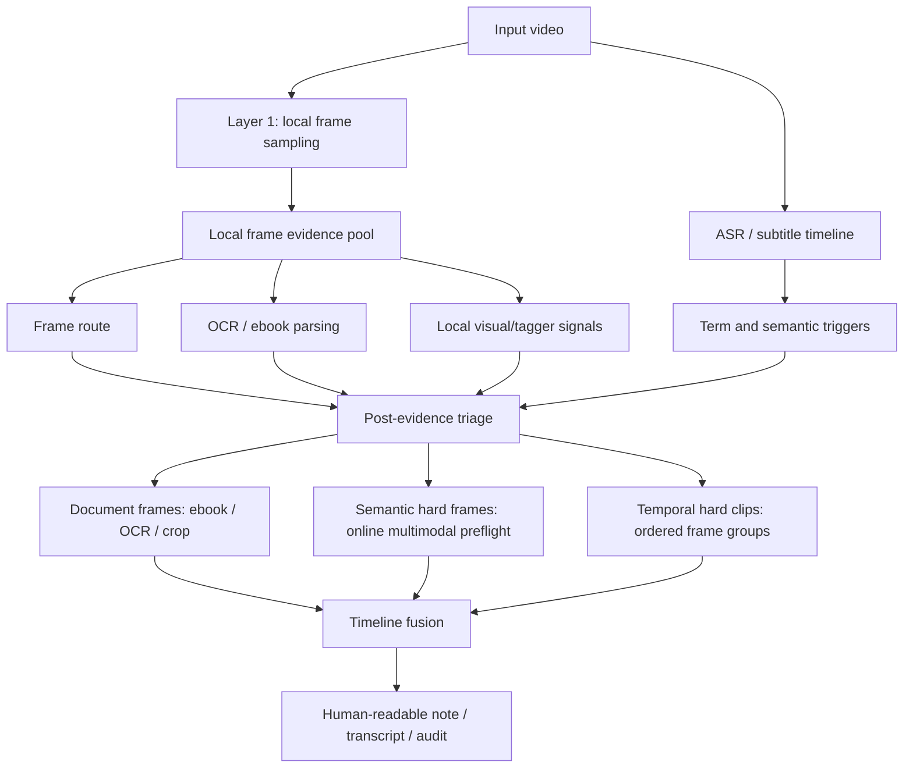

# Frame Sampling Strategy

## Update Record

- 2026-07-03 23:51:11 | Codex / GPT-5 | Documented the code-level frame sampling strategy after adding long-video balanced sampling modes.
- 2026-07-04 00:19:30 | Codex / GPT-5 | Reworked this note into an implementation map: sampling modes, evidence independence, triage scoring, local-vs-cloud boundaries, outputs, and operator commands.

## Purpose

VKP uses frame sampling to build a durable visual evidence pool for knowledge videos. The best strategy is not "sample fewer frames because online multimodal is expensive". The better split is:

1. Local frame extraction can be much denser, because it is evidence collection.
2. ASR, subtitles, OCR/ebook parsing, Qinglong tags, frame routing, and multimodal review should complete as independent evidence streams.
3. Fusion and triage compare those streams after the first pass.
4. Cloud/API multimodal is only used for unresolved or high-risk candidates selected by preflight, not for every extracted frame by default.

This makes long videos auditable without turning cloud multimodal into the default processing engine.

## Open-Source Lessons Applied

The referenced projects point to a layered design instead of one fixed frame interval:

| Source pattern | Useful lesson for VKP | VKP implementation |
|---|---|---|
| BiliNote-style video notes | Transcript/time-axis should exist before visual fusion | ASR/subtitle timeline is preserved separately from frames |
| Peepshow-style frame reports | Dense local frame evidence is valuable for review | Local frame budget defaults to 720 and can expand in `dense-local` |
| AI-Video-Transcriber-style parameter panels | Users need visible knobs for mode, batch size, and limits | CLI/MCP expose `--sample-mode`, `--max-frames`, and online vision limits separately |
| OCR/document pipelines | Page-like frames should go to OCR/ebook tools first | `run_visual_structure` continues to reuse `ebook_markdown_pipeline` |
| Video understanding pipelines | Operations/demos need ordered frame groups, not isolated screenshots | `run_temporal_frame_groups` and temporal analysis stay separate |

## Code-Level Architecture

The implementation is split into two layers.

### Layer 1: First-Pass Local Evidence Sampling

This layer is implemented in:

- `src/video_knowledge_pipeline/config.py`
- `src/video_knowledge_pipeline/orchestrator.py`
- `src/video_knowledge_pipeline/video.py`

Constants in `config.py`:

```python
DEFAULT_LOCAL_FRAME_SAMPLE_INTERVAL_SECONDS = 5.0
DEFAULT_LOCAL_FRAME_BUDGET = 720
DEFAULT_LOCAL_FRAME_SAMPLING_MODE = "balanced-long-video"
LOCAL_FRAME_SAMPLING_MODES = ("balanced-long-video", "dense-local", "triage-first")
```

These constants describe the local evidence pool. They are intentionally separate from online vision defaults:

```python
DEFAULT_VISION_EXECUTION = {
    "multimodal_limit": 19,
    "temporal_limit": 3,
    "frame_count": 8,
}
```

Core flow in `orchestrator.add_video(...)`:

```text
add_video
  -> probe_video
  -> parse_transcript
  -> _frame_sampling_plan
  -> fixed_timepoints
  -> scene_change_timepoints, if budget remains
  -> semantic_timepoints, if budget remains
  -> merge_timepoints
  -> build_segments
  -> extract_segment_frames
  -> write sampling-plan.json / segments.json
```

The actual branch logic is in `_frame_sampling_plan(...)`:

```python
def _frame_sampling_plan(duration, sample_interval, max_frames, sample_mode):
    if sample_mode == "dense-local":
        # Keep the requested interval and expand the local budget.
    elif sample_mode == "triage-first":
        # Use about 70% for whole-video coverage and reserve about 30%.
    else:
        # Balanced full-video coverage, dynamically increasing interval if needed.
```

`video.fixed_timepoints(...)` then converts the computed interval and budget into timestamps. It supports:

- `max_points <= 0`: no fixed points
- `max_points == 1`: one point at `0.0`
- long videos: no first-hour-only truncation when used with `balanced-long-video`

The first-pass artifact is:

```text
videos/<video_id>/sampling-plan.json
```

It records what the system really did:

```json
{
  "mode": "balanced-long-video",
  "duration_seconds": 18000,
  "requested_interval_seconds": 5.0,
  "requested_max_frames": 720,
  "effective_interval_seconds": 25.03,
  "effective_max_frames": 720,
  "fixed_budget": 720,
  "reserved_for_scene_or_semantic": 0,
  "fixed_points": 720,
  "extra_points": 0,
  "merged_segments": 720
}
```

### Layer 2: Post-Evidence Triage And Targeted Follow-Up

This layer is implemented in:

- `src/video_knowledge_pipeline/vision_review_triage.py`
- `src/video_knowledge_pipeline/vision_review_queue.py`
- `src/video_knowledge_pipeline/frame_recapture.py`
- `src/video_knowledge_pipeline/temporal_frame_groups.py`
- `src/video_knowledge_pipeline/visual_structure.py`

The main decision module is `vision_review_triage(...)`.

It reads `timeline.json` after ASR/OCR/route/tagger evidence exists, scores each timeline item, and outputs three independent candidate queues:

| Output queue | Meaning | Downstream tool |
|---|---|---|
| `visual_structure_first_candidates` | Looks like document/PPT/board/table/code, but OCR/structure is missing or weak | `run_visual_structure` / ebook pipeline |
| `semantic_candidates` | Single frame needs multimodal interpretation | `vision-execution-preflight` then `run_multimodal_frame_analysis` |
| `temporal_candidates` | Needs ordered multi-frame understanding | `run_temporal_frame_groups` then `run_temporal_visual_analysis` |

Artifacts written by triage:

```text
vision-review-triage.json
vision-review-triage.md
mcp-vision-review-triage.args.json
mcp-vision-review-triage-preflight.args.json
```

`vision_review_queue(...)` then turns selected candidates into configurable batches and retryable scripts for online vision. This is where batch size belongs. Sampling and cloud-call batch size are not the same knob.

## Sampling Modes

### `balanced-long-video`

Default mode.

Use it when the goal is stable first-pass coverage for unknown videos.

Algorithm:

```python
effective_interval = max(requested_interval, duration / (max_frames - 1))
fixed_budget = max_frames
effective_max_frames = max_frames
```

Behavior:

| Video duration | Requested | Effective behavior |
|---:|---|---|
| 30 min | 5s, 720 frames | about 5s/frame, full coverage |
| 1 hour | 5s, 720 frames | about 5s/frame, full coverage |
| 5 hours | 5s, 720 frames | about 25s/frame, full coverage |

This fixes the old failure mode where a 5-hour video could consume all frames in the first hour.

### `dense-local`

Use it when local evidence quality matters more than runtime or disk size.

Algorithm:

```python
desired_budget = ceil(duration / requested_interval) + 1
effective_max_frames = max(requested_max_frames, desired_budget)
effective_interval = requested_interval
fixed_budget = effective_max_frames
```

Behavior:

| Video duration | Requested | Effective behavior |
|---:|---|---|
| 1 hour | 5s | about 721 frames |
| 5 hours | 5s | about 3601 frames |

This mode is appropriate when the next steps are local OCR, ebook parsing, local image diff, local tagger, or manual review. It still does not imply cloud multimodal calls.

### `triage-first`

Use it when the first run should leave room for high-signal supplements.

Algorithm:

```python
fixed_budget = round(max_frames * 0.7)
reserved_budget = max_frames - fixed_budget
effective_interval = max(requested_interval, duration / (fixed_budget - 1))
```

Budget usage:

1. Fixed full-video coverage uses about 70%.
2. Scene-change frames use part of the remainder.
3. Transcript semantic points use the remaining budget.

This mode is a better starting point when subtitles/tags already exist and the video likely has important named tools, prices, steps, screen demonstrations, or dense UI pages.

## Triage Scoring Rules

`vision_review_triage._score_item(...)` is the current code-level realization of the "find hard and error-prone segments" strategy.

### Route Signals

| Timeline signal | Score effect | Candidate queue |
|---|---:|---|
| `visual_route=document_visual` or `mixed`, missing `structured_visual` | +2 visual | `visual_structure_first` |
| `visual_route=semantic_frame` or `mixed`, missing `visual_understanding` | gap only; no score without positive visual evidence | no model queue by itself |
| `visual_route=temporal_sequence` or `mixed`, missing `temporal_visual_understanding` | gap only until motion/boundary evidence exists | local recapture when frames are missing |

### ASR / OCR Conflict Signals

| Signal | Example | Score effect |
|---|---|---:|
| OCR empty but transcript points to screen | "看这里", "这个表", "屏幕上" | +2 semantic |
| Missing visual text on document-like frame | PPT/board/table but no OCR text | +3 visual |
| Number mismatch | ASR says `16k`, OCR shows another number | +3 semantic, +1 visual |
| Term mismatch | ASR and OCR disagree on tool names | +2 semantic |
| Term resolver says needs review | unresolved named entity | +3 semantic |

### Operation / Temporal Signals

| Signal | Example | Score effect |
|---|---|---:|
| Operation language | "点击", "打开", "切换", "输入", "提交" | +2 temporal only with verified broad/localized change |
| Temporal route without analysis | UI/demo/process segment | no score by itself |
| Existing temporal frame evidence | `temporal_frame_paths` exists | analyze locally; eligibility requires dynamic/scene evidence |

### Qinglong Tagger Signals

Tags are imported by `tagger_import.py` and can be passed into triage through `tagger_json`.

High-value tags increase priority:

| Tag group | Effect |
|---|---|
| `疑难`, `易错`, `重点`, `工具名`, `术语`, `名称`, `复核` | boost semantic review |
| `操作`, `步骤`, `流程`, `演示`, `动态` | boost temporal only when local motion evidence exists; otherwise request recapture |
| `OCR`, `屏幕文字`, `课件`, `表格`, `公式`, `代码` | boost document/OCR review |

Low-value tags suppress priority:

```text
闲聊, 过渡, 重复, 铺垫, 口水, 低价值, 无信息
```

This is why Qinglong tags should help both timeline weighting and downstream review priority, not just add labels.

## Evidence Independence Rule

The first round must let each evidence stream complete independently.

Correct:

- ASR writes transcript evidence.
- Subtitle/source metadata is preserved separately.
- Frame extraction writes local visual evidence.
- OCR/ebook writes text and layout evidence.
- Qinglong tagger writes labels and time-axis evidence.
- Multimodal writes visual understanding only when explicitly run.
- Fusion compares results after all available streams exist.

Incorrect:

- Skipping frame extraction because ASR looks complete.
- Skipping OCR because multimodal already summarized a frame.
- Replacing raw ASR with corrected terms before preserving the original.
- Sending all extracted local frames to cloud vision because they exist.
- Letting tagger labels suppress the independent first-pass ASR/OCR/frame extraction.

## Recommended Production Flow



Practical default:

1. Use `balanced-long-video` for initial bundle creation.
2. Run ASR, subtitle import, frame router, OCR/ebook parsing, and tagger import independently.
3. Run `vision-review-triage` to identify conflicts and weak segments.
4. For local-only improvement, use recapture/crop/OCR/ebook paths.
5. For model-needed improvement, use preflight-confirmed multimodal execution on selected candidates only.

## Online Multimodal Boundary

Online multimodal remains a downstream review branch, not a sampling branch.

The local frame pool can contain hundreds or thousands of frames. Cloud/API vision should only run after:

1. `vision-execution-preflight` selects exact indexes.
2. The expected call count and indexes are confirmed.
3. The candidate is unresolved by local evidence or explicitly selected by a human/agent.

Default online vision limits stay small:

```json
{
  "multimodal_limit": 19,
  "temporal_limit": 3,
  "frame_count": 8
}
```

## Operator Commands

Default balanced full-video coverage:

```powershell
.\scripts\video-knowledge.ps1 acceptance-run `
  D:\path\to\lesson.mp4 `
  D:\video-knowledge-runs\lesson-001 `
  --title "课程名"
```

Dense local evidence for a long video:

```powershell
.\scripts\video-knowledge.ps1 acceptance-run `
  D:\path\to\long-course.mp4 `
  D:\video-knowledge-runs\long-course `
  --title "长课程" `
  --sample-mode dense-local `
  --sample-interval 5
```

Triage-first first pass:

```powershell
.\scripts\video-knowledge.ps1 acceptance-run `
  D:\path\to\lesson.mp4 `
  D:\video-knowledge-runs\lesson-triage `
  --title "课程名" `
  --sample-mode triage-first
```

Post-evidence triage:

```powershell
.\scripts\video-knowledge.ps1 vision-review-triage `
  D:\video-knowledge-runs\lesson-001\webui-bundle `
  --mode triage `
  --min-score 3
```

Full local+vision candidate mode, without executing API calls:

```powershell
.\scripts\video-knowledge.ps1 vision-review-triage `
  D:\video-knowledge-runs\lesson-001\webui-bundle `
  --mode full
```

Plan local supplemental frame recapture before sending anything to cloud vision:

```powershell
.\scripts\video-knowledge.ps1 plan-supplemental-frame-sampling `
  D:\video-knowledge-runs\lesson-001\webui-bundle `
  --max-items 30 `
  --max-frames-per-item 4
```

Execute the planned local frame recapture only when ready:

```powershell
.\scripts\video-knowledge.ps1 run-frame-recapture-plan `
  D:\video-knowledge-runs\lesson-001\webui-bundle `
  --execute
```

Then create retryable online vision batches from the remaining triage result:

```powershell
.\scripts\video-knowledge.ps1 vision-review-queue `
  D:\video-knowledge-runs\lesson-001\webui-bundle `
  --batch-size 10
```

## Current Tests

The strategy is covered by `tests/test_frame_sampling_strategy.py`:

- `balanced-long-video` covers a 5-hour video with 720 frames across the full duration.
- `dense-local` keeps 5-second sampling for a 5-hour video and expands to about 3601 frames.
- `triage-first` reserves about 30% of the frame budget for scene/transcript-semantic supplements.

`tests/test_cli_config_contracts.py` also checks that local sampling defaults remain separate from cloud vision limits.

The triage layer is covered by the vision review queue and vision pipeline tests:

- route/OCR/ASR conflicts become candidate rows;
- online vision batches are configurable;
- generated batch scripts are explicit retry artifacts instead of hidden automatic calls.

## Implementation Status

Implemented:

- Local frame sampling modes.
- Long-video balanced coverage.
- Dense local mode for thousands of local frames.
- Triage-first budget reservation.
- CLI/MCP propagation of `sample_mode`.
- `sampling-plan.json` audit artifact.
- ASR/OCR/route/tagger/multimodal triage scoring.
- Supplemental local recapture planner through `plan-supplemental-frame-sampling`.
- Reuse of existing `run-frame-recapture-plan` executor through `manifest.frame_recapture.items`.
- Configurable online vision queue batches.

Still worth improving later:

- Stronger integration between Qinglong time-axis tags and segment boundary correction.
- UI controls for `sample_mode`, local frame budget, supplemental recapture, online batch size, and retry state in the task console.

## Balanced hard-frame escalation gate v2

2026-07-19 13:19:27 +08:00 | Codex / GPT-5

The earlier hard-frame strategy remains authoritative. Version 2 adds a cheap, local gate before multimodal execution:

1. Reuse `exports/scene-detection.json` instead of reimplementing shot detection.
2. Inspect OCR confidence, structure completeness, ASR/OCR conflicts, relational layouts, non-text material, and existing Qinglong/quality signals.
3. Compare temporal frames with an adaptive grid; mask only explicit normalized presenter/PIP/overlay regions at their actual position and size.
4. Treat unknown localized motion as evidence, not as a presenter label; require operation/process language before temporal escalation.
5. Escalate complex layouts and cross-source conflicts to one-image semantic review.
6. Escalate to temporal review for broad dynamic change, a scene boundary, or localized change paired with operation/process evidence; missing groups go to local recapture.
7. Collapse adjacent repeated pages with dHash or OCR-text similarity while keeping the evidence-strongest representative; original Timeline evidence is retained.
8. Run the same triage again after ebook/OCR/crop/tile execution so resolved simple pages leave the model queue.

`vision-review-triage.json` now uses `video_knowledge_pipeline.vision_review_triage.v2` and keeps v1 queue fields. Additional audit fields include:

- `selected_action`, `benefit_reasons`, and `suppression_reasons`;
- `ocr_evidence`, `frame_change_evidence`, and `scene_boundary_evidence`;
- `duplicate_of_index`;
- `temporal_recapture_indexes`, `temporal_recapture_candidates`, and per-row `local_prerequisite_action`;
- `estimated_model_calls`, `estimated_images`, and `recommended_execution_location`.

This gate creates candidates only. It does not authorize upload, choose an arbitrary provider, or bypass preflight, consent, allowlist, call limits, or cost limits.

Research and source mapping: `docs/open-source-hard-frame-routing-research-2026-07-19.md`.
