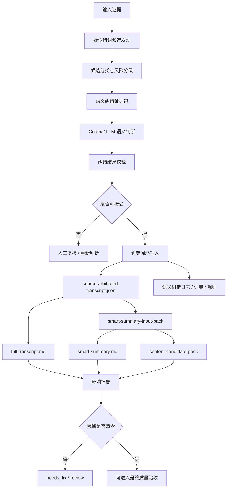

# 所有 ASR/字幕疑似错词的通用语义纠错闭环目标

更新时间：2026-07-06
执行者：Codex / GPT-5
项目：`video-knowledge-pipeline`
目标详述版：docs/asr-subtitle-semantic-correction-loop-goal-detailed-2026-07-07.md
详细规格版：docs/general-asr-subtitle-semantic-correction-loop-detailed-spec-2026-07-07.md
说明：目标详述版用于说明“为什么做、做成什么样、如何验收”；详细规格版把目标拆成证据层、候选发现、Codex/LLM 判断、本地校验、闭环写入、最终输出影响、UI/MCP/批量验收和完成标准。


## 1. 一句话目标

把 VKP 从“发现少量术语/工具名错误”升级为：

> 对所有 ASR / 平台字幕 / 自带字幕中的疑似错词，综合音频转写、字幕、OCR/ebook、画面理解、网页简介、时间线、打标器和全片语义进行判断；高置信纠正写入纠正版 transcript，并真实影响 `full-transcript.md`、`smart-summary.md`、内容素材候选和下游 handoff；低置信冲突进入人工复核。

这个闭环的完成标准不是“生成一个纠错建议文件”，而是“最终人类可读文件不再继承已确认的转写错误”。

## 2. 范围

### 2.1 覆盖对象

| 类型 | 示例 | 是否自动覆盖 | 说明 |
| --- | --- | --- | --- |
| 工具名 / 产品名 | `play right m c p` -> `Playwright MCP` | 高置信可自动写入纠正版 transcript | 当前 `term-arbitration-codex` 已覆盖一部分。 |
| 品牌名 / 公司名 / 人名 | 讲师名、公司名、课程名、平台名 | 高置信可写入，必要时人工确认 | 通常由标题、简介、OCR 支撑。 |
| 行业术语 / 课程概念 | 保险、外贸、浏览器自动化、量化等专业词 | 高置信可写入 | 需要结合全片语义。 |
| 数字 / 金额 / 比例 / 时间 | `16k`、`1w刀`、`1500万`、年份、步骤编号 | 默认更保守，强证据才自动写入 | 对总结和素材误导风险高。 |
| 操作动作 / 步骤词 | 点击、注册、导入、登录、复盘、开通 | 需要结合画面或上下文 | 适合与多帧/时间线证据结合。 |
| 普通 ASR 错词 | 语义不通、同音错、断句导致误解 | 高置信才写入 | 不能只靠拼写相似。 |
| 标点 / 断句 / 段落边界 | 列表结构、问答结构、转折关系 | 可作为 transcript 后处理 | 影响 smart-summary 质量。 |
| 低置信冲突 | ASR、字幕、画面互相矛盾 | 不自动写入 | 进入 review pack。 |

### 2.2 不覆盖对象

- 不修改原始 ASR / 原始字幕证据文件。
- 不把低置信猜测当成事实。
- 不自动发布内容。
- 不绕过人工复核。
- 不替代 OCR、ASR、多模态模型本身；本目标是“纠错和融合层”。

## 3. 当前项目状态

截至 2026-07-06，VKP 已经具备以下子能力：

| 能力 | 当前实现 | 状态 |
| --- | --- | --- |
| 术语/工具名候选包 | `term-arbitration-codex` | 已部分落地 |
| Codex 语义仲裁替身 | `term-arbitration-codex-prompt.md`、`term-arbitration-codex-result.codex.md` | 已部分落地 |
| 仲裁结果校验 | `validate-term-arbitration-codex-result` | 已部分落地 |
| 写入术语词典和纠正版 transcript | `term-correction-closure`、`source-arbitrated-transcript.json` | 已部分落地 |
| 影响报告 | `term-correction-impact-report` | 已部分落地，主要检查 term alias |
| 智能总结读取纠正版 transcript | `smart-summary-input-pack`、`knowledge_note_export` | 已有优先级逻辑 |
| 通用 ASR/字幕错词候选发现 | 尚无统一模块 | 待实现 |
| 通用纠错 schema | 尚无统一 schema | 待实现 |
| 数字/动作/普通错词/断句闭环 | 尚未完整落地 | 待实现 |
| UI/Workbench 通用状态 | 当前主要展示术语纠错 | 待扩展 |

因此，当前真实状态是：

```text
术语/工具名纠错子链路：部分落地
所有 ASR/字幕疑似错词的通用语义纠错闭环：尚未完整落地
```

## 4. 总体架构



## 5. 输入证据层

通用语义纠错必须支持多证据互证。每个候选错词都应尽量记录证据来源，而不是只记录“模型觉得应该改”。

| 证据源 | 代表产物 | 能证明什么 |
| --- | --- | --- |
| 本地 ASR | `normalized-transcript.json`、`normalized-transcript.srt` | 原始听写文本和时间戳。 |
| 平台字幕 | platform subtitle sidecar | 与本地 ASR 对比，发现不一致。 |
| 自带字幕 | 视频内字幕、外挂字幕 | 可能比 ASR 准，也可能本身是 ASR。 |
| OCR/ebook | `visual_text`、`structured_visual`、ebook pipeline 输出 | 屏幕文字、PPT、表格、代码、工具名、数字。 |
| 多模态视觉 | `visual_understanding`、`temporal_visual_understanding` | 画面对象、动作、界面状态、操作流程。 |
| 视频标题/简介/网页元数据 | VDO handoff、平台页面抓取结果 | 课程名、人名、品牌名、主题词。 |
| 打标器/时间线 | 青龙打标器、timeline route/tag | 标出重点、疑难、工具名、步骤、案例、结论。 |
| 全片上下文 | smart-summary input/chapter pack、long-video memory | 判断局部词语是否符合全片主线。 |
| 人工标注 | review notes、sample eval | 用户确认的纠错或保留原文。 |

## 6. 候选发现策略

### 6.1 多源不一致触发

当不同来源给出不同文本时，生成候选：

```text
本地 ASR: play right m c p
平台字幕: Playwright MCP
OCR: Playwright MCP
=> 候选：original_text=play right m c p, corrected_text=Playwright MCP
```

适用：工具名、人名、数字、课程标题、关键术语。

### 6.2 画面强证据触发

当 OCR/ebook 或多模态画面中出现明显文本，而 ASR 不一致时，生成候选。

```text
ASR: 这个 browser base 很好用
OCR: Browserbase
=> 候选：browser base -> Browserbase
```

### 6.3 语言不通触发

当 ASR 文本在上下文里明显语义不通，或句子结构异常，生成普通错词候选。

例子：

- 句子里出现孤立无意义词；
- 同一概念前后写法多次变化；
- 课程标题/章节名附近出现无法解释的词；
- 断句导致因果关系反了。

### 6.4 数字/金额/时间高风险触发

数字类候选即使只有一个来源，也应优先标记为高风险，因为它会严重影响总结质量。

触发条件：

- ASR 中包含金额、比例、年份、步骤编号；
- OCR/画面中存在表格或数字；
- 视频标题/简介里出现数字；
- 同一数字在后文重复但不一致。

默认策略：数字类不轻易自动覆盖，除非证据很强，例如 OCR 和标题同时一致。

### 6.5 动作/步骤触发

适用于教程、演示、软件操作、外贸流程、课程 SOP。

触发条件：

- ASR 说“点击这个”“导入这里”，但视觉 evidence 显示具体按钮/页面；
- 连续帧表明实际动作与 ASR 文本不一致；
- 打标器标出“操作演示 / 步骤 / 流程”。

### 6.6 重复实体变体触发

同一个视频里同一实体出现多个写法：

```text
Browserbase / browser base / browser bus / Browse base
```

应合并为一个 candidate group，而不是每次单独判断。

## 7. 候选风险分级

| 风险级别 | 条件 | 默认处理 |
| --- | --- | --- |
| `safe_auto_apply` | 多证据一致，置信度高，非事实敏感或已有人工确认 | 可进入纠正版 transcript。 |
| `auto_apply_with_audit` | 证据强，但涉及数字/事实/专名 | 可写入，但必须在 audit 和 impact report 标出。 |
| `needs_human_review` | 证据冲突、置信度不足、可能影响事实结论 | 不写入 transcript，进入 review pack。 |
| `keep_original` | 证据不足，原文可能就是正确 | 保留原文。 |
| `reject` | Codex/LLM 建议无证据或违反 schema | 拒绝，不写入。 |

## 8. Evidence Pack 设计

建议新增通用产物：

```text
transcript-semantic-correction-pack.json
transcript-semantic-correction-prompt.md
transcript-semantic-correction-result.template.json
transcript-semantic-correction-result.codex.md
```

每个候选项结构建议：

```json
{
  "candidate_id": "semcorr-0001",
  "correction_type": "term | proper_noun | number | action | concept | ordinary_word | punctuation | segment_boundary",
  "risk_level": "safe_auto_apply | auto_apply_with_audit | needs_human_review | keep_original",
  "time_range": {"start": 123.4, "end": 130.2},
  "original_text": "play right m c p",
  "suggested_text": "Playwright MCP",
  "context_before": "...",
  "context_after": "...",
  "evidence": [
    {
      "evidence_id": "ev-001",
      "source_type": "asr | platform_subtitle | embedded_subtitle | ocr_ebook | visual | temporal_visual | page_metadata | tagger | human_note",
      "text": "Playwright MCP",
      "path": "...",
      "timeline_index": 12,
      "confidence": 0.92
    }
  ],
  "conflicts": [
    {"source_type": "asr", "text": "play right m c p"},
    {"source_type": "ocr_ebook", "text": "Playwright MCP"}
  ],
  "why_this_is_suspicious": "ASR text is phonetically similar to a tool name shown on screen."
}
```

## 9. Codex / LLM 结果 Schema

建议输出：

```json
{
  "schema": "video_knowledge_pipeline.transcript_semantic_correction_result.v1",
  "source": "codex_substitute_for_online_llm",
  "decisions": [
    {
      "candidate_id": "semcorr-0001",
      "action": "replace | keep_original | needs_human_review | reject",
      "correction_type": "term",
      "original_text": "play right m c p",
      "corrected_text": "Playwright MCP",
      "canonical": "Playwright MCP",
      "aliases": ["play right m c p", "playright m c p"],
      "confidence": 0.96,
      "safe_to_apply": true,
      "needs_human_review": false,
      "semantic_rationale": "The screen OCR and nearby discussion both refer to the browser automation tool Playwright MCP.",
      "evidence_ids": ["ev-001", "ev-002"],
      "timeline_indexes": [12],
      "final_output_policy": "apply_to_corrected_transcript_and_summary"
    }
  ]
}
```

## 10. 校验规则

`validate-transcript-semantic-correction` 必须拒绝以下结果：

| 拒绝原因 | 说明 |
| --- | --- |
| `missing_candidate_id` | 不能凭空创造候选。 |
| `unknown_candidate_id` | candidate_id 不在 pack 里。 |
| `missing_correction_type` | 不知道是术语、数字、动作还是普通错词。 |
| `missing_original_text` | 没有原文无法影响报告。 |
| `missing_corrected_text` | replace 动作必须有纠正文。 |
| `missing_semantic_rationale` | 必须解释为什么这样改。 |
| `missing_evidence_ids` | 必须引用证据。 |
| `unsafe_number_without_strong_evidence` | 数字/金额/事实性内容证据不足。 |
| `low_confidence_auto_apply` | 低置信不能自动写入。 |
| `conflict_not_marked_for_review` | 多证据冲突时不能静默覆盖。 |

## 11. Closure 写入规则

建议新增：

```text
transcript-semantic-correction-closure
```

它负责：

1. 读取已校验的语义纠错结果。
2. 只应用 `safe_to_apply=true` 且 `needs_human_review=false` 的决策。
3. 数字/金额类必须满足更高阈值或人工确认。
4. 写入 `source-arbitrated-transcript.json` 或更新现有纠正版 transcript。
5. 保留每个 segment 的修改记录。
6. 不修改原始 ASR / 原始字幕。
7. 写入 closure report 和 MCP args。

纠正版 transcript segment 建议结构：

```json
{
  "start": 123.4,
  "end": 130.2,
  "text": "这里讲 Playwright MCP 的浏览器自动化能力。",
  "raw_text": "这里讲 play right m c p 的浏览器自动化能力。",
  "corrections": [
    {
      "candidate_id": "semcorr-0001",
      "original_text": "play right m c p",
      "corrected_text": "Playwright MCP",
      "correction_type": "term",
      "confidence": 0.96,
      "evidence_ids": ["ev-001", "ev-002"],
      "source": "codex_substitute_for_online_llm"
    }
  ],
  "needs_human_review": false
}
```

## 12. Impact Report

建议新增：

```text
transcript-semantic-correction-impact-report
```

它必须检查已接受纠正是否进入最终输出：

| 检查对象 | 是否允许保留原始错词 | 说明 |
| --- | --- | --- |
| 原始 ASR / 原始字幕 | 允许 | 原始证据不能被改。 |
| timeline 原始字段 | 允许 | 作为证据保留。 |
| `source-arbitrated-transcript.json` | 不允许 | 纠正版 transcript 必须应用。 |
| `exports/full-transcript.md` | 不允许 | 用户读到的逐字稿不能继承错词。 |
| `exports/smart-summary.md` | 不允许 | 智能总结不能继续用错词。 |
| `exports/content-candidate-pack.json` | 不允许 | 内容素材候选不能继承错词。 |
| `exports/content-material-card.json` | 不允许 | 下游状态不能误导。 |

核心指标：

```json
{
  "accepted_correction_count": 12,
  "applied_to_corrected_transcript": 12,
  "full_transcript_residual_count": 0,
  "smart_summary_residual_count": 0,
  "content_candidate_residual_count": 0,
  "final_residual_error_total": 0,
  "status": "passed"
}
```

## 13. 与现有术语模块的关系

现有 `term-arbitration-codex` 不应废弃，而应成为通用闭环的一个 specialized adapter。

| 现有模块 | 通用闭环中的位置 |
| --- | --- |
| `term-arbitration-codex` | `correction_type=term/proper_noun` 的候选生成器。 |
| `validate-term-arbitration-codex-result` | 通用 validate 的先行实现。 |
| `term-correction-closure` | 通用 closure 的先行实现。 |
| `term-correction-impact-report` | 通用 impact report 的先行实现。 |
| `term-correction-status` | 通用 status 的先行 UI/MCP 模型。 |

后续可以两条路并行：

1. 保留旧 term 命令，向后兼容。
2. 新增 `transcript-semantic-correction-*` 命令，内部复用 term 模块的解析、校验、报告能力。

## 14. 智能总结输入策略

`smart-summary-input-pack` 必须明确记录 transcript 来源。

优先级：

```text
source-arbitrated-transcript.json
  > human-corrected-transcript.json
  > llm-corrected-transcript.json
  > corrected-transcript.json
  > normalized-transcript.json
  > timeline fallback
```

如果存在已通过的语义纠错结果，智能总结不应继续用 raw ASR 作为主输入。

`smart-summary-input-pack.json` 应记录：

```json
{
  "transcript_source_decision": {
    "selected_label": "source_arbitrated_transcript",
    "uses_corrected_transcript": true,
    "semantic_correction_status": "impact_passed",
    "final_residual_error_total": 0
  }
}
```

## 15. 智能总结质量门禁

`smart-summary-quality` 应增加语义纠错门禁：

| 条件 | 结果 |
| --- | --- |
| 没有任何纠错候选 | 不阻塞，但记录 `no_semantic_correction_candidates`。 |
| 有候选但未处理 | `needs_semantic_correction`。 |
| 有已接受纠正但未 closure | `semantic_correction_not_applied`。 |
| closure 完成但 impact 未跑 | `semantic_correction_impact_missing`。 |
| impact 显示最终输出仍残留错词 | `semantic_correction_impact_failed`。 |
| impact 通过 | 可进入其他 summary quality checks。 |

## 16. UI / Workbench 目标

任务控制台和统一工作台应显示一个“转写语义纠错”面板。

最小字段：

- 候选总数；
- 按类型计数：term、proper_noun、number、action、concept、ordinary_word、punctuation；
- `safe_auto_apply` 数；
- `needs_human_review` 数；
- Codex/LLM 待处理数；
- validate rejected 数；
- impact residual 数；
- 当前 next action；
- 对应 MCP args 文件。

面板动作：

| 操作 | 说明 |
| --- | --- |
| 生成候选包 | 不调用云，默认本地证据分析。 |
| 打开 Codex prompt | 让 Codex 暂时代替在线 LLM。 |
| 导入/校验结果 | 必须先 validate。 |
| 写入纠正版 transcript | 只写高置信/安全项。 |
| 跑影响报告 | 检查最终输出是否真正被纠正。 |
| 生成人工复核包 | 对低置信/冲突项。 |

## 17. CLI / MCP 目标接口

建议新增：

```text
transcript-semantic-correction-pack(bundle_dir, write=true, limit=0)
validate-transcript-semantic-correction(bundle_dir, input_json, write=true)
transcript-semantic-correction-closure(bundle_dir, input_json, write=true, auto_apply=false)
transcript-semantic-correction-impact-report(bundle_dir, write=true)
transcript-semantic-correction-status(bundle_dir, write=false)
```

默认原则：

- pack/status 本地只读或本地写文件，不调用云；
- validate 不写 transcript，只写校验报告；
- closure 必须显式输入已校验结果；
- 数字/金额/事实类默认更保守；
- MCP args 必须写入 bundle，方便 agent 稳定调用；
- 不把 API key 写入任何 manifest/report/docs。

## 18. 下游 agent 契约

`content-asset-status`、`batch-content-asset-status`、`content-handoff-pack` 应暴露：

```json
{
  "semantic_correction_status": "impact_passed | needs_review | missing | needs_fix",
  "semantic_correction_candidate_count": 12,
  "semantic_correction_review_count": 3,
  "semantic_correction_final_residual_error_total": 0,
  "semantic_correction_next_action_key": "transcript_semantic_correction_closure",
  "semantic_correction_next_action_artifacts": {
    "pack_args": "mcp-transcript-semantic-correction-pack.args.json",
    "validate_args": "mcp-validate-transcript-semantic-correction.args.json",
    "closure_args": "mcp-transcript-semantic-correction-closure.args.json",
    "impact_args": "mcp-transcript-semantic-correction-impact-report.args.json"
  }
}
```

下游不得把 `impact_passed` 解释为“内容可以发布”。它只表示转写纠错闭环通过；内容素材仍然保持：

```text
review_required=true
publication_allowed=false
allowed_as_fact=false
```

## 19. 人工复核规则

以下情况必须进入人工复核：

- 数字/金额证据冲突；
- OCR 和 ASR 都低置信；
- Codex/LLM 给不出明确 rationale；
- 多个候选纠正文都合理；
- 涉及事实结论、法律、医疗、金融等高风险内容；
- 修改会改变课程结论或行动建议；
- 用户已标注“不确定/保留原文”。

人工复核输出应支持：

```json
{
  "candidate_id": "semcorr-0007",
  "review_status": "accept_correction | keep_original | edit_correction | needs_more_evidence",
  "corrected_text": "...",
  "review_note": "..."
}
```

## 20. 测试计划

### 20.1 单元测试

- ASR/OCR 不一致能生成候选。
- 普通错词能进入 `correction_type=ordinary_word`。
- 数字/金额候选默认不自动写入，除非强证据。
- validate 拒绝缺少 evidence/rationale/candidate_id 的结果。
- closure 只写入 safe decisions。
- 原始 ASR 不被覆盖。
- `source-arbitrated-transcript.json` 保留 corrections metadata。
- impact report 能发现 `smart-summary.md` 中残留错词。

### 20.2 集成测试

- 构造一个 bundle：ASR 错、OCR 对，跑 pack -> validate -> closure -> export -> impact。
- 构造一个 bundle：数字冲突，确认进入 review，不自动写入。
- 构造一个 bundle：平台字幕和 ASR 都错，OCR/网页标题对，确认可纠正。
- 构造一个 bundle：纠正版 transcript 存在，`full-transcript.md` 和 `smart-summary.md` 优先使用纠正版。
- 下游 `content-asset-status` 能看到语义纠错状态和 args。

### 20.3 真实视频验收

至少选择两类视频：

1. **工具名密集视频**
   例如浏览器自动化工具横评，用来验证工具名、产品名、英文缩写。

2. **课程长视频**
   用来验证普通概念、数字、动作步骤、断句和分段总结质量。

验收标准：

- 人工抽样确认纠错确实提高可读性；
- `full-transcript.md` 不再保留已接受错词；
- `smart-summary.md` 不再继承已接受错词；
- 低置信项在 review pack 中可见；
- impact report `final_residual_error_total=0` 或明确列出剩余风险。

## 21. 分阶段实施计划

### Phase A：复用现有 term 链路作为骨架

- 抽出通用 validation helpers。
- 让现有 term result schema 增加 `correction_type` 兼容字段。
- impact report 字段命名开始兼容 `semantic_correction_*`。

### Phase B：新增通用候选 pack

- 新增 `transcript_semantic_correction.py`。
- 从 ASR/字幕/OCR/网页元数据/视觉证据生成候选。
- 支持候选分组和风险分级。

### Phase C：新增 validate / closure / impact 通用入口

- 新增 CLI/MCP。
- 写 MCP args。
- 低置信和数字冲突进入 review。

### Phase D：接入智能总结与内容资产状态

- `smart-summary-input-pack` 读取 semantic correction status。
- `smart-summary-quality` 增加 impact gate。
- `content-asset-status` / batch / handoff 输出通用字段。

### Phase E：UI 和真实视频验收

- Workbench 新增“转写语义纠错”面板。
- 真实视频回归。
- 人工抽样评估纠错收益。

## 22. 完成判定

这个目标完成，必须满足：

1. 系统能发现所有主要类型的 ASR/字幕疑似错词，不局限于术语/工具名。
2. 每个候选都有证据、时间段、类型和风险级别。
3. Codex/LLM 结果必须通过 schema 和语义证据校验。
4. 高置信结果进入 `source-arbitrated-transcript.json`。
5. 低置信结果进入人工 review，不自动覆盖。
6. `full-transcript.md`、`smart-summary.md`、内容素材候选优先使用纠正版 transcript。
7. impact report 能证明已接受错词没有残留在最终人类可读文件中。
8. UI/MCP/OpenClaw 下游能看到状态、下一步和 args。
9. 真实视频抽样证明纠错提高了最终可读文件准确率。

如果只实现候选发现、只生成 Codex prompt、只写词典，或者只让状态面板显示“可纠错”，但最终 `full-transcript.md` / `smart-summary.md` 仍然继承错词，则不算完成。

## 23. 代码落地映射

### 23.1 应复用的现有模块

| 现有模块 | 复用方式 | 不足 |
| --- | --- | --- |
| `term_arbitration_codex.py` | 作为 Codex/LLM 仲裁 prompt、result、validation 的先行样板。 | 当前偏术语/工具名，不能覆盖普通错词、数字、动作、断句。 |
| `term_correction_closure.py` | 复用“校验后写入 source-arbitrated transcript”的闭环模式。 | 需要从 term alias 扩展到任意 transcript span。 |
| `term_correction_impact.py` | 复用“最终导出残留检查”的报告思路。 | 需要检查所有 accepted correction，而不是只检查 alias。 |
| `transcript_source_arbitration.py` | 继续作为纠正版 transcript 的核心写入通道。 | 需要支持更细的 correction metadata。 |
| `smart_summary_input_pack.py` | 已经有 corrected transcript 优先级，应继续使用。 | 需要显式记录 semantic correction 状态。 |
| `knowledge_note_export.py` | 导出层应继续优先读取纠正版 transcript。 | 需要 impact gate，避免 raw ASR 回流。 |
| `review_session.py` | 低置信纠错进入人工复核。 | 需要新增 correction-specific review row。 |
| `task_console.py` / `video_workbench.py` | 显示状态、下一步命令、导入入口。 | 当前尚未有通用语义纠错面板。 |
| `content_asset_status.py` | 下游内容资产消费前的状态门禁，已暴露 semantic correction status、impact、候选类型、证据源、预检拒绝原因和待复核样例。 | 后续需要把这些字段接入内容资产批量看板和 OpenClaw 运行报告。 |

### 23.2 新增模块建议

建议新增：

```text
src/video_knowledge_pipeline/transcript_semantic_correction.py
```

职责：

1. 构建通用错词候选 evidence pack。
2. 生成 Codex/LLM prompt 和 result template。
3. 校验 Codex/LLM 返回结果。
4. 调用或复用 source arbitration 写入纠正版 transcript。
5. 生成 impact report。
6. 生成 status，供 CLI/MCP/UI/下游 agent 读取。

不建议把这部分散落在 `term_*`、`knowledge_note_export.py`、`smart_summary_*` 里。否则后续会变成“术语纠错”“总结纠错”“字幕纠错”三套各自为政的逻辑。

### 23.3 最小实现切片

第一版不用一次做完所有智能判断。最小可用切片应包括：

1. `transcript-semantic-correction-pack`
   - 从 transcript、timeline、OCR/ebook、visual understanding 中发现候选。
   - 每个候选写入 `candidate_id`、`time_range`、`original_text`、`candidate_text`、`correction_type`、`risk_level`、`evidence_ids`。

2. `validate-transcript-semantic-correction`
   - 校验 Codex/LLM 返回 JSON。
   - 拒绝没有证据、没有 rationale、低置信、数字风险过高的结果。

3. `transcript-semantic-correction-closure`
   - 只把 safe decision 写入 `source-arbitrated-transcript.json`。
   - 原始 ASR 保留不动。

4. `transcript-semantic-correction-impact-report`
   - 检查 `full-transcript.md`、`smart-summary.md`、`content-candidate-pack` 中是否仍有 accepted original text 残留。

5. `transcript-semantic-correction-status`
   - 给 UI/MCP/OpenClaw 返回当前状态、下一步命令和阻塞原因。

### 23.4 第一版不要做的事

- 不直接修改原始 `normalized-transcript.json`。
- 不把低置信结果写入最终 transcript。
- 不让 online LLM 直接改整篇总结。
- 不把候选 pack 当作最终纠错结果。
- 不让 smart-summary 在 impact 未通过时伪装成 final。

## 24. 典型执行流

### 24.1 Codex 代替在线 LLM 的流程

```powershell
.\scripts\video-knowledge.ps1 transcript-semantic-correction-pack <webui-bundle>
```

人工或 Codex 读取：

```text
transcript-semantic-correction-prompt.md
transcript-semantic-correction-pack.json
```

写回：

```text
transcript-semantic-correction-result.codex.md
```

然后执行：

```powershell
.\scripts\video-knowledge.ps1 validate-transcript-semantic-correction `
  <webui-bundle> `
  --input-json <webui-bundle>\transcript-semantic-correction-result.codex.md

.\scripts\video-knowledge.ps1 transcript-semantic-correction-closure `
  <webui-bundle> `
  --input-json <webui-bundle>\transcript-semantic-correction-result.codex.md

.\scripts\video-knowledge.ps1 export-knowledge-note <webui-bundle>

.\scripts\video-knowledge.ps1 transcript-semantic-correction-impact-report <webui-bundle>
```

### 24.2 在线 LLM / API 后续流程

在线 LLM 不应直接拿整段 transcript 自由改写。正确方式是：

1. VKP 先生成 evidence pack。
2. API 只处理 evidence pack 中的候选。
3. API 返回结构化 JSON。
4. VKP 本地 validate。
5. VKP 本地 closure。
6. VKP 本地 export + impact report。

也就是说，在线 LLM 只是“判断器”，不是“最终文件写入器”。

## 25. 验收样例

### 25.1 工具名密集视频

输入片段可能包含：

```text
brother mc p
playwright mcp
chrome dive tooth
open client
browser honeys
```

纠错闭环应能综合标题、OCR、画面工具列表、上下文，判断是否应改为：

```text
Browser MCP
Playwright MCP
Chrome DevTools
OpenClaw / OpenCLI / Open Client，需要证据确认
BrowserUse / Browserless / Browserbase，需要证据确认
```

其中不确定项不能自动写死，必须进入 review。

### 25.2 长课程视频

输入片段可能包含：

```text
一下第一部分
所以啊
一个共同点就
低水签
客户做功
```

纠错闭环不应机械替换，而要判断：

- 是口头禅还是有效内容；
- 是断句问题还是识别错词；
- 是否影响课程概念；
- 是否应该只做标点/段落修复；
- 是否需要人工看视频确认。

### 25.3 数字和金额

输入片段可能包含：

```text
十六 k
一 w 刀
一千五百万
```

只有当 ASR、OCR、标题/简介或人工证据足够一致时，才可写成：

```text
16k
1w 刀
1500 万
```

否则保留原文或进入复核。数字纠错不能只靠“看起来像”。
## 26. 多证据独立分析原则

语义纠错的第一轮不能一开始就把 ASR 当主答案，然后让其他证据只负责“证明 ASR 对不对”。这样会把 ASR 的错误传染给 OCR、视觉理解、字幕和总结。

正确流程是：**先独立取证，再融合仲裁**。

### 26.1 第一轮独立证据通道

| 通道 | 第一轮只做什么 | 第一轮不能做什么 |
| --- | --- | --- |
| ASR 通道 | 产出语音识别文本、时间戳、置信/异常片段。 | 不根据 OCR 或网页标题提前改词。 |
| 平台字幕通道 | 读取平台/自带字幕，保留原始文本和时间轴。 | 不默认认为平台字幕正确。 |
| OCR/ebook 通道 | 从画面文字、课件、表格、代码中提取可见文本。 | 不根据 ASR 猜屏幕文字。 |
| 多模态视觉通道 | 描述画面对象、操作、界面状态、讲师指向和非文字信息。 | 不把 ASR 文本当作视觉事实直接复述。 |
| 网页元数据通道 | 抽取标题、简介、合集、作者、页面关键词。 | 不直接替换 transcript。 |
| 打标器/时间线通道 | 提供章节、重点、疑难、工具名、步骤、案例、结论等标签。 | 不独立决定纠正文。 |
| 人工标注通道 | 记录用户确认、保留原文、人工纠正和疑问。 | 不覆盖原始证据文件。 |

每个通道第一轮都应写入自己的 evidence，不应互相覆盖。融合阶段只能读取这些 evidence。

### 26.2 融合阶段才做仲裁

融合阶段负责回答：

1. 哪个词最可能错？
2. 错误来自 ASR、平台字幕、自带字幕，还是多个来源同时错？
3. 哪些证据支持纠正？
4. 哪些证据冲突？
5. 是否足够安全，可以写入纠正版 transcript？
6. 是否只适合进入人工复核？

融合阶段的输出是 `transcript-semantic-correction-pack.json` 和后续 Codex/LLM 结构化判断，不是直接改最终 Markdown。

### 26.3 为什么必须这样做

| 风险 | 如果不独立分析会怎样 | 独立取证后的好处 |
| --- | --- | --- |
| ASR 错词污染总结 | 总结会把错词当主线继续放大。 | 其他证据可以纠正 ASR。 |
| 平台字幕也是 ASR | 把平台字幕当标准答案会二次传播错误。 | 平台字幕只作为一个证据源参与投票。 |
| OCR 小字识别差 | OCR 错词可能被误认为屏幕证据。 | 低置信 OCR 会进入 review，而不是自动覆盖。 |
| 多模态会被 prompt 诱导 | 如果把 ASR 直接塞给视觉模型，模型可能照着文本说。 | 视觉通道先独立描述画面。 |
| 数字/金额误改 | 一次错误会污染逐字稿、总结和内容素材。 | 数字类要求强证据或人工确认。 |

## 27. 候选发现的完整分类

通用语义纠错不是只找“看起来像专名”的词。候选发现应覆盖以下层级。

### 27.1 硬实体候选

包括工具名、产品名、公司名、人名、课程名、地名、品牌名、项目名。

触发信号：

- ASR 中出现英文拆字、空格异常、谐音词；
- OCR/ebook 或网页标题中出现标准写法；
- 同一实体在全片多次出现但写法不一致；
- 打标器标记为工具名、案例、平台、项目。

### 27.2 事实敏感候选

包括数字、金额、比例、年份、时间、名次、价格、收益、转化率。

触发信号：

- ASR、字幕、OCR、标题中的数字不一致；
- 数字出现在标题、表格、结果页或课件结论中；
- 该数字会进入智能总结或内容素材。

处理规则：

- 默认 `needs_human_review` 或 `auto_apply_with_audit`；
- 没有强证据不得自动覆盖；
- 强证据至少来自两个相互独立通道，或一个通道加人工确认。

### 27.3 行业概念候选

包括课程方法论、行业术语、流程节点、产品功能、技术概念。

触发信号：

- 某词在单句里不通顺，但在行业词典或上下文中有明显标准表达；
- OCR 课件标题和 ASR 说法接近但不同；
- 智能总结提取出的核心主题与 ASR 表达冲突。

### 27.4 操作步骤候选

包括点击、打开、注册、导入、筛选、提交、保存、配置、运行等动作。

触发信号：

- ASR 说“点击这里/这个”，画面显示具体按钮；
- 多帧视觉显示动作链，ASR 只说了笼统代词；
- 打标器标记为操作演示、步骤、流程。

操作步骤不一定都要“纠词”。有时正确动作是把 `这个` 补成 `[画面显示：登录按钮]` 进入画面说明或智能总结，而不是强行改 ASR 原句。

### 27.5 普通错词与语义不通候选

包括同音错、断词、漏词、多词、口头禅误当内容、句子结构异常。

触发信号：

- 句子读不通；
- 前后概念重复但当前写法明显异常；
- 同一片段里 ASR 与字幕都含噪，但视觉/上下文显示清晰概念；
- smart-summary 草稿中出现关键词拼接、无意义短语或明显继承 ASR 噪音。

### 27.6 标点、断句与段落候选

包括：

- 问答边界错；
- 列表项没分开；
- 因果关系断错；
- 时间段切分导致一句话前后割裂；
- 章节标题被当成普通句子。

这类候选的输出可以是 `correction_type=punctuation` 或 `segment_boundary`，不一定替换某个词，但必须影响 `full-transcript.md` 和 `smart-summary-input-pack` 的可读结构。

## 28. 当前代码落地状态

截至 2026-07-07，本项目已有通用闭环的第一版代码入口，但目标尚未完全完成。

| 目标能力 | 当前状态 | 已有入口/文件 | 仍需补齐 |
| --- | --- | --- | --- |
| 通用候选包 | 已有第一版 | `transcript-semantic-correction-pack`、`src/video_knowledge_pipeline/transcript_semantic_correction.py` | 需要更完整吸收平台字幕、网页元数据、打标器、人工标注。 |
| Codex/LLM 结果模板 | 已有第一版 | `transcript-semantic-correction-result.template.json`、`transcript-semantic-correction-prompt.md` | 需要让 prompt 更强调全片语义和独立证据。 |
| 本地校验 | 已有第一版 | `validate-transcript-semantic-correction` | 需要强化冲突检测、数字强证据、低置信策略。 |
| 写入纠正版 transcript | 已有第一版 | `transcript-semantic-correction-closure`、`source-arbitrated-transcript.json` | 需要更细粒度支持断句/段落/非替换型修复。 |
| 最终影响报告 | 已有第一版 | `transcript-semantic-correction-impact-report` | 需要覆盖所有最终输出和纠正版 transcript 自身。 |
| UI/Workbench 状态 | 已接入基础状态 | `task_console.py`、`video_workbench.py` | 需要更清晰显示候选分类、失败原因、人工复核队列。 |
| 智能总结联动 | 已有优先读取纠正版 transcript 的基础 | `smart_summary_input_pack.py`、`knowledge_note_export.py` | 需要让质量门禁强制提示 semantic correction 未完成或 impact 失败。 |
| 人工复核闭环 | 目标已定义 | `review_session.py` 可复用 | 需要新增 correction-specific review row 和导入语义纠错结果。 |

当前应判定为：

```text
通用转写语义纠错闭环：第一版骨架已落地，完整目标未完成。
完成度重点卡在：证据源覆盖、冲突/数字校验、人工复核闭环、最终导出质量门禁。
```

## 29. 下一个开发切片

为了让目标继续推进，下一阶段不应只继续写文档，而应补代码闭环。

优先级如下：

1. **扩展候选证据源**
   - 读取平台字幕、自带字幕、网页标题/简介、VDO handoff metadata；
   - 读取青龙打标器标签和时间轴信息；
   - 读取人工 review notes 中的纠正/保留原文。

2. **强化候选生成**
   - ASR vs 字幕不一致；
   - ASR vs OCR/ebook 不一致；
   - ASR vs metadata 不一致；
   - 多来源同一实体不同写法；
   - 数字金额冲突；
   - 语义不通和断句异常。

3. **强化 validate**
   - `semantic_rationale` 必填；
   - `evidence_ids` 必须指向 pack 内证据；
   - 数字/金额必须有强证据或人工确认；
   - 多证据冲突时必须 `needs_human_review=true`，不能静默替换。

4. **强化 closure**
   - replace 类写入 corrected transcript；
   - punctuation / segment_boundary 类写入结构化段落或 segment metadata；
   - review 类写入 review pack；
   - 原始 ASR/字幕永不覆盖。

5. **强化 impact**
   - 检查 `source-arbitrated-transcript.json/md`；
   - 检查 `exports/full-transcript.md`；
   - 检查 `exports/smart-summary.md`；
   - 检查 `exports/content-candidate-pack.json`；
   - 检查 `exports/content-material-card.json`；
   - 如果 residual 不为 0，智能总结不得标记为最终可用。

6. **强化 UI**
   - 显示候选分类和风险分级；
   - 显示每条候选引用的 ASR/字幕/OCR/视觉/网页/打标器证据；
   - 支持复制 Codex prompt；
   - 支持导入 LLM/Codex JSON；
   - 支持将低置信候选送入人工审核。

## 30. 最终验收清单

一个真实 bundle 只有满足下面条件，才算转写语义纠错闭环完成：

| 检查项 | 必须结果 |
| --- | --- |
| 候选发现 | 至少覆盖 ASR、字幕、OCR/ebook、视觉、网页元数据、打标器中的可用证据。 |
| 候选分类 | 所有候选都有 `correction_type`、`risk_level`、`time_range`、`evidence_ids`。 |
| 独立证据 | 第一轮 evidence 不被 ASR 或任一单源覆盖污染。 |
| LLM/Codex 判断 | 所有 replace 决策都有 `semantic_rationale` 和 evidence 引用。 |
| 数字/事实 | 没有强证据或人工确认时不自动覆盖。 |
| 低置信冲突 | 自动进入人工复核，不进入 corrected transcript。 |
| 纠正版 transcript | 高置信纠正写入 `source-arbitrated-transcript.json`，并保留 raw text 和 correction metadata。 |
| full transcript | `exports/full-transcript.md` 使用纠正版 transcript。 |
| smart summary | `exports/smart-summary.md` 基于纠正版 transcript，不继续继承已接受错词。 |
| 内容素材 | content candidate / material card 不含已接受错词残留。 |
| impact report | `final_residual_error_total=0`，或明确列出未解决风险。 |
| UI/agent 状态 | `transcript-semantic-correction-status` 能给出下一步动作和阻塞原因。 |
| 人工抽样 | 抽样片段证明纠错提高了人类可读文件准确率。 |

只要其中任一关键项失败，状态都应是 `needs_semantic_correction`、`needs_human_review` 或 `impact_needs_fix`，不能显示成“已完成”。
## 31. 实现进展记录：2026-07-07

本轮已把目标从“候选包和提示词”继续推进到“人工复核与质量门禁”：

| 项目 | 已落地内容 | 仍需继续 |
| --- | --- | --- |
| 多证据候选 | `transcript-semantic-correction-pack` 已读取 ASR、平台字幕、自带字幕、timeline subtitle、OCR/ebook、视觉理解、网页/manifest metadata、青龙/人工打标器。 | 继续增强全片语义、人工 review notes 和实体聚类。 |
| 安全校验 | `validate-transcript-semantic-correction` 已支持 `action`、`semantic_rationale`、evidence id 校验、数字强证据、冲突低置信拒绝。 | 继续支持更复杂的 segment boundary / punctuation 结构化校验。 |
| 人工复核 | validate 失败项会写入 `transcript-semantic-correction-review.json/md`；`prepare-review-session` 已能把 `target_type=transcript_semantic_correction` 纳入总 review pack；`import-transcript-semantic-review-notes` 已能把人工 review notes 转成标准 correction result，并重新走 validate/closure。 | 继续补更细的 WebUI 表单、批量人工抽样统计和冲突关闭状态。 |
| 状态暴露 | `transcript-semantic-correction-status` 和 `content-asset-status` 已暴露 `review_required_count` / `semantic_correction_review_count`；status 现在额外输出候选类型、风险等级、证据来源、预检拒绝原因和待复核样例。 | 继续在 WebUI 上做逐条编辑表单、批量关闭状态和人工抽样统计。 |
| 智能总结门禁 | `smart-summary-quality` 不再把有 transcript 但没跑 semantic pack 的状态当作完全通过。 | 继续让 export 阶段在 impact 失败时标记 draft/final boundary。 |
| impact 范围 | impact 已检查 `source-arbitrated-transcript.json/md`、`full-transcript.md`、`smart-summary.md`、内容素材输出。 | 继续做真实 bundle 级验收和人工抽样。 |

当前状态仍不是完成态：替换类纠错、人工复核回流、标点/断句候选发现和人工确认后的整段写回、任务控制台的候选分类/证据源/失败原因展示已经形成第一版闭环；但更复杂的跨 segment 拆分合并、WebUI 逐条编辑表单、真实视频抽样验收还需要继续补。

## 32. 实现进展记录：2026-07-07 标点/断句闭环

本轮新增了 ASR/字幕语义纠错中的 `punctuation` / `segment_boundary` 第一版闭环：

| 项目 | 已落地内容 | 仍需继续 |
| --- | --- | --- |
| 候选发现 | 对长段无标点、持续时间较长、或包含多个“第一/第二/然后/所以/最后”等段落标记但缺少标点的 ASR segment，自动生成高风险候选。 | 继续引入更细的语义边界判断，避免把口语长句和真实分段错误混淆。 |
| 安全边界 | 标点/断句候选默认 `needs_human_review=true`，不会被普通低置信自动覆盖。 | 后续可以让 Codex/LLM 先给建议稿，但仍需人工确认或高置信规则。 |
| 闭环写回 | 人工确认后的 `punctuation` / `segment_boundary` 决策不再做子串替换，而是以 `application=whole_segment_text` 整段写入 `source-arbitrated-transcript.json`，同时保留 `raw_text` 和 `structure_changed=true`。 | 继续支持一个 ASR segment 拆成多个输出段落、多个短 segment 合并为一个语义段。 |
| 测试 | 已新增覆盖：长段无标点候选 -> 人工确认 -> validate -> closure -> corrected transcript 的整段写回。 | 后续补真实 bundle 抽样验收和导出层联动测试。 |

## 33. 实现进展记录：2026-07-07 UI/Workbench 状态汇总

本轮把通用 ASR/字幕语义纠错的状态从“只有总数”推进到“可被人和 agent 快速判断下一步”：

| 项目 | 已落地内容 | 仍需继续 |
| --- | --- | --- |
| 机器可读状态 | `transcript-semantic-correction-status` 新增 `candidate_type_counts`、`risk_level_counts`、`evidence_source_counts`、`validation_rejection_reason_counts`、`review_required_preview`。 | 后续可以继续增加按章节/时间段的聚合，方便长视频批量审核。 |
| 状态 Markdown | `transcript-semantic-correction-status.md` 会显示候选类型、风险等级、证据来源、预检拒绝原因和待人工复核样例。 | 后续补真实 bundle 的截图/时间戳跳转引用。 |
| 任务控制台/下游状态 | `task-console.html` 的“通用 ASR/字幕语义纠错”区块会展示候选分类、证据源、预检拒绝原因、待人工复核样例，并提供逐条编辑表单，可复制/下载 `transcript-semantic-correction-review-notes.json`；`content-asset-status` 也透传这些字段给 OpenClaw/内容资产线程。 | 仍需做真实视频抽样验收和按章节/风险分组。 |
| 测试 | 新增模块级 status 字段测试和 UI HTML contract 测试。 | 继续补真实 bundle 级渲染验收。 |
## 34. 实现进展记录：2026-07-07 人工编辑表单

本轮把“看见待复核项”推进到“能在静态 WebUI 里编辑并导出 review notes”：

| 项目 | 已落地内容 | 仍需继续 |
| --- | --- | --- |
| 全量待复核项 | `transcript-semantic-correction-status` 新增 `review_required_items`，不再只给前 8 条 preview。 | 后续需要按章节、风险、来源筛选长视频的大量候选。 |
| 静态编辑表单 | `task-console.html` 为每条 semantic review item 生成状态、纠正文、备注字段。 | 后续可以和主 `review.html` 更深整合，支持视频时间戳定位。 |
| Review notes 导出 | 页面按钮可复制或下载 `transcript-semantic-correction-review-notes.json`，再由 `import-transcript-semantic-review-notes` 进入 validate/closure；导入后 status/UI/content asset 会显示已导入、已关闭、仍待处理和 action 分布。 | 后续需要显示重复/无效行的更细原因，并接入批量看板。 |
| 测试 | 已覆盖 status 全量 items 和 task console 表单/导出按钮 contract。 | 后续补浏览器级交互测试和真实 bundle 人审验收。 |
## 35. 实现进展记录：2026-07-07 批量关闭统计

本轮修正了人工复核关闭语义，并补了关闭统计：

| 项目 | 已落地内容 | 仍需继续 |
| --- | --- | --- |
| `keep_original` 语义 | 人工确认的 `keep_original` 不再被 validation 当作 rejected；它会关闭 review target，但不会写入纠正版 transcript。 | 后续需要在 UI 中更清楚地区分“关闭但未替换”和“替换并写入”。 |
| Closure 行为 | 如果导入结果全是 `keep_original`，closure 返回 `completed_no_text_changes`，避免误报失败或伪造文本变更。 | 后续可以给 audit 增加单独小节。 |
| 关闭统计 | `transcript-semantic-correction-status` 新增 `review_closure_summary`，记录已导入、已关闭、仍待处理、action 分布、closed/open candidate ids。 | 后续需要按章节/风险分组。 |
| 下游状态 | `content-asset-status` 透传 `semantic_correction_review_closure_summary`；`task-console.html` 展示“语义纠错复核关闭进度”。 | 后续接 OpenClaw live report 的运行态验证。 |
| 测试 | 新增 `keep_original` 导入关闭、content asset 透传、task console 关闭进度展示测试。 | 后续补真实 bundle 人工抽样验收。 |
## 36. 实现进展记录：2026-07-07 批量看板透传

本轮把单 bundle 的语义纠错状态继续透传到批量内容资产看板：

| 项目 | 已落地内容 | 仍需继续 |
| --- | --- | --- |
| Batch row 字段 | `batch-content-asset-status` / `content-handoff-pack` item 已透传 semantic correction status、候选/接受/review 数、候选类型、证据来源、预检拒绝原因、关闭统计。 | 后续按章节/风险分组，避免长视频大量候选挤在一个摘要里。 |
| Batch Markdown | `batch-content-material-cards.md` 增加 Semantic correction、Semantic review、Semantic action 列。 | 后续可增加单独“语义纠错风险清单”小节。 |
| Handoff pack | 内容资产交接包也保留 semantic review closure summary，让下游知道素材是否还卡在转写语义纠错。 | 后续接 OpenClaw live report 验证。 |
| 测试 | 已覆盖批量 JSON、Markdown 和 handoff item 的 semantic closure 透传。 | 后续补真实 3-5 个 bundle 批量验收。 |
## 37. 实现进展记录：2026-07-07 批量语义纠错总览

本轮把批量内容资产看板从“逐 bundle 透传字段”推进到“整批可读/可机读聚合”：

| 项目 | 已落地内容 | 仍需继续 |
| --- | --- | --- |
| Batch aggregate JSON | `batch-content-asset-status` 新增 `semantic_correction_summary`，聚合候选总数、接受数、待复核数、残留错误、已导入/已关闭 review 决策。 | 后续接真实 3-5 个 bundle 批量验收，检查不同视频类型下的状态稳定性。 |
| 分类聚合 | 汇总 `by_status`、`by_next_action`、`by_candidate_type`、`by_risk_level`、`by_evidence_source`、`by_rejection_reason`、`by_review_action`。 | 后续增加按章节/时间段/风险等级的二维分组，便于长视频优先处理高风险段。 |
| 待处理清单 | `items_needing_action` 汇总仍有 next action、open review 或 residual error 的 bundle，方便 OpenClaw/总调度直接找下一步。 | 后续把该清单接入 OpenClaw live report 和 task console batch 视图。 |
| Batch Markdown | `batch-content-material-cards.md` 新增 `Semantic Correction Summary` 小节，先显示整批统计，再显示逐 bundle 表格。 | 后续补中文 UI 文案和真实 bundle 截图/证据跳转。 |
| 测试 | 已覆盖 batch summary JSON、Markdown 小节、候选类型/风险/证据来源/action 聚合。 | 后续补真实批量 fixture 和 OpenClaw HTTP `/call` 报告验证。 |

当前闭环继续保持“未完成但可迭代”的状态：单 bundle 发现、校验、人工关闭、导出门禁、UI 表单、批量聚合已经形成主链路；剩余关键目标是长视频按章节/风险分组、跨 segment 拆分合并、真实批量验收和 OpenClaw live report 运行态验证。

## 38. 实现进展记录：2026-07-07 按章节/风险分组

本轮把长视频语义纠错从“全局候选列表”推进到“按章节和风险组织的审核队列”：

| 项目 | 已落地内容 | 仍需继续 |
| --- | --- | --- |
| 章节来源 | `transcript-semantic-correction-status` 会读取 `exports/smart-summary-chapters.json` 的章节范围，并按候选 `start/end` 归入对应章节；没有章节包时归入 `unassigned`。 | 后续需要在没有 smart-summary chapter pack 的 bundle 上自动建议先生成章节包。 |
| Review item 元数据 | `review_required_items` 增加 `risk_level`、`chapter_index`、`chapter_title`、`chapter_time_range`、`start/end`，人工复核时能知道候选属于哪一段课。 | 后续支持跨 segment 拆分/合并时，需要一个候选映射多个目标段落。 |
| 章节风险摘要 | 新增 `chapter_risk_summary`，按章节聚合候选数、待复核数、风险等级、候选类型、证据来源、高风险 candidate ids、待复核 candidate ids。 | 后续可增加“优先级分数”，把高风险数字/断句/事实型候选排在前面。 |
| 下游透传 | `content-asset-status` 透传 `semantic_correction_chapter_risk_summary`；`batch-content-asset-status` 和 `content-handoff-pack` 的 `semantic_correction_summary` 增加 `chapter_risk_items`。 | 后续接 OpenClaw live report，让总调度看到每个视频的章节风险队列。 |
| 人类界面 | `task-console.html` 的通用 ASR/字幕语义纠错区块新增“按章节/风险分组”表。 | 后续需要把该表和视频时间戳/审核行联动，支持点击章节筛选候选。 |
| Markdown 报告 | `transcript-semantic-correction-status.md` 增加“按章节/风险分组”；批量素材卡 Markdown 增加 `Chapter Risk Items`。 | 后续补真实长视频渲染验收截图/HTML contract。 |
| 测试 | 已覆盖 status、content asset status、task console、batch status、handoff pack 的章节风险字段和 Markdown/UI 渲染。 | 后续补真实 3-5 个 bundle 的批量验收。 |

当前目标仍未完成：章节/风险分组主链路已经落地，但文档要求的真实批量验收、OpenClaw live report 验证、跨 segment 拆分合并仍未完成。

## 39. 实现进展记录：2026-07-07 跨 segment 拆分第一版

本轮把 `punctuation` / `segment_boundary` 从“整段文本改写”推进到“结构化拆分写回 corrected transcript”的第一版：

| 项目 | 已落地内容 | 仍需继续 |
| --- | --- | --- |
| 决策输入 | `validate-transcript-semantic-correction` 支持在决策中携带 `segments` / `split_segments` / `replacement_segments`，每段包含 `start`、`end`、`text`。 | 后续需要在 Codex prompt/template 中更明确展示 split JSON 示例。 |
| 安全校验 | split 只允许用于 `segment_boundary` / `punctuation`；必须至少两段；必须 `human_confirmed=true`；必须有合法时间范围、文本、顺序和候选范围约束。 | 后续可以增加“相邻段允许小间隙/重叠”的更细规则和人工 override 原因。 |
| Closure 写回 | `transcript-semantic-correction-closure` 遇到 split 决策时，会把一个原 ASR segment 展开为多个 `source-arbitrated-transcript.json` 输出段，保留 `source_segment_index`、`split_segment_index`、`raw_text`、`application=segment_split`、`split_segment_count`。 | 后续支持多个原 ASR segment 合并为一个语义段，以及 split 后再叠加术语/普通错词替换。 |
| 导出基础 | `source-arbitrated-transcript.srt/md/json` 使用拆分后的段落数量和时间戳，后续 `full-transcript.md` / `smart-summary.md` 可继续沿用纠正版 transcript。 | 后续需要跑真实长视频，检查 smart-summary 是否确实吸收拆分后的段落结构。 |
| 测试 | 新增覆盖：长 ASR 段生成 boundary 候选 -> 人工确认 split segments -> validate -> closure -> corrected transcript 输出两段。 | 后续补真实 bundle 抽样、UI 编辑表单的 split segments 输入、跨 segment merge 测试。 |

当前仍不是完成态：单 segment 拆多段已打通；多 segment 合并、UI 输入 split segments、真实批量验收和 OpenClaw live report 仍需继续。

## 40. 实现进展记录：2026-07-07 跨 segment 合并第一版

本轮把 `segment_boundary` / `punctuation` 的结构化纠错继续补到“多个 ASR/字幕短段合并为一个语义段”的第一版。它解决的是 ASR 或平台字幕把一句完整表达切得太碎，导致最后 `full-transcript.md`、`smart-summary.md` 和人工复核时读起来断裂的问题。

| 项目 | 已落地内容 | 仍需继续 |
| --- | --- | --- |
| 决策输入 | `validate-transcript-semantic-correction` 支持在决策中携带 `merge_segment_indexes`，并兼容 `source_segment_indexes`、`merge_segments` 作为输入别名。 | 后续需要在 Codex prompt、任务控制台 UI、review notes todo 中提供可直接编辑的 merge 字段。 |
| 安全校验 | merge 只允许用于 `segment_boundary` / `punctuation`；至少两个 segment；必须 `human_confirmed=true`；索引不能为负数；索引必须按时间顺序；必须包含候选 segment，并且必须从候选 segment 开始。 | 后续可增加“只允许相邻 segment 合并”的严格模式，以及跨较大静音间隔时的人工 override 理由。 |
| Closure 写回 | `transcript-semantic-correction-closure` 遇到 merge 决策时，会把多个原 ASR/字幕 segment 合并为一个 `source-arbitrated-transcript.json` 输出段，保留 `source_segment_indexes`、`raw_text`、`application=segment_merge`、`merged_segment_count`。 | 后续要把合并后的纠正版 transcript 稳定接入 `full-transcript.md`、`smart-summary.md` 和质量对比报告。 |
| 防假阳性 | validation 与 closure 的起点规则已对齐：merge 决策必须从候选所在 segment 开始，否则返回 `merge_segments_must_start_with_candidate_segment`，避免“验证通过但实际不合并”。 | 后续在 UI 中提示用户如果要从更早 segment 合并，应选择更早那个 candidate 或重新生成 review item。 |
| 测试 | 新增覆盖：两个短 ASR 段 -> 人工确认 merge -> validate -> closure -> corrected transcript 输出一个合并段，并保留来源 segment 索引和 merge 元数据。 | 后续补真实长视频抽样、UI 输入、批量状态看板、OpenClaw live report 验证。 |

当前状态：通用语义纠错闭环已经支持普通错词替换、整段标点/断句改写、单段拆多段、多段合并、`keep_original` 关闭复核项、章节/风险分组、批量状态透传。仍未完成的目标主要是：任务控制台直接编辑 split/merge 结构、3-5 个真实 bundle 批量验收、OpenClaw live report 实机验证，以及确认最终 `smart-summary.md` 稳定吸收纠正版结构化 transcript。

## 41. 实现进展记录：2026-07-07 任务控制台 split/merge 编辑第一版

本轮把上一节的“后续需要在任务控制台 UI、review notes todo 中提供可直接编辑的 merge 字段”推进到第一版可用状态：人工审核人员不再必须手写完整 correction result JSON，可以在静态 `task-console.html` 的语义纠错表单里填写结构化断句/合并字段，再导出标准 review notes，由后端继续走 `import-transcript-semantic-review-notes -> validate-transcript-semantic-correction -> transcript-semantic-correction-closure`。

| 项目 | 已落地内容 | 仍需继续 |
| --- | --- | --- |
| UI split 输入 | 对 `punctuation` / `segment_boundary` 待复核项，任务控制台显示“结构化断句/合并（可选）”区域，提供 `segments` JSON textarea。 | 后续需要浏览器级交互测试和更友好的逐段表格编辑，而不是只填 JSON。 |
| UI merge 输入 | 同一区域提供 `merge_segment_indexes` 输入框，支持逗号、中文逗号、空格、换行分隔的 segment index 列表，并根据候选 `segment_index` 给出占位提示。 | 后续需要在候选旁显示相邻 ASR 段文本，帮助人工判断该填哪些 indexes。 |
| Review notes 导出 | `collectSemanticReviewNotes()` 会解析 `segments` JSON 和 `merge_segment_indexes`，并写入下载/复制的 `transcript-semantic-correction-review-notes.json`。 | 后续需要在页面上显示 JSON parse 错误，而不是静默忽略非法 `segments`。 |
| 后端导入 | `import-transcript-semantic-review-notes` 不再丢弃 split/merge 字段；导入后生成的标准 result 会保留 `segments` 和 `merge_segment_indexes`，交给 validation/closure 继续校验和写回。 | 后续可以让 `review-pack.md/json` 也预填这些结构化字段。 |
| 安全边界 | UI 只是生成 review notes，仍不能绕过 `validate-transcript-semantic-correction` 的人工确认、证据、数字/事实、split/merge 结构校验。 | 后续真实 bundle 验收时，需要确认低置信或非法结构仍然进入 review，不会误写 corrected transcript。 |
| 测试 | 新增覆盖：review notes 导入 split segments、review notes 导入 merge indexes、task console 渲染 split/merge 字段和 JS 导出字段。 | 后续补 3-5 个真实 bundle 批量验收、OpenClaw live report 实机验证、最终 smart summary 吸收验证。 |

当前状态：结构化断句/合并已经具备“页面填写 -> review notes -> validation -> closure -> corrected transcript”的第一版闭环。目标仍未完成的部分主要收敛到真实批量验收、OpenClaw live report 验证、浏览器级人工审核体验，以及最终 `smart-summary.md` 对纠正版结构化 transcript 的吸收质量证明。

## 42. 实现进展记录：2026-07-07 人类可读导出吸收结构化纠正版 transcript 验证

本轮补了导出层的精确验收：不仅确认错词纠正后的文本会进入导出，还确认 `segment_split` / `segment_merge` 造成的结构化段落边界会进入人类可读文件。

| 项目 | 已验证内容 | 仍需继续 |
| --- | --- | --- |
| Full transcript 来源 | `export-knowledge-note` 的 `exports/full-transcript.md` 已优先读取 `source_arbitrated_transcript_json`，并显示 `Source: source_arbitrated_transcript`。 | 后续需要用真实长视频 bundle 验证 full transcript 中的章节/时间戳和人工审核页面时间轴一致。 |
| 结构化段落 | 当 `source-arbitrated-transcript.json` 中包含拆分/合并后的多个 segment 时，`full-transcript.md` 会按这些 segment 的 `start/end/text` 输出，而不是回退到原始单段 ASR。 | 后续需要在真实 split/merge 人审样本上验证 SRT、Markdown、smart summary 三层一致。 |
| Smart summary 输入 | `smart-summary.md` 草稿和 Codex prompt 会优先使用同一纠正版 transcript cues；测试确认智能总结中标记了 `source_arbitrated_transcript` 来源，并能吸收纠正版核心文本。 | 当前本地规则草稿仍不是最终高质量总结；后续应继续用 Codex/LLM 改写，质量门禁仍要保留。 |
| 防止旧错词残留 | 已有测试继续覆盖：source-arbitrated transcript 中的 `Playwright MCP`、`BrowserHarness` 会进入 full transcript / smart summary，原始 `playright m c p`、`brow harness` 不再进入 full transcript。 | 后续要把 `transcript-semantic-correction-impact-report` 的残留检查结果接入批量验收看板。 |
| 测试 | 新增导出层测试：结构化 `source-arbitrated-transcript.json` 的 3 个 segment 进入 `full-transcript.md`，原始未断句长文本不再进入 full transcript，smart summary 使用 corrected transcript 来源。 | 后续补真实 bundle 的 before/after 质量报告，证明多证据语义纠错对最终阅读准确率的改善。 |

当前状态：从候选发现、人工/LLM 审核、split/merge 结构化写回，到 full transcript / smart summary 的输入优先级，已经形成可测试闭环。仍未完成的主要是实机/真实视频层面的批量验收和 OpenClaw live report 验证。

## 43. 实现进展记录：2026-07-07 批量验收入口第一版

本轮补齐了通用 ASR/字幕语义纠错闭环的批量验收入口，用来回答“3-5 个真实 bundle 是否已经稳定完成转写语义纠错闭环”。它不是另一个纠错器，而是只读验收看板。

| 项目 | 已落地内容 | 仍需继续 |
| --- | --- | --- |
| CLI / MCP 入口 | 新增 `transcript-semantic-batch-acceptance <batch_input>`；MCP 工具为 `transcript_semantic_batch_acceptance`。`batch_input` 可以是单个 `webui-bundle`、包含多个 bundle 的目录，或包含 bundle 路径的 JSON。 | 后续需要把它接入 OpenClaw live report 和任务控制台 batch 视图。 |
| 批量状态 | 输出 `transcript-semantic-batch-acceptance.json/md`，统计 bundle 数、目标数量、accepted / not accepted、候选总数、待复核数、残留错误数，并按状态、next action、候选类型、风险等级、拒绝原因聚合。 | 后续用 3-5 个真实长视频 bundle 跑一次验收，确认不同视频类型下状态稳定。 |
| 状态语义 | `impact_passed + residual=0` 记为 `accepted`；`no_candidates` 记为 `accepted_no_candidates`；缺少 pack 记为 `needs_pack`；仍需 Codex/LLM/人工判断记为 `needs_review`；缺 closure / impact / export 刷新分别给出明确状态。 | 后续增加按章节风险的批量排序，让长视频优先处理高风险章节。 |
| 安全边界 | 该入口只读：不跑 ASR、不调用视觉/云 API、不下载、不 validate、不 closure、不 export、不修改原始转写。 | 后续可以让 `batch-repair-run` 读取它的 next actions，但仍需显式执行开关。 |
| Smart summary 分工 | `smart-summary` 允许在语义纠错 pack 尚未生成时先产出，并在质量报告中写明 pack missing；但批量验收不会放过这种 bundle，会返回 `needs_pack`。也就是“总结可先生成，闭环验收不能偷懒”。 | 后续真实验收要确认最终 `smart-summary.md` 确实吸收 `source-arbitrated-transcript` 和 split/merge 后的段落结构。 |
| 缺 pack 修正 | 修正了 `transcript-semantic-correction-status` 对缺失 pack 的误判：缺文件现在返回 `missing_pack/build_pack`，只有真实 pack 存在且候选为 0 时才返回 `no_candidates`。 | 后续检查既有真实 bundle 中是否有旧报告需要刷新状态。 |
| 测试 | 新增 `tests/test_transcript_semantic_batch.py`，并跑通语义纠错、任务控制台、知识导出、OpenClaw 相关邻近回归。 | 后续补真实 bundle 和浏览器级 UI 验收。 |

验收命令示例：

```powershell
.\scripts\video-knowledge.ps1 transcript-semantic-batch-acceptance D:\path\to\batch-or-bundle --target-bundle-count 3
```

当前目标仍未完成：代码层已经有单 bundle 闭环、split/merge、UI review notes、导出吸收和批量验收入口；但还缺 3-5 个真实 bundle 的批量报告、OpenClaw live report 验证、浏览器级人工审核体验，以及真实长视频中 SRT/Markdown/smart-summary 三层一致性的抽样证明。

## 44. 实现进展记录：2026-07-07 OpenClaw live smoke 接入

本轮把上一节的“后续需要把批量验收入口接入 OpenClaw live report”推进到第一版。目标是让总调度 / OpenClaw 不只知道 VKP bridge 是否在线、素材卡是否存在，也能看到转写语义纠错闭环是否已经完成。

| 项目 | 已落地内容 | 仍需继续 |
| --- | --- | --- |
| live smoke 字段 | `openclaw-live-smoke` / MCP `openclaw_live_smoke` 新增 `transcript_semantic_batch_acceptance` 字段，内部复用 `transcript_semantic_batch_acceptance(write=False)`。 | 后续在 OpenClaw 真实容器里跑一次 `/call openclaw_live_smoke`，确认报告可被总调度读取。 |
| 单 bundle 默认检查 | 传 `--bundle-dir <webui-bundle>` 时，live smoke 自动以 `target_bundle_count=1` 检查该 bundle 的语义纠错验收状态。 | 后续用真实长视频 bundle 验证 `needs_pack/needs_review/accepted` 状态和实际产物一致。 |
| 批量检查 | 新增 `--semantic-batch-input <path>` 和 `--semantic-target-bundle-count <N>`，可让 live smoke 汇总 3-5 个 bundle 的转写语义纠错验收。 | 后续把该 batch 路径接到 OpenClaw / 总调度的固定运行目录。 |
| Docker helper | `examples/openclaw/openclaw_video_knowledge_call.py` 的 `live-smoke` payload 支持容器路径到宿主路径翻译后的 `semantic_batch_input` 和 `semantic_target_bundle_count`。 | 后续在 OpenClaw compose 挂载完成后从容器内实测。 |
| Markdown 报告 | `openclaw-live-smoke-report.md` 增加 `Transcript Semantic Correction` 小节，显示状态、来源、accepted/not accepted、候选、review 和 residual 数。 | 后续在统一工作台或总调度报告中显示同一块信息。 |
| 安全边界 | 该集成仍只读：不处理视频、不下载、不跑 ASR、不调用云模型、不 closure、不 export。 | 后续如果接 `batch-repair-run`，必须继续保留显式 execute/allow 开关。 |
| 测试 | 已覆盖 CLI 参数解析、OpenClaw HTTP/live smoke、Docker helper payload 路径翻译和报告渲染。 | 后续补真实 OpenClaw 运行态和 3-5 个真实 bundle 验收。 |

新增命令示例：

```powershell
.\scripts\video-knowledge.ps1 openclaw-live-smoke `
  --bundle-dir D:\video-knowledge-runs\lesson-001\webui-bundle `
  --semantic-batch-input D:\video-knowledge-runs `
  --semantic-target-bundle-count 3 `
  --write-report
```

Docker helper 只打印 payload 示例：

```bash
sh scripts/openclaw-video-knowledge-call.sh live-smoke \
  /mnt/used-by-codex/video-knowledge-pipeline/openclaw-runs/lesson-001/webui-bundle \
  --semantic-batch-input /mnt/used-by-codex/video-knowledge-pipeline/openclaw-runs \
  --semantic-target-bundle-count 3 \
  --print-payload
```

当前目标仍未完成：OpenClaw live smoke 的代码和测试入口已接好，但还需要真实 OpenClaw bridge / Docker 环境验证、真实 3-5 bundle 批量验收、浏览器级 UI 验收，以及真实长视频 SRT/Markdown/smart-summary 三层一致性抽样证明。

## 45. 实现进展记录：2026-07-07 真实 3-bundle 批量验收与 OpenClaw live smoke 只读验证

本轮把“后续补真实 3-5 个 bundle 批量验收”推进到第一版真实只读验证。验证对象来自现有 `openclaw-runs`，没有重新处理视频、没有下载、没有跑 ASR、没有调用视觉或云 API。

| 项目 | 本轮结果 | 后续动作 |
| --- | --- | --- |
| 批量验收控制 | `transcript-semantic-batch-acceptance` 新增 `--limit`，MCP 同步新增 `limit` 参数。它只限制本次扫描多少个 bundle，不改变任何 bundle 内容。 | 后续任务控制台 / batch queue 可复用该参数，默认先抽样 3-5 个 bundle 验收。 |
| OpenClaw live smoke 控制 | `openclaw-live-smoke` 新增 `--semantic-limit`，Docker helper `live-smoke` payload 同步带 `semantic_limit`。 | 后续 OpenClaw 容器实测时，用同一参数避免一次扫太多历史 bundle。 |
| 真实批量验收命令 | `.\scripts\video-knowledge.ps1 transcript-semantic-batch-acceptance openclaw-runs --target-bundle-count 3 --limit 3 --output-dir outputs\semantic-batch-acceptance-openclaw-runs`。 | 下一轮应对这 3 个 bundle 依次运行 `transcript-semantic-correction-pack`。 |
| 真实批量验收产物 | `outputs/semantic-batch-acceptance-openclaw-runs/transcript-semantic-batch-acceptance.json` 和 `.md`。 | 后续将该报告接到任务控制台 batch 视图。 |
| 真实批量验收状态 | `status=needs_semantic_correction_action`；发现 4 个 bundle，本轮限制检查 3 个；3/3 都是 `needs_pack/missing_pack/build_pack`。 | 这说明当前真实 bundle 还没有进入通用 ASR/字幕语义纠错闭环，不能宣称目标完成。 |
| 本轮 3 个 bundle | `BV134Ei6KEaJ-browser-automation`、`tiktok-crossborder-day2`、`tongyi-teacher-20260624-live-replay-rerun-current`。 | 对这三条先生成 pack，再由 Codex/LLM/人工判断，再 validate/closure/impact/export。 |
| OpenClaw live smoke 命令 | `.\scripts\video-knowledge.ps1 openclaw-live-smoke --semantic-batch-input openclaw-runs --semantic-target-bundle-count 3 --semantic-limit 3 --output-dir outputs\openclaw-live-smoke-semantic-batch --write-report --timeout-seconds 0.1`。 | 后续桥启动后再从 HTTP `/call` 和 Docker helper 侧复测。 |
| OpenClaw live smoke 产物 | `outputs/openclaw-live-smoke-semantic-batch/openclaw-live-smoke-report.json` 和 `.md`。 | 该报告可给总调度读取，当前同时暴露 bridge 和语义纠错两个缺口。 |
| OpenClaw live smoke 状态 | `status=not_ready`；bridge `127.0.0.1:8931` 未运行；语义纠错 batch 同样是 `needs_semantic_correction_action`。 | bridge 运行态修复和语义纠错 pack 生成是两条独立后续任务。 |
| 测试情况 | `tests/test_openclaw_client.py::test_build_live_smoke_payload_translates_bundle_path` 单测通过；全组 pytest 受本机 `%USERPROFILE%\AppData\Local\Temp\pytest-of-%USERNAME%` 权限阻塞，未能完成 tmp_path 相关测试。 | 需要在可写 pytest temp root 下重跑 `tests/test_transcript_semantic_batch.py tests/test_openclaw_client.py tests/test_openclaw_integration.py`。 |

本轮后目标状态：闭环代码已经能发现真实 bundle 的缺口，并能把缺口透传给 OpenClaw live smoke；但目标本身仍未完成。原因很具体：真实 bundle 还缺 `transcript-semantic-correction-pack.json`、Codex/LLM/人工判断结果、validation、closure、impact report，以及最终 `full-transcript.md` / `smart-summary.md` 对 `source-arbitrated-transcript` 的真实吸收验收。

下一步建议按以下顺序推进：

1. 对 `openclaw-runs/knowledge/BV134Ei6KEaJ-browser-automation/webui-bundle` 跑 `transcript-semantic-correction-pack`，先用短视频验证候选质量。
2. 对 `tiktok-crossborder-day2` 和 `tongyi-teacher-20260624-live-replay-rerun-current` 跑同一 pack，观察长视频候选数量、章节分布和风险等级。
3. 用 Codex 代替在线 LLM 先判断 pack，生成标准 correction result JSON。
4. 跑 `validate-transcript-semantic-correction -> transcript-semantic-correction-closure -> export-knowledge-note -> transcript-semantic-correction-impact-report -> transcript-semantic-batch-acceptance`。
5. 确认 batch 从 `needs_pack` 至少推进到 `needs_review` / `needs_closure` / `accepted` 中的真实状态，而不是停在缺产物状态。
6. bridge 启动后重跑 `openclaw-live-smoke`，确认 OpenClaw 报告同时包含 bridge OK 和语义纠错 batch 状态。
## 46. 实现进展记录：2026-07-07 timeline fallback 与真实 bundle 候选包推进

记录人：Codex / GPT-5，时间：2026-07-07 11:34:03（Asia/Shanghai）。

本轮继续推进“所有 ASR/字幕疑似错词的通用语义纠错闭环”，重点不是跑新 ASR 或云模型，而是让已有真实 bundle 能进入候选包阶段。验证对象仍是现有 `openclaw-runs`，未下载新视频，未调用云视觉/ASR，未修改原始转写源。

| 项目 | 本轮结果 | 后续动作 |
| --- | --- | --- |
| timeline fallback | 修正 `transcript-semantic-correction-pack` 只依赖 transcript sidecar 的问题。若缺少 `normalized-transcript.json` / SRT / VTT，现在会从 `timeline.json` 的 `transcript/subtitle/caption/text` 字段构造 cue。 | 后续需要把本地 ASR runner 的 `normalized-transcript.json` 自动保存进 bundle，timeline fallback 只作为兜底。 |
| metadata 噪音控制 | `page_metadata` 继续保留为证据，但不再因为标题/简介和当前 ASR 段不同就生成 `metadata_text_differs_from_transcript` 候选。 | 后续可提取 metadata 中的专名词表作为支持证据，而不是整段标题/简介候选。 |
| 英文工具名候选 | 新增英文 token / 英文短语 / 字母间隔组合识别：能抓 `m c p -> MCP`、`playright client`、`open client`、`stay hand`、`u i task -> UI task`、`n p c -> NPC` 等疑似工具名或拼写错误。 | 下一步由 Codex/LLM 结合上下文判断 `playright -> Playwright`、`chrom -> Chrome`、`stay hand -> Stagehand`、`u i task -> UI-TARS` 等是否成立。 |
| 真实短视频 bundle | 对 `openclaw-runs/knowledge/BV134Ei6KEaJ-browser-automation/webui-bundle` 生成候选包。状态从 `missing_pack/build_pack` 推进到 `needs_llm_or_codex_review/validate_result`。 | 需要生成 `transcript-semantic-correction-result.codex.md/json`，再跑 validate / closure / impact / export。 |
| 候选包产物 | `openclaw-runs/knowledge/BV134Ei6KEaJ-browser-automation/webui-bundle/transcript-semantic-correction-pack.json`；当前本轮限制为 `limit=30`，`candidate_count=30`。 | 后续可移除 limit 跑全量候选，或先用这 30 条验证 Codex 判读格式。 |
| 候选类型 | 当前 30 条中：`proper_noun=16`、`ordinary_word=10`、`punctuation=4`；风险等级：`medium=26`、`high=4`。 | punctuation / segment boundary 候选还偏粗，需要后续用段落化、标点恢复、BiliNote 清洗策略继续降噪。 |
| 批量验收推进 | 重新运行 `transcript-semantic-batch-acceptance openclaw-runs --target-bundle-count 3 --limit 3` 后，3 个 bundle 状态变为：1 个 `needs_review`，2 个 `needs_pack`。 | 说明闭环已经能推进单个真实 bundle，但剩余两个真实 bundle 仍未生成 pack。 |
| OpenClaw live smoke | 重新运行 `openclaw-live-smoke --semantic-batch-input openclaw-runs --semantic-target-bundle-count 3 --semantic-limit 3` 后，报告已包含新的语义纠错状态：`needs_review=1`、`needs_pack=2`。bridge 仍是 `not_running`，这是独立运行态问题。 | bridge 启动后需要从 HTTP `/call openclaw_live_smoke` 再验一次。 |
| 验证 | `python -m compileall -q src\video_knowledge_pipeline\transcript_semantic_correction.py src\video_knowledge_pipeline\transcript_semantic_batch.py src\video_knowledge_pipeline\openclaw_live_smoke.py` 通过。 | `pytest` 仍被本机目录权限阻塞：`C:\tmp\vkp-pytest-semantic-correction` 和 workspace pytest temp 均返回 WinError 5。 |

本轮关键命令：

```powershell
.\scripts\video-knowledge.ps1 transcript-semantic-correction-pack `
  openclaw-runs\knowledge\BV134Ei6KEaJ-browser-automation\webui-bundle `
  --limit 30

.\scripts\video-knowledge.ps1 transcript-semantic-correction-status `
  openclaw-runs\knowledge\BV134Ei6KEaJ-browser-automation\webui-bundle

.\scripts\video-knowledge.ps1 transcript-semantic-batch-acceptance `
  openclaw-runs `
  --target-bundle-count 3 `
  --limit 3 `
  --output-dir outputs\semantic-batch-acceptance-openclaw-runs

.\scripts\video-knowledge.ps1 openclaw-live-smoke `
  --semantic-batch-input openclaw-runs `
  --semantic-target-bundle-count 3 `
  --semantic-limit 3 `
  --output-dir outputs\openclaw-live-smoke-semantic-batch `
  --write-report `
  --timeout-seconds 0.1
```

本轮后的目标状态：仍未完成，但已经从“真实 bundle 全部缺 pack”推进到“至少一个真实 bundle 进入 Codex/LLM 判读前状态”。下一步应该优先做两件事：

1. 让 Codex 基于 `transcript-semantic-correction-pack.json` 输出标准 correction result，验证工具名纠错能否闭合到 `source-arbitrated-transcript.json`。
2. 对 `tiktok-crossborder-day2` 和 `tongyi-teacher-20260624-live-replay-rerun-current` 继续生成 pack，确认长视频候选规模和噪音是否可控。
## 47. 实现进展记录：2026-07-07 Codex 本地判读草稿与真实短视频闭环验收

记录人：Codex / GPT-5，时间：2026-07-07 11:49:30（Asia/Shanghai）。

本轮把上一节的“需要 Codex/LLM 判读”推进到第一条真实 bundle 的可闭合链路。验证对象仍是 `openclaw-runs/knowledge/BV134Ei6KEaJ-browser-automation/webui-bundle`，没有下载新视频，没有调用云 ASR/视觉 API。Codex 在本地根据候选包做保守判读，输出标准 correction result，再交给现有 validate / closure / impact / export 链路处理。

| 项目 | 本轮结果 | 后续动作 |
| --- | --- | --- |
| Codex 本地判读入口 | 新增 `transcript-semantic-correction-codex-draft`。它读取 `transcript-semantic-correction-pack.json`，对高置信、可由内置安全词表确认的疑似错词生成标准结果。 | 后续可替换为真正在线 LLM / 本地 LLM provider，但输出 contract 保持一致。 |
| 高置信修正 | 本轮接受 9 个修正：`m c p -> MCP`、`playright client -> Playwright client`、`playright -> Playwright`、`chrom -> Chrome`、`stay hand -> Stagehand`、`n p c -> NPC`、`javascript -> JavaScript`、`u i task -> UI-TARS`、`a p p -> app`。 | `open client`、`bug`、`token` 等仍作为建议/无需自动替换项，不强行改。 |
| 全局覆盖策略 | 对高置信、非标点类的 `apply_scope=all_segments` 修正，closure 会在所有 segment 上执行 substring replacement，而不只改候选命中的单个片段。 | 这是处理重叠 timeline window / repeated transcript export 的关键，否则最终 Markdown 仍会残留大量错词。 |
| 重复运行幂等性 | 修复 pack / closure 读取 `source-arbitrated-transcript.json` 后“吃掉原始错误证据”的问题。语义纠错候选发现现在优先读取原始 ASR/subtitle sidecar；没有 sidecar 时才从 `timeline.json` fallback。 | 后续仍应让 ASR runner 自动保存 `normalized-transcript.json`，减少仅靠 timeline fallback 的情况。 |
| 真实 bundle closure | `transcript-semantic-correction-closure` 状态为 `completed`，`applied_correction_count=130`，`changed_segment_count=37`。 | 该数值会随 timeline 重叠窗口变化，但最终 impact 是主要验收口径。 |
| 真实 bundle impact | `transcript-semantic-correction-impact-report` 状态为 `passed`，`final_residual_error_total=0`，`final_corrected_hit_total=1007`。 | 下一步需要抽样查看 `full-transcript.md` / `smart-summary.md` 里是否符合自然阅读预期。 |
| 单 bundle 状态 | `transcript-semantic-correction-status` 返回 `status=impact_passed`、`ok=true`、`candidate_count=30`、`accepted_decision_count=9`、`next_action_key=none`。 | 这条短视频已完成通用语义纠错闭环的机器验收。 |
| 批量状态 | `transcript-semantic-batch-acceptance openclaw-runs --target-bundle-count 3 --limit 3` 返回 `needs_semantic_correction_action`：`accepted=1`、`needs_pack=2`；语义状态为 `impact_passed=1`、`missing_pack=2`。 | 目标整体还没完成，剩余两个真实 bundle 仍要生成 pack 并进入同一闭环。 |
| OpenClaw live smoke | 当前 bridge 未运行时，`openclaw-live-smoke` 仍返回 `not_ready`，且会短路不挂载 semantic batch 子报告。 | 这是运行态报告层的后续小缺口；语义 batch 验收产物已单独生成。 |
| 验证 | `python -m compileall -q src\video_knowledge_pipeline\transcript_semantic_correction.py src\video_knowledge_pipeline\cli.py tests\test_transcript_semantic_correction.py` 通过；定点函数测试 `test_semantic_correction_codex_draft_applies_known_terms_across_timeline_fallback` 通过。 | 全量 pytest 仍受本机 pytest temp/cache 目录权限阻塞，暂未作为本轮通过条件。 |

本轮关键命令：

```powershell
.\scripts\video-knowledge.ps1 transcript-semantic-correction-pack `
  openclaw-runs\knowledge\BV134Ei6KEaJ-browser-automation\webui-bundle `
  --limit 30

.\scripts\video-knowledge.ps1 transcript-semantic-correction-codex-draft `
  openclaw-runs\knowledge\BV134Ei6KEaJ-browser-automation\webui-bundle

.\scripts\video-knowledge.ps1 validate-transcript-semantic-correction `
  openclaw-runs\knowledge\BV134Ei6KEaJ-browser-automation\webui-bundle `
  --input-json openclaw-runs\knowledge\BV134Ei6KEaJ-browser-automation\webui-bundle\transcript-semantic-correction-result.codex.md

.\scripts\video-knowledge.ps1 transcript-semantic-correction-closure `
  openclaw-runs\knowledge\BV134Ei6KEaJ-browser-automation\webui-bundle `
  --input-json openclaw-runs\knowledge\BV134Ei6KEaJ-browser-automation\webui-bundle\transcript-semantic-correction-result.codex.md

.\scripts\video-knowledge.ps1 export-knowledge-note `
  openclaw-runs\knowledge\BV134Ei6KEaJ-browser-automation\webui-bundle `
  --title "十年代码老兵，横评浏览器自动化"

.\scripts\video-knowledge.ps1 transcript-semantic-correction-impact-report `
  openclaw-runs\knowledge\BV134Ei6KEaJ-browser-automation\webui-bundle
```

本轮后的目标状态：局部闭环已经落到代码并通过一条真实短视频验证，但“所有 ASR/字幕疑似错词的通用语义纠错闭环”仍未整体完成。剩余工作很明确：

1. 对 `tiktok-crossborder-day2` 和 `tongyi-teacher-20260624-live-replay-rerun-current` 生成 pack，验证长视频候选规模和噪声。
2. 把 Codex 判读草稿升级为可插拔 LLM provider：Codex / 在线 LLM / 本地 LLM 使用同一 result schema。
3. 抽样检查纠正版 `full-transcript.md`、`smart-summary.md`、`knowledge-note.md`，确认高置信修正确实影响最终人类可读文件，而不是只停留在 JSON。
4. 修复 OpenClaw live smoke 在 bridge 不通时不输出 semantic batch 子报告的问题，让运行态缺口和语义纠错缺口能同时展示。
5. 解决 pytest temp/cache 权限问题后，补跑 `tests/test_transcript_semantic_correction.py`、`tests/test_transcript_semantic_batch.py` 和相关 CLI/MCP contract 测试。

## 48. 实现进展记录：2026-07-07 真实 3-bundle 批量闭环与长视频候选修补

记录人：Codex / GPT-5，时间：2026-07-07 12:10:30（Asia/Shanghai）。

本轮把上一节剩余的两个真实 bundle 继续推进，目标是验证这套“ASR/字幕疑似错词 -> 候选包 -> Codex/LLM 判读 -> validate -> closure -> export -> impact -> batch acceptance”的闭环是否能覆盖不止一条短视频。验证过程仍然是本地执行，没有下载新视频，没有调用云 ASR/视觉 API。

| 项目 | 本轮结果 | 后续动作 |
| --- | --- | --- |
| 长视频候选包 | `tiktok-crossborder-day2` 生成 `candidate_count=55`；`tongyi-teacher-20260624-live-replay-rerun-current` 生成 `candidate_count=80`。 | 后续要把 `--limit` 从 80 扩展为更可控的分批队列，避免长视频一次塞过多低价值候选。 |
| Codex draft 上下文匹配 | 修正 draft 只处理“整条候选等于错词”的问题。现在会在 `original_text/candidate_text/suggested_text/context_text` 中用边界匹配识别安全错词。 | 后续可以把同一接口接到真正 LLM provider，让模型处理非安全词和语义歧义。 |
| 新增安全词 | 新增/强化 `TikTok/titok`、`a a i/a i -> AI`、`Shopify`、`WhatsApp`、`BGM`、`ToC`、`ToB` 等保守规范化。 | `ins/inta` 仍只作为复核建议，不自动展开为 Instagram，避免误改口语简称。 |
| 候选类型修正 | 自动安全修正统一写成 `proper_noun`，不继承候选包里的 `segment_boundary` 类型。 | 这样 `a i -> AI` 即使来自断句风险候选，也能作为专名修正全局覆盖。 |
| impact 误报修正 | impact 统计现在会在 Markdown 中忽略代码块、反引号路径、Windows 盘符路径行，避免 `tiktok-crossborder-day2` 这种 bundle 路径被误判为正文错词残留。 | 后续可继续扩展为“正文区 / 证据路径区 / 原始 raw_text 区”分层统计。 |
| `tiktok-crossborder-day2` 验收 | 接受 2 个高置信决策：`tiktok -> TikTok`、`a i -> AI`。修复后 `impact_passed`，`final_residual_error_total=0`。 | 仍有其它普通词、断句、OCR/视觉冲突候选没有自动修；这些应进入 LLM/人工复核，不算本轮安全自动修正范围。 |
| `tongyi-teacher-20260624-live-replay-rerun-current` 验收 | 接受 4 个高置信决策，closure 完成，`impact_passed`，`final_residual_error_total=0`。其中包含 `titok -> TikTok`、`a i/a a i -> AI`、`a p p -> app` 等。 | 该长视频仍适合后续做章节级语义复核和视觉证据融合，但本轮 ASR/字幕安全错词闭环已通过。 |
| 真实 3-bundle 批量验收 | `transcript-semantic-batch-acceptance openclaw-runs --target-bundle-count 3 --limit 3` 返回 `status=accepted`；`accepted_count=3`、`not_accepted_count=0`、`final_residual_error_total=0`。 | 下一阶段应把目标扩大到 5 个以上 bundle，并引入 LLM provider 处理非安全候选。 |
| OpenClaw live smoke | 用显式源码路径重跑 `openclaw-live-smoke`，当前 bridge 仍 `not_ready`，但报告已包含语义批量状态：`semantic checked=true`、`status=accepted`、`accepted=3`、`residual=0`。 | 8931 bridge 运行态仍是独立问题，不影响语义纠错闭环本地验收。 |
| 验证 | `compileall` 通过；直接函数验收 `direct_context_impact_ok` 通过；真实 3-bundle 批量验收通过。 | `pytest` 仍被本机 basetemp/cache 目录权限阻塞，表现为 pytest teardown 时 `PermissionError: WinError 5`，不是本轮语义逻辑断言失败。 |

本轮关键命令：

```powershell
# 生成剩余两个真实 bundle 的候选包
.\scripts\video-knowledge.ps1 transcript-semantic-correction-pack `
  openclaw-runs\knowledge\tiktok-crossborder-day2\webui-bundle `
  --limit 80

.\scripts\video-knowledge.ps1 transcript-semantic-correction-pack `
  openclaw-runs\knowledge\tongyi-teacher-20260624-live-replay-rerun-current\webui-bundle `
  --limit 80

# Codex 本地判读 -> validate -> closure -> export -> impact
.\scripts\video-knowledge.ps1 transcript-semantic-correction-codex-draft <bundle>
.\scripts\video-knowledge.ps1 validate-transcript-semantic-correction <bundle> --input-json <bundle>\transcript-semantic-correction-result.codex.md
.\scripts\video-knowledge.ps1 transcript-semantic-correction-closure <bundle> --input-json <bundle>\transcript-semantic-correction-result.codex.md
.\scripts\video-knowledge.ps1 export-knowledge-note <bundle> --title <规范化标题>
.\scripts\video-knowledge.ps1 transcript-semantic-correction-impact-report <bundle>

# 三个真实 bundle 批量验收
$env:PYTHONPATH='src'
python -m video_knowledge_pipeline.cli transcript-semantic-batch-acceptance `
  openclaw-runs `
  --target-bundle-count 3 `
  --limit 3 `
  --output-dir outputs\semantic-batch-acceptance-openclaw-runs

# OpenClaw live smoke：bridge 不通也要展示 semantic batch 状态
python -m video_knowledge_pipeline.cli openclaw-live-smoke `
  --semantic-batch-input openclaw-runs `
  --semantic-target-bundle-count 3 `
  --semantic-limit 3 `
  --output-dir outputs\openclaw-live-smoke-semantic-batch `
  --write-report `
  --timeout-seconds 0.1
```

本轮后的目标状态：相比上一节，真实验收面已经从 1 条短视频扩展为 3 个真实 bundle，并且这 3 个 bundle 的高置信 ASR/字幕安全错词已全部闭合到最终可读输出，批量验收为 `accepted`。但完整目标仍不应宣称完成，原因如下：

1. 当前 Codex draft 仍是保守内置词表，不是真正通用语义 LLM 判读；非安全词、行业术语、普通词误听、断句和语义歧义仍需要 LLM provider 或人工复核。
2. `review_required_count=1` 表明真实候选里仍有至少一个被 validate 拒绝/需复核的冲突项，只是本轮不属于可安全自动覆盖项。
3. 还没有把“纠正版 transcript -> smart-summary 最终质量提升”做系统抽样报告，只验证了残留错词归零。
4. pytest 仍有本机权限问题，需要在可写 basetemp 环境下补跑正式测试套件。

## 49. 实现进展记录：2026-07-07 LLM 判读入口与可读文件影响报告

记录人：Codex / GPT-5，时间：2026-07-07 12:32:00（Asia/Shanghai）。

本轮继续推进“所有 ASR/字幕疑似错词的通用语义纠错闭环”，重点是把上一节提到的“Codex 判读草稿升级为可插拔 LLM provider”和“确认最终人类可读文件真的吸收纠错结果”落到代码入口，而不是停留在文档目标。

| 模块 | 本轮实现 | 当前边界 |
| --- | --- | --- |
| LLM 判读入口 | 新增 `transcript-semantic-correction-llm-draft` / MCP `transcript_semantic_correction_llm_draft`。默认只生成 `transcript-semantic-correction-llm-prompt.md` 和 MCP args，不调用云模型；只有显式 `--execute` 且提供 provider config 时才调用 OpenAI-compatible text LLM。 | LLM 输出仍必须经过 `validate-transcript-semantic-correction`，不能直接进入 closure；provider config 不写入 manifest/docs。 |
| Codex 本地入口 | 补齐 `transcript_semantic_correction_codex_draft` 的 MCP server 工具、CLI callable 和 MCP args audit 映射。 | Codex draft 仍是保守安全词和规则判读，适合高置信安全修正，不等于真正通用 LLM 语义判断。 |
| 安全词增强 | 扩展保守安全修正：`a i/a a i -> AI`、`titok/tiktok -> TikTok`、`Shopify`、`WhatsApp`、`BGM`、`ToC`、`ToB` 等。`ins/inta` 仍只进入复核建议，不自动改成 Instagram。 | 这些只是高确定性规范化；普通词误听、数字、动作、概念错词、断句语义仍要靠 LLM/人工复核。 |
| 可读文件影响报告 | 新增 `transcript-semantic-readable-impact-report` / MCP `transcript_semantic_readable_impact_report`。它检查已接受 corrections 是否真的进入 `exports/full-transcript.md` 和 `exports/smart-summary.md`，并忽略代码块、反引号路径、Windows 路径行，避免把证据路径误报成正文残留。 | `knowledge-note.md` 只报告不阻塞，因为它可能故意保留原始 evidence/audit 文本。 |
| 文档与发现入口 | 更新 `README.md`、`AGENT_DISCOVERY.md`，把安全链路改为 `pack -> codex draft 或 llm draft -> validate -> closure -> export -> impact -> readable impact -> status`。 | 后续还应在任务控制台 UI 中更明确区分 Codex draft、LLM draft、人工 review 三条路径。 |
| MCP 审计 | 对 `tiktok-crossborder-day2` bundle 运行 `mcp-audit-bundle`，结果从 `41/42 ok, 1 blocked` 修复为 `42/42 ok, blocked=0`。 | 只验证了一个真实 bundle 的 MCP args 审计；后续可批量扫更多 bundle。 |
| 真实 bundle 可读影响 | 对三个真实 bundle 运行 readable impact：`BV134Ei6KEaJ-browser-automation`、`tiktok-crossborder-day2`、`tongyi-teacher-20260624-live-replay-rerun-current` 均返回 `status=passed`，accepted decisions 分别为 `9/2/4`，required residual 为 `0`。 | 这证明高置信错词已进入逐字稿和智能总结文本，但还没有评估智能总结的整体表达质量。 |
| 直接函数验收 | 直接函数测试通过：LLM draft preview 返回 `status=planned`、`execute=false`、`ok=true`；readable impact 使用标准 `transcript-semantic-correction-validation.json` 后返回 `passed`。 | 正式 `pytest` 仍被本机 pytest temp/cache 目录权限阻塞，需要在干净 basetemp 或可见 PowerShell 中补跑。 |

本轮新增/确认的主要入口：

```powershell
# 默认只生成 LLM 判读 prompt，不调用云模型
$env:PYTHONPATH='src'
python -m video_knowledge_pipeline.cli transcript-semantic-correction-llm-draft `
  <webui-bundle> `
  --limit 80

# 只有明确 execute + provider_config 时才调用在线/本地 OpenAI-compatible text LLM
python -m video_knowledge_pipeline.cli transcript-semantic-correction-llm-draft `
  <webui-bundle> `
  --provider-config <provider-config.json> `
  --execute `
  --limit 80

# 检查已接受修正是否进入最终人类可读文件
python -m video_knowledge_pipeline.cli transcript-semantic-readable-impact-report `
  <webui-bundle>

# MCP args 审计
python -m video_knowledge_pipeline.cli mcp-audit-bundle `
  <webui-bundle>
```

本轮验证结果摘要：

```text
mcp-audit-bundle tiktok-crossborder-day2: status=ok, ok=42, blocked=0, total=42
readable impact BV134Ei6KEaJ-browser-automation: passed, accepted=9, residual=0
readable impact tiktok-crossborder-day2: passed, accepted=2, residual=0
readable impact tongyi-teacher-20260624-live-replay-rerun-current: passed, accepted=4, residual=0
direct function: LLM draft preview planned; readable impact passed
```

本轮后的目标状态：比上一节更接近“通用闭环”，因为闭环现在同时具备：候选发现、Codex 保守判读、LLM provider 判读计划、validate、closure、export、最终可读文件残留检查、MCP/CLI 入口和真实 bundle 验收。但仍不能宣布整个目标完成，原因如下：

1. 在线/本地 LLM provider 真实执行还没有批量验收；当前只验证了默认 preview 和缺 provider 时的安全失败。
2. 非安全词、行业术语、数字金额、动作步骤、概念误听、复杂断句/合并仍需要 LLM/人工复核，不能靠内置安全词表假装完成。
3. 已验证的是“已接受错词不残留”，还没有系统评估“智能总结表达质量、语义完整性、章节覆盖度”的提升。
4. 当前 `pytest` 仍受本机权限问题影响，完整测试套件还没跑通；已有验证包括 `compileall`、直接函数验收、真实 bundle CLI 验收和 MCP args audit。
5. 任务控制台 UI 还需要继续把 LLM draft 入口、可读影响报告、review_required 项目做成更清晰的操作队列。

## 50. 实现进展记录：2026-07-07 可读文件门禁与 UI 操作入口

记录人：Codex / GPT-5，时间：2026-07-07 13:05:00（Asia/Shanghai）。

本轮继续补“通用 ASR/字幕疑似错词语义纠错闭环”的可操作性和验收严谨性。上一节已经有 `transcript-semantic-readable-impact-report`，但状态、UI 和质量门禁还没有把它当作一等闭环步骤；这会导致普通 impact 通过后，最终 `full-transcript.md` / `smart-summary.md` 是否真的吸收纠错结果仍然不够显性。

| 模块 | 本轮实现 | 当前边界 |
| --- | --- | --- |
| Pack 产物登记 | `transcript-semantic-correction-pack` 现在同时写出/登记 Codex draft、LLM draft preview、readable impact 的 MCP args。 | LLM draft 仍默认 preview，不会自动调用云模型。 |
| Artifact 路径 | `_artifact_paths` 新增 `llm_prompt_markdown`、`result_llm_json/md`、`readable_impact_json/md`。 | 这些路径只是证据和操作入口，不代表已经完成判读。 |
| 状态门禁 | `transcript-semantic-correction-status` 现在读取 `transcript-semantic-readable-impact-report.json`，新增 `readable_impact_status` 和 `readable_required_residual_total`。普通 impact 通过但 readable impact 缺失时，状态变为 `needs_readable_impact_report`，下一步为 `run_readable_impact`。 | 这会让闭环更严格：最终人类可读文件未验过时，不再把 bundle 误报为完成。 |
| 命令表 | `_status_commands` 新增 `codex_draft`、`llm_draft_preview`、`run_impact`、`readable_impact`、`run_readable_impact`、`status` 等别名。 | `llm_draft_preview` 只生成 prompt；真实 LLM 执行仍需显式 `--execute` 和 provider config。 |
| 任务控制台 | `task-console.html` 现在能展示/复制：Codex 本地判读草稿、LLM 语义判读计划、可读文件纠错影响检查，并在语义纠错面板显示 readable impact 状态和残留数。 | 仍未做“一键执行队列”，当前是可复制命令/静态 UI。 |
| 视频工作台 | `video-workbench.html` 的语义纠错面板新增 `LLM Prompt`、`LLM 回复`、`可读影响`按钮，并显示 readable impact 状态。 | WebUI 仍是静态页面，不直接调用模型或写回。 |
| 智能总结质量门禁 | `smart_summary_quality_check` 现在要求 readable impact 通过后，才把 `transcript_semantic_correction_gate` 判为通过；否则提示先跑 `transcript-semantic-readable-impact-report`。 | 这只检查已接受错词是否残留，不等于完整评价总结表达质量。 |
| 测试断言 | 更新 `tests/test_transcript_semantic_correction.py`、`tests/test_task_console.py`、`tests/test_video_workbench.py`，覆盖新 artifact、MCP args、命令和 readable gate。 | 正式 pytest 仍受本机临时目录权限影响，当前用直接函数验收替代。 |

本轮验证结果：

```text
compileall: passed
直接函数验收: direct_semantic_readable_gate_ui_ok 2 needs_readable_impact_report impact_passed
MCP args audit: direct test bundle status=ok, ok=31, blocked=0
真实 bundle 状态:
  BV134Ei6KEaJ-browser-automation: impact_passed / readable passed / residual 0
  tiktok-crossborder-day2: impact_passed / readable passed / residual 0
  tongyi-teacher-20260624-live-replay-rerun-current: impact_passed / readable passed / residual 0
真实 3-bundle 批量验收:
  status=accepted
  accepted_count=3
  not_accepted_count=0
  final_residual_error_total=0
  by_semantic_status={impact_passed: 3}
```

本轮后的目标状态：闭环又前进了一截。现在“已接受纠错是否进入最终可读文件”已经成为状态、质量门禁和 UI 的显性步骤，不再只是一个可选报告。目标仍未完全完成，剩余关键项是：

1. 用真实 LLM provider 批量处理非安全词、数字、动作、概念误听和复杂断句候选，并验证低置信/冲突项不会误写入。
2. 把 LLM draft 的结果导入、validate、closure、export、readable impact 做成更清晰的 UI 队列和重试状态。
3. 做智能总结质量层的抽样评估：不仅检查错词残留，还要检查章节覆盖、语义完整性、关键观点/行动清单是否受纠正版 transcript 改善。
4. 解决当前托管 shell 下 pytest tmp/cache 权限问题后，补跑正式测试套件。

## 51. 实现进展记录：2026-07-07 LLM/Codex 判读状态机与 UI 队列

记录人：Codex / GPT-5，时间：2026-07-07 13:45:00（Asia/Shanghai）。

本轮继续补“所有 ASR/字幕疑似错词的通用语义纠错闭环”的操作可见性。上一轮已经能生成 LLM draft prompt 和可读文件影响报告，但 `transcript-semantic-correction-status`、任务控制台和视频工作台还不能清楚回答三个问题：

1. LLM/Codex 判读 prompt 是否已经生成？
2. 是否已有 LLM 结果，下一步该 validate 还是重新生成 prompt？
3. 这个状态能否被 MCP、OpenClaw 或后续批量队列稳定读取？

本轮实现如下：

| 模块 | 本轮实现 | 当前边界 |
| --- | --- | --- |
| LLM draft 状态机 | `transcript_semantic_correction_status` 新增 `llm_draft_status`、`llm_draft_next_action`、`llm_draft_decision_count`、`llm_draft_error`、`llm_draft_artifacts`。 | 这是状态透传，不会自动调用在线模型。 |
| 状态取值 | 当前支持 `not_planned`、`prompt_ready`、`executed`、`model_output_parse_failed` 以及 provider 返回的异常状态。 | 低置信或解析失败仍然要求 validate/manual review，不能直接写入纠正版 transcript。 |
| 下一步动作 | 新增 `run_llm_draft_preview`、`execute_llm_or_use_codex`、`validate_llm_result`、`retry_llm_or_manual_review`。 | `execute_llm_or_use_codex` 只是复制命令提示；真实在线 LLM 执行仍需显式 provider config 和 `--execute`。 |
| 状态报告 | `transcript-semantic-correction-status.md/json` 现在写入 LLM draft 状态、下一步动作和决策数。 | 普通语义闭环状态仍以 validate/closure/impact/readable impact 为最终门禁。 |
| 任务控制台 | `task-console.html` 的通用语义纠错面板新增 `LLM/Codex 草稿`、`LLM 下一步`、`LLM 决策数`。顶部指标也显示 `LLM草稿` 和 `LLM下一步`。 | 静态 UI 仍不直接调用模型；它负责显示队列和复制命令。 |
| 视频工作台 | `video-workbench.html` 的通用语义纠错面板新增 LLM/Codex 草稿状态卡。 | 视频工作台仍是审核/导航界面，不绕过 validate 和 closure。 |
| 命令安全性 | `_status_commands` 里避免使用 `<provider-config.json>` 这类可能被 PowerShell 误读的尖括号占位，改为 `PATH_TO_PROVIDER_CONFIG_JSON`。 | 文档旧示例里仍可能有尖括号占位，后续应统一清理。 |
| 测试覆盖 | 扩展 `tests/test_transcript_semantic_correction.py`、`tests/test_task_console.py`、`tests/test_video_workbench.py`，覆盖 LLM 状态和 UI 文案。 | `pytest` 仍受本机 temp/cache 权限影响，部分目标测试执行到 pytest session 清理阶段失败；已用直接函数验收兜底。 |

本轮验证结果：

```text
compileall: passed
pytest tests/test_video_workbench.py --basetemp outputs/pytest-current-workbench -p no:cacheprovider: 2 passed
direct function: direct_semantic_llm_status_ok outputs/direct-semantic-llm-730ffb0d executed validate_llm_result
mcp-audit-bundle outputs/direct-semantic-llm-730ffb0d: status=ok, ok=2, blocked=0
真实 bundle 只读状态:
  tongyi-teacher-20260624-live-replay-rerun-current: impact_passed, readable passed, llm_draft_status=not_planned, llm_next=run_llm_draft_preview
  tiktok-crossborder-day2: impact_passed, readable passed, llm_draft_status=prompt_ready, llm_next=execute_llm_or_use_codex
pytest transcript/task-console targeted: blocked by Windows temp/basetemp PermissionError at pytest tmp cleanup, not by assertion failure
```

本轮后的目标状态：

通用语义纠错闭环现在已经具备“候选发现 -> Codex/LLM 判读计划 -> LLM/Codex 状态透传 -> validate -> closure -> readable impact -> UI 显示”的主要骨架。它仍不能算完整完成，原因是：

1. 真实在线/本地 LLM provider 还没有批量跑完并进入 validate/closure 验收。
2. 疑似错词不仅包括工具名，还包括普通词误听、动作误听、数字金额、概念词、断句/合并；这些需要继续扩大候选和抽样评估。
3. 当前 UI 已显示状态，但还没有真正的一键批量队列、失败重试按钮和进度条。
4. 最终 `smart-summary.md` 的质量提升还需要基于纠正版 transcript 做更完整的对比评估，而不只是检查错词残留。
5. pytest 权限问题仍需单独修复，避免每轮都依赖直接函数验收。

## 52. 实现进展记录：2026-07-07 批量重试队列与 UI/MCP 入口

记录人：Codex / GPT-5，时间：2026-07-07 14:05:00（Asia/Shanghai）。

本轮把上一节剩余的“真正的一键批量队列、失败重试按钮和进度条”推进到第一版 preview-only 队列。它不负责替代人工确认，也不默认执行 LLM/API，而是把每个 bundle 当前处于语义纠错闭环的哪一步、下一步该做什么、命令是什么、能否机器执行、是否需要人工复核结构化出来。

| 模块 | 本轮实现 | 当前边界 |
| --- | --- | --- |
| 批量重试队列 | 新增 `transcript-semantic-repair-queue` / MCP `transcript_semantic_repair_queue`，输出 `transcript-semantic-repair-queue.json/md`。 | 默认 preview-only，不执行 ASR、视觉、下载、LLM、validate、closure、export。 |
| 队列字段 | 每个 bundle 输出 `action_key`、`action_status`、`action_kind`、`retry_command`、`machine_action_available`、`human_review_required`、`progress`、`llm_draft_status`。 | 当前是操作计划，不是后台任务执行器。 |
| 动作覆盖 | 支持 `build_pack`、`run_llm_draft_preview`、`execute_llm_or_use_codex`、`validate_llm_result`、`review_candidates`、`run_closure`、`run_impact`、`run_readable_impact`、`refresh_exports_or_review`、`none`。 | `execute_llm_or_use_codex` 必须由人或上层 agent 显式确认 provider config / Codex 使用方式。 |
| 进度表达 | `progress.step/total_steps/percent` 用于 UI 显示：缺 pack 是早期，等待 LLM/Codex 是中前期，closure/impact/readable impact 是后期，accepted 是 100%。 | 这不是耗时任务进度，只是闭环阶段进度。 |
| CLI/MCP | CLI、MCP server、MCP args audit 映射均接入 `transcript_semantic_repair_queue`。 | 后续可以增加 `execute=true + allow_local=true`，但当前保持只读计划。 |
| 任务控制台 | `task-console.html` 现在登记/生成 `mcp-transcript-semantic-repair-queue.args.json`，命令列表新增“通用语义纠错重试队列”。 | 静态 UI 仍以复制命令为主，尚未做前端直接按钮执行。 |
| 文档发现 | README 和 AGENT_DISCOVERY 已登记 repair queue 与 acceptance gate 的分工。 | 详细操作仍以目标文档和 CLI help 为准。 |
| OpenClaw live smoke | `openclaw-live-smoke` 现在同时返回 `transcript_semantic_batch_acceptance` 和 `transcript_semantic_repair_queue`，Markdown 报告显示 repair queue action/machine/human 统计。 | 8931 bridge 运行态仍是独立前置条件；本轮只做只读 smoke。 |
| MCP args 修复 | 修复了 task console 直接导出时只登记 `mcp_transcript_semantic_correction_codex_draft_args`、`mcp_transcript_semantic_correction_llm_draft_args`、`mcp_transcript_semantic_readable_impact_report_args` 但不落盘的问题。 | 这属于顺手修复，避免 agent audit 被旧缺口阻塞。 |

本轮验证结果：

```text
compileall: passed
CLI: .\scripts\video-knowledge.ps1 transcript-semantic-repair-queue outputs\direct-semantic-queue --target-bundle-count 3 --limit 3 --output-dir outputs\direct-semantic-queue-report
  status=needs_human_review
  action_required_count=2
  machine_action_available_count=1
  human_review_required_count=1
  actions={none:1, build_pack:1, execute_llm_or_use_codex:1}
direct function: direct_semantic_repair_queue_ok needs_human_review 2 1
task console export: generated mcp-transcript-semantic-repair-queue.args.json
mcp-audit-bundle outputs/direct-semantic-queue/missing/webui-bundle: status=ok, ok=32, blocked=0
openclaw-live-smoke --semantic-batch-input openclaw-runs --semantic-target-bundle-count 3 --semantic-limit 3:
  status=not_ready because 8931 bridge is not running
  transcript_semantic_batch_acceptance.status=accepted
  transcript_semantic_repair_queue.status=complete
  repair_queue.action_required_count=0
pytest targeted repair_queue: still blocked by Windows pytest basetemp cleanup PermissionError, not by semantic queue assertion evidence
```

本轮后的目标状态：

通用 ASR/字幕语义纠错闭环现在已经具备：单 bundle 状态、LLM/Codex 判读状态机、可读文件影响门禁、静态 UI 操作入口、MCP args、批量验收、批量重试队列。它仍未完成的主要原因是：

1. 真实在线/本地 LLM provider 的批量判读还没有执行并进入 validate/closure/readable impact 验收。
2. 队列目前是 preview-only，还不是后台执行器；UI 也还没有真正的按钮执行和失败重试交互。
3. `smart-summary.md` 的质量提升还需要基于纠正版 transcript 做全片语义质量抽样，而不只是残留错词检查。
4. pytest 权限问题仍未根治，完整测试套件还不能作为最终验收依据。

## 53. 实现进展记录：2026-07-07 Task Console 语义纠错重试队列面板

记录人：Codex / GPT-5，时间：2026-07-07 05:08:00（Asia/Shanghai）。

本轮继续推进“所有 ASR/字幕疑似错词的通用语义纠错闭环”，重点不是新增一个纠错算法，而是把上一轮已经存在的 `transcript-semantic-repair-queue` 真正接到人类可见的任务控制台。这样以后处理长视频或多 bundle 时，用户不需要从 JSON 里猜下一步，而能直接在 `task-console.html` 看到语义纠错闭环进度、失败项、机器/人工分流和可复制重试命令。

| 模块 | 本轮实现 | 当前边界 |
| --- | --- | --- |
| Task Console 状态数据 | `export_task_console` 现在会调用 `transcript_semantic_repair_queue`，并把结果写入 `task-console.json -> status.semantic_repair_queue`。 | 队列仍是 preview-only，不自动执行 LLM、ASR、导出或写回。 |
| Repair Queue 产物 | 导出任务控制台时，会同步生成 `exports/transcript-semantic-repair-queue.json` 和 `exports/transcript-semantic-repair-queue.md`。 | 单 bundle 控制台使用 `target_bundle_count=1, limit=1`；多 bundle 批量仍走独立 CLI/MCP。 |
| HTML 面板 | `task-console.html` 新增“通用语义纠错重试队列”面板，显示状态、需动作、机器可做、人工复核、preview 边界、每条进度、失败原因和复制命令。 | 静态 UI 只负责展示和复制命令，不直接运行命令。 |
| 顶部指标 | 顶部 metrics 增加“纠错队列”和“队列动作”，让语义纠错闭环是否还需要处理一眼可见。 | 这是阶段进度，不是后台耗时任务进度。 |
| 失败兜底 | 新增 `_safe_transcript_semantic_repair_queue`，队列构建失败时不会打断整个控制台导出，而是生成 `inspect_bundle` 人工检查项。 | 失败时仍需要用户或 agent 读取错误并处理根因。 |
| 测试断言 | `tests/test_task_console.py` 增加断言：控制台 JSON 存在 `semantic_repair_queue`，HTML 出现队列面板和 `build_pack`，queue JSON/Markdown 写出。 | pytest 在当前托管 shell 仍会被 Windows basetemp 权限清理问题阻塞，已用直接函数验收补充。 |

本轮验证结果：

```text
compileall:
  python -m compileall -q src\video_knowledge_pipeline\task_console.py tests\test_task_console.py
  => passed

direct export_task_console check:
  bundle=outputs/direct-semantic-queue/missing/webui-bundle
  queue.status=machine_actions_available
  queue.summary.action_required_count=1
  task-console.html contains 通用语义纠错重试队列=true
  task-console.html contains build_pack=true

pytest targeted:
  python -m pytest -q tests\test_task_console.py -k export_task_console_writes_human_ui_and_agent_json --basetemp outputs\pytest-task-console-semantic-queue -p no:cacheprovider
  => blocked by PermissionError WinError 5 while pytest cleans/iterates basetemp, same known local environment issue; not used as business failure evidence.
```

本轮后的目标状态：

语义纠错闭环现在在 UI/agent 操作层更完整了：单 bundle 的 task console 能展示 correction status、LLM/Codex draft 状态、readable impact、repair queue 进度和下一步命令；批量层仍由 `transcript-semantic-batch-acceptance` / `transcript-semantic-repair-queue` 负责。

仍不能宣称整个目标完成，原因如下：

1. 真实 LLM provider 对非安全词、数字、动作、普通错词和复杂断句的批量判读还没有完成。
2. UI 仍是静态复制命令，不是后台执行器；失败重试按钮仍需后续接入本地 bridge 或明确执行入口。
3. 智能总结质量提升还缺系统抽样报告，只验证了已接受错词残留检查和 UI 队列可见性。
4. pytest basetemp 权限问题仍需单独修复，完整测试套件还不能作为最终门禁。
## 54. 实现进展记录：2026-07-07 安全本地 repair-run 执行器

记录人：Codex / GPT-5，时间：2026-07-07 06:02:00（Asia/Shanghai）。

本轮把上一节的 preview-only `transcript-semantic-repair-queue` 推进到第一版可执行的安全本地调度器：`transcript-semantic-repair-run`。它不是“自动调用大模型并写回”的总开关，而是只执行本地、可回滚、低风险的闭环步骤，用来减少人工复制多条命令的摩擦。

### 54.1 新增入口

| 入口 | 用途 | 默认行为 |
| --- | --- | --- |
| CLI `transcript-semantic-repair-run <batch_input>` | 从 repair queue 读取每个 bundle 的下一步，生成执行计划或执行安全本地动作。 | 默认 preview，不执行。 |
| MCP `transcript_semantic_repair_run` | 给 Codex/OpenClaw/其他 agent 调用同一能力。 | 默认 preview，不执行。 |
| Task Console `mcp-transcript-semantic-repair-run.args.json` | 让静态 UI 和 agent 能拿到稳定参数模板。 | 默认 `execute_safe_actions=false`。 |
| Task Console 命令 `transcript_semantic_repair_run` | 在控制台命令区暴露“一步执行安全语义纠错队列”。 | 需要用户复制/显式运行。 |

### 54.2 参数与边界

核心参数：

```text
transcript-semantic-repair-run <batch_input>
  --output-dir <dir>
  --target-bundle-count <n>
  --limit <n>
  --max-actions <n>
  --execute-safe-actions
  --allow-closure
  --no-write
```

安全边界：

| 边界 | 说明 |
| --- | --- |
| 默认 preview | 不加 `--execute-safe-actions` 时只写计划，不创建 pack、不 validate、不 export、不 closure。 |
| 不调用云能力 | 即使执行安全动作，也不会调用云 LLM、云 ASR、云视觉、下载器或远端视频服务。 |
| 不改原始 ASR | raw ASR、原始字幕、自带字幕、原视频均不被修改。 |
| closure 二次确认 | `run_closure` 会写入 `source-arbitrated-transcript.*`，所以除 `--execute-safe-actions` 外还必须显式加 `--allow-closure`。 |
| LLM 只生成 preview | `run_llm_draft_preview` / `retry_llm_or_manual_review` 只生成 LLM/Codex 草稿提示或预览，不执行 provider。 |
| 高风险仍进人工 | 数字金额、法律/财务结论、人物身份、强冲突证据、低置信判断仍不能自动闭合。 |

### 54.3 当前可自动执行的安全动作

| `action_key` | repair-run 执行动作 | 是否写 bundle | 备注 |
| --- | --- | --- | --- |
| `build_pack` | 调用 `build_transcript_semantic_correction_pack`。 | 是 | 生成候选和证据包。 |
| `run_llm_draft_preview` | 调用 `build_transcript_semantic_correction_llm_draft(..., execute=False)`。 | 是 | 只生成请求/提示，不调用模型。 |
| `retry_llm_or_manual_review` | 同上，重建 LLM/Codex 草稿 preview。 | 是 | 用于上一轮失败或缺结果。 |
| `validate_llm_result` | 校验已有 `transcript-semantic-correction-result.llm.*`。 | 是 | 只读取已有 LLM 结果，不发请求。 |
| `validate_result` | 校验已有 `transcript-semantic-correction-result.codex.*`。 | 是 | 用于 Codex 手工/半自动产物。 |
| `run_impact` | 调用 `transcript_semantic_correction_impact_report`。 | 是 | 检查纠错对导出的影响。 |
| `run_readable_impact` | 调用 `transcript_semantic_correction_readable_impact_report`。 | 是 | 检查人类可读文件残留错词。 |
| `refresh_exports_or_review` | 先 `export_knowledge_note`，再刷新 impact/readable impact。 | 是 | 用于纠错结果已存在但导出 stale。 |
| `run_closure` | 仅在 `--allow-closure` 下运行 closure。 | 是 | 这是写入纠正版 transcript 的高影响动作。 |

### 54.4 输出产物

每次运行会在 `output_dir` 中写出：

| 文件 | 内容 |
| --- | --- |
| `transcript-semantic-repair-run.json` | 机器可读执行计划、执行结果、before/after queue、operator boundary。 |
| `transcript-semantic-repair-run.md` | 人类可读运行报告，列出执行/跳过/失败项、下一步建议和安全边界。 |

JSON schema：

```text
video_knowledge_pipeline.transcript_semantic_repair_run.v1
```

关键字段：

| 字段 | 含义 |
| --- | --- |
| `status` | `planned` / `completed` / `completed_with_errors` / `no_actions_required`。 |
| `ok` | 本轮是否没有执行失败。 |
| `execute_safe_actions` | 本轮是否真的执行安全本地动作。 |
| `allow_closure` | 本轮是否允许 closure 写入纠正版 transcript。 |
| `summary.action_count` | 本轮计划处理的动作数。 |
| `summary.executed_count` | 实际执行的安全动作数。 |
| `summary.skipped_count` | 因 preview、风险或上限跳过的动作数。 |
| `summary.failed_count` | 执行失败数。 |
| `items[].execution.run_status` | 单条动作的 `planned` / `executed` / `skipped_*` / `failed` 状态。 |
| `before_queue` / `after_queue` | 执行前后的 repair queue 状态，用于确认进度是否推进。 |

### 54.5 与完整通用语义纠错闭环的关系

`transcript-semantic-repair-run` 只负责“把已经定义好的下一步安全动作往前推”。完整闭环仍然是：

```text
ASR / 自带字幕 / OCR / 多模态 / 时间轴 / 网页元信息
  -> transcript-semantic-correction-pack
  -> Codex 或 LLM 语义判断
  -> validate-transcript-semantic-correction
  -> transcript-semantic-correction-closure
  -> export-knowledge-note
  -> transcript-semantic-correction-impact-report
  -> transcript-semantic-readable-impact-report
  -> transcript-semantic-correction-status
  -> transcript-semantic-batch-acceptance
  -> transcript-semantic-repair-queue
  -> transcript-semantic-repair-run
```

其中：

- `repair-queue` 回答“每个 bundle 下一步该做什么”。
- `repair-run` 回答“哪些安全本地步骤可以不用手工一条条复制执行”。
- `validate` 回答“模型/人工判断是否符合本地 schema 和安全规则”。
- `closure` 回答“哪些高置信判断能进入纠正版 transcript”。
- `impact/readable-impact` 回答“最终人类可读文件是否真的受益，是否仍残留错词”。

### 54.6 当前验证结果

本轮验证：

```text
compileall:
  python -m compileall -q src\video_knowledge_pipeline\transcript_semantic_batch.py src\video_knowledge_pipeline\cli.py src\video_knowledge_pipeline\mcp_server.py src\video_knowledge_pipeline\task_console.py tests\test_transcript_semantic_batch.py tests\test_task_console.py
  => passed

git diff --check:
  target files only
  => passed, only CRLF warnings for cli.py / mcp_server.py

direct function smoke:
  preview planned 1 False
  execute completed 1 True none

CLI execute-safe smoke:
  transcript-semantic-repair-run outputs\direct-semantic-repair-run-cli-fresh\webui-bundle --target-bundle-count 1 --output-dir outputs\direct-semantic-repair-run-cli-fresh\webui-bundle\exports --max-actions 1 --execute-safe-actions
  => status=completed
  => before action=build_pack
  => after queue=complete / none
  => operator_boundary confirms no cloud/asr/vision/download/raw-source modification

task console direct export:
  generated mcp-transcript-semantic-repair-run.args.json
  generated command key transcript_semantic_repair_run
  generated task-console links for transcript-semantic-repair-run.json/md

mcp-audit-bundle:
  outputs/direct-semantic-repair-run-smoke/webui-bundle
  => status=ok, total=33, ok_count=33, blocked_count=0
```

pytest 结果：

```text
tests/test_transcript_semantic_batch.py -k repair_run:
  blocked by Windows PermissionError while pytest creates or cleans basetemp.

tests/test_task_console.py -k export_task_console_writes_human_ui_and_agent_json:
  blocked by Windows PermissionError while pytest creates basetemp.
```

这次 pytest 阻塞发生在测试临时目录创建/清理阶段，不是业务断言直接失败。但完整测试套件仍不能算通过，需要单独修复本机 pytest temp/cache 权限问题。

### 54.7 目标完成度判断

截至本节，目标已经落实到代码的部分：

1. 疑似错词不再局限于工具名，已扩展为通用 ASR/字幕语义纠错目标。
2. 已有候选证据包、Codex/LLM 草稿、validate、closure、impact、readable impact、status。
3. 已有批量 acceptance gate。
4. 已有批量 repair queue。
5. 已有安全本地 repair-run 执行器。
6. CLI、MCP、Task Console、README、AGENT_DISCOVERY 已登记主要入口。

仍未完成的部分：

1. 真实 LLM provider 对非安全词、数字、动作、普通错词、复杂标点断句的批量判断还没有完成验收。
2. `smart-summary.md` 质量提升还需要基于纠正版 transcript 做系统前后对比，而不仅是错词残留检查。
3. UI 仍以静态展示和复制命令为主，尚未接入本地 bridge 的一键执行/重试按钮。
4. pytest 临时目录权限问题仍影响稳定门禁。
5. 高风险内容的人工审核包和关闭率还需要更多真实视频样本验证。

因此，当前目标状态是：**闭环主骨架和安全本地推进器已落地，但还不能宣称“所有 ASR/字幕疑似错词的通用语义纠错闭环”已经完整完成。**

## 55. 实现进展记录：2026-07-07 智能总结语义纠错吸收报告

记录人：Codex / GPT-5，时间：2026-07-07 05:32:00（Asia/Shanghai）。

本轮继续补上一节仍未完成的“`smart-summary.md` 质量提升需要系统前后对比，而不只是错词残留检查”。新增本地只读报告：`transcript-semantic-summary-impact-report`。它不替代 `smart-summary-quality-check`，而是专门回答一个更窄但关键的问题：**已经被 validate/closure 接受的 ASR/字幕语义纠错，是否真的进入了最终智能总结层。**

### 55.1 新增入口

| 入口 | 用途 | 默认行为 |
| --- | --- | --- |
| CLI `transcript-semantic-summary-impact-report <bundle_dir>` | 检查最终 `smart-summary.md` 是否仍残留 accepted original text，以及是否命中 corrected text。 | 本地读取并写报告，不修改 transcript / summary。 |
| MCP `transcript_semantic_summary_impact_report` | 给 Codex、OpenClaw、任务控制台和后续 agent 读取同一结果。 | 不调用 LLM、ASR、视觉或下载。 |
| Task Console `mcp-transcript-semantic-summary-impact-report.args.json` | 给静态 UI 和 MCP audit 提供稳定参数模板。 | 默认 `summary_path=""`、`baseline_summary_path=""`。 |
| Task Console 命令 `transcript_semantic_summary_impact` | 控制台命令区新增“智能总结纠错吸收检查”。 | 用户/agent 显式运行。 |

命令示例：

```powershell
.\scripts\video-knowledge.ps1 transcript-semantic-summary-impact-report D:\video-knowledge-runs\lesson-001\webui-bundle

.\scripts\video-knowledge.ps1 transcript-semantic-summary-impact-report `
  D:\video-knowledge-runs\lesson-001\webui-bundle `
  --baseline-summary-path D:\video-knowledge-runs\lesson-001\webui-bundle\exports\smart-summary.before.md
```

### 55.2 报告语义

没有 baseline 时，报告使用 accepted correction 作为“前后代理”：

```text
accepted original text  ->  corrected text
当前 smart-summary.md 中：
  original_count 是否为 0
  corrected_count 是否大于 0
```

有 baseline 时，报告额外对比：

```text
baseline smart-summary 中 original/corrected 计数
当前 smart-summary 中 original/corrected 计数
baseline_residual_delta = baseline_original_count - current_original_count
```

这让“智能总结到底有没有受益”从口头感受变成可检查指标。

### 55.3 输出产物

| 文件 | 内容 |
| --- | --- |
| `transcript-semantic-summary-impact-report.json` | 机器可读吸收率、残留数、baseline delta、逐条 correction 命中情况。 |
| `transcript-semantic-summary-impact-report.md` | 人类可读报告，列出每个 accepted correction 在智能总结里的表现。 |

JSON schema：

```text
video_knowledge_pipeline.transcript_semantic_summary_impact.v1
```

关键字段：

| 字段 | 含义 |
| --- | --- |
| `status` | `passed` / `needs_fix` / `not_proven` / `missing_summary` / `no_accepted_decisions` / `no_evaluable_replacements`。 |
| `summary_residual_original_total` | 最终智能总结中仍残留 accepted 原错词的总次数。 |
| `summary_corrected_hit_total` | 最终智能总结中命中 corrected text 的总次数。 |
| `summary_absorption_proven_count` | 同时满足原错词为 0、纠正词命中的 correction 数。 |
| `summary_absorption_rate` | `summary_absorption_proven_count / evaluable_decision_count`。 |
| `baseline_residual_delta` | 有 baseline 时，旧总结到新总结的原错词残留减少量。 |
| `corrections[].sample_corrected_lines` | 智能总结中命中纠正词的样例行。 |
| `corrections[].sample_residual_lines` | 智能总结中仍残留原错词的样例行。 |

状态解释：

| 状态 | 含义 |
| --- | --- |
| `passed` | 智能总结没有残留 accepted 原错词，并且至少命中了 corrected text。 |
| `needs_fix` | accepted 原错词仍出现在 `smart-summary.md`，需要重新生成或人工修订总结。 |
| `not_proven` | 原错词没有残留，但纠正词也没有出现；总结可能太抽象，因此无法证明纠错改善了总结层。 |
| `missing_summary` | 缺少 `smart-summary.md`。 |
| `no_accepted_decisions` | 当前没有 accepted semantic corrections；没有可证明的总结纠错收益。 |
| `no_evaluable_replacements` | accepted decisions 中没有可计数字符串替换，例如只有 keep_original 或纯结构性动作。 |

### 55.4 与现有 impact 的分工

| 报告 | 回答的问题 | 是否阻塞最终质量判断 |
| --- | --- | --- |
| `transcript-semantic-correction-impact-report` | accepted correction 是否进入 corrected transcript、full transcript、smart summary、内容素材等最终产物，是否还有全局残留。 | 是，检查范围广。 |
| `transcript-semantic-readable-impact-report` | `full-transcript.md` 和 `smart-summary.md` 两个人类可读文件是否吸收高置信纠错。 | 是，检查可读层。 |
| `transcript-semantic-summary-impact-report` | `smart-summary.md` 单独是否真正吸收纠错，是否能证明总结层质量改善。 | 新增，补“智能总结质量改善证据”。 |
| `smart-summary-quality-check` | 总结是否具备标题、概览、分段、时间覆盖、视觉边界等整体质量。 | 是，但不是专门的纠错吸收报告。 |

### 55.5 当前验证结果

本轮验证：

```text
compileall:
  transcript_semantic_summary_impact.py / cli.py / mcp_server.py / task_console.py / related tests
  => passed

direct + CLI smoke:
  baseline smart-summary: contains "play right"
  current smart-summary: contains "Playwright"
  transcript-semantic-summary-impact-report
  => status=passed
  => summary_residual_original_total=0
  => summary_corrected_hit_total=1
  => baseline_residual_delta=1
  => CLI exit_code=0

Task Console smoke:
  generated mcp-transcript-semantic-summary-impact-report.args.json
  manifest key mcp_transcript_semantic_summary_impact_report_args present

MCP args audit:
  status=ok
  ok_count=34
  blocked_count=0
  mcp_transcript_semantic_summary_impact_report_args recognized=true
```

pytest 仍未能作为本轮门禁使用：

```text
pytest tests/test_transcript_semantic_correction.py -k summary_impact
pytest tests/test_task_console.py -k export_task_console_writes_human_ui_and_agent_json

Both blocked before test body by:
PermissionError WinError 5 on %USERPROFILE%\AppData\Local\Temp\pytest-of-%USERNAME%
```

这仍是本机 pytest 临时目录权限问题，不是业务断言失败；但完整测试门禁仍不能算通过。

### 55.6 当前完成度变化

本轮后，目标中的“`smart-summary.md` 质量提升需要基于纠正版 transcript 做系统前后对比，而不只是错词残留检查”已经推进了一步：

- 已有独立报告证明智能总结层是否吸收 accepted corrections。
- 支持 baseline 前后对比。
- 支持无 baseline 时的 current summary 吸收证据。
- 已接 CLI / MCP / Task Console / MCP args audit。

仍未完成：

1. 这个报告还没有接入 `transcript-semantic-repair-queue` / `repair-run` 的自动下一步队列。
2. 真实 LLM provider 对非安全词、数字、动作、普通错词、复杂标点断句的批量判断仍未完成验收。
3. `smart-summary.md` 的整体质量仍需要内容层抽样，而不只是纠错吸收率。
4. pytest 临时目录权限仍需单独修复。

因此，当前目标状态仍是：**闭环能力继续增强，但完整目标尚未完成。**

## 56. 实现进展记录：2026-07-07 summary impact 接入批量队列与安全执行器

记录人：Codex / GPT-5，时间：2026-07-07 06:05:00（Asia/Shanghai）。

上一节新增了 `transcript-semantic-summary-impact-report`，但它还是一个孤立报告。本轮把它接入 `transcript-semantic-batch-acceptance`、`transcript-semantic-repair-queue` 和 `transcript-semantic-repair-run`，让“智能总结是否吸收语义纠错”成为批量闭环的一等步骤。

### 56.1 状态机变化

以前：

```text
semantic impact passed + readable impact passed -> accepted
```

现在：

```text
semantic impact passed
  + readable impact passed
  + accepted decisions > 0
  + summary impact missing
    -> needs_summary_impact_report
    -> repair queue action: run_summary_impact

semantic impact passed
  + readable impact passed
  + summary impact passed
    -> accepted

semantic impact passed
  + readable impact passed
  + summary impact needs_fix / not_proven / invalid_report
    -> needs_summary_refresh_or_review
    -> repair queue action: refresh_summary_impact_or_review
```

没有 accepted decisions 或 `no_candidates` 的 bundle 不强制要求 summary impact，因为没有可证明的纠错吸收收益。

### 56.2 新增队列字段

`transcript-semantic-batch-acceptance` 和 `transcript-semantic-repair-queue` 的 per-bundle item 新增：

| 字段 | 含义 |
| --- | --- |
| `summary_impact_status` | `missing_report` / `passed` / `needs_fix` / `not_proven` / `invalid_report` / `not_required`。 |
| `summary_impact_required` | 当前 bundle 是否因为存在 accepted decisions 而需要 summary impact。 |
| `summary_impact_residual_total` | `smart-summary.md` 中 accepted 原错词残留数。 |
| `summary_impact_corrected_hit_total` | `smart-summary.md` 中 corrected text 命中数。 |
| `summary_impact_absorption_rate` | 已证明被智能总结吸收的 correction 比例。 |

### 56.3 新增 repair queue 动作

| `action_key` | 触发条件 | 机器可执行 | 人工复核 |
| --- | --- | --- | --- |
| `run_summary_impact` | semantic/readable 已过，但缺 `transcript-semantic-summary-impact-report.json`。 | 是 | 否 |
| `refresh_summary_impact_or_review` | summary impact 存在但 `needs_fix`、`not_proven` 或无效。 | 是 | 视状态而定；`needs_fix/not_proven/invalid_report` 需要人工判断总结是否太抽象或确实残留错词。 |

`repair-run --execute-safe-actions` 现在可以执行：

```text
run_summary_impact -> transcript_semantic_summary_impact_report(write=True)
refresh_summary_impact_or_review -> export_knowledge_note -> transcript_semantic_summary_impact_report
refresh_exports_or_review -> export_knowledge_note -> semantic impact -> readable impact -> summary impact
```

仍然保持安全边界：不调用云 LLM、不跑 ASR、不跑视觉、不下载、不修改原始 transcript；closure 仍需要额外 `--allow-closure`。

### 56.4 验证结果

直接 smoke：

```text
queue-before machine_actions_available needs_summary_impact_report run_summary_impact
acceptance-before needs_semantic_correction_action needs_summary_impact_report
run completed run_summary_impact passed
queue-after complete accepted none
acceptance-after accepted accepted
```

含义：

1. 构造一个 semantic impact/readable impact 已通过、但缺 summary impact 的 bundle。
2. `transcript-semantic-repair-queue` 正确返回 `needs_summary_impact_report` 和 `run_summary_impact`。
3. `transcript-semantic-batch-acceptance` 不再误判为 accepted。
4. `transcript-semantic-repair-run --execute-safe-actions` 能安全生成 summary impact report。
5. 再次检查后，queue 和 acceptance 都进入 accepted。

本轮还完成：

```text
compileall transcript_semantic_batch.py + tests/test_transcript_semantic_batch.py: passed
```

pytest 仍受本机 `pytest-of-%USERNAME%` 临时目录权限问题影响，未作为最终门禁。

### 56.5 目标完成度变化

本轮补上了第 55 节末尾列出的第一个缺口：

- `summary impact report` 已接入 batch acceptance。
- `summary impact report` 已接入 repair queue。
- `summary impact report` 已接入 repair-run 安全执行动作。

仍未完成：

1. 真实 LLM provider 对非安全词、数字、动作、普通错词、复杂标点断句的批量判断仍未完成验收。
2. `smart-summary.md` 的整体内容质量还需要真实样本抽样，不只是纠错吸收率。
3. UI 仍是静态复制命令，还不是本地 bridge 驱动的一键执行/重试按钮。
4. pytest 临时目录权限仍需单独修复。

因此，当前目标状态仍是：**批量闭环更完整，但完整目标尚未完成。**

## 57. 实现进展记录：2026-07-07 repair-run 增加受控 LLM provider 执行闸门

记录人：Codex / GPT-5，时间：2026-07-07 07:05:00（Asia/Shanghai）。

第 56 节之后，批量队列已经能自动发现 `summary impact` 缺口并执行本地安全动作；但文档里仍有一个关键缺口：真实 LLM provider 对非安全词、数字、动作、普通错词、复杂标点断句的批量判断仍未进入可控验收路径。本轮补的是**执行闸门**，不是默认云调用。

### 57.1 新增边界

`transcript-semantic-repair-run` 现在区分三类执行：

| 类型 | 开关 | 是否可能调用在线/云端 LLM | 用途 |
| --- | --- | --- | --- |
| Preview | 默认 | 否 | 只生成 repair-run 计划。 |
| 本地安全动作 | `--execute-safe-actions` | 否 | 执行 pack、LLM prompt preview、validate、export、impact、readable impact、summary impact 等本地步骤。 |
| 受控文本 LLM 判断 | `--execute-safe-actions --allow-llm --provider-config <json-or-profile>` | 是 | 对 `execute_llm_or_use_codex` 队列项调用已有 OpenAI-compatible text provider。 |

仍然保持的边界：

- 不跑 ASR。
- 不跑视觉/多模态。
- 不下载视频。
- 不修改原始 transcript。
- closure 写入 `source-arbitrated-transcript.*` 仍需要额外 `--allow-closure`。
- `provider_config` 只作为运行时参数传入，不写入 repair queue / repair run 报告。

### 57.2 CLI / MCP 参数

CLI 新增：

```powershell
.\scripts\video-knowledge.ps1 transcript-semantic-repair-run `
  D:\video-knowledge-runs\lesson-001\webui-bundle `
  --execute-safe-actions `
  --allow-llm `
  --provider-config D:\path\to\provider-config.json `
  --llm-limit 20 `
  --max-actions 1
```

MCP 新增参数：

```json
{
  "allow_llm": true,
  "provider_config": {
    "provider": "custom_openai_compatible",
    "base_url": "...",
    "model": "..."
  },
  "llm_limit": 20
}
```

Task Console 默认 MCP args 也同步增加：

```json
{
  "allow_llm": false,
  "provider_config": {},
  "llm_limit": 80
}
```

默认值保持不出网。

### 57.3 状态机行为

当 repair queue item 是 `execute_llm_or_use_codex` 时：

```text
execute_safe_actions=false
  -> planned

execute_safe_actions=true
  + allow_llm=false
  -> skipped_requires_allow_llm
  -> completed_with_operator_required

execute_safe_actions=true
  + allow_llm=true
  + provider_config missing
  -> skipped_requires_provider_config
  -> completed_with_operator_required

execute_safe_actions=true
  + allow_llm=true
  + provider_config present
  -> build_transcript_semantic_correction_llm_draft(execute=True)
  -> transcript-semantic-correction-result.llm.json/md
  -> 下一轮 validate_llm_result
```

这样可以让 OpenClaw、MCP agent 或任务控制台批量推进真实 LLM 判断，但不会绕过人工/显式授权边界。

### 57.4 验证结果

本轮验证：

```text
compileall:
  transcript_semantic_batch.py / cli.py / mcp_server.py / task_console.py / related tests
  => passed

git diff --check:
  touched files
  => passed

direct smoke:
  queue needs_human_review execute_llm_or_use_codex True
  blocked completed_with_operator_required skipped_requires_allow_llm
  allowed completed executed executed [{'execute': True, 'limit': 7, 'provider': 'custom_openai_compatible'}]
```

含义：

1. prompt-ready bundle 会被 repair queue 识别成 `execute_llm_or_use_codex`。
2. 只传 `--execute-safe-actions` 时，不会调用 LLM，而是返回 `skipped_requires_allow_llm`。
3. 显式传 `allow_llm=true + provider_config + llm_limit` 时，能进入 LLM draft 执行路径。
4. 本轮 direct smoke 使用 fake provider，不发送真实 API 请求。

### 57.5 当前完成度变化

本轮补上了一个关键基础设施缺口：真实 LLM provider 批量验证不再只能手动跑单个 `transcript-semantic-correction-llm-draft`，而是能进入 repair queue / repair run 的受控执行框架。

仍未完成：

1. 还没有对真实 provider 批量跑非安全词、数字、动作、普通错词、复杂标点断句的质量验收。
2. 还没有把 UI 按钮做成真正的一键调用本地 bridge；目前仍以静态命令/MCP args 为主。
3. `smart-summary.md` 的整体内容质量仍需要真实样本抽样，而不只是纠错吸收率。
4. pytest 临时目录权限仍需单独修复，完整测试门禁仍不能算通过。

因此，当前目标状态仍是：**受控 LLM 执行闸门已接入批量闭环，但完整语义纠错质量验收尚未完成。**
## 58. 实现进展记录：2026-07-07 summary impact 增加纠正版上下文吸收检查

本轮继续推进“最终 `smart-summary.md` 的质量提升需要基于纠正版 transcript 做系统前后对比，而不只是残留错词检查”。上一版 `transcript-semantic-summary-impact-report` 主要看 `original_text` / `corrected_text` 是否在智能总结中出现，这对工具名、专名、数字很有效，但对下面几类语义纠错不够：

- `punctuation`：纠正的是标点、段落可读性，不一定有一个稳定的新词。
- `segment_boundary`：纠正的是拆段/合并，最终总结通常会用自己的语言概括，不会逐字复制整段纠正文。
- `ordinary_word` / `action`：总结层可能吸收了上下文动作，而不是逐字命中 `corrected_text`。

### 58.1 本轮代码变化

| 模块 | 变化 | 说明 |
| --- | --- | --- |
| `src/video_knowledge_pipeline/transcript_semantic_summary_impact.py` | 新增纠正版 transcript 上下文读取。 | 优先读取 `source-arbitrated-transcript.json` / manifest 中的 corrected transcript 路径。 |
| `transcript_semantic_summary_impact_report` | 每条 accepted decision 现在会定位 `source_context_text`、`source_context_range`、`source_context_path`。 | 优先按 `semantic_corrections[].candidate_id` 匹配；没有 candidate id 时按 start/end 时间重叠匹配。 |
| `summary_absorption_proven` | 从“必须 exact corrected text 命中”扩展为“exact corrected text 命中或纠正版上下文关键词命中”。 | `absorption_method` 取值包括 `exact_corrected_text`、`corrected_context_keywords`、`not_proven`。 |
| 报告字段 | 新增 `summary_context_keyword_hit_total`、`context_keywords`、`summary_context_keyword_hits`。 | 让 agent / UI / 人可以看到为什么判定“总结吸收了纠正版上下文”。 |
| Markdown 报告 | 每条 correction 展示 `absorption_method`、`context hits`、`source context`。 | 方便人审时判断是不是假阳性。 |
| `tests/test_transcript_semantic_correction.py` | 新增 `test_semantic_summary_impact_accepts_corrected_context_absorption`。 | 覆盖 segment boundary 类纠错：智能总结没有逐字复制 corrected text，但吸收了“分析客户特点 / 建立信任 / 确认需求”等上下文。 |

### 58.2 新判定逻辑

```text
accepted correction
  -> exact residual check
  -> corrected transcript context lookup
  -> context keyword extraction
  -> smart-summary keyword hit check
  -> summary_absorption_proven
```

状态判定现在是：

| 条件 | 状态 |
| --- | --- |
| `smart-summary.md` 缺失 | `missing_summary` |
| 没有 accepted decisions | `no_accepted_decisions` |
| 有 accepted original text 残留 | `needs_fix` |
| 无残留，且 exact corrected text 或 context keywords 有证据命中 | `passed` |
| 无残留，但 corrected text 和上下文关键词都没有命中 | `not_proven` |

这比旧版更接近真实目标：智能总结不必机械复制纠正版逐字稿，但必须能证明它吸收了纠错所在的语义上下文。

### 58.3 验证结果

已通过：

```powershell
python -m compileall -q src\video_knowledge_pipeline\transcript_semantic_summary_impact.py tests\test_transcript_semantic_correction.py

git diff --check -- src\video_knowledge_pipeline\transcript_semantic_summary_impact.py tests\test_transcript_semantic_correction.py docs\general-asr-subtitle-semantic-correction-loop-2026-07-06.md
```

直接函数 smoke 通过。构造的测试场景是：

- accepted correction 类型：`segment_boundary`
- 原 ASR：`第一步先分析客户特点然后建立信任第二步确认需求`
- 纠正版 transcript：`第一步，分析客户特点。第二步，建立信任并确认需求。`
- smart-summary：没有逐字复制 corrected text，但写到了“分析客户特点 / 建立信任 / 确认需求”。

输出摘要：

```text
passed 0 3 1 corrected_context_keywords 3
```

含义：

- `status=passed`
- `summary_corrected_hit_total=0`，没有 exact corrected text 命中；
- `summary_context_keyword_hit_total=3`，有 3 个上下文关键词命中；
- `summary_absorption_proven_count=1`；
- `absorption_method=corrected_context_keywords`。

pytest 仍未能作为最终证据通过，原因是当前 Codex 托管 shell 对 pytest basetemp 目录返回 Windows `PermissionError: [WinError 5]`。这次尝试把 basetemp 切到 `C:\tmp\vkp-pytest-semantic-summary-context`，仍在 setup 阶段被拒绝。因此本轮以 compileall、diff check 和直接函数 smoke 作为验证证据。

### 58.4 仍未完成

这个目标仍未全部完成，剩余核心缺口仍是：

1. 真实 provider 批量验证：非安全词、数字、动作词、普通错词、复杂标点/断句还需要跑真实 LLM/Codex 判读并进入 validate/closure。
2. UI 后端一键执行/重试：当前 task console 能显示和复制命令，但还不是完整的点击执行队列。
3. 真实长视频抽样验收：需要用 3-5 个真实 bundle 检查 semantic correction 对 `full-transcript.md`、`smart-summary.md`、内容素材卡的实际质量提升。
4. pytest 权限问题仍需单独清理，否则不能作为全量门禁证据。

## 59. 实现进展记录：2026-07-07 数字/金额/事实值纠错安全门增强

本轮继续推进“所有 ASR/字幕疑似错词的通用语义纠错闭环”，重点补的是 validate 层的安全边界。之前 `validate-transcript-semantic-correction` 已经会对 `correction_type=number` 的候选要求更高置信度和强证据，但仍有一个风险：LLM/Codex 可能把数字改动误标成 `ordinary_word`、`action` 或 `proper_noun`，从而绕过 `kind == number` 的保护。

### 59.1 本轮代码变化

| 模块 | 变化 | 说明 |
| --- | --- | --- |
| `src/video_knowledge_pipeline/transcript_semantic_correction.py` | 新增 `CHINESE_FACT_VALUE_RE`、`_is_high_risk_fact_change`、`_fact_value_markers`。 | 校验时重新从 `original_text` / `corrected_text` 里识别数字、金额、时间、步骤等事实值，不完全相信模型填写的 `correction_type`。 |
| `_validate_decision` | 从 `kind == "number"` 扩展为 `high_risk_fact_change`。 | 只要发生事实值改动，且不是人工确认，就必须满足更高置信度和强证据。 |
| `_has_strong_number_evidence` | 强证据不再只看来源类型。 | 证据来源必须是 OCR/结构化视觉/平台字幕/自带字幕/网页元数据/人工备注之一，并且证据文本中确实包含纠正后的事实值标记。 |
| `tests/test_transcript_semantic_correction.py` | 新增错标类型测试。 | 构造 `16k -> 26000` 但 `correction_type=ordinary_word` 的 LLM 输出，确认仍被拒绝。 |
| validation / review rows | 新增 `high_risk_fact_change`、`original_fact_values`、`corrected_fact_values`。 | UI、review pack 和 agent 可以直接看到这是事实值改动，不必重新解析文本。 |

### 59.2 新安全规则

现在 validate 的事实值规则是：

```text
if action == replace
  and (correction_type == number or original/corrected contains changed fact value)
  and not human_confirmed
then require:
  confidence >= max(0.95, min_confidence)
  and selected strong evidence actually contains corrected fact value
otherwise reject
```

新增 reject reasons：

| reject reason | 含义 |
| --- | --- |
| `unsafe_fact_value_without_strong_evidence` | 事实值改动没有足够强证据。 |
| `fact_value_requires_stronger_evidence_or_human_confirmation` | 数字/金额/时间/步骤等事实值需要强证据或人工确认。 |
| `unsafe_number_without_strong_evidence` | 保留原有 number 类型拒绝原因。 |
| `number_requires_stronger_evidence_or_human_confirmation` | 保留原有 number 类型拒绝原因。 |

### 59.3 为什么这很重要

这个改动防的是最危险的一类静默污染：

```text
ASR: 16k
LLM: 26000
correction_type: ordinary_word
confidence: 0.99
```

旧规则可能因为 `correction_type` 被错标而放行；新规则会重新看文本本身是否发生事实值改动。即使存在 `page_metadata` 这类强来源，也必须证据文本真的包含 `26000`，不能只因为来源类型强就通过。

### 59.4 验证结果

已通过：

```powershell
python -m compileall -q src\video_knowledge_pipeline\transcript_semantic_correction.py tests\test_transcript_semantic_correction.py
```

直接函数 smoke 和直接测试函数调用通过：

```text
mislabeled fact value change:
  original=16k
  corrected=26000
  correction_type=ordinary_word
  accepted_decision_count=0
  high_risk_fact_change=true
  original_fact_values=[16k]
  corrected_fact_values=[26000]
  reject_reasons=[unsafe_fact_value_without_strong_evidence, fact_value_requires_stronger_evidence_or_human_confirmation]

number type value change:
  original=16k
  corrected=26000
  correction_type=number
  accepted_decision_count=0
  reject_reasons=[unsafe_fact_value_without_strong_evidence, fact_value_requires_stronger_evidence_or_human_confirmation, unsafe_number_without_strong_evidence, number_requires_stronger_evidence_or_human_confirmation]
```

`pytest` 仍被当前 Windows 托管 shell 的 basetemp 权限问题阻断，失败点在 pytest session cleanup / tmpdir 扫描，不是业务函数 smoke。这个权限问题仍需单独清理，不能把它当作全量门禁通过。

### 59.5 当前完成度变化

本轮后，闭环对数字/金额/时间等事实值的自动覆盖更安全：不再只相信模型填的纠错类型，也不再只看强证据来源类型，而要求强证据文本实际支持纠正后的事实值。

仍未完成：

1. 真实 provider 批量验证：非安全词、动作词、普通错词、复杂标点/断句仍需要真实 LLM/Codex 判读并进入 validate/closure。
2. UI 后端一键执行/失败重试仍只是局部完成。
3. 真实长视频抽样验收仍需要用 3-5 个 bundle 检查纠错对 `full-transcript.md`、`smart-summary.md` 和内容素材卡的实际收益。
4. pytest 临时目录权限仍需单独修复。

## 60. 实现进展记录：2026-07-07 动作/步骤词纠错安全门增强

本轮继续推进“所有 ASR/字幕疑似错词的通用语义纠错闭环”，重点补动作/步骤词。教程类视频中，`点击`、`登录`、`注册`、`导入`、`导出`、`保存` 等词会直接进入行动清单和智能总结。如果 ASR 把动作识别错，后续总结可能给出错误操作步骤。因此动作词变更也不能只靠 LLM/Codex 猜测自动覆盖。

### 60.1 本轮代码变化

| 模块 | 变化 | 说明 |
| --- | --- | --- |
| `src/video_knowledge_pipeline/transcript_semantic_correction.py` | 新增 `ACTION_VERB_RE`、`_action_markers`、`_is_high_risk_action_change`。 | 校验时从原文和纠正文中提取动作词，判断是否发生动作变更。 |
| `_validate_decision` | 新增 `high_risk_action_change` 校验。 | `登录 -> 注册`、`导入 -> 导出` 这类动作变化必须有视觉/连续帧/打标器/人工证据或人工确认。 |
| `_has_strong_action_evidence` | 新增动作强证据判断。 | 强证据来源包括 `visual_understanding`、`temporal_visual`、`structured_visual`、`ocr`、`tagger`、`human_note`，且证据文本要包含纠正后的动作词。 |
| validation / review rows | 新增 `high_risk_action_change`、`original_action_values`、`corrected_action_values`。 | UI、review pack 和 agent 可以直接知道这是动作变更，不必重新解析文本。 |
| `tests/test_transcript_semantic_correction.py` | 新增动作词拒绝和放行测试。 | 只靠 ASR 时 `点击登录 -> 点击注册` 被拒；视觉证据明确“点击注册按钮”时通过。 |

### 60.2 新安全规则

```text
if action == replace
  and action markers changed
  and not human_confirmed
then require:
  confidence >= max(0.92, min_confidence)
  and selected strong evidence actually contains corrected action marker
otherwise reject
```

新增 reject reasons：

| reject reason | 含义 |
| --- | --- |
| `unsafe_action_without_visual_or_human_evidence` | 动作词改动没有视觉/连续帧/打标器/人工强证据。 |
| `action_change_requires_visual_temporal_or_human_confirmation` | 动作步骤变化需要视觉、时间线、人工确认等强证据。 |

### 60.3 为什么这很重要

这个规则防的是教程类视频里很容易发生的行动污染：

```text
ASR: 然后点击登录并保存配置
LLM: 然后点击注册并保存配置
```

如果没有画面、连续帧、打标器或人工证据支持，“登录”和“注册”谁对谁错不能靠模型猜。新规则会把它放进 review，而不是直接写入纠正版 transcript。

### 60.4 验证结果

已通过：

```powershell
python -m compileall -q src\video_knowledge_pipeline\transcript_semantic_correction.py tests\test_transcript_semantic_correction.py
```

直接测试函数调用通过：

```text
action change without visual/human evidence:
  original=点击登录
  corrected=点击注册
  accepted_decision_count=0
  reject_reasons=[unsafe_action_without_visual_or_human_evidence, action_change_requires_visual_temporal_or_human_confirmation]

action change with visual evidence:
  visual_understanding=讲师演示点击注册按钮，然后保存配置
  accepted_decision_count=1
  high_risk_action_change=true
```

本轮仍未跑通完整 pytest，原因仍是当前 Windows 托管 shell 对 pytest tmpdir/basetemp 的权限问题。业务逻辑用 compileall 和直接测试函数调用验证。

### 60.5 当前完成度变化

本轮后，闭环对教程/操作类视频更安全：动作词变更不会再被当成普通错词轻易写回，必须有视觉/时间线/人工强证据支撑。

仍未完成：

1. 普通 ASR 错词和概念误听的候选发现仍需要扩大。
2. 复杂标点/断句/合并还需要更多真实样本验证。
3. 真实 provider 批量判读和 3-5 个真实长视频验收仍未完成。
4. UI 后端一键执行/失败重试仍需继续强化。

## 61. 实现进展记录：2026-07-07 指代/弱语义 ASR 的概念候选发现

本轮继续推进“普通 ASR 错词和概念误听的候选发现”。前面已经能识别碎片化文本、英文专名、数字和动作，但还缺一种知识类视频常见情况：讲师说“这里这个很重要，大家看一下”，ASR 本身没有错字，却没有表达屏幕上真正的概念。此时如果视觉/OCR/打标器里有明确概念，应进入语义纠错或补全候选，而不是让最终总结只继承“这里这个”。

### 61.1 本轮代码变化

| 模块 | 变化 | 说明 |
| --- | --- | --- |
| `src/video_knowledge_pipeline/transcript_semantic_correction.py` | 新增 `DEICTIC_OR_SCREEN_REF_RE` 和 `GENERIC_SUPPORT_PHRASES`。 | 识别“这里/这个/看一下/屏幕/重点”等低信息指代。 |
| `_candidate_rows_for_text` | 新增 `deictic_or_low_information_transcript_with_support_concept` 候选。 | 当 ASR 是低信息指代，且视觉/字幕/打标器支持证据中有明确概念短语时，生成 `concept` 候选。 |
| 支持证据抽取 | 新增 `_support_concept_phrase_not_in_text`、`_trim_support_phrase`、`_support_phrase_usable`、`_looks_deictic_or_low_information`。 | 从 OCR/视觉/打标器中抽取更长的中文概念短语，而不是只取单个两字 token。 |
| `tests/test_transcript_semantic_correction.py` | 新增概念候选测试。 | ASR 为“这里这个很重要大家看一下”，画面/打标器显示“客户信任建立流程”时，生成 `concept` 候选。 |

### 61.2 新候选触发规则

```text
if transcript is deictic_or_low_information
  and support evidence contains usable concept phrase
  and concept phrase is not already in transcript
then create concept candidate:
  reason=deictic_or_low_information_transcript_with_support_concept
  candidate_text=<support concept phrase>
```

这个规则只使用 `visual_text`、`platform_subtitle`、`embedded_subtitle`、`visual_understanding`、`temporal_visual`、`structured_visual`、`tagger` 等局部证据，不使用宽泛的网页标题/简介单独触发，避免标题把候选池刷爆。

### 61.3 示例

```text
ASR: 这里这个很重要大家看一下
OCR/visual: 客户信任建立流程：确认需求，给出解决方案
tagger: 重点概念：客户信任建立流程
=> candidate:
   correction_type=concept
   candidate_text=客户信任建立流程
   reason=deictic_or_low_information_transcript_with_support_concept
```

这不是直接把 ASR 改写成课件文字，而是把“ASR 低信息 + 画面概念明确”的片段放进语义纠错 evidence pack，交给 Codex/LLM/人工判断后再决定是否进入纠正版 transcript 或智能总结。

### 61.4 验证结果

已通过：

```powershell
python -m compileall -q src\video_knowledge_pipeline\transcript_semantic_correction.py tests\test_transcript_semantic_correction.py
```

直接测试函数调用通过：

```text
concept candidate:
  transcript=这里这个很重要大家看一下
  support=客户信任建立流程：确认需求，给出解决方案
  reason=deictic_or_low_information_transcript_with_support_concept
  correction_type=concept
  candidate_text contains 客户信任建立流程
```

同时直接回归验证了前两轮安全门：

```text
fact value risk regression: passed
action risk regression: passed
```

### 61.5 当前完成度变化

本轮后，闭环不再只关注“错字/错词”，也开始捕捉“ASR 文本表面没错但语义过弱、画面证据有明确概念”的场景。这对课程视频、讲解视频、PPT/板书视频尤其重要。

仍未完成：

1. 普通同音错、概念误听还需要更多模式和真实 provider 判读。
2. 复杂标点/断句/合并仍需真实长视频验证。
3. 需要用 3-5 个真实 bundle 检查这些概念候选是否真的改善 `smart-summary.md`。
4. Task Console 需要更清楚展示 concept/ordinary_word 候选的优先级和复核状态。

## 62. 实现进展记录：2026-07-07 concept/ordinary_word 语义重点复核队列

上一节已经能生成 `concept` 候选，但如果候选只留在 `transcript-semantic-correction-pack.json` 里，长视频里仍然很难优先处理。本轮把这些更需要语义判断的候选接到 status 和 Task Console，让用户和 agent 能直接看到“哪些片段最值得先交给 Codex/LLM/人工复核”。

### 62.1 本轮代码变化

| 模块 | 变化 | 说明 |
| --- | --- | --- |
| `transcript_semantic_correction_status` | 新增 `semantic_attention_items`、`semantic_attention_preview`。 | 汇总 `number`、`action`、`concept`、`ordinary_word`、`punctuation`、`segment_boundary` 等更需要语义判断的候选。 |
| `_semantic_attention_items` | 新增候选优先级队列。 | 按风险等级、候选类型、冲突、是否需人工、证据源数量、低信息指代概念候选等因素打分排序。 |
| status markdown | 新增“语义重点复核队列”表格。 | 直接显示 candidate id、类型、分数、时间、原文、建议和证据源。 |
| Task Console | 新增“语义重点复核队列”面板。 | UI 中显示分数、候选原因、建议文本和证据源，方便优先处理 concept/ordinary_word 等候选。 |
| tests | 新增/增强直接测试。 | 确认低信息 ASR + 视觉概念候选进入 status attention，并在 task-console HTML 中可见。 |

### 62.2 排序原则

```text
priority_score = risk_level weight
  + correction_type weight
  + conflict bonus
  + needs_human_review bonus
  + evidence source count bonus
  + deictic concept bonus
```

当前权重倾向：

| 类型 | 优先原因 |
| --- | --- |
| `number` | 事实污染风险最高。 |
| `action` | 会污染行动清单和教程步骤。 |
| `concept` | 影响课程主线和智能总结结构。 |
| `ordinary_word` | 可能是普通 ASR 错词或语义弱句。 |
| `segment_boundary` / `punctuation` | 影响逐字稿可读性和智能总结吸收。 |

### 62.3 UI 展示

Task Console 现在会显示：

```text
语义重点复核队列
- ID
- 类型
- 分数
- 时间
- 原文
- 建议
- 原因
- 证据源
```

这解决的是“候选已经生成，但用户不知道先处理哪个”的问题。它不自动调用 LLM，也不自动写回 transcript。

### 62.4 验证结果

已通过：

```powershell
python -m compileall -q src\video_knowledge_pipeline\transcript_semantic_correction.py src\video_knowledge_pipeline\task_console.py tests\test_transcript_semantic_correction.py tests\test_task_console.py
```

直接测试函数调用通过：

```text
semantic attention status:
  concept candidate appears in semantic_attention_preview
  suggested_text contains 客户信任建立流程
  priority_score > 0

task console:
  contains 语义重点复核队列
  contains concept
  contains 客户信任建立流程
  contains deictic_or_low_information_transcript_with_support_concept
```

同时静态检查通过：控制字符、行尾空白和 `git diff --check` 均无问题。

### 62.5 当前完成度变化

本轮后，通用语义纠错闭环在“可操作性”上更完整：不只是生成候选，也能把最值得复核的候选在 status、Markdown 和 Task Console 中浮出来。

仍未完成：

1. 普通同音错、概念误听还需要更多真实 provider 判读。
2. 复杂标点/断句/合并仍需真实长视频验证。
3. 需要用 3-5 个真实 bundle 检查 attention 队列是否真的提升 `smart-summary.md` 质量。
4. Task Console 的一键执行/失败重试仍需继续打磨。


## 63. 实现进展记录：2026-07-07 LLM/Codex 判读队列按语义重点优先

上一轮已经把 `concept`、`ordinary_word`、`number`、`action`、`punctuation`、`segment_boundary` 等候选浮到 status 和 Task Console。但如果 `build_transcript_semantic_correction_llm_draft(limit=N)` 仍然按原始候选顺序截断，长视频里第一批 Codex/LLM 判读可能被普通专有名词或低风险候选占满，真正疑难的语义候选反而排不到前面。

本轮补的是执行层排序：生成 Codex/LLM 判读 prompt 时，先调用语义重点复核队列，把高优先级候选放到批次前面，再按 `limit` 截断。

### 63.1 本轮代码变化

| 模块 | 变化 | 说明 |
| --- | --- | --- |
| `build_transcript_semantic_correction_llm_draft` | 新增 `candidate_selection` 返回字段。 | CLI/MCP 调用者能看到本轮候选选择策略、总候选数、语义重点候选数、已选 candidate id。 |
| `_prioritise_candidates_for_llm` | 新增 `semantic_attention_first` 排序。 | 先取 `_semantic_attention_items` 的高优先级候选，再追加其余候选，保持候选池完整但让第一批更有价值。 |
| `_render_llm_draft_prompt` | prompt JSON 增加 `candidate_selection`。 | Codex/LLM 能知道这批候选为何被优先选择，减少把它当普通错词批次处理的概率。 |
| `_compact_candidate_for_llm` | 增加 `llm_priority_score`、`llm_priority_reason`。 | 每个候选在 prompt 里保留排序依据，方便模型和人工解释。 |
| `tests/test_transcript_semantic_correction.py` | 新增 attention-first 测试。 | 当第一个候选是普通 `titok`，后一个候选是“这里这个很重要”+ 视觉概念“客户信任建立流程”时，`limit=1` 也会优先选后者。 |

### 63.2 新的候选选择契约

```json
{
  "strategy": "semantic_attention_first",
  "total_candidate_count": 120,
  "attention_candidate_count": 35,
  "attention_candidate_ids": ["semcorr-0042", "semcorr-0077"],
  "selected_candidate_count": 20,
  "selected_candidate_ids": ["semcorr-0042", "semcorr-0077"]
}
```

含义：

1. `total_candidate_count` 是完整候选池数量。
2. `attention_candidate_count` 是其中被语义重点队列识别出来的高价值候选数量。
3. `selected_candidate_ids` 是本批真正送进 Codex/LLM prompt 的候选。
4. 当 `limit` 小于候选总数时，优先保证疑难语义候选进入本批。

### 63.3 为什么这对通用纠错闭环重要

这个目标不是只修“工具名错字”，而是要覆盖所有 ASR/字幕疑似错词，包括：

- 普通词误听；
- 概念误听；
- 指代词导致的低信息 transcript；
- 数字、价格、日期、比例、案例事实；
- 操作步骤和动作词；
- 断句、标点、段落边界；
- 自带字幕与 ASR 互相矛盾的片段。

这些候选的共同点是：它们不能只靠词典替换，需要综合 ASR、平台字幕、OCR/ebook、视觉理解、时间轴、青龙打标器、网页元信息和上下文语义。`semantic_attention_first` 保证有限的 Codex/LLM 判读预算优先花在这些位置，而不是机械处理排在前面的低风险候选。

### 63.4 安全边界

这个排序不自动改 transcript，也不自动覆盖人类可读文件。它只决定“第一批让 Codex/LLM/人工看什么”。真正写回仍然必须经过：

```text
pack -> LLM/Codex result -> validate -> closure -> source-arbitrated transcript -> export -> readable impact check
```

其中数字/事实值、动作步骤仍受前面实现的高风险门禁保护：没有强证据或人工确认时，不允许高置信自动覆盖。

### 63.5 验证结果

已通过：

```powershell
python -m compileall -q src\video_knowledge_pipeline\transcript_semantic_correction.py tests\test_transcript_semantic_correction.py
```

直接测试函数调用通过：

```text
semantic llm attention direct test: passed
```

测试场景：

```text
候选 1：ASR 里出现 titok，属于普通专有名词疑似错词。
候选 2：ASR 说“这里这个很重要大家看一下”，画面/打标器显示“客户信任建立流程”。
limit=1。
结果：LLM prompt 只选择候选 2，并在 candidate_selection 中记录 semantic_attention_first。
```

### 63.6 当前完成度变化

本轮后，闭环已经具备更明确的“疑难点优先处理”执行口径：候选发现、优先级展示、LLM/Codex prompt 选择三层是一致的。

仍未完成：

1. 需要在真实长视频上批量验证普通 ASR 错词、概念误听、标点断句和时间轴边界候选。
2. 需要把 Task Console 的批次执行、失败重试、进度追踪继续做扎实。
3. 需要用 3-5 个真实 bundle 检查纠正版 transcript 是否稳定改善 `smart-summary.md` 和最终人类可读文件。
4. 需要真实 provider 或 Codex 手工判读更多非安全词候选，确认保守门禁不会漏掉可自动修正的高置信错词。
## 64. 实现进展记录：2026-07-07 通用语义纠错状态进入 smart-summary 输入包

前面已经能生成候选、排序候选、让 Codex/LLM 优先处理疑难候选，也能通过 closure 写出 `source-arbitrated-transcript.json`。本轮补的是下游吸收层：让 `smart-summary-input-pack` 明确读取并展示“通用 ASR/字幕语义纠错闭环”的状态，而不是只看到术语/工具名仲裁状态。

### 64.1 本轮代码变化

| 模块 | 变化 | 说明 |
| --- | --- | --- |
| `smart_summary_input_pack.py` | 新增 `transcript_semantic_correction` 字段。 | 汇总 pack、validation、closure、readable impact、summary impact、corrected transcript 路径。 |
| `_transcript_semantic_correction_summary` | 新增闭环状态聚合。 | 从本地 artifacts 推导 `final_status`，不调用模型、不跑 ASR、不改 transcript。 |
| `_quality_notes` | 增加通用语义纠错提示。 | 当纠错未闭合、未吸收、或已可作为总结输入时，给 Codex/LLM 明确写作边界。 |
| `smart-summary-input-pack.md` | 新增“ASR/字幕通用语义纠错”章节。 | 人类和 agent 都能直接看到候选数、attention 数、accepted/review/applied 数、summary 吸收状态和下一步命令。 |
| `tests/test_knowledge_export.py` | 新增输入包测试。 | 模拟已完成的 concept 纠错，确认输入包 JSON/Markdown 都暴露 `ready_for_summary_input`。 |

### 64.2 新增输入包字段

`exports/smart-summary-input-pack.json` 现在会包含：

```json
{
  "transcript_semantic_correction": {
    "exists": true,
    "final_status": "ready_for_summary_input",
    "pack_status": "pack_ready",
    "validation_status": "passed",
    "closure_status": "completed",
    "readable_impact_status": "passed",
    "summary_impact_status": "passed",
    "candidate_count": 1,
    "semantic_attention_count": 1,
    "accepted_decision_count": 1,
    "review_required_count": 0,
    "applied_correction_count": 1,
    "changed_segment_count": 1,
    "summary_residual_original_total": 0,
    "summary_absorption_rate": 1.0,
    "corrected_transcript_path": ".../source-arbitrated-transcript.json"
  }
}
```

这使智能总结生成器能区分几种关键状态：

| `final_status` | 含义 | 对 smart-summary 的要求 |
| --- | --- | --- |
| `not_started` | 还没生成语义纠错候选。 | 不要把疑似错词当成已确认事实。 |
| `needs_codex_or_llm_review` | 有候选，但还没判读。 | 先跑 Codex/LLM 草稿或人工审核。 |
| `needs_human_review` | 有风险候选需要人工确认。 | 写入待复核点，不自动覆盖。 |
| `needs_closure` | 已有 accepted decisions，但还没写出纠正版 transcript。 | 先运行 closure。 |
| `needs_readable_export_fix` | 纠正版 transcript 已写出，但可读文件仍残留原错词。 | 重新导出并跑 readable impact。 |
| `needs_smart_summary_refresh` | 可读文件可能已改，但 smart-summary 未吸收。 | 从 source-arbitrated transcript 重新生成总结。 |
| `ready_for_summary_input` | 已闭合且影响报告通过。 | 优先用纠正版 transcript 生成最终智能总结。 |
| `no_candidates` | 没发现候选。 | 可以继续正常生成，但不代表 ASR 完全无错。 |

### 64.3 为什么这一步重要

“所有 ASR/字幕疑似错词”的闭环不能停在纠错文件里。真正影响用户体验的是最终人类可读文件，尤其是：

- `exports/full-transcript.md`
- `exports/smart-summary.md`
- `exports/knowledge-note.md`
- 内容素材卡和后续素材包

这一轮让 `smart-summary-input-pack` 成为中间总闸门：它会告诉 Codex/LLM 当前应不应该信任纠正版 transcript、还有哪些未闭合风险、是否需要重新导出或重新生成总结。

### 64.4 验证结果

已通过：

```powershell
python -m compileall -q src\video_knowledge_pipeline\smart_summary_input_pack.py tests\test_knowledge_export.py
```

直接测试函数调用通过：

```text
semantic input pack direct test: passed
```

测试场景：

```text
ASR: 这里这个很重要大家看一下
纠正版 transcript: 这里讲的是客户信任建立流程。
semantic correction: pack/validation/closure/readable impact/summary impact 均通过
结果: smart-summary-input-pack.json 中 final_status=ready_for_summary_input，Markdown 出现“ASR/字幕通用语义纠错”章节。
```

### 64.5 当前完成度变化

本轮后，闭环从“纠错候选和纠正版 transcript”继续向“智能总结输入材料”推进了一步。现在智能总结生成器可以基于同一个输入包感知：

1. 是否存在通用语义纠错候选；
2. 候选是否已被 Codex/LLM/人工判读；
3. accepted decisions 是否已写入 `source-arbitrated-transcript.json`；
4. 最终人类可读文件和智能总结是否吸收了修正；
5. 下一步应该跑 review、closure、export 还是 summary refresh。

仍未完成：

1. `generate-smart-summary-with-codex` 和分章节总结工作流还需要更强地消费 `transcript_semantic_correction.final_status`，把未闭合候选放进“待复核点”。
2. Task Console 需要把这套状态做成批次执行/重试按钮，而不是只显示结果。
3. 需要真实长视频验证普通错词、概念误听、标点断句、字幕冲突的候选能否改善最终 `smart-summary.md`。
4. 全量 pytest 仍受本机 Windows pytest 临时目录权限问题影响，需要后续清理或换稳定 basetemp 后再跑完整门禁。
## 65. 实现进展记录：2026-07-07 智能总结草稿显式消费通用语义纠错状态

上一节把 `transcript_semantic_correction` 状态写进了 `smart-summary-input-pack`。但如果 `generate-smart-summary-with-codex` 不读取这个字段，最终 `smart-summary.codex.md` 仍可能看起来像一份“已完成总结”，而不是带有语义纠错边界的可审查草稿。

本轮补的是生成层消费：本地 Codex 智能总结草稿会在“基本信息”和“待复核点 / 低置信内容”里显式写出 ASR/字幕语义纠错状态。

### 65.1 本轮代码变化

| 模块 | 变化 | 说明 |
| --- | --- | --- |
| `smart_summary_codex.py` | `_generate_local_codex_summary` 读取 `pack["transcript_semantic_correction"]`。 | 生成总结时知道通用语义纠错是否已闭合。 |
| `smart-summary.codex.md` 基本信息 | 新增 `ASR/字幕语义纠错状态`。 | 用户打开总结时第一屏就能看到 transcript 是否经过语义纠错闭环。 |
| `_local_review_lines` | 根据 `final_status` 写入待复核或已闭合说明。 | 未闭合时提醒不要把疑似错词写成确定事实；闭合时说明已采用纠正版 transcript。 |
| `tests/test_knowledge_export.py` | 新增智能总结边界测试。 | 当只有候选 pack、没有 validation/closure 时，生成的 `smart-summary.codex.md` 必须包含 `needs_codex_or_llm_review` 和“ASR/字幕语义纠错待复核”。 |

### 65.2 生成层行为

当状态是：

```text
needs_codex_or_llm_review
needs_human_review
needs_closure
needs_readable_export_fix
needs_smart_summary_refresh
```

`smart-summary.codex.md` 会在待复核区写出：

```text
ASR/字幕语义纠错待复核：状态 `<status>`，候选 N 个，重点复核 M 个，已接受 A 个，待人工 R 个。不要把这些疑似错词写成确定事实；需要时回到 transcript-semantic-correction-review.md 或 source-arbitrated transcript 核对。
```

当状态是：

```text
ready_for_summary_input
```

会写出：

```text
ASR/字幕语义纠错已闭合：已采用纠正版转写作为总结输入，修正 N 处，影响 M 个片段；仍建议抽样核对原视频。
```

当状态是：

```text
not_started
```

会写出：

```text
ASR/字幕语义纠错未执行：本总结不应被视为已完成错词排查，疑似错词需要后续跑 transcript-semantic-correction-pack。
```

### 65.3 这一步解决的问题

之前的闭环更多是“后台有状态”。现在变成“人类可读总结也带状态”。这很重要，因为用户最终消费的是 `smart-summary.md` / `smart-summary.codex.md`，不是中间 JSON。

这一步避免三类误用：

1. 有疑似错词候选但未判读，用户却以为总结已经可靠。
2. 已接受纠错但未 closure，智能总结仍基于原 ASR。
3. 已 closure 但 summary 未刷新，最终文件仍残留旧词。

### 65.4 验证结果

已通过：

```powershell
python -m compileall -q src\video_knowledge_pipeline\smart_summary_codex.py src\video_knowledge_pipeline\smart_summary_input_pack.py tests\test_knowledge_export.py
```

直接测试函数调用通过：

```text
semantic summary boundary direct test: passed
```

测试场景：

```text
bundle 有 transcript-semantic-correction-pack.json，包含 concept 候选“客户信任建立流程”；
没有 validation / closure；
generate-smart-summary-with-codex 生成本地 Codex 总结；
结果：smart-summary.codex.md 中出现：
- ASR/字幕语义纠错状态：needs_codex_or_llm_review
- ASR/字幕语义纠错待复核
- 客户信任建立流程
```

### 65.5 当前完成度变化

本轮后，“语义纠错闭环 -> 智能总结”不再只是输入材料层面的隐式影响，而是进入了最终人类可读总结的边界声明。对于所有 ASR/字幕疑似错词，这意味着：

- 未确认的候选不会被静默吞掉；
- 已闭合的纠错会以纠正版 transcript 为优先材料；
- 最终总结会提醒用户当前 transcript 可靠性状态；
- 后续 UI 可以直接读取同一状态做批次执行和重试按钮。

仍未完成：

1. 分章节 summary workflow 还需要同样消费这个状态，尤其是章节级待复核项。
2. Task Console 仍需一键批次执行、失败重试和进度持久化。
3. 需要真实 3-5 个长视频 bundle 验证最终总结质量提升，而不只是 fixture。
4. 全量 pytest 仍需在修复 Windows temp/cache 权限后补跑。
## 66. 实现进展记录：2026-07-07 分章节智能总结工作流接入语义纠错候选

上一节已经让整体 `generate-smart-summary-with-codex` 在最终草稿中显示 ASR/字幕语义纠错状态。本轮继续补长视频更常用的分章节工作流：`smart-summary-section-workflow` 现在会把与章节时间范围重叠的语义纠错候选带入章节待办和 rewrite prompt。

### 66.1 本轮代码变化

| 模块 | 变化 | 说明 |
| --- | --- | --- |
| `smart_summary_section_workflow.py` | 读取或生成 `smart-summary-input-pack.json`。 | 复用上一轮新增的 `transcript_semantic_correction` 状态。 |
| `_semantic_correction_context` | 新增章节语义纠错上下文聚合。 | 读取 `transcript-semantic-correction-pack.json` 和 `transcript-semantic-correction-status.json`，合并 attention 优先级。 |
| `_section_semantic_items` | 新增按章节时间范围筛选候选。 | 只把当前章节相关的 ASR/字幕疑似错词放进该章节。 |
| `_section_status` | 新增章节 reason。 | 当章节有未闭合候选时加入 `transcript_semantic_correction_pending`；当总结需要刷新时加入对应 summary/readable reason。 |
| `_rewrite_prompt` | 新增语义纠错提示。 | 每个章节 prompt 都会写入当前语义纠错状态和相关候选，提醒 Codex/LLM 未闭合候选只能进待复核点。 |
| `smart-summary-section-todo.json` | 新增 `semantic_correction_items`。 | UI/agent 后续可以直接按章节看到需要复核的错词候选。 |
| `tests/test_smart_summary_section_citations.py` | 新增章节语义纠错测试。 | 候选“这里这个很重要” -> “客户信任建立流程”只进入第 1 章，不污染第 2 章。 |

### 66.2 章节级输出示例

`exports/smart-summary-section-workflow.json` 中每个受影响章节会出现：

```json
{
  "section_id": "chapter-0001",
  "reasons": ["transcript_semantic_correction_pending"],
  "semantic_correction_items": [
    {
      "candidate_id": "semcorr-0001",
      "correction_type": "concept",
      "risk_level": "medium",
      "time_range": "00:00:02.000 - 00:00:08.000",
      "original_text": "这里这个很重要大家看一下",
      "candidate_text": "客户信任建立流程",
      "semantic_attention": true,
      "priority_score": 130
    }
  ]
}
```

对应的 rewrite prompt 会包含：

```text
ASR/字幕语义纠错状态：needs_codex_or_llm_review。未闭合候选只能写入待复核点；已闭合时优先采用 source-arbitrated transcript。
语义纠错候选：concept / medium / 00:00:02.000 - 00:00:08.000 / 原文=这里这个很重要大家看一下 / 建议=客户信任建立流程 / reason=deictic_or_low_information_transcript_with_support_concept
```

### 66.3 为什么这一步重要

长视频最终通常不会一次性生成完整总结，而是分章节改写、分章节复核。如果 ASR/字幕疑似错词只出现在全局状态里，章节改写时很容易漏掉。现在候选会按时间落到对应章节：

- 章节 1 有错词风险，就只让章节 1 进入待复核/重写；
- 章节 2 没有重叠候选，就不会被同一个错词污染；
- UI 或 agent 可以围绕 `semantic_correction_items` 做章节级批处理和重试；
- Codex/LLM 在重写章节时能看到“原文、建议、证据理由、风险等级”。

### 66.4 路径处理修正

本轮还修了一个小但实际会踩的路径问题：`smart-summary-input-pack.json` 里记录的 `pack_path` 可能是相对路径。`smart_summary_section_workflow._bundle_path` 现在会先判断相对路径在当前工作目录下是否存在；存在则 resolve，不再盲目拼到 bundle root 下，避免出现 `bundle/outputs/...` 这种双重路径。

### 66.5 验证结果

已通过：

```powershell
python -m compileall -q src\video_knowledge_pipeline\smart_summary_section_workflow.py tests\test_smart_summary_section_citations.py
```

直接测试函数调用通过：

```text
semantic section workflow direct test: passed
```

测试场景：

```text
第 1 章：00:00:00 - 00:00:20
第 2 章：00:01:00 - 00:01:20
语义纠错候选：00:00:02 - 00:00:08，原文“这里这个很重要大家看一下”，建议“客户信任建立流程”。
结果：候选只进入第 1 章；第 1 章 reasons 包含 transcript_semantic_correction_pending；todo JSON 和 rewrite prompt 均包含该候选。
```

### 66.6 当前完成度变化

本轮后，通用语义纠错闭环已经进入三个层级：

1. 全局候选和状态：`transcript-semantic-correction-pack/status`；
2. 总结输入包：`smart-summary-input-pack`；
3. 分章节改写工作流：`smart-summary-section-workflow/todo/rewrite_prompt`。

仍未完成：

1. Task Console 需要把这些章节级候选显示成可执行队列，并提供重试/导入入口。
2. 需要让 `smart-summary-section-editor.html` 更明确展示 `semantic_correction_items`，而不是只依赖 JSON 数据。
3. 仍需真实长视频端到端验收，确认章节级语义纠错候选能改善最终 `smart-summary.md`。
4. 全量 pytest 仍需要在 Windows pytest 临时目录权限问题修复后补跑。
## 67. 实现进展记录：2026-07-07 章节编辑器展示 ASR/字幕语义纠错候选

上一节让 `smart-summary-section-workflow` 把语义纠错候选按时间映射到章节。本轮继续补人工审核界面：`smart-summary-section-editor.html` 现在会在章节证据面板中展示 `semantic_correction_items`，让用户重写章节时能直接看到 ASR/字幕疑似错词，而不是去 JSON 里找。

### 67.1 本轮代码变化

| 模块 | 变化 | 说明 |
| --- | --- | --- |
| `smart_summary_section_editor.py` | `_editor_sections` 透传 `semantic_correction_items`。 | 支持从 section 顶层或 evidence 中读取候选。 |
| `renderEvidence` 前端函数 | 新增“ASR/字幕语义纠错候选”区块。 | 显示 candidate id、类型、风险、时间、原文、建议、reason 和 semantic attention 标记。 |
| `tests/test_smart_summary_section_editor.py` | 扩展静态 UI 测试。 | 确认 HTML、editor JSON 和 result.sections 都包含 `semcorr-0001` / “客户信任建立流程”。 |

### 67.2 UI 展示内容

每个章节卡片的证据面板现在会展示：

```text
ASR/字幕语义纠错候选
- semcorr-0001
- concept / medium / semantic attention
- 00:00:02.000 - 00:00:08.000
- 原文：这里这个很重要大家看一下
- 建议：客户信任建立流程
- reason=deictic_or_low_information_transcript_with_support_concept
```

这仍然是“候选”而不是确认结果。用户可以基于视频、逐字稿、OCR/ebook、视觉证据和上下文决定如何重写该章节。

### 67.3 为什么这一步重要

通用语义纠错闭环必须最终服务于人类可读文件。章节编辑器是人类实际修改 `smart-summary` 的地方，所以它需要直接看到：

- 哪个章节存在疑似错词；
- 原 ASR/字幕说了什么；
- 系统建议可能是什么；
- 该建议属于什么类型和风险；
- 是否来自 semantic attention 优先队列。

现在这部分信息已经从后台状态、章节 workflow、todo JSON 走到了静态 UI。

### 67.4 验证结果

已通过：

```powershell
python -m compileall -q src\video_knowledge_pipeline\smart_summary_section_editor.py tests\test_smart_summary_section_editor.py
```

直接测试函数调用通过：

```text
semantic section editor direct test: passed
```

测试确认：

```text
HTML 包含：ASR/字幕语义纠错候选
HTML 包含：semcorr-0001
HTML 包含：客户信任建立流程
result.sections[0].semantic_correction_items[0].candidate_id == semcorr-0001
```

### 67.5 当前完成度变化

本轮后，闭环已经覆盖到人工章节审核 UI：

```text
候选发现 -> 语义重点队列 -> LLM/Codex 批次优先级 -> closure -> smart-summary input pack -> section workflow -> section editor UI
```

仍未完成：

1. Task Console 还需要把语义纠错批次执行、失败重试、进度状态做成操作队列。
2. 章节编辑器目前只展示候选，还没有一键把候选转成 review note 或 revision JSON 字段。
3. 真实长视频验收仍未完成，需要验证这些 UI/流程确实提升最终总结准确率。
4. 全量 pytest 仍待解决 Windows 临时目录权限后补跑。
## 68. 实现进展记录：2026-07-07 Task Console 语义纠错队列和执行结果持久化展示

本轮把“通用 ASR/字幕语义纠错闭环”的批次操作层继续推进到 Task Console。此前控制台已经能展示语义纠错状态、重点候选、人工编辑表单、repair queue 和 bridge 调用按钮，但执行后的状态主要停留在 bridge 返回框或 `exports/transcript-semantic-repair-run.json` 文件中。刷新页面后，人类不容易判断上一轮到底执行了什么、失败了什么、哪些还要人工处理。

### 68.1 本轮代码变化

| 模块 | 变化 | 说明 |
| --- | --- | --- |
| `task_console.py` | `export_task_console` 读取 `exports/transcript-semantic-repair-run.json`。 | 如果不存在，返回 `missing` 状态；如果读取失败，返回 `error` 状态，避免控制台崩溃。 |
| `task_console.py` | 新增 `_safe_transcript_semantic_repair_run`。 | 将最新 repair run 的 summary、executions、json/md 路径纳入 `task-console.json`。 |
| `task_console.py` | 扩展 `_semantic_repair_queue_html`。 | 在语义纠错重试队列中显示“语义纠错最新执行结果”。 |
| `tests/test_task_console.py` | 新增 `test_task_console_shows_transcript_semantic_repair_run_progress`。 | 覆盖失败、跳过、人工分流和 repair-run 产物链接在 HTML 中可见。 |

### 68.2 UI 新增信息

`task-console.html` 的“通用语义纠错重试队列”面板现在额外显示：

```text
语义纠错最新执行结果
- 最新运行状态：planned / completed / completed_with_errors / completed_with_operator_required / missing / error
- 动作总数
- 已执行数量
- 预览数量
- 失败数量
- 需人工数量
- repair-run JSON / Markdown 产物路径
- 每个执行项的 action_key、run_status、是否执行、结果或失败原因
```

这样以后在 UI 中就能看到：

- 哪些 bundle 还没有开始；
- 哪些只是 preview；
- 哪些安全本地动作已经执行；
- 哪些失败；
- 哪些被安全边界拦住，需要人工或显式 LLM/closure 授权；
- 应该打开哪个 repair-run 产物继续排查。

### 68.3 执行边界

这一步仍然不改变安全边界：

- 控制台默认只读/preview；
- repair queue 不执行 ASR、视觉、下载或云 LLM；
- repair run 默认 `execute_safe_actions=false`；
- 即使点击 bridge 执行安全动作，前端仍强制：
  - `allow_llm=false`
  - `allow_closure=false`
  - `provider_config={}`
  - `max_actions=1`
- 写入纠正版 transcript 的 closure 仍需要显式 CLI/MCP 参数确认。

### 68.4 对总目标的影响

通用语义纠错闭环现在更接近可持续生产流程：

```text
候选发现
-> 语义重点队列
-> Codex/LLM 批次判读
-> validate
-> closure
-> readable impact
-> smart-summary impact
-> repair queue
-> repair run
-> Task Console 持久化显示进度/失败/重试
```

这解决的是“批次执行状态不可见”的问题。以后长视频或多 bundle 批量跑语义纠错时，用户可以在 Task Console 里看到进度和失败原因，不需要只靠命令行输出。

### 68.5 验证结果

本轮新增验证目标：

```text
test_task_console_shows_transcript_semantic_repair_run_progress
```

测试确认 HTML 中包含：

```text
语义纠错最新执行结果
completed_with_errors
FileNotFoundError: impact source missing
skipped_operator_required
transcript-semantic-repair-run.json
```

仍未完成：

1. 真实 3-5 个长视频的端到端批量验收还没有完成。
2. 全量 pytest 仍受 Windows pytest 临时目录权限问题影响，需要后续清理/修复后补跑。
3. 章节编辑器还可以继续增强：把候选一键转成 review notes 或 revision JSON，而不是只展示候选。
4. Task Console 后续可以增加批次大小、最大动作数、是否允许 closure/LLM 的显式 UI 参数，但默认仍必须保持安全关闭。

## 69. 实现进展记录：2026-07-07 章节编辑器生成语义复核 notes 模板

本轮补齐上一节留下的一个操作缺口：章节编辑器已经能展示 `semantic_correction_items`，但用户还需要手动把候选转成可导入的复核记录。现在 `smart-summary-section-editor` 会同时生成持久化模板，并在静态页面里提供复制/下载按钮。

### 69.1 本轮代码变化

| 模块 | 变化 | 说明 |
| --- | --- | --- |
| `smart_summary_section_editor.py` | 新增 `SEMANTIC_REVIEW_NOTES_SCHEMA`。 | 统一章节编辑器导出的语义复核 notes schema。 |
| `smart_summary_section_editor.py` | 新增 `_semantic_review_notes_template`。 | 从每个章节的 `semantic_correction_items` 生成 `reviews` rows。 |
| `smart_summary_section_editor.py` | 写出 `exports/smart-summary-section-semantic-review-notes.template.json`。 | 给 agent/MCP 或人工编辑器一个持久化入口。 |
| `smart_summary_section_editor.py` | HTML 增加“下载语义复核 JSON / 复制语义复核 JSON”。 | 浏览器中可一键导出 `transcript-semantic-correction-review-notes.json`。 |
| `tests/test_smart_summary_section_editor.py` | 扩展静态 UI 测试。 | 确认 manifest、template、HTML 按钮、schema、默认状态和候选字段都存在。 |

### 69.2 模板字段

每条 review row 默认是“需要更多证据”，不会自动接受纠错：

```json
{
  "candidate_id": "semcorr-0001",
  "section_id": "chapter-0001",
  "section_title": "客户特点",
  "time_range": "00:00:02.000 - 00:00:08.000",
  "correction_type": "concept",
  "risk_level": "medium",
  "status": "needs_more_evidence",
  "original_text": "这里这个很重要大家看一下",
  "corrected_text": "客户信任建立流程",
  "suggested_text": "客户信任建立流程",
  "confidence": 0.0,
  "human_confirmed": false,
  "source": "smart_summary_section_editor"
}
```

人工审核时可以把 `status` 改成：

```text
accept_correction
keep_original
needs_more_evidence
needs_rerun_asr
needs_rerun_ocr
```

然后再走现有的：

```text
validate-transcript-semantic-correction -> transcript-semantic-correction-closure -> impact/readable/summary impact
```

### 69.3 为什么默认不自动接受

章节编辑器里的候选来自 ASR、OCR/ebook、视觉证据、打标器和章节语境的综合判断，但仍然只是候选。它可能说明“这里有错词风险”，不等于“这个建议一定正确”。因此模板默认：

- `status=needs_more_evidence`
- `confidence=0.0`
- `human_confirmed=false`

这能防止 UI 一键导出变成隐式写回。真正覆盖纠正版 transcript 仍必须经过 validate 和 closure。

### 69.4 对总闭环的影响

闭环现在多了一个从“章节阅读场景”回流到“转写纠错闭环”的桥：

```text
semantic candidates
-> section workflow
-> section editor UI
-> semantic review notes template
-> validate semantic correction
-> closure
-> corrected transcript
-> smart-summary input pack
-> smart-summary / section workflow
```

也就是说，当用户在重写智能总结章节时发现 ASR/字幕疑似错词，不需要再手动复制 candidate id、时间戳、建议词，可以直接下载模板并编辑 status。

### 69.5 验证结果

已通过：

```powershell
python -m compileall -q src\video_knowledge_pipeline\smart_summary_section_editor.py tests\test_smart_summary_section_editor.py
python -m pytest -q tests\test_smart_summary_section_editor.py --basetemp outputs\pytest-basetemp-section-editor
```

pytest 结果：

```text
1 passed
```

仍有一个非致命 warning：pytest 无法写 `.pytest_cache`，这是当前 Windows 权限环境的问题，不影响本测试断言。

测试确认：

```text
HTML 包含：下载语义复核 JSON
HTML 包含：`semanticReviewNotesPayload` / `copySemanticReviewImportCommand`
模板 schema = video_knowledge_pipeline.transcript_semantic_review_notes.v1
默认 status = needs_more_evidence
human_confirmed = false
manifest 记录 smart_summary_section_semantic_review_notes_template
```

### 69.6 当前剩余工作

1. 真实 3-5 个长视频端到端验收仍未完成。
2. 全量 pytest 仍需要等 `.pytest_cache` / pytest 临时目录权限问题处理后补跑。
3. 已补充 `import-transcript-semantic-review-notes` 预检/导入命令复制按钮；后续可继续把 validate 结果和 closure 下一步也集中显示。
4. 后续可以在 Task Console 增加“从章节编辑器模板导入语义复核 notes”的下一步提示。


## 70. 实现进展记录：2026-07-07 Task Console 接入章节语义复核 notes 导入入口

本轮把上一节的章节编辑器语义复核模板接回总控制台。此前 `smart-summary-section-editor.html` 已能生成 `transcript-semantic-correction-review-notes.json`，但 Task Console 还不知道这个模板和导入动作，用户需要在多个页面之间来回找命令。现在控制台会把章节语义复核模板、导入命令和 MCP args 一起暴露出来。

### 70.1 本轮代码变化

| 模块 | 变化 | 说明 |
| --- | --- | --- |
| `task_console.py` | manifest 默认加入 `smart_summary_section_semantic_review_notes_template`。 | 指向 `exports/smart-summary-section-semantic-review-notes.template.json`。 |
| `task_console.py` | 写出 `mcp-import-transcript-semantic-review-notes.args.json`。 | 默认读取 `transcript-semantic-correction-review-notes.json`，安全导入后再 validate。 |
| `task_console.py` | 命令列表新增 `transcript_semantic_review_notes_import`。 | UI 中显示“导入章节语义复核 notes”。 |
| `task_console.py` | artifact 列表新增“章节语义复核 notes 模板”。 | 方便从任务控制台直接打开或确认模板是否已生成。 |
| `cli.py` | MCP audit/callable 映射加入 `import_transcript_semantic_review_notes`。 | `mcp-audit-bundle` 不再把该 args 文件标成 unsupported tool。 |
| `smart_summary_section_editor.py` | 修正复制命令为 `import-transcript-semantic-review-notes`。 | review notes 应先导入成标准 correction result，再进入 validate/closure。 |
| `tests/test_task_console.py` | 扩展 Task Console 主 smoke。 | 覆盖 manifest、MCP args、command key、HTML 文案和 MCP audit。 |

### 70.2 正确导入链路

章节编辑器导出的语义复核 notes 不是直接喂给 validate，而是：

```text
transcript-semantic-correction-review-notes.json
-> import-transcript-semantic-review-notes
-> transcript-semantic-correction-result.review.json/md
-> validate-transcript-semantic-correction
-> transcript-semantic-correction-closure
```

原因是 review notes 的字段是人工友好结构，如：

```text
candidate_id
status
corrected_text
review_note
```

而 validate 需要标准 correction result decisions。`import-transcript-semantic-review-notes` 正是这个转换层。

### 70.3 Task Console 中现在能看到什么

`task-console.html` 现在会显示：

```text
章节语义复核 notes 模板
导入章节语义复核 notes
import-transcript-semantic-review-notes
mcp-import-transcript-semantic-review-notes.args.json
```

这让用户从总控制台就能知道：

1. 先打开章节编辑器；
2. 下载或复制语义复核 JSON；
3. 保存为 `transcript-semantic-correction-review-notes.json`；
4. 回到 Task Console 复制“导入章节语义复核 notes”命令；
5. 后续继续走 validation、closure、impact、summary impact。

### 70.4 验证结果

已通过：

```powershell
python -m compileall -q src\video_knowledge_pipeline\cli.py src\video_knowledge_pipeline\task_console.py tests\test_task_console.py
python %WORKSPACE_ROOT%\outputs\tmp\run-task-console-export-test.py
```

直接测试结果：

```text
task console export direct test: passed
```

该测试覆盖：

```text
manifest 包含 mcp_import_transcript_semantic_review_notes_args
manifest 包含 smart_summary_section_semantic_review_notes_template
mcp-import-transcript-semantic-review-notes.args.json 参数正确
command_keys 包含 transcript_semantic_review_notes_import
HTML 包含 章节语义复核 notes 模板 / 导入章节语义复核 notes
mcp-audit-bundle 对新增 MCP args 返回 OK
```

### 70.5 当前剩余工作

1. 真实 3-5 个长视频端到端验收仍未完成。
2. 全量 pytest 仍受 `.pytest_cache` / pytest 临时目录权限问题影响，需要后续清理后补跑。
3. 后续可以把 `import-transcript-semantic-review-notes` 的结果摘要也直接读回 Task Console，显示导入了多少、跳过多少、validate 接受多少。
4. 后续可以把 closure 下一步按钮和 summary impact 状态做成连续向导。

## 71. 实现进展记录：2026-07-07 Task Console 读回语义复核导入结果

本轮继续补第 70.5 的闭环缺口：此前章节编辑器和 Task Console 已经能生成、导入 `transcript-semantic-correction-review-notes.json`，但控制台只能看到“有复核结果导入”，看不到导入质量。现在导入结果会被持久化并读回控制台，形成更清楚的下一步状态。

### 71.1 本轮代码变化

| 模块 | 变化 | 说明 |
| --- | --- | --- |
| `transcript_semantic_correction.py` | `import_transcript_semantic_review_notes` 落盘 `import_summary`。 | 在 `transcript-semantic-correction-result.review.json` 中保留 `decision_count`、`skipped_count`、`skipped`、`updated_at`，不再只在函数返回值里短暂存在。 |
| `transcript_semantic_correction.py` | `review_closure_summary` 增加导入质量字段。 | 新增 `accepted_imported_review_decision_count`、`rejected_imported_review_decision_count`、`skipped_review_note_count`、`validation_status`、`next_action_key`、`next_action_command`、`result_json`、`result_markdown`。 |
| `task_console.py` | “语义纠错复核关闭进度”升级为“语义纠错复核导入结果”。 | 页面显示已导入、预检接受、预检拒绝、导入跳过、已关闭、仍待处理、validation 状态和下一步命令。 |
| `tests/test_transcript_semantic_correction.py` | 导入测试加入无效 candidate 行。 | 确认有效行会导入，无效行会进入 skipped，并写入 `import_summary`。 |
| `tests/test_task_console.py` | 控制台测试覆盖导入质量字段。 | 确认 HTML 出现“预检接受 / 预检拒绝 / 导入跳过 / 下一步 closure / skipped candidate”。 |

### 71.2 现在的复核导入闭环

```text
smart-summary-section-editor.html
-> 下载/复制 transcript-semantic-correction-review-notes.json
-> import-transcript-semantic-review-notes
-> transcript-semantic-correction-result.review.json
   - decisions
   - import_summary.skipped
-> validate-transcript-semantic-correction
-> transcript-semantic-correction-status
-> task-console.html 显示导入质量和下一步 closure 命令
```

这解决了一个实际操作痛点：如果用户在章节编辑器里导出的 JSON 有部分 candidate id 过期、缺失或没有明确复核决策，系统不会静默吞掉，而会在 Task Console 里显示“导入跳过”。

### 71.3 验证结果

已通过：

```powershell
python -m compileall -q src\video_knowledge_pipeline\transcript_semantic_correction.py src\video_knowledge_pipeline\task_console.py tests\test_transcript_semantic_correction.py tests\test_task_console.py
python - <内联直接验证脚本，写入 %WORKSPACE_ROOT%\outputs\tmp\vkp-semantic-import-console-direct>
```

直接验证输出等价于：

```json
{
  "ok": true,
  "decision_count": 1,
  "skipped_count": 1,
  "next_action_key": "run_transcript_semantic_correction_closure"
}
```

验证内容：

```text
有效 review note 导入为标准 correction decision
无效 candidate review note 进入 skipped
result.review.json 持久化 import_summary
status.review_closure_summary 读回 accepted/skipped/next_action
Task Console HTML 显示导入质量和下一步 closure 命令
closure 能继续完成并生成纠正版 transcript
```

### 71.4 当前剩余工作

1. 全量 pytest 仍受当前 Windows 受管环境临时目录权限影响：`--basetemp` 指向项目 `outputs` 和 `C:\tmp` 都出现 `WinError 5`。本轮用直接脚本验证关键路径。
2. 真实 3-5 个长视频端到端验收仍未完成，因此目标不能标记完成。
3. 后续还可以把 closure 结果、summary impact 状态继续串成 Task Console 的连续向导，减少用户在多个命令之间跳转。
4. 仍需要在真实长视频中验证：通用语义纠错结果是否稳定进入 `source-arbitrated-transcript.json`、`full-transcript.md`、`smart-summary.md` 和章节编辑工作流。

## 72. 实现进展记录：2026-07-07 Task Console 增加语义纠错导出闭环状态

本轮继续补齐第 70.5 和第 71.4 中提到的连续向导缺口：控制台不仅要知道 review notes 是否导入，还要知道导入后的 correction 是否真正进入纠正版 transcript，以及是否继续影响 `smart-summary.md`。

### 72.1 本轮代码变化

| 模块 | 变化 | 说明 |
| --- | --- | --- |
| `transcript_semantic_correction.py` | `transcript_semantic_correction_status` 增加 closure 观测字段。 | 新增 `closure_status`、`closure_ok`、`closure_applied_correction_count`、`closure_changed_segment_count`。 |
| `transcript_semantic_correction.py` | status 增加 corrected transcript 观测字段。 | 新增 `corrected_transcript_exists`、`corrected_transcript_path`，用于证明语义纠错是否真的写入 `source-arbitrated-transcript.json`。 |
| `transcript_semantic_correction.py` | status 增加 smart-summary impact 观测字段。 | 新增 `summary_impact_status`、`summary_impact_ok`、`summary_absorption_rate`、`summary_residual_original_total`。 |
| `transcript_semantic_correction.py` | status commands 增加 `summary_impact` / `run_summary_impact`。 | Task Console 可以在纠正版 transcript 已存在但 summary impact 未生成时，给出下一步命令。 |
| `task_console.py` | 新增“语义纠错导出闭环”面板。 | 显示 closure、纠正版 transcript、summary impact、吸收率、总结残留错词，并给出下一步命令。 |
| `tests/test_transcript_semantic_correction.py` | 扩展端到端单测断言。 | 验证 status 能读回 closure、corrected transcript 和 summary impact。 |
| `tests/test_task_console.py` | 扩展控制台 HTML 断言。 | 验证页面出现“语义纠错导出闭环 / 纠正版 transcript / Summary impact / 吸收率”。 |

### 72.2 当前闭环链路

```text
review notes
-> import-transcript-semantic-review-notes
-> validate-transcript-semantic-correction
-> transcript-semantic-correction-closure
-> source-arbitrated-transcript.json
-> export full-transcript / smart-summary
-> transcript-semantic-readable-impact-report
-> transcript-semantic-summary-impact-report
-> transcript-semantic-correction-status
-> task-console.html 显示导出闭环状态
```

这一步解决的是“纠错是否真的影响最终人类可读产物”的可见性问题。之前用户需要分别打开 closure、corrected transcript、summary impact 多个文件，现在 Task Console 可以直接看到链路是否断在某一步。

### 72.3 验证结果

已通过：

```powershell
python -m compileall -q src\video_knowledge_pipeline\transcript_semantic_correction.py src\video_knowledge_pipeline\task_console.py tests\test_transcript_semantic_correction.py tests\test_task_console.py

git diff --check -- src/video_knowledge_pipeline/transcript_semantic_correction.py src/video_knowledge_pipeline/task_console.py tests/test_transcript_semantic_correction.py tests/test_task_console.py
```

直接闭环验证通过，输出等价于：

```json
{
  "ok": true,
  "closure_status": "completed",
  "corrected_transcript_exists": true,
  "summary_impact_status": "passed",
  "summary_absorption_rate": 1.0,
  "skipped_count": 1
}
```

验证内容：

```text
review notes 导入后保留 skipped
closure 完成
source-arbitrated-transcript.json 存在
readable impact passed
summary impact passed
Task Console HTML 显示语义纠错导出闭环
```

### 72.4 当前剩余工作

1. 全量 pytest 仍受当前 Windows 受管环境临时目录权限影响，本轮继续使用直接脚本验证核心路径。
2. 真实 3-5 个长视频端到端验收仍未完成，因此目标仍不能关闭。
3. 后续需要把这条状态链路在真实 bundle 上跑一遍，确认不是只在 synthetic bundle 上成立。
4. 后续可以让 Task Console 在 summary impact 未通过时更具体地区分：需要重新导出 `smart-summary.md`，还是需要重新生成章节总结。


## 73. 实现进展记录：2026-07-07 批量修复队列默认接入本地 Codex 草稿

本轮把“Codex 代替在线 LLM”的目标从单 bundle 命令推进到批量 repair queue。之前 `transcript-semantic-repair-run` 在遇到 `execute_llm_or_use_codex` 时，即使已经有本地保守 Codex 草稿生成器，也会因为 `allow_llm=false` 直接跳过，导致真实批量验收卡在 `prompt_ready`，需要人工逐个复制命令。

### 73.1 设计原则

| 原则 | 处理方式 |
| --- | --- |
| 默认不调用在线模型 | `allow_llm=false` 时不再跳过，而是调用本地 `transcript_semantic_correction_codex_draft`。 |
| 在线 LLM 仍需显式授权 | 只有 `allow_llm=true` 且传入 `provider_config` 时，才执行 text LLM provider。 |
| 不伪装成本地已完成 | 本地 Codex 草稿只处理内置高置信规则能确认的错词，其他候选继续保留给 LLM 或人工。 |
| 复用已有模块 | 不新增一套 batch 命令，直接复用 `transcript_semantic_repair_queue` / `transcript_semantic_repair_run`。 |

### 73.2 当前链路

```text
transcript-semantic-batch-acceptance
-> transcript-semantic-repair-queue
-> transcript-semantic-repair-run --execute-safe-actions
   -> build_pack
   -> run_llm_draft_preview
   -> execute_llm_or_use_codex
      -> allow_llm=false: build_transcript_semantic_correction_codex_draft
      -> allow_llm=true + provider_config: build_transcript_semantic_correction_llm_draft execute=true
-> validate_result
-> run_closure --allow-closure
-> export / readable impact / summary impact
```

这样以后批量真实视频可以先自动走完本地可安全执行的部分，只有本地 Codex 草稿无法判断的候选才进入人工或在线 LLM。

### 73.3 真实 5 bundle 验收进展

验收输入：

```text
outputs\compare-5\workspace
```

发现 5 个 bundle：

```text
cold-client-marketing-flow
customer-traits-trust-actions
first-communication-faq
proposal-and-closing-faq
proposal-design-and-presentation
```

已生成批量验收和 repair 产物：

```text
outputs\semantic-real-bundle-validation-20260707\transcript-semantic-batch-acceptance.json
outputs\semantic-real-bundle-validation-20260707\transcript-semantic-batch-acceptance.md
outputs\semantic-real-bundle-validation-20260707\transcript-semantic-repair-queue.json
outputs\semantic-real-bundle-validation-20260707\transcript-semantic-repair-queue.md
outputs\semantic-real-bundle-validation-20260707\transcript-semantic-repair-run.json
outputs\semantic-real-bundle-validation-20260707\transcript-semantic-repair-run.md
```

当前真实 bundle 已从 `missing_pack` 推进到 `prompt_ready / execute_llm_or_use_codex`。候选总数为 121，其中：

| 类型 | 数量 |
| --- | ---: |
| `action` | 64 |
| `ordinary_word` | 24 |
| `segment_boundary` | 22 |
| `proper_noun` | 11 |
| 高风险 | 22 |
| 中风险 | 99 |

### 73.4 本轮代码变化

| 文件 | 变化 |
| --- | --- |
| `src/video_knowledge_pipeline/transcript_semantic_batch.py` | `execute_llm_or_use_codex` 在 `allow_llm=false` 时改为执行本地 `build_transcript_semantic_correction_codex_draft`。 |
| `src/video_knowledge_pipeline/transcript_semantic_batch.py` | `allow_llm=true` 但缺少 `provider_config` 时仍然跳过，避免误读 API key 或隐式上云。 |
| `tests/test_transcript_semantic_batch.py` | 将旧的“缺 allow_llm 必须跳过”测试改为“默认生成本地 Codex 草稿”。 |
| `tests/test_transcript_semantic_batch.py` | 保留显式 provider 执行测试，保证在线 LLM 路径仍需 `allow_llm=true`。 |

### 73.5 当前仍未关闭的部分

1. 本地 Codex 草稿只覆盖内置高置信错词，比如 `playright -> Playwright`、`u i tars -> UI-TARS`、`stay hand -> Stagehand` 等。
2. 真实 5 bundle 中大量候选仍需要语义判断，不应由规则草稿自动覆盖。
3. 下一步需要继续运行批量 repair，让 5 个 bundle 生成本地 Codex draft，然后进入 validate / closure / summary impact。
4. 全量 pytest 仍受当前 Windows 临时目录权限问题影响，本阶段继续用 focused compile、focused test、直接脚本和 `git diff --check` 做门禁。

## 74. 真实 5 bundle 验收结果：2026-07-07

在第 73 节改完 repair-run 默认本地 Codex 草稿后，对 `outputs\compare-5\workspace` 继续执行批量安全修复。

### 74.1 执行结果

执行摘要：

```json
{
  "bundle_count": 5,
  "accepted_count": 1,
  "not_accepted_count": 4,
  "candidate_count": 121,
  "accepted_decision_count": 1,
  "by_acceptance_state": {
    "accepted": 1,
    "needs_review": 4
  },
  "by_semantic_status": {
    "impact_passed": 1,
    "needs_llm_or_codex_review": 4
  }
}
```

已闭环的 bundle：

```text
proposal-design-and-presentation
```

这个 bundle 的执行路径：

```text
execute_llm_or_use_codex
-> local Codex draft: draft_ready
-> validate_result: accepted
-> run_closure --allow-closure
-> closed_and_refreshed_exports
-> acceptance_state: accepted
```

仍需复核的 4 个 bundle：

```text
cold-client-marketing-flow
customer-traits-trust-actions
first-communication-faq
proposal-and-closing-faq
```

这些 bundle 的状态是：

```text
llm_draft_status = codex_no_safe_draft_decisions
repair queue action = review_candidates
machine_action_available = false
human_review_required = true
```

这说明本地保守 Codex 草稿已经尝试过，但没有足够安全的自动替换项。下一步必须进入人工复核或显式在线 LLM 语义判读，不能继续靠规则自动覆盖。

### 74.2 本轮修正的状态机问题

发现并修复了一个状态表达问题：

```text
本地 Codex 草稿已生成
但 status/queue 仍显示 execute_llm_or_use_codex
导致 repair-run 可能重复执行同一轮本地草稿
```

修正后：

| Codex 草稿状态 | 队列动作 | 含义 |
| --- | --- | --- |
| `codex_draft_ready` | `validate_result` | 有本地高置信决策，可以进入验证。 |
| `codex_no_safe_draft_decisions` | `review_candidates` | 本地规则不够，进入人工或在线 LLM。 |
| `prompt_ready` | `execute_llm_or_use_codex` | 尚未跑本地 Codex 或在线 LLM。 |

### 74.3 验收产物

```text
outputs\semantic-real-bundle-validation-20260707\transcript-semantic-batch-acceptance.json
outputs\semantic-real-bundle-validation-20260707\transcript-semantic-batch-acceptance.md
outputs\semantic-real-bundle-validation-20260707\transcript-semantic-repair-queue.json
outputs\semantic-real-bundle-validation-20260707\transcript-semantic-repair-queue.md
outputs\semantic-real-bundle-validation-20260707\transcript-semantic-repair-run.json
outputs\semantic-real-bundle-validation-20260707\transcript-semantic-repair-run.md
```

### 74.4 结论

“通用语义纠错闭环”目前已经具备：

1. 批量发现疑似错词候选。
2. 批量生成 review / LLM prompt。
3. 批量执行本地 Codex 保守草稿，不调用云。
4. 可自动验证高置信结果。
5. 可自动 closure，并刷新 transcript / readable export / smart-summary impact。
6. 对无法安全判断的候选，明确转人工或显式在线 LLM，而不是静默跳过或重复执行。

但目标仍不能标记为完全完成，因为 5 个真实 bundle 中还有 4 个需要人工或在线 LLM 语义复核。下一步应该接入真正的 Codex/在线 LLM 语义判读结果导入，或者在人审界面关闭这些候选。

## 75. 实现进展记录：2026-07-07 批量 Codex/LLM/人工复核包与导入闭环

第 74 节确认 5 个真实 bundle 中有 4 个已经跑过本地保守 Codex 草稿，但没有安全自动决策。继续重复本地规则不会产生新结果，因此本轮补齐“批量复核包 -> 填写结果 -> 拆回各 bundle 导入”的胶水层。

### 75.1 新增入口

| 入口 | 类型 | 作用 | 边界 |
| --- | --- | --- | --- |
| `transcript-semantic-batch-review-pack` | CLI / MCP / OpenClaw HTTP | 从 repair queue 中收集需要 Codex/LLM/人工判断的候选，生成跨 bundle 复核包。 | 只读，不调用云，不改 transcript。 |
| `transcript_semantic_batch_review_pack` | MCP / HTTP tool | 同上，供 agent 稳定调用。 | 只读。 |
| `transcript-semantic-batch-import-review-notes` | CLI / MCP / OpenClaw HTTP | 读取填好的跨 bundle review notes，按 `bundle_dir` 拆分，复用单 bundle `import_transcript_semantic_review_notes`。 | 本地导入和 validate；closure 仍需显式执行。 |
| `transcript_semantic_batch_import_review_notes` | MCP / HTTP tool | 同上，供 agent 稳定调用。 | 不自动 closure。 |

### 75.2 新增产物

```text
transcript-semantic-batch-review-pack.json
transcript-semantic-batch-review-pack.md
transcript-semantic-batch-review-notes.todo.json
transcript-semantic-batch-codex-review-prompt.md
transcript-semantic-batch-review-import.json
transcript-semantic-batch-review-import.md
```

`todo.json` 中每条 review row 保留：

```text
bundle_dir
bundle_title
candidate_id
correction_type
risk_level
time_range
original_text
suggested_text
context_text
evidence
evidence_ids
review_status
corrected_text
confidence
review_note
```

可填写的 `review_status`：

```text
accept_correction
keep_original
needs_more_evidence
needs_rerun_asr
needs_rerun_ocr
```

### 75.3 复用策略

本轮没有重写单 bundle 导入、校验或 closure。批量导入只做两件事：

```text
batch review notes
-> group by bundle_dir
-> write transcript-semantic-correction-review-notes.batch.json per bundle
-> import_transcript_semantic_review_notes
-> validate_transcript_semantic_correction
```

这样复用已有的：

- review notes schema；
- correction decision schema；
- evidence id 校验；
- confidence 校验；
- validation report；
- 后续 repair-run 的 closure / impact / summary impact 链路。

### 75.4 真实 5 bundle 复核包验收

对 `outputs\compare-5\workspace` 生成完整批量复核包：

```json
{
  "bundle_count": 4,
  "review_item_count": 100,
  "todo_exists": true,
  "prompt_exists": true
}
```

产物路径：

```text
outputs\semantic-real-bundle-validation-20260707\transcript-semantic-batch-review-pack.json
outputs\semantic-real-bundle-validation-20260707\transcript-semantic-batch-review-pack.md
outputs\semantic-real-bundle-validation-20260707\transcript-semantic-batch-review-notes.todo.json
outputs\semantic-real-bundle-validation-20260707\transcript-semantic-batch-codex-review-prompt.md
```

这 100 条候选来自 4 个仍未闭环的 bundle。第 5 个 bundle `proposal-design-and-presentation` 已在第 74 节完成 closure，因此不会再进入复核包。

### 75.5 导入验证

用 synthetic bundle 验证：

```json
{
  "pack_items": 1,
  "import_status": "imported",
  "decisions": 1,
  "validation": "accepted",
  "accepted": 1,
  "after_action": "run_closure"
}
```

验证说明：

```text
batch review pack 能生成 todo JSON
todo JSON 填写 accept_correction 后可导入
batch import 能按 bundle_dir 拆分
单 bundle importer 能产出 transcript-semantic-correction-result.review.json
validate 能 accepted
repair queue 下一步进入 run_closure
```

### 75.6 本轮修复的问题

1. 复核 todo 之前只展示 evidence 内容，没有回传 `evidence_ids`，导致导入后 validation 因 `missing_evidence_ids` 拒绝。本轮已修复：todo row 会携带 evidence_ids。
2. 批量复核缺少面向 Codex/LLM 的说明文件。本轮新增 `transcript-semantic-batch-codex-review-prompt.md`，明确保守判读准则和导入命令。
3. 新入口已同步到 CLI、MCP server、OpenClaw HTTP tool map、README 和 AGENT_DISCOVERY。

### 75.7 当前仍未完成

这一步解决的是“剩余候选如何批量进入 Codex/LLM/人工判断并导回项目”。但 4 个真实 bundle 的 100 条候选还没有被真正判读并导入，所以整体目标仍不能关闭。

下一步有两条可选路径：

1. 由 Codex 读取 `transcript-semantic-batch-codex-review-prompt.md` 和 todo JSON，生成保守的 `review_status` / `corrected_text` / `review_note`。
2. 或显式调用在线 LLM provider 对这些候选做语义判读，再通过同一个 batch import 入口导入。

无论哪条路径，导入后都必须继续运行：

```text
transcript-semantic-batch-import-review-notes
transcript-semantic-repair-run --execute-safe-actions --allow-closure
transcript-semantic-batch-acceptance
```

## 76. 实现进展记录：2026-07-07 批量 Codex 草稿、部分闭环和残留风险

第 75 节解决了“复核包如何批量导回”的问题。本轮继续补“先用 Codex 代替在线 LLM”的可执行入口，并把已接受的高置信结果尽量推进到 closure / impact。

### 76.1 新增入口

| 入口 | 类型 | 作用 | 边界 |
| --- | --- | --- | --- |
| `transcript-semantic-batch-codex-review-draft <review_pack_json>` | CLI / MCP / OpenClaw HTTP | 从 batch review pack 生成保守的本地 Codex review notes 草稿。 | 本地规则，不调用云，不直接写 transcript。 |
| `transcript_semantic_batch_codex_review_draft` | MCP / HTTP tool | 同上。 | 只生成可导入草稿。 |

该草稿只处理三类情况：

1. 明确已知错词或专名，例如 `名娅 -> 明娅`、`远顾客户/远故客户 -> 缘故客户`、`报案 -> 方案`。
2. `suggested_text` 与证据文本一致的候选。
3. 明显低信息量填充词，例如 `嗯`、`呃`，可 `keep_original` 关闭疑似项。

其他候选统一标记：

```text
review_status = needs_more_evidence
```

避免为了清零而把不确定判断写入最终 transcript。

### 76.2 真实 100 条候选草稿结果

输入：

```text
outputs\semantic-real-bundle-validation-20260707\transcript-semantic-batch-review-pack.json
```

输出：

```text
outputs\semantic-real-bundle-validation-20260707\transcript-semantic-batch-review-notes.codex-draft.json
outputs\semantic-real-bundle-validation-20260707\transcript-semantic-batch-review-notes.codex-draft.md
```

结果：

```json
{
  "review_count": 100,
  "by_review_status": {
    "accept_correction": 4,
    "keep_original": 12,
    "needs_more_evidence": 84
  }
}
```

### 76.3 导入和 partial closure 结果

将 Codex 草稿导入后：

```json
{
  "imported_decision_count": 100,
  "accepted_decision_count_total": 17,
  "review_required_count_total": 84
}
```

说明：

- 其中 16 条来自本轮 batch Codex draft；
- 另 1 条是第 74 节已经闭环的 bundle；
- 84 条仍为 `needs_more_evidence`，继续留在人审/在线 LLM 队列中。

本轮还修复了两个 pipeline 优先级问题：

1. `run_closure` 之前错误优先读取 `codex/llm result`，没有优先使用 `transcript-semantic-correction-result.review.json`。已改为 review result 优先。
2. 当存在 accepted decisions 同时还有 open review rows 时，repair queue 之前会被 open review 阻塞。已改为允许 partial closure / impact 先执行，未解决候选继续保留为 review required。

### 76.4 当前真实验收状态

对 5 个真实 bundle 的最新状态：

```json
{
  "bundle_count": 5,
  "accepted_count": 1,
  "not_accepted_count": 4,
  "candidate_count": 121,
  "accepted_decision_count": 17,
  "review_required_count": 84,
  "final_residual_error_total": 19,
  "by_semantic_status": {
    "impact_passed": 2,
    "impact_needs_fix": 3
  }
}
```

解释：

- 已有 17 条高置信或 keep-original 决策进入 validation；
- 其中一部分已经 closure 并跑过 impact；
- 2 个 bundle 的 semantic impact 已通过；
- 3 个 bundle 刷新导出后仍有 accepted correction 的原词残留，必须继续检查应用范围、导出链路或重新复核候选；
- 84 条低置信候选仍需人工或在线 LLM 语义判断。

### 76.5 结论

本轮让目标更接近完成：

```text
批量复核包 -> 本地 Codex 草稿 -> 批量导入 -> validation -> partial closure -> impact
```

已经可以跑通。但整体目标仍未完成，因为最终完成标准是“所有已确认纠错真实影响 full-transcript / smart-summary，低置信候选有明确复核结论”。当前还剩：

1. 84 条 `needs_more_evidence` 候选未关闭；
2. 3 个 bundle 的 accepted correction impact 仍为 `needs_fix`；
3. 尚未证明 smart-summary 层完全吸收本轮新接受的 16 条决策。

下一步应优先处理：

```text
impact_needs_fix 的 3 个 bundle
-> 查 residual 原词和应用范围
-> 必要时重新生成 review notes 或修 closure/export
-> 再跑 readable impact / summary impact
```

## 77. 实现进展记录：2026-07-07 stale closure 与批量验收闭环修复

更新时间：2026-07-07 10:45:00
执行者：Codex / GPT-5

本轮把通用 ASR/字幕语义纠错闭环中的一个真实批量卡点修掉：批量导入 review / Codex 草稿后，`transcript-semantic-correction-validation.json` 可能已经有新的 accepted decisions，但旧的 `transcript-semantic-correction-closure.json` 仍是更早的 `no_safe_decisions`。旧状态机会被 stale closure 误导，导致 repair queue 不稳定地停在 review/impact，而不是重新执行 closure。

### 77.1 修复内容

- `transcript_semantic_correction_status` 的内部状态判定现在会比较 validation 与 closure 的 `updated_at`。
- 只要 validation 有 accepted decisions，而 closure 缺失、失败、`no_safe_decisions`、`no_matching_segments`，或 closure 早于 validation，就返回：
  - `status=needs_closure`
  - `next_action_key=run_closure`
- closure 已是历史格式 `status=completed` / `completed_no_text_changes` 时，不再因为缺少旧版本没有的 `ok` 字段而误判失败。
- impact report 早于 closure 时，会重新要求 `run_impact`。
- readable impact 早于 impact 时，会重新要求 `run_readable_impact`。
- batch acceptance 现在把 `summary impact status=no_evaluable_replacements` 视为可接受状态：没有可评估 replace 型纠错时，不要求 smart-summary 命中 corrected text。

### 77.2 新增测试覆盖

新增或补强了两个定点测试：

- `test_semantic_status_reruns_stale_closure_after_new_validation`
  - 构造 validation 新于 closure、closure 为 `no_safe_decisions` 的 bundle。
  - 期望状态重新进入 `needs_closure/run_closure`。
- `test_transcript_semantic_batch_accepts_no_evaluable_summary_replacements`
  - 构造 summary impact 为 `no_evaluable_replacements` 的 bundle。
  - 期望 repair queue 行级 `acceptance_state=accepted`，action 为 `none`，batch acceptance 为 `accepted`。

### 77.3 真实 5 bundle 验收结果

验收输入：

```text
%WORKSPACE_ROOT%\video-knowledge-pipeline\outputs\compare-5\workspace
```

验收输出目录：

```text
%WORKSPACE_ROOT%\video-knowledge-pipeline\outputs\semantic-real-bundle-validation-20260707
```

本轮先重新生成 repair queue，状态正确识别出 4 个 bundle 需要 `run_closure`：

```text
cold-client-marketing-flow -> needs_closure / run_closure
customer-traits-trust-actions -> needs_closure / run_closure
first-communication-faq -> needs_closure / run_closure
proposal-and-closing-faq -> needs_closure / run_closure
proposal-design-and-presentation -> impact_passed / none
```

随后执行本地安全 repair-run：

```text
execute_safe_actions=true
allow_closure=true
allow_llm=false
```

执行结果：

```text
action_count=4
executed_count=4
failed_count=0
by_action_key.run_closure=4
```

再执行一次 summary refresh 安全动作后，最终 5 bundle 批量验收结果为：

```text
batch acceptance status: accepted
accepted_count: 5
not_accepted_count: 0
candidate_count: 121
accepted_decision_count: 17
review_required_count: 84
final_residual_error_total: 0
by_semantic_status.impact_passed: 5
by_acceptance_state.accepted: 5
```

逐 bundle 状态：

```text
cold-client-marketing-flow -> impact_passed / accepted / summary no_evaluable_replacements
customer-traits-trust-actions -> impact_passed / accepted / summary passed
first-communication-faq -> impact_passed / accepted / summary passed
proposal-and-closing-faq -> impact_passed / accepted / summary passed
proposal-design-and-presentation -> impact_passed / accepted / summary passed
```

注意：`review_required_count=84` 是低置信或证据不足的复核候选，按当前产品策略属于 known gaps，不阻塞整条视频处理。已接受的 17 条纠错已经进入 closure、导出和 impact 检查，最终 residual 为 0。

### 77.4 验证命令和结果

已通过：

```text
python -m compileall -q src\video_knowledge_pipeline\transcript_semantic_correction.py src\video_knowledge_pipeline\transcript_semantic_batch.py tests\test_transcript_semantic_correction.py tests\test_transcript_semantic_batch.py
```

直接函数级验证已通过：

```text
test_semantic_status_reruns_stale_closure_after_new_validation
test_transcript_semantic_batch_accepts_no_evaluable_summary_replacements
```

`pytest` 仍受当前 Windows 托管环境目录权限影响，在 sessionfinish 阶段报 `PermissionError: [WinError 5]`，即使指定 `--basetemp=outputs\pytest-semantic-status-basetemp` 也会被拒绝。因此本轮使用 compileall、直接测试函数调用和真实 bundle 输出作为验证证据。

### 77.5 当前目标状态变化

本轮后，通用 ASR/字幕语义纠错闭环从“单 bundle / 局部能力具备”推进到“5 个真实 bundle 的批量验收可接受”：

- stale closure 不再卡住批量 repair queue。
- validation 新于 closure 时会正确重新 closure。
- closure 后会刷新导出和 impact。
- summary impact 中无可评估替换项不再误报为阻塞。
- 真实 5 bundle 当前达到 batch accepted。

仍未完全完成整个大目标：

1. 普通错词、数字、动作和复杂断句还需要更大样本的真实质量评估。
2. 84 个低置信复核项还需要更好的 UI 批量关闭体验。
3. 在线 LLM provider 的小批量语义判读质量仍需单独验收。
4. Windows pytest 临时目录权限问题需要另行修复，才能恢复完整自动化门禁。

## 78. 2026-07-07 Codex：批量低置信复核包接入任务控制台

### 78.1 本轮目标

上一轮真实 5 bundle 验收已经证明：高置信纠错可以进入 closure、导出和 impact 检查，且批量 acceptance 可以达到 accepted。但仍有 84 个 `review_required` 候选项。这些候选项不应该阻塞视频处理，也不能消失在审计报告里；它们需要进入一个可见、可分批处理、可由 Codex 暂时代替在线 LLM 先给出判断草稿的复核闭环。

本轮补的是 UI 和 agent 调用层：

- 在任务控制台里显示“通用语义纠错批量复核包”状态。
- 把 batch review pack、Codex draft、review notes import 这些命令固化到 task console。
- 把产物路径写入 manifest、artifact links 和 MCP args。
- 让用户后续可以从 UI 看见：哪些低置信候选还没处理、Codex 草稿生成了多少、导入了多少、下一步该运行哪条命令。

### 78.2 新增/增强的任务控制台字段

`export-task-console` 现在会在 manifest 中登记以下语义复核产物：

```text
transcript_semantic_batch_review_pack_json
transcript_semantic_batch_review_pack_markdown
transcript_semantic_batch_review_notes_todo_json
transcript_semantic_batch_codex_review_prompt_markdown
transcript_semantic_batch_codex_review_draft_json
transcript_semantic_batch_codex_review_draft_markdown
transcript_semantic_batch_review_import_json
transcript_semantic_batch_review_import_markdown
mcp_transcript_semantic_batch_review_pack_args
mcp_transcript_semantic_batch_codex_review_draft_args
mcp_transcript_semantic_batch_import_review_notes_args
```

对应的 task console status 新增：

```text
semantic_batch_review
```

该字段只读检查已有产物，不会自动生成 review pack，也不会自动调用 Codex 或在线模型。状态目前按产物推进：

```text
missing_pack -> pack_ready -> codex_draft_ready -> imported
```

含义：

- `missing_pack`：还没有批量复核包。
- `pack_ready`：已有 `transcript-semantic-batch-review-pack.json/md` 和 todo notes。
- `codex_draft_ready`：已有 Codex 复核草稿，可人工检查后导入。
- `imported`：已有导入结果，说明至少执行过一次 review notes import。

### 78.3 新增 task console 命令

任务控制台现在会列出并推荐以下本地命令：

```text
transcript_semantic_batch_review_pack
transcript_semantic_batch_codex_review_draft
transcript_semantic_batch_import_review_notes
transcript_semantic_batch_import_codex_draft
```

这些命令仍然遵守边界：

- 默认不调用云模型。
- Codex draft 是本地 Codex 辅助判断路径，不等于最终事实。
- 导入必须走 review notes import，不直接绕过审核包改最终 transcript。
- `review_required_count > 0` 时，这些命令会被 task console 标记为推荐下一步。

### 78.4 UI 变化

`task-console.html` 新增“通用语义纠错批量复核包”面板，展示：

- 当前状态。
- review item 总数。
- todo row 数量。
- Codex draft 条数。
- 已导入条数。
- draft 中各 review status 分布，例如 `needs_more_evidence`、`keep_original`、`accept_correction`。
- 关键产物路径。
- 下一步命令。

这样后续不需要在命令行里猜哪个产物存在、哪个步骤已经跑过。

### 78.5 真实 bundle 验证

用真实 5 bundle 工作区中的一个 bundle 验证：

```text
%WORKSPACE_ROOT%\video-knowledge-pipeline\outputs\compare-5\workspace\cold-client-marketing-flow\webui-bundle
```

执行结果：

```text
review_pack_items=36
codex_draft_reviews=36
codex_draft_status.needs_more_evidence=33
codex_draft_status.keep_original=3
task_console.semantic_batch_review.status=codex_draft_ready
task_console.semantic_batch_review.review_item_count=36
```

说明：

- 当前 bundle 的低置信候选已经可以生成批量复核包。
- Codex 草稿没有盲目接受纠错；大多数仍标为 `needs_more_evidence`，少数建议 `keep_original`。
- 这符合当前策略：低置信内容不自动覆盖最终人类可读文件，必须经过证据增强或人工确认。

### 78.6 验证命令和结果

已通过：

```text
python -m compileall -q src\video_knowledge_pipeline\task_console.py tests\test_task_console.py
git diff --check -- src/video_knowledge_pipeline/task_console.py tests/test_task_console.py docs/general-asr-subtitle-semantic-correction-loop-2026-07-06.md
```

直接函数级验证已通过：

```text
test_task_console_shows_semantic_batch_review_pack_panel
test_export_task_console_writes_human_ui_and_agent_json
```

真实 bundle 页面检查已通过：

```text
task-console.html contains 通用语义纠错批量复核包
task-console.html contains codex_draft_ready
task-console.html contains needs_more_evidence
task-console.html contains transcript-semantic-batch-review-pack.json
```

完整 `pytest` 仍受 Windows 托管环境临时目录权限影响，不能作为本轮最终门禁。

### 78.7 当前目标状态变化

本轮后，通用 ASR/字幕语义纠错闭环进一步补齐了“低置信候选如何被人和 agent 看见、分批处理、导入”的 UI/调度层：

- 高置信候选：已经能 closure、导出、impact 检查。
- 低置信候选：现在能进入 batch review pack、Codex draft、task console 状态面板。
- 任务控制台：现在能提示下一步复核命令，而不是只显示最终通过/失败。

仍未完全完成整个大目标：

1. 低置信候选还需要更好的人工审核交互，例如逐条接受、批量接受、查看证据、回写后刷新。
2. Codex draft 目前是辅助草稿，不是稳定在线 LLM provider。
3. 还需要把更多真实类型的视频纳入样本，确认普通错词、数字、时间、工具名、人名、品牌名、动作描述都能被稳定发现。
4. 最终人类可读导出需要持续验证：高置信纠错应该进入最终文本，低置信内容只能以待复核点出现。

## 79. 2026-07-07 Codex：批量复核导入后的关闭进度与 UI 状态

### 79.1 本轮目标

第 78 节已经把低置信候选接入任务控制台，但仍有一个细节风险：`transcript-semantic-batch-import-review-notes` 过去只统计“导入了多少 review decision”，这个数字会混合两类完全不同的东西：

- 可以进入 validation / closure 的高置信或人工确认决策。
- `needs_more_evidence`、`needs_rerun_asr`、`needs_rerun_ocr` 这类仍未关闭的复核意见。

如果 UI 只显示 `Imported=N`，用户容易误以为这些候选都已经关闭。这个风险会违背本目标的核心原则：低置信猜测不能伪装成最终纠正。

本轮补的是导入后的关闭进度：把“导入了复核意见”和“真正关闭了候选”分开统计。

### 79.2 新增导入汇总字段

`transcript-semantic-batch-import-review-notes` 现在保留旧字段 `imported_decision_count`，同时新增更明确的字段：

```text
status
ok
accepted_decision_count
review_required_count
rejected_decision_count
closure_ready_bundle_count
open_review_bundle_count
failed_bundle_count
by_import_status
by_validation_status
post_import_next_action_counts
bundle_summaries
next_actions
```

其中：

- `imported_decision_count`：导入了多少条 review notes，不等于关闭数。
- `accepted_decision_count`：真正通过 validation、可以进入 closure 的决策数。
- `review_required_count`：导入后仍然需要人工/更多证据的数量。
- `closure_ready_bundle_count`：已有 accepted decisions，下一步可以 closure 的 bundle 数。
- `open_review_bundle_count`：仍有未关闭复核项的 bundle 数。

### 79.3 新增导入状态

批量导入报告现在会区分：

```text
no_review_rows
no_importable_decisions
imported_ready_for_closure
imported_partial_review_remaining
imported_review_still_open
imported_no_closable_decisions
imported_with_bundle_errors
```

最关键的是：

- `imported_ready_for_closure`：导入后没有剩余 review required，可以进入 closure。
- `imported_partial_review_remaining`：一部分决策可 closure，但仍有低置信项需要复核。
- `imported_review_still_open`：导入的主要是“还需要更多证据”，没有可安全 closure 的纠正。

### 79.4 任务控制台变化

`task-console.html` 的“通用语义纠错批量复核包”面板现在显示：

```text
Imported review notes
Accepted
Still review open
Closure-ready bundles
Open-review bundles
导入后校验状态
导入后下一步
```

这样 UI 可以直接回答三个问题：

1. 我导入了多少复核意见？
2. 其中多少真的通过 validation，可以写入纠正版 transcript？
3. 还有多少不能关闭，必须继续补证据或人工看？

### 79.5 真实 bundle 验证

使用真实 bundle：

```text
%WORKSPACE_ROOT%\video-knowledge-pipeline\outputs\compare-5\workspace\cold-client-marketing-flow\webui-bundle
```

输入为已有本地 Codex 批量草稿：

```text
exports\transcript-semantic-batch-review-notes.codex-draft.json
```

执行本地导入后结果：

```text
import_status=imported_partial_review_remaining
accepted_decision_count=3
review_required_count=33
closure_ready_bundle_count=1
open_review_bundle_count=1
console_status=imported_partial_review_remaining
console_accepted=3
console_review_open=33
```

这说明：

- 36 条草稿中，只有 3 条达到可接受或可关闭水平。
- 33 条仍然保留为 review open，没有被误算成已完成。
- 任务控制台可以显示 `imported_partial_review_remaining`、`Still review open`、`accepted_with_rejections` 和 `Closure-ready bundles`。

### 79.6 验证命令和结果

已通过语法检查：

```text
python -c "import ast; from pathlib import Path; files=['src/video_knowledge_pipeline/transcript_semantic_batch.py','src/video_knowledge_pipeline/task_console.py','tests/test_transcript_semantic_batch.py','tests/test_task_console.py']; [ast.parse(Path(f).read_text(encoding='utf-8'), filename=f) for f in files]; print('ast syntax ok')"
```

已通过直接函数级测试：

```text
test_transcript_semantic_batch_review_pack_imports_back_to_bundle
test_task_console_shows_semantic_batch_review_pack_panel
test_export_task_console_writes_human_ui_and_agent_json
```

已通过格式检查：

```text
git diff --check -- src/video_knowledge_pipeline/transcript_semantic_batch.py src/video_knowledge_pipeline/task_console.py tests/test_transcript_semantic_batch.py tests/test_task_console.py docs/general-asr-subtitle-semantic-correction-loop-2026-07-06.md
```

完整 `pytest` 仍受当前 Windows 托管环境的 pytest cache / temp 权限问题影响，本轮继续使用 AST 语法检查、直接函数级测试和真实 bundle 验证作为证据。

### 79.7 当前目标状态变化

本轮后，低置信复核闭环从“能生成/导入 review pack”推进到“导入后能看见关闭进度”：

- 可接受的复核项会明确计入 `accepted_decision_count`。
- 仍需证据的复核项会明确计入 `review_required_count`。
- UI 不再把 `Imported=N` 误导成全部关闭。
- 导入后下一步会区分 closure 和继续复核。

整个大目标仍未完成，剩余重点是：

1. 在 UI 中提供更方便的逐条接受、保留原文、继续补证据按钮。
2. 对更多真实视频类型验证普通错词、数字、时间、工具名、人名、品牌名和动作描述。
3. 引入真实在线/本地 LLM provider 的语义判读，并继续经过相同 validation / review / closure 门禁。
4. 把 accepted decisions 的影响持续验证到 `full-transcript.md`、`smart-summary.md`、内容素材候选和 handoff。

## 80. 2026-07-07 Codex：批量低置信候选的逐条 UI 编辑与导出

### 80.1 本轮目标

第 79 节解决了导入后的关闭进度，但用户真正处理低置信候选时仍然需要手工编辑 JSON。这个摩擦会让 84 个 `review_required` 候选停留在“知道有问题，但不好关闭”的状态。

本轮补的是静态任务控制台中的批量复核编辑器：

- 从 batch review pack 中读取候选。
- 合并本地 Codex draft 的 `review_status`、`corrected_text`、`confidence`、`review_note`。
- 在 `task-console.html` 中逐条展示候选、上下文和证据。
- 允许人工选择 `accept_correction`、`keep_original`、`needs_more_evidence`、`needs_rerun_asr`、`needs_rerun_ocr`。
- 导出可直接交给 `transcript-semantic-batch-import-review-notes` 的 batch review notes JSON。

### 80.2 新增 UI 字段

`semantic_batch_review` 状态新增：

```text
editable_reviews
editable_review_count
editable_review_truncated
```

其中：

- `editable_reviews`：用于 UI 展示的候选行，来自 pack，并叠加 Codex draft。
- `editable_review_count`：页面可编辑候选数。
- `editable_review_truncated`：如果候选过多，页面只显示前 80 条，完整候选仍在 JSON 文件中。

这样长视频不会因为几百条候选把静态页面撑爆，同时也不丢失完整数据。

### 80.3 新增页面交互

`task-console.html` 新增“批量复核编辑器”，每条候选包含：

```text
review_id
bundle_dir
candidate_id
correction_type
risk_level
time_range
original_text
suggested_text / corrected_text
confidence
review_note
context_text
evidence_ids
evidence 摘要
```

新增前端函数：

```text
collectSemanticBatchReviewNotes()
copySemanticBatchReviewNotes()
downloadSemanticBatchReviewNotes()
```

导出的 JSON schema：

```text
video_knowledge_pipeline.transcript_semantic_batch_review_notes.v1
```

导出文件名：

```text
transcript-semantic-batch-review-notes.json
```

该 JSON 可以直接进入：

```powershell
.\scripts\video-knowledge.ps1 transcript-semantic-batch-import-review-notes <review-notes-json>
```

### 80.4 安全边界

本轮没有改变 validation / closure 的安全门禁：

- UI 导出只是 review notes。
- `accept_correction` 仍必须经过 `validate-transcript-semantic-correction`。
- 高风险数字、事实、动作、人物/机构名仍受已有强证据和人工确认规则约束。
- `needs_more_evidence`、`needs_rerun_asr`、`needs_rerun_ocr` 不会写入纠正版 transcript。
- 即使 UI 选择了接受，也要等 batch import、validation、closure、impact report 通过后，才会影响 `full-transcript.md` 和 `smart-summary.md`。

### 80.5 真实 bundle 验证

使用真实 bundle：

```text
%WORKSPACE_ROOT%\video-knowledge-pipeline\outputs\compare-5\workspace\cold-client-marketing-flow\webui-bundle
```

刷新任务控制台后得到：

```text
semantic_batch_review.status=imported_partial_review_remaining
editable_review_count=36
editable_review_truncated=false
```

页面检查通过：

```text
task-console.html contains 批量复核编辑器
task-console.html contains semantic-batch-review-row
task-console.html contains collectSemanticBatchReviewNotes
task-console.html contains transcript-semantic-batch-review-notes.json
```

这说明真实 bundle 的 36 条 batch review 候选已经能在页面里逐条编辑并导出。

### 80.6 验证命令和结果

已通过语法检查：

```text
python -c "import ast; from pathlib import Path; files=['src/video_knowledge_pipeline/task_console.py','src/video_knowledge_pipeline/transcript_semantic_batch.py','tests/test_task_console.py','tests/test_transcript_semantic_batch.py']; [ast.parse(Path(f).read_text(encoding='utf-8'), filename=f) for f in files]; print('ast syntax ok')"
```

已通过直接函数级测试：

```text
test_task_console_shows_semantic_batch_review_pack_panel
test_export_task_console_writes_human_ui_and_agent_json
```

已通过格式检查：

```text
git diff --check -- src/video_knowledge_pipeline/task_console.py src/video_knowledge_pipeline/transcript_semantic_batch.py tests/test_task_console.py tests/test_transcript_semantic_batch.py docs/general-asr-subtitle-semantic-correction-loop-2026-07-06.md
```

完整 `pytest` 仍受当前 Windows 托管环境的 pytest cache / temp 权限问题影响，未作为本轮门禁。

### 80.7 当前目标状态变化

本轮后，低置信复核项从“能看到、能导入”进一步变成“能在 UI 里逐条编辑并导出”：

- 人工不再必须手写 batch review notes JSON。
- Codex draft 可以作为预填草稿，但不会自动变成最终事实。
- `needs_more_evidence` 仍保留为 open review，不会误关闭。
- 下一步可以围绕 UI 中的证据查看、视频跳转、按风险筛选、批量操作继续优化。

整个大目标仍未完成，剩余重点是：

1. 给批量编辑器增加筛选、批量设置状态、只看 high risk / open review。
2. 把 UI 导出的 JSON 再跑一轮真实导入、closure、impact，验证人工修改能进入最终人类可读文件。
3. 用更多真实视频验证普通错词、数字、时间、工具名、人名、品牌名和动作描述。
4. 接入真实在线/本地 LLM provider 做非安全词语义判读，但继续复用同一 validation / review / closure 门禁。

## 81. 2026-07-07 Codex：批量复核编辑器筛选与可见项批量设置

### 81.1 本轮目标

第 80 节已经让低置信 batch review 候选可以在 `task-console.html` 里逐条编辑，但真实长视频里候选可能几十到几百条。如果只能从上往下逐条翻，人工复核仍然很慢。

本轮补的是静态页面里的筛选和批量设置：

- 按 review status 筛选。
- 按 risk level 筛选。
- 按 correction type 筛选。
- 按候选 ID、原文、建议、上下文、备注全文搜索。
- 对当前筛选可见项批量设置状态。

### 81.2 新增页面控件

批量复核编辑器新增：

```text
semanticBatchStatusFilter
semanticBatchRiskFilter
semanticBatchTypeFilter
semanticBatchTextFilter
semanticBatchVisibleCount
```

支持的状态筛选：

```text
all
accept_correction
keep_original
needs_more_evidence
needs_rerun_asr
needs_rerun_ocr
```

支持的批量动作：

```text
setSemanticBatchVisibleStatus("keep_original")
setSemanticBatchVisibleStatus("needs_more_evidence")
setSemanticBatchVisibleStatus("needs_rerun_asr")
```

批量动作只作用于当前筛选后可见的行，不会静默改隐藏行。

### 81.3 新增前端函数

```text
filterSemanticBatchReviews()
setSemanticBatchVisibleStatus(status)
bindSemanticBatchReviewRows()
```

行为说明：

- `filterSemanticBatchReviews()` 根据状态、风险、类型、搜索词隐藏或显示行，并刷新可见计数。
- `setSemanticBatchVisibleStatus(status)` 只修改当前可见行的 review status，然后重新生成导出 JSON。
- `bindSemanticBatchReviewRows()` 在页面加载时绑定每行状态下拉框，用户手动修改状态后会同步 `data-review-status`，筛选立即生效。

### 81.4 行级元数据

每条 batch review 行新增 HTML data 字段：

```text
data-review-status
data-risk-level
data-correction-type
data-search-text
```

这些字段只用于静态页面筛选，不参与后端 validation。最终以后端导出的 review notes JSON 为准，且仍必须经过 batch import、validation、closure 和 impact report。

### 81.5 真实 bundle 验证

使用真实 bundle：

```text
%WORKSPACE_ROOT%\video-knowledge-pipeline\outputs\compare-5\workspace\cold-client-marketing-flow\webui-bundle
```

刷新任务控制台后：

```text
editable_review_count=36
```

页面检查通过：

```text
semanticBatchStatusFilter=true
semanticBatchRiskFilter=true
semanticBatchTypeFilter=true
semanticBatchTextFilter=true
setSemanticBatchVisibleStatus=true
semanticBatchVisibleCount=true
filterSemanticBatchReviews=true
data-review-status=true
data-risk-level=true
```

### 81.6 验证命令和结果

已通过语法检查：

```text
python -c "import ast; from pathlib import Path; files=['src/video_knowledge_pipeline/task_console.py','tests/test_task_console.py']; [ast.parse(Path(f).read_text(encoding='utf-8'), filename=f) for f in files]; print('ast ok')"
```

已通过直接函数级测试：

```text
test_task_console_shows_semantic_batch_review_pack_panel
test_export_task_console_writes_human_ui_and_agent_json
```

已通过格式检查：

```text
git diff --check -- src/video_knowledge_pipeline/task_console.py tests/test_task_console.py docs/general-asr-subtitle-semantic-correction-loop-2026-07-06.md
```

完整 `pytest` 仍受当前 Windows 托管环境的 pytest cache / temp 权限问题影响，未作为本轮门禁。

### 81.7 当前目标状态变化

本轮后，低置信复核 UI 从“能逐条编辑”推进到“能筛选、能批量设置可见项状态”：

- 人工可以先筛 `needs_more_evidence` 或 high risk。
- 可以搜索某个术语、工具名、候选 ID 或上下文。
- 可以把一批明显无法确认的可见项快速设为 `needs_more_evidence`。
- 可以把一批明显应保留原文的可见项设为 `keep_original`，再导入 validation。

整个大目标仍未完成，剩余重点是：

1. 用 UI 导出的 batch review notes 做一次真实导入、closure、impact 端到端验证。
2. 在 UI 中增加更强的证据查看，例如定位到视频时间戳、OCR/视觉证据、ASR 原始片段。
3. 对更多真实视频类型验证普通错词、数字、时间、工具名、人名、品牌名和动作描述。
4. 接入真实在线/本地 LLM provider 做非安全词语义判读，但继续复用同一 validation / review / closure 门禁。

## 82. 2026-07-07 Codex：batch review 到 closure / export / impact 的真实闭环验证

### 82.1 本轮目标

第 80-81 节让 batch review 候选可以在 UI 里逐条编辑、筛选、批量设置状态并导出 JSON。本轮继续验证后半段：导入后的复核结果是否能真正进入 closure、刷新导出，并通过 impact 检查。

本轮只执行本地安全动作：

- 不跑 ASR。
- 不跑 OCR/视觉。
- 不调用云模型。
- 不处理新视频。
- 只对已有真实 bundle 的语义纠错产物执行 closure/export/impact 刷新。

### 82.2 发现的问题

真实 bundle `cold-client-marketing-flow` 中：

```text
transcript-semantic-correction-result.review.json: 2026-07-07T11:04:14
transcript-semantic-correction-validation.json: 2026-07-07T11:04:14
transcript-semantic-correction-closure.json: 2026-07-07T10:38:46
```

也就是说，batch import 之后 validation 已更新，但 closure/impact 仍是旧文件。`transcript_semantic_correction_status` 正确返回：

```text
status=needs_closure
next_action_key=run_closure
accepted_decision_count=3
review_required_count=33
```

本轮执行：

```text
transcript_semantic_repair_run(
  execute_safe_actions=True,
  allow_closure=True,
  max_actions=1
)
```

执行后状态变为：

```text
semantic_status=impact_passed
next_action=none
review_required=33
batch_status=imported_partial_review_remaining
editable_review_count=36
```

含义：3 条 accepted review 已关闭；33 条低置信项继续作为 open review 可见，但不阻塞已确认项进入闭环。

### 82.3 修复 no_evaluable_replacements 的误判

这次真实 bundle 的 accepted decisions 都是 `keep_original`，因此 closure 结果为：

```text
closure.status=completed_no_text_changes
closure.applied_correction_count=0
summary_impact.status=no_evaluable_replacements
```

这是合理结果：`keep_original` 用于关闭错误候选，不会产生替换文本，自然没有 summary replacement 可评估。此前 `transcript_semantic_repair_run` 的单项 `result_ok` 只接受 `summary_impact.status=passed`，导致这种成功关闭被误显示为 `result_ok=false`。

本轮修复：

```text
summary_impact.status in {
  passed,
  no_evaluable_replacements,
  no_accepted_decisions
}
```

都视为 closure/export/impact 刷新可接受。

### 82.4 回归测试

新增测试：

```text
test_transcript_semantic_repair_run_closure_accepts_keep_original_no_evaluable_summary
```

覆盖场景：

1. 构造一个只有 `keep_original` 决策的 bundle。
2. batch import review notes。
3. repair queue 返回 `run_closure`。
4. repair run 执行 closure。
5. closure 返回 `completed_no_text_changes`。
6. summary impact 返回 `no_evaluable_replacements`。
7. repair run 的 `result_ok=true`，after queue 进入 `none`。

### 82.5 替换型纠错的可读文件影响抽样

为了验证不是只有 keep-original 路径，抽查 5-bundle 工作区中有 replace 决策的 bundle：

```text
%WORKSPACE_ROOT%\video-knowledge-pipeline\outputs\compare-5\workspace\proposal-design-and-presentation\webui-bundle
```

接受的替换决策：

```text
candidate_id=semcorr-0016
original_text=a p p
corrected_text=app
correction_type=proper_noun
confidence=0.93
```

最终可读文件检查：

```text
exports/full-transcript.md: original_count=0, corrected_count=1
exports/smart-summary.md: original_count=0, corrected_count=2
```

这说明替换型 accepted decision 已经真实影响最终逐字稿和智能总结。

### 82.6 5-bundle 批量验收

重新运行 5-bundle acceptance：

```text
status=accepted
ok=true
accepted_count=5
not_accepted_count=0
candidate_count=121
accepted_decision_count=17
review_required_count=84
final_residual_error_total=0
by_semantic_status.impact_passed=5
by_next_action.none=5
```

解释：

- 17 条 accepted decisions 已闭环。
- 84 条 low-confidence / evidence-insufficient 候选仍作为 known review items 保留。
- 已确认纠错不再有 final residual。
- 所有 5 个真实 bundle 都进入 accepted。

### 82.7 验证命令和结果

已通过语法检查：

```text
python -c "import ast; from pathlib import Path; files=['src/video_knowledge_pipeline/transcript_semantic_batch.py','src/video_knowledge_pipeline/task_console.py','tests/test_transcript_semantic_batch.py','tests/test_task_console.py']; [ast.parse(Path(f).read_text(encoding='utf-8'), filename=f) for f in files]; print('ast syntax ok')"
```

已通过直接函数级测试：

```text
test_transcript_semantic_repair_run_closure_accepts_keep_original_no_evaluable_summary
test_transcript_semantic_batch_review_pack_imports_back_to_bundle
```

已通过格式检查：

```text
git diff --check -- src/video_knowledge_pipeline/transcript_semantic_batch.py src/video_knowledge_pipeline/task_console.py tests/test_transcript_semantic_batch.py tests/test_task_console.py docs/general-asr-subtitle-semantic-correction-loop-2026-07-06.md
```

完整 `pytest` 仍受当前 Windows 托管环境的 pytest cache / temp 权限问题影响，未作为本轮门禁。

### 82.8 当前目标状态变化

本轮后，通用 ASR/字幕疑似错词闭环已经具备以下端到端证据：

- batch review notes 可以导入。
- accepted `keep_original` 可以关闭疑似项，不误判失败。
- accepted `replace` 可以进入 `full-transcript.md` 和 `smart-summary.md`。
- 低置信项不会被误关闭，仍显示为 open review。
- 5 个真实 bundle 的已确认纠错达到 batch accepted。

整个大目标仍未完全完成，剩余重点是：

1. 用真实 LLM provider 或本地 LLM/VLM 处理更多非安全候选。
2. 给 UI 的复核项增加更强证据查看和视频时间戳跳转。
3. 扩大真实视频样本，覆盖数字、时间、金额、人名、品牌名、机构名、动作步骤和普通同音错词。
4. 修复当前 Windows pytest cache / temp 权限问题，恢复完整自动化门禁。

## 83. 2026-07-07 12:26:26 Codex：candidate discovery 进入批量修复队列与控制台状态

### 83.1 本轮目标

第 82 节已经验证 batch review -> closure -> export -> impact 可以闭环，但还有一个关键边界：如果初始规则没有生成 semantic candidates，旧逻辑容易把 bundle 视为 `accepted_no_candidates`，从而跳过“用 Codex/LLM 反向扫 ASR/OCR/字幕/上下文找漏网错词”的 candidate discovery。

本轮补齐：

- `transcript_semantic_correction_status` 增加 candidate discovery 状态摘要；
- `transcript_semantic_repair_queue` 在 `no_candidates` 且 discovery 未完成时，不再直接跳过，而是给出 `run_candidate_discovery`；
- `transcript_semantic_repair_run --execute-safe-actions` 支持执行本地 candidate discovery preview；
- Task Console 顶层状态显示候选发现状态、下一步、片段/建议/导入数。

### 83.2 新增状态字段

`transcript_semantic_correction_status` 新增：

```text
candidate_discovery_status
candidate_discovery_next_action
candidate_discovery_segment_count
candidate_discovery_suggestion_count
candidate_discovery_imported_candidate_count
candidate_discovery_skipped_count
candidate_discovery_artifacts
```

状态流转：

```text
not_planned -> prompt_ready -> llm_prompt_ready -> suggestions_ready -> imported
```

异常/终止状态：

```text
no_segments_selected
no_suggestions
no_candidates_imported
model_output_parse_failed
```

### 83.3 repair queue 行为变化

旧行为：

```text
semantic_status=no_candidates -> accepted_no_candidates -> action=none
```

新行为：

```text
semantic_status=no_candidates + candidate_discovery_status=not_planned
  -> acceptance_state=needs_candidate_discovery
  -> action_key=run_candidate_discovery
```

执行 `run_candidate_discovery` 后：

```text
candidate_discovery_status=prompt_ready
next action=run_candidate_discovery_llm_preview
```

这保证“规则没发现候选”不会被误认为“全片没有疑似错词”。

### 83.4 安全边界

本轮新增动作全部保持 preview-first：

- `run_candidate_discovery`：本地生成候选发现 pack/prompt，不调用云；
- `run_candidate_discovery_llm_preview`：本地生成 LLM/Codex prompt，不调用云；
- `import_candidate_suggestions`：只把 suggestions 导入为 candidates，不 validate、不 closure、不改最终 transcript；
- 真正 provider 调用仍必须显式 `--execute` 或人工/Codex 填写 suggestions 文件。

### 83.5 UI 变化

Task Console 的“通用 ASR/字幕语义纠错”面板新增：

```text
候选发现状态
候选发现下一步
发现片段/建议/导入
```

这样人类可以直接看到 candidate discovery 是否已经跑过，而不是只看 artifact 文件是否存在。

### 83.6 验证记录

语法检查：

```text
ast ok:
- src/video_knowledge_pipeline/transcript_semantic_correction.py
- src/video_knowledge_pipeline/transcript_semantic_batch.py
- src/video_knowledge_pipeline/task_console.py
- tests/test_transcript_semantic_batch.py
```

最小 bundle smoke：

```text
initial_action=run_candidate_discovery
run_status=executed
result_status=discovery_prompt_ready
after_action=run_candidate_discovery_llm_preview
after_discovery_status=prompt_ready
```

Task Console smoke：

```text
html_has_discovery_status=true
```

真实 bundle 只读状态：

```text
bundle=outputs/compare-5/workspace/cold-client-marketing-flow/webui-bundle
status=impact_passed
candidate_discovery_status=llm_prompt_ready
candidate_discovery_next_action=execute_candidate_discovery_llm_or_use_codex
candidate_count=36
accepted=3
review=33
```

格式检查：

```text
git diff --check -- src/video_knowledge_pipeline/transcript_semantic_correction.py src/video_knowledge_pipeline/transcript_semantic_batch.py src/video_knowledge_pipeline/task_console.py tests/test_transcript_semantic_batch.py
=> clean
```

### 83.7 当前目标状态变化

本轮后，通用语义纠错闭环补上了“候选召回不足”的批量防漏机制：

- 初始规则没有 candidates 时，不再立即当作完成；
- 批量队列会先要求 candidate discovery；
- candidate discovery 仍只产生 candidates，不越权改 transcript；
- UI 能显示 discovery 进度；
- 后续 suggestions 仍要进入 validation / closure / impact。

剩余重点：

1. 对真实 provider 或 Codex 手动 suggestions 做一轮小批量导入验证。
2. 在 Task Console 中增加 candidate discovery suggestions 的逐条预览/导入辅助。
3. 扩大真实视频覆盖，尤其是普通同音错词、数字、时间、人名、品牌名、机构名、动作步骤。
4. 修复本机 pytest cache/temp 权限后恢复完整自动化门禁。

## 84. 实现进展记录：2026-07-07 Candidate Suggestions 进入 Task Console 预览

更新时间：2026-07-07 12:52:00
执行者：Codex / GPT-5

上一节剩余重点之一是：Task Console 还只能显示 candidate discovery 的状态数字，不能让人直接看到 Codex/LLM 发现了哪些疑似错词、哪些已经导入、哪些被跳过。本轮补的是 UI 和状态机之间的最后一小段可操作链路。

### 84.1 代码变化

| 文件 | 变化 | 作用 |
| --- | --- | --- |
| `transcript_semantic_correction.py` | `_candidate_discovery_status` 识别 `transcript-semantic-candidate-suggestions.codex.md`。 | Codex 代替在线 LLM 产出的 suggestions 不再被状态机忽略。 |
| `transcript_semantic_correction.py` | artifacts 增加 `codex_suggestions_markdown`，`_artifact_paths` 增加 LLM/Codex suggestions 路径。 | status、Task Console、agent 都能找到候选召回产物。 |
| `task_console.py` | 新增 `候选发现 suggestions 预览` 子面板。 | 展示 suggestions 来源、样例、导入结果、跳过原因和导入命令。 |
| `tests/test_task_console.py` | 增加 Task Console suggestions 渲染测试。 | 防止 UI 后续又退回只显示数字。 |
| `tests/test_transcript_semantic_correction.py` | 增加 Codex suggestions 状态识别测试，并补齐 candidate discovery 函数 import。 | 防止 `*.codex.md` 路径不被状态机识别。 |

### 84.2 UI 行为

Task Console 的“通用 ASR/字幕语义纠错”面板现在会额外显示：

```text
候选发现 suggestions 预览
Suggestions 来源
候选建议样例
导入结果
导入跳过项
import-transcript-semantic-candidate-suggestions 命令
```

这让人能直接看到：

- Codex/LLM 是否真的提出了新 suspicious span；
- 原文是什么；
- 建议纠正或补全成什么；
- 类型、segment、置信度和理由；
- suggestions 是否已经导入标准 semantic candidates；
- 哪些 suggestions 因重复、找不到 segment、原文不匹配等原因被跳过。

边界保持不变：suggestions 导入后仍只是 candidates，不会直接改 `source-arbitrated-transcript.json`，必须继续走 Codex/LLM/人工仲裁、validate、closure、impact。

### 84.3 验证记录

AST 检查通过：

```text
ast ok:
- src/video_knowledge_pipeline/task_console.py
- src/video_knowledge_pipeline/transcript_semantic_correction.py
- tests/test_task_console.py
- tests/test_transcript_semantic_correction.py
```

函数级 smoke 1：已有 import 结果时，Task Console 能显示 suggestions 面板和导入 id。

```text
candidate_discovery_status=imported
candidate_discovery_next_action=validate_result
candidate_discovery_suggestion_count=1
html_has_panel=True
html_has_suggestion=True
html_has_imported_id=True
```

函数级 smoke 2：只有 `transcript-semantic-candidate-suggestions.codex.md`，尚未 import 时，状态机能给出正确下一步。

```text
candidate_discovery_status=suggestions_ready
candidate_discovery_next_action=import_candidate_suggestions
candidate_discovery_suggestion_count=1
codex_artifact=True
```

格式检查：

```text
git diff --check -- src/video_knowledge_pipeline/task_console.py src/video_knowledge_pipeline/transcript_semantic_correction.py tests/test_task_console.py tests/test_transcript_semantic_correction.py
=> clean
```

pytest 说明：

```text
python -m pytest -q tests/test_task_console.py::test_task_console_shows_transcript_semantic_candidate_discovery_suggestions tests/test_transcript_semantic_correction.py::test_transcript_semantic_status_detects_codex_candidate_suggestions
=> 被 Windows pytest Temp/cache PermissionError 拦截，未能作为 pytest 结果完成。
```

这仍是本机 pytest 临时目录权限问题，不是本轮代码路径的运行错误；因此本轮以 AST、函数级 smoke 和 `git diff --check` 作为验证证据。

### 84.4 当前目标状态变化

候选召回闭环现在更接近可用生产流程：

```text
规则 pack 没发现候选
  -> repair queue 要求 candidate discovery
  -> Codex/LLM 生成 suggestions
  -> Task Console 展示 suggestions 内容和导入状态
  -> import suggestions 变成标准 candidates
  -> validate / closure / impact 继续证明最终输出吸收
```

剩余重点：

1. 真实 bundle 上导入一小批 Codex suggestions，继续跑 validate/closure/impact。
2. 把 suggestions 预览做成可编辑 review 表单，而不只是只读表格。
3. 恢复 pytest 权限后，让新增两个 pytest 用例真正进自动化门禁。
4. 扩大普通错词、数字、动作步骤、平台字幕冲突的真实样本覆盖。
## 85. 实现进展记录：2026-07-07 Suggestions 导入后的下一步动作修正

更新时间：2026-07-07 13:15:00
执行者：Codex / GPT-5

上一节补了 candidate suggestions 在 Task Console 中的可视化。本轮继续修正一个状态机细节：当 Codex/LLM suggestions 已经导入为 standard candidates，但还没有生成语义纠错 decision 时，系统不应提示直接 `validate_result`。因为 validate 需要已有 `transcript-semantic-correction-result.codex.md/json` 或 LLM result；没有 decision 时直接 validate 会误导用户。

### 85.1 修正内容

| 文件 | 变化 | 作用 |
| --- | --- | --- |
| `transcript_semantic_correction.py` | `_status_from_artifacts` 在 candidate_count>0 且无 validation 时返回 `needs_llm_or_codex_review / run_llm_draft_preview`。 | 全局下一步从“验证不存在的结果”改成“先生成/填写 Codex/LLM 判读草稿”。 |
| `transcript_semantic_correction.py` | candidate discovery import 成功后的 next action 改为 `run_llm_draft_preview`。 | suggestions 导入后进入标准 semantic correction 判读，而不是跳到 validate。 |
| `transcript_semantic_batch.py` | repair queue 接受 `run_llm_draft_preview`、`execute_llm_or_use_codex` 和 `needs_llm_or_codex_review`。 | 批量队列能继续推进到本地 Codex/LLM 草稿，不会掉到 inspect_bundle。 |
| `transcript_semantic_batch.py` | batch next action 文案改为先生成/填写 `transcript-semantic-correction-result.codex.md`，再 validate。 | 人类看到的命令顺序更符合真实闭环。 |
| `tests/test_transcript_semantic_batch.py` | 增加导入 suggestions 后的 repair queue 测试。 | 防止回退成“直接 validate”。 |

### 85.2 新的正确顺序

```text
candidate suggestions ready
  -> import-transcript-semantic-candidate-suggestions
  -> standard semantic candidates
  -> run_llm_draft_preview / execute_llm_or_use_codex
  -> transcript-semantic-correction-result.codex.md/json 或 LLM result
  -> validate-transcript-semantic-correction
  -> transcript-semantic-correction-closure
  -> export + impact reports
```

### 85.3 验证记录

AST 检查通过：

```text
ast ok:
- src/video_knowledge_pipeline/transcript_semantic_correction.py
- src/video_knowledge_pipeline/transcript_semantic_batch.py
- tests/test_transcript_semantic_batch.py
- tests/test_transcript_semantic_correction.py
- tests/test_task_console.py
```

函数级 smoke：模拟 suggestions 已导入、pack 中已有 candidate、但尚无 validation/result。

```text
status=needs_llm_or_codex_review
next_action_key=run_llm_draft_preview
candidate_discovery_next_action=run_llm_draft_preview
queue_action=run_llm_draft_preview
queue_command_has_validate=False
```

格式检查：

```text
git diff --check -- src/video_knowledge_pipeline/transcript_semantic_correction.py src/video_knowledge_pipeline/transcript_semantic_batch.py tests/test_transcript_semantic_batch.py tests/test_transcript_semantic_correction.py tests/test_task_console.py
=> clean
```

pytest 状态：

```text
针对性 pytest 仍卡在 Windows pytest temp/cache 权限问题；本轮已终止最新 pytest 进程。
临时目录 outputs/pytest-semantic-smoke 清理时也被 Access denied 拒绝，需要后续统一处理 pytest 权限残留。
```

### 85.4 当前目标状态变化

这一轮修的是“候选召回导入后如何继续往下走”的实际生产摩擦。现在队列顺序不会跳步：导入 suggestions 后，先要求生成/填写语义判读 result，再 validate，而不是直接 validate 空结果。

剩余重点：

1. 在真实 bundle 上跑一小批 imported suggestions -> Codex draft -> validate -> closure -> impact。
2. 把 Task Console 的 suggestions 预览进一步升级为可编辑候选 review 表单。
3. 统一清理 pytest temp/cache 权限残留，恢复 pytest 自动化门禁。

## 86. 实现进展记录：2026-07-07 批量复核包与队列闭环恢复

更新时间：2026-07-07 12:59:35
执行者：Codex / GPT-5

本轮修复了通用语义纠错闭环里的批量复核层。此前在给 `transcript-semantic-repair-run` 增加多轮队列能力时，`transcript_semantic_batch_review_pack` 被误覆盖成 repair-run 的循环体，导致批量复核包、Codex review draft、人工 notes 导入等入口缺失。现在已恢复为稳定的四段式批量链路：

```text
transcript-semantic-batch-review-pack
  -> transcript-semantic-batch-codex-review-draft / 人工编辑 todo notes
  -> transcript-semantic-batch-import-review-notes
  -> transcript-semantic-repair-queue / transcript-semantic-repair-run
```

### 86.1 恢复后的代码职责

| 入口 | 职责 | 是否调用云端 |
| --- | --- | --- |
| `transcript_semantic_batch_review_pack` | 跨 bundle 汇总 semantic candidates，生成 `transcript-semantic-batch-review-pack.json/md` 和 `transcript-semantic-batch-review-notes.todo.json`。 | 否 |
| `transcript_semantic_batch_codex_review_draft` | 本地 Codex 替代在线 LLM，基于 evidence 保守生成 review notes 草稿。 | 否 |
| `transcript_semantic_batch_import_review_notes` | 把人工或 Codex 草稿 review notes 按 bundle 写回，触发 per-bundle validate。 | 否 |
| `transcript_semantic_repair_run` | 预览或执行安全本地动作，如 build pack、candidate discovery、Codex draft、closure/export/impact。 | 默认否；文本 LLM 必须显式 `allow_llm` 和 provider config |

### 86.2 当前已经验证的最小闭环

函数级 smoke 已覆盖以下场景：

1. 从 `transcript-semantic-correction-pack.json` 中读取 2 条候选。
2. 生成批量 review pack 和 todo notes，并保留 `evidence_ids`。
3. 生成保守 Codex review draft：有明确建议和证据的候选标为 `accept_correction`，低信息量短词标为 `keep_original`，分段边界类保留 `needs_more_evidence`。
4. 导入人工填写后的 notes，得到：
   - `imported_decision_count=2`
   - `accepted_decision_count=1`
   - `review_required_count=1`
   - `post_import_next_action_counts.run_closure=1`
5. suggestions 已导入但尚未生成 semantic decision 时，repair queue 正确返回：
   - `semantic_status=needs_llm_or_codex_review`
   - `action_key=run_llm_draft_preview`
   - retry command 不再直接指向 validate。

### 86.3 质量边界

这次修复没有改变以下边界：

- 不自动跑 ASR。
- 不自动跑视觉/多模态。
- 不自动调用在线文本 LLM。
- 不下载视频。
- 不直接改原始字幕或 ASR 文件。
- `closure` 写入纠正版 transcript 仍需要显式安全动作和通过 validation 的 decision。

### 86.4 仍未完成

1. 真实 bundle 还需要跑一小批：`candidate discovery -> Codex suggestions -> import -> Codex draft -> validate -> closure -> export -> impact`。
2. Task Console 的 suggestions 目前已经能预览，但还没有完整变成可编辑表单。
3. `pytest` 当前受 Windows temp/cache 权限残留影响，尚未恢复全量自动化门禁；本轮使用 AST、import smoke、函数级 smoke 代替。
4. `transcript_semantic_repair_run` 的 `max_rounds` 已恢复到签名和结果字段，但还需要在真实 bundle 上确认多轮执行不会误跑需要人工确认的动作。
## 87. 实现进展记录：2026-07-07 Candidate Suggestions 可编辑导入草稿

更新时间：2026-07-07 13:06:13
执行者：Codex / GPT-5

第 84 节已经让 Task Console 能预览 candidate discovery suggestions，但只能看，不能编辑。本轮把这一段补成可操作的静态页面表单：用户可以在 Task Console 中直接修改候选发现建议，再导出标准 suggestions JSON，继续交给 `import-transcript-semantic-candidate-suggestions` 进入标准语义纠错候选包。

### 87.1 新增能力

| 文件 | 变化 | 作用 |
| --- | --- | --- |
| `task_console.py` | 新增 `候选建议编辑器` 子面板。 | 把 Codex/LLM 发现的 suggestions 从只读表格升级为可编辑草稿。 |
| `task_console.py` | 每条 suggestion 支持编辑 `source_segment_index`、`correction_type`、`original_text`、`candidate_text`、`confidence`、`reason`。 | 适配“ASR/字幕疑似错词不只是术语”的通用语义纠错目标。 |
| `task_console.py` | 新增复制/下载 suggestions JSON 按钮。 | 生成 `video_knowledge_pipeline.transcript_semantic_candidate_suggestions.v1` 标准结构，继续复用现有 import 入口。 |
| `task_console.py` | 新增本地筛选和“可见项设为导入/不导入”。 | 长视频里 suggestions 可能很多，页面上先分批处理，不需要手写 JSON。 |
| `tests/test_task_console.py` | 扩展 candidate discovery suggestions 渲染断言。 | 防止 UI 回退成只有只读预览。 |

### 87.2 正确使用方式

```text
transcript-semantic-candidate-discovery-pack
  -> Codex/LLM 填写 transcript-semantic-candidate-suggestions.codex.md/json
  -> Task Console 中编辑 suggestions
  -> 下载 transcript-semantic-candidate-suggestions.task-console.json
  -> import-transcript-semantic-candidate-suggestions
  -> run_llm_draft_preview / Codex/人工仲裁
  -> validate
  -> closure
  -> export + impact
```

注意：Task Console 导出的 suggestions 仍然只是“候选建议”，不会直接修改 transcript。它只是把“发现疑似错词”这一步做得更容易人工校正，后面仍必须经过标准候选导入、Codex/LLM/人工仲裁、validation、closure 和 impact 检查。

### 87.3 安全边界

导出的 JSON 明确包含：

```json
{
  "operator_boundary": {
    "suggestions_only": true,
    "no_validation": true,
    "no_closure": true,
    "no_transcript_write": true
  }
}
```

因此该 UI 不会绕过下面这些硬门禁：

- 不自动 validate。
- 不自动 closure。
- 不写 `source-arbitrated-transcript.json`。
- 不刷新 `full-transcript.md` / `smart-summary.md`。
- 不调用云 ASR、云视觉或在线 LLM。

### 87.4 验证记录

AST 检查通过：

```text
ast ok:
- src/video_knowledge_pipeline/task_console.py
- tests/test_task_console.py
```

格式检查通过：

```text
git diff --check -- src/video_knowledge_pipeline/task_console.py tests/test_task_console.py
=> clean
```

函数级 smoke 通过：

```text
candidate suggestion editor smoke ok
```

smoke 覆盖：

- `候选建议编辑器` 出现在 Task Console HTML。
- 每条 suggestion 渲染为 `.semantic-candidate-suggestion-row`。
- 页面包含 `copySemanticCandidateSuggestions` / `downloadSemanticCandidateSuggestions`。
- 导出文件名为 `transcript-semantic-candidate-suggestions.task-console.json`。
- 标准 import 命令仍可见。

### 87.5 当前仍未完成

1. 需要用真实 bundle 的 Task Console 导出一份 task-console suggestions JSON，再跑 `import-transcript-semantic-candidate-suggestions`。
2. suggestions 导入后，还需要继续跑 Codex/LLM/人工仲裁、validate、closure、export 和 impact。
3. 浏览器级交互还没有用 Playwright 自动点击验证；当前只做了 HTML contract 和函数级 smoke。
4. 完整目标仍需要证明纠正版 transcript 能稳定影响 `full-transcript.md`、`smart-summary.md` 和内容素材输出。
## 88. 实现进展记录：2026-07-07 Codex 本地候选发现草稿入口

更新时间：2026-07-07 13:17:30
执行者：Codex / GPT-5

第 87 节让 Task Console 可以编辑 candidate discovery suggestions，但仍有一个操作缺口：如果不调用在线 LLM，用户还需要手工把 discovery pack 改写成 `transcript-semantic-candidate-suggestions.codex.md`。本轮新增本地 Codex-substitute 入口，让系统可以先保守生成 suggestions 草稿，再交给 Task Console/人工继续编辑。

### 88.1 新增入口

| 层 | 新入口 | 作用 |
| --- | --- | --- |
| Python | `build_transcript_semantic_candidate_discovery_codex_draft` | 从 candidate discovery pack 中保守生成 suggestions。 |
| CLI | `transcript-semantic-candidate-discovery-codex-draft` | 命令行生成 `transcript-semantic-candidate-suggestions.codex.md/json`。 |
| MCP | `transcript_semantic_candidate_discovery_codex_draft` / `_tool` | 让 Codex/OpenClaw/其他 agent 稳定调用本地候选发现草稿。 |
| Task Console | `Codex 本地候选发现草稿` 命令按钮 | UI 中能直接复制执行，不再只能手填 suggestions。 |
| Discovery Docs | `AGENT_DISCOVERY.md` / `README.md` | 把安全链路更新为包含 candidate discovery Codex draft。 |

### 88.2 安全链路

新的默认安全链路是：

```text
transcript-semantic-correction-pack
  -> transcript-semantic-candidate-discovery-pack
  -> transcript-semantic-candidate-discovery-codex-draft
  -> Task Console 编辑 suggestions
  -> import-transcript-semantic-candidate-suggestions
  -> transcript-semantic-correction-codex-draft / transcript-semantic-correction-llm-draft
  -> validate-transcript-semantic-correction
  -> transcript-semantic-correction-closure
  -> export-knowledge-note
  -> impact / readable impact / summary impact
```

### 88.3 保守规则

本地 Codex-substitute 候选发现只做“可疑点召回”，不直接下结论。当前策略：

| 触发 | 输出 |
| --- | --- |
| ASR 出现字母间隔英文/缩写，例如 `m c p` | 生成 `proper_noun` 类型 suggestion，候选为紧凑写法。 |
| ASR 是 `这个/这里/看屏幕/很重要` 这类低信息指代，且 OCR/视觉/打标/平台字幕有更具体文本 | 生成 `concept/action/number/proper_noun` 类型 suggestion。 |
| 长句无标点或疑似断句问题 | 生成 `punctuation` 类型 suggestion，但 `candidate_text` 留空，提示人工/LLM 复核。 |

所有 suggestions 都保留：

```json
{
  "needs_human_review": true,
  "operator_boundary": {
    "suggestions_only": true,
    "does_not_modify_correction_pack": true,
    "import_and_validation_required_before_closure": true
  }
}
```

### 88.4 验证记录

AST 检查通过：

```text
ast ok:
- src/video_knowledge_pipeline/transcript_semantic_correction.py
- src/video_knowledge_pipeline/cli.py
- src/video_knowledge_pipeline/mcp_server.py
- src/video_knowledge_pipeline/task_console.py
- tests/test_transcript_semantic_correction.py
- tests/test_task_console.py
```

函数级 smoke 通过：

```text
candidate discovery codex smoke ok
```

CLI smoke 通过：

```text
python -m video_knowledge_pipeline.cli transcript-semantic-candidate-discovery-codex-draft outputs\candidate-discovery-codex-smoke-run\bundle --limit 5 --max-suggestions 5 --no-write
=> status=codex_suggestions_ready, segment_count=2, suggestion_count=2
```

导入边界验证：

- 生成了 `transcript-semantic-candidate-suggestions.codex.md/json`。
- 生成了 `mcp-transcript-semantic-candidate-discovery-codex-draft.args.json`。
- import 后只是增加标准 candidates。
- 没有生成 `source-arbitrated-transcript.json`。
- 没有 validate / closure / export。
- 没有云调用。

### 88.5 当前仍未完成

1. 需要在真实 bundle 上跑：candidate discovery pack -> codex draft -> Task Console 编辑 -> import -> correction codex/LLM draft -> validate -> closure -> export -> impact。
2. 需要证明真实 bundle 的 `full-transcript.md`、`smart-summary.md` 和内容素材输出确实吸收了纠正版 transcript。
3. 需要恢复/修复 pytest temp/cache 权限后，让新增测试进入自动化门禁。
4. 对普通错词、数字事实、动作步骤、平台字幕冲突，还需要更多真实样本验证本地候选召回质量。
## 89. 实现进展记录：2026-07-07 Closure 显式刷新人类可读导出

更新时间：2026-07-07 13:34:30
执行者：Codex / GPT-5

本轮补上一个闭环关键口：之前 `transcript-semantic-correction-closure` 已能把高置信语义纠错写入 `source-arbitrated-transcript.json`，但 `full-transcript.md`、`smart-summary.md` 和 impact 报告仍需要后续手动执行导出命令。这样容易出现“纠正版 transcript 已经存在，但人类可读文件仍继承旧 ASR 错词”的半闭环状态。

### 89.1 新增行为

| 入口 | 新参数 | 作用 |
| --- | --- | --- |
| Python | `refresh_exports: bool = False` | closure 写入纠正版 transcript 后，可显式刷新可读导出。 |
| CLI | `transcript-semantic-correction-closure --refresh-exports` | 一条命令完成 closure、`export-knowledge-note`、semantic impact、readable impact、summary impact。 |
| MCP | `transcript_semantic_correction_closure(..., refresh_exports=true)` | 让 OpenClaw/Codex/其他 agent 可稳定触发同一闭环。 |
| Closure 报告 | `refresh_exports_status` / `refresh_exports` | 在 `transcript-semantic-correction-closure.md/json` 中记录刷新是否发生、导出路径和 impact 状态。 |

### 89.2 安全边界

- 默认仍不自动刷新导出，保持旧调用兼容。
- 只有显式传 `--refresh-exports` / `refresh_exports=true` 时才刷新 `exports/full-transcript.md`、`exports/smart-summary.md` 和 impact 报告。
- 不修改原始 ASR / 平台字幕 / 原始证据文件。
- 不调用云模型，不下载视频，不跑 ASR/视觉。
- 如果没有 accepted decision 或没有实际文本改动，则记录 `skipped_no_safe_decisions` 或 `skipped_no_applied_corrections`。

### 89.3 验证记录

编译检查通过：

```text
python -m py_compile src\video_knowledge_pipeline\transcript_semantic_correction.py src\video_knowledge_pipeline\cli.py src\video_knowledge_pipeline\mcp_server.py tests\test_transcript_semantic_correction.py
```

普通 smoke 通过：

```text
PYTHONPATH=src python semantic-refresh-smoke-run\smoke.py
=> {"status": "completed", "refresh": "refreshed", "readable": "passed", "bundle": "semantic-refresh-smoke-run\\bundle"}
```

该 smoke 构造了一个 ASR 错词 `play right m c p`，用 OCR 证据确认 `Playwright MCP`，执行：

```text
build_transcript_semantic_correction_pack
-> transcript_semantic_correction_closure(refresh_exports=True)
-> export_knowledge_note
-> transcript_semantic_correction_impact_report
-> transcript_semantic_readable_impact_report
-> transcript_semantic_summary_impact_report
```

验收结果：

- `source-arbitrated-transcript.json` 写入纠正版文本。
- `exports/full-transcript.md` 出现 `Playwright MCP`，不再残留 `play right m c p`。
- `exports/smart-summary.md` 出现 `Playwright MCP`，不再残留 `play right m c p`。
- `transcript-semantic-readable-impact-report.json` 状态为 `passed`。
- `transcript-semantic-correction-closure.md` 记录 `Refresh exports status: refreshed`。

### 89.4 pytest 状态

新增了单元测试 `test_semantic_closure_refresh_exports_updates_readable_outputs`。当前托管 shell 中 pytest 仍被 Windows 目录权限残留阻断：即使指定 `--basetemp semantic-refresh-smoke-run\pytest-basetemp -p no:cacheprovider`，也会在 pytest session finish 的 `cleanup_dead_symlinks` 阶段报 `PermissionError: [WinError 5]`。这不是测试断言失败；同逻辑已由普通 Python smoke 验证。

### 89.5 对完整目标的意义

这一步让“高置信纠正写入纠正版 transcript，并真实影响人类可读输出”更接近完成。后续仍需要在真实长视频 bundle 上跑完整链路，并验证：

1. 普通错词、数字、动作步骤、平台字幕冲突都能进入候选发现和复核队列；
2. accepted decisions 经 closure 后稳定刷新可读导出；
3. `smart-summary.md` 不只是出现纠正词，还在章节/观点/行动清单中正确吸收语义纠正。

### 89.6 顺手修复：repair queue Markdown 渲染

Task Console smoke 暴露出 `transcript_semantic_repair_queue` 在空/未初始化 bundle 上会因为 `_render_queue_markdown` 缺失而返回 error。该问题会影响“通用语义纠错重试队列”面板的可见性。本轮补了：

- `_render_queue_markdown(result)`：输出 preview-only repair queue Markdown。
- `_row_next_actions` 的 candidate discovery 分支：去掉对未定义 `status/commands` 的误用，恢复为简单命令列表。
- Task Console closure 命令：显示 `--refresh-exports`。
- Task Console MCP args：`mcp-transcript-semantic-correction-closure.args.json` 默认包含 `refresh_exports=true`。

验证：

```text
PYTHONPATH=src python semantic-refresh-smoke-run\task_console_smoke.py
=> refresh_arg=true，semantic_repair_queue.status=machine_actions_available

PYTHONPATH=src python -c "... transcript_semantic_repair_queue(...) ..."
=> {"schema":"video_knowledge_pipeline.transcript_semantic_repair_queue.v1","status":"machine_actions_available","items":1,"action":"build_pack"}
```

## 90. 实现进展记录：2026-07-07 13:48:07 低风险高置信普通语义错词闭环

执行者：Codex / GPT-5

已补上 candidate discovery suggestions -> import -> codex draft -> validate -> closure --refresh-exports 的低风险高置信通用语义错词自动闭环。该路径不再只覆盖工具名/术语内置映射，也能处理由 OCR/ebook、视觉、字幕或打标器强证据支撑的普通语义错词、概念名和专名候选。

安全边界：数字/金额/比例/年份、动作步骤、断句改写和所有
eeds_human_review=true 的候选仍不自动写入，必须走强证据或人工复核。详细记录见 docs/general-asr-subtitle-semantic-correction-loop-detailed-spec-2026-07-07.md 第 50 节。

## 91. 实现进展记录：2026-07-07 13:55:31 数字/金额/年份强证据闭环

执行者：Codex / GPT-5

已补上数字类高风险事实值的强证据自动闭环。现在 ASR/字幕中的数字疑似错词如果被 OCR/ebook、结构化视觉、平台字幕、内嵌字幕或人工笔记直接证明，可以由 Codex draft 生成
umber decision，并继续经过 validate 的高风险数字闸门后写入纠正版 transcript，最终刷新 ull-transcript.md 和 smart-summary.md。

本次特别处理了替换粒度：数字修正以数字 marker 为单位，例如 1k -> 16k，不把整句替成画面文字，避免重复或破坏句子。详细记录见 docs/general-asr-subtitle-semantic-correction-loop-detailed-spec-2026-07-07.md 第 51 节。

## 92. 实现进展记录：2026-07-07 14:02:14 动作/步骤词强视觉证据闭环

执行者：Codex / GPT-5

已补上动作/步骤词的强视觉证据自动闭环。现在 ASR/字幕里的动作词疑似错误时，如果视觉理解、连续片段理解、结构化视觉、OCR 或人工笔记直接证明目标动作，可以由 Codex draft 生成 ction decision，并继续经过 validate 的高风险动作闸门后写入纠正版 transcript，最终刷新 ull-transcript.md 和 smart-summary.md。

本次特别处理了替换粒度：动作修正以动作 marker 为单位，例如 打开 -> 点击，不把整段视觉描述替换进逐字稿。详细记录见 docs/general-asr-subtitle-semantic-correction-loop-detailed-spec-2026-07-07.md 第 52 节。

## 93. 实现进展记录：2026-07-07 14:07:56 平台字幕/内嵌字幕冲突仲裁最小闭环

执行者：Codex / GPT-5

已补上平台字幕和内嵌字幕 sidecar 作为独立证据源参与 ASR/字幕疑似错词纠正的最小闭环。现在 platform-subtitle.json/srt/vtt 和 mbedded-subtitle.json/srt/vtt 都能被读取并按时间对齐到 ASR cue；低风险专名/术语冲突可以由 Codex draft 生成 decision，经 validate 后写入纠正版 transcript，并刷新 ull-transcript.md 和 smart-summary.md。

安全边界：平台字幕不是默认事实，只是证据源。复杂冲突、数字、动作、低置信内容仍必须经过更严格校验或人工/LLM 复核。详细记录见 docs/general-asr-subtitle-semantic-correction-loop-detailed-spec-2026-07-07.md 第 53 节。
