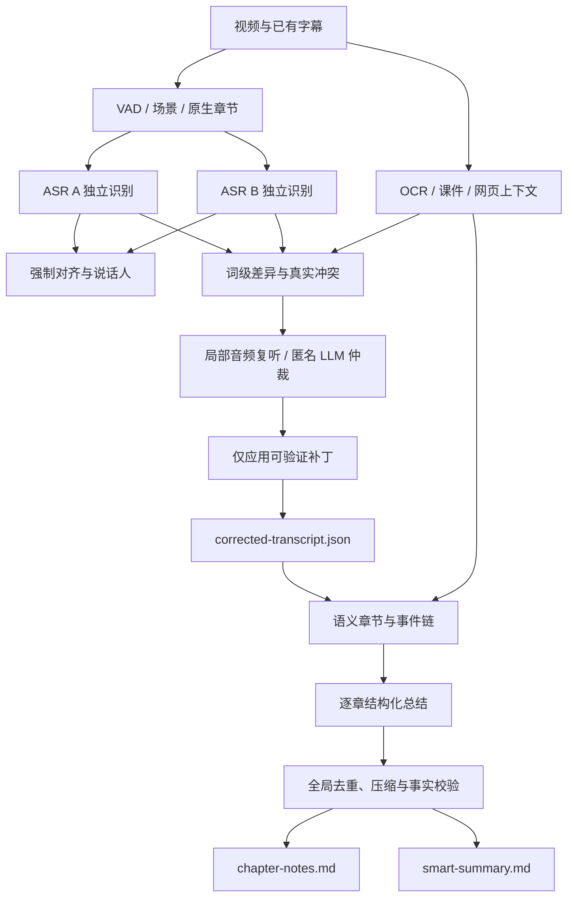

# 开源项目中的逐字稿与智能总结最佳实践

## 2026-07-12 22:53:28 | Codex（GPT-5）

- Action: 核对本机已拉取的开源项目源码，并整理逐字稿、长视频章节化和智能总结的可复用最佳实践。
- Scope: `video-knowledge-pipeline` 的 ASR、时间对齐、证据仲裁、语义章节、分层总结和质量验收。
- Evidence: 本机 `%WORKSPACE_ROOT%\tool-source-review` 真实源码、官方仓库与论文，以及 VKP 24 段当前时间窗人工金标。
- Boundary: 不把得到大脑（原 Get 笔记更名后的产品）的转写导入生产证据链；它只可作为外部质量对照。

## 2026-07-12 23:04:57 | Codex（GPT-5）

- Action: 根据重新切分后的 24 段人工审核结果，补充人工基准窗口、ASR 预填充、标点和版本可比性规则；明确“先确认问题，再复用源码”的实施顺序。
- Evidence: `D:\downloads\quality-benchmark-manifest.completed (1).json`，`window_strategy=asr_vad_sentence_aligned_v1`，24/24 样本已完成人工审核。
- Correction: 新窗口与上一轮固定窗口不一致，上一轮人工稿只保留为历史快照。仓库内 21:51 生成的报告已经使用新窗口 24/24 人工真值，旧稿未参与评分。

## 2026-07-13 00:38:07 | Codex（GPT-5）

- Action: 将开源项目做法、可复用模块、VKP 落地状态和后续验证门槛汇总为一份可执行的源码复用文档。
- Status correction: transcribe-critic 差异仲裁、PySceneDetect adapter、语义章节 Map 到全局 Reduce、CoE 风格一致性检查、粗到细证据回看均已有本地代码和针对性测试；Qwen3 ForcedAligner 已完成官方 API 适配、Windows 音频读取修复和 CUDA 真实运行验证。
- Decision: 问题优先，源码复用优先于自研；只有同一人工金标窗口上的指标或盲评确实提升，复用模块才进入默认生产链。

## 2026-07-13 07:00:03 | Codex（GPT-5）

- ForcedAligner fix: 上游对 Windows 本地路径调用 `librosa.load()` 时异常卡死；VKP adapter 改用 `soundfile` 读取 WAV，并以官方支持的 `(numpy.ndarray, sample_rate)` 输入调用 `align()`。
- Runtime evidence: 1 秒与 10 秒本地片段均在 `cuda:0` 成功输出词/字级时间戳；正式 `plan-asr -> run-asr-plan` 入口返回 `status=ok`，`bfloat16`、`sdpa`、时间戳覆盖率 1.0、单调性通过。
- Global Reduce fix: 删除整串 `text[:max_input_chars]` 尾截断；超预算时按章节均衡保留章节 ID、标题、时间范围及头尾内容，且元数据仍超预算时明确阻断，不删除末尾章节。
- Verification boundary: ForcedAligner 已完成运行闭环，但尚未进入 24 段人工基准的时间戳误差评分；智能总结三视频匿名盲评仍未完成。

## 一、结论

高质量开源项目没有把“完整音频交给一个 ASR，再把整份逐字稿交给一个 LLM”作为可靠生产方案。共同路线是把识别、对齐、差异定位、局部复听、章节化、总结和验证分开：



对 VKP 最重要的判断是：

1. 当前不缺更多 ASR 名称，缺的是多 ASR 冲突的可靠定位、局部复听和补丁验证。
2. 时间戳能力应与文本识别能力分开测量；识别器没有运行对齐器时不能伪造时间戳误差。
3. 智能总结必须只读取纠正版逐字稿和结构化视觉证据，不能直接读取 raw ASR。
4. 长视频不能丢弃中段，也不能只按固定时长或字符数机械分章。
5. 本地抽帧和索引可以充分执行；在线多模态只处理高风险、疑难和证据冲突片段。

### 1.1 开源项目做法与 VKP 复用总表

| 质量问题 | 开源项目的成熟做法 | 主要参考项目 | VKP 复用方式 | 当前状态 |
| --- | --- | --- | --- | --- |
| 长音频被硬切、语句不完整 | VAD/静音边界切分，再合并为完整句段 | FunASR、WhisperX、Lhotse | 运行时直接调用 FunASR VAD；人工基准采用 `asr_vad_sentence_aligned_v1` | 已落地，24/24 新窗口人工金标完成 |
| 单 ASR 错词无法确认 | 两套 ASR 独立识别，词级 diff、差异聚类、匿名候选、局部补丁 | transcribe-critic | 适配 positioned diff、cluster、anonymous adjudication、patch apply；不引入 GNU `wdiff` 强依赖 | 已落地并有针对性测试，尚需在 24 段金标上量化收益 |
| ASR 文本和时间戳能力混在一起 | 识别器与 forced alignment 分离 | Qwen3-ASR、WhisperX | 官方 `Qwen3ForcedAligner` runner、SoundFile tuple 输入、分块和单调时间戳门禁 | 正式入口已在 CUDA/bfloat16 上输出真实词级时间戳；待 24 段误差评分 |
| 场景切点依赖自研阈值 | 使用成熟内容/自适应场景检测器 | PySceneDetect | 直接调用 `AdaptiveDetector`/`ContentDetector`，保留 ffmpeg fallback | 已落地；三段合成视频正确识别 1 秒、2 秒切点 |
| 长视频固定时长分章 | ASR、标题变化、视觉变化、原生章节共同决定语义边界 | Chapter-Llama、ARC-Chapter | semantic chapter plan 汇合转写、青龙、OCR、场景等信号 | 已有入口；仍需完整视频章节盲评 |
| 章节摘要彼此重复或冲突 | 章节 Map 后再做全局 Reduce | vsummary | 章节结构化 JSON -> global Reduce；Reduce 不直接读取 raw ASR | 已落地；完整 Map、全章节预算覆盖和不完整 Map 阻断测试通过 |
| 跨章实体、数字、事件不一致 | 构造事件链和实体关系后再验证摘要 | CoE | entity/number/event consistency；允许 `unknown` 和证据不足 | 已落地；明确新数字冲突会阻断，证据不足不会伪造结论 |
| 五小时视频难以定位疑难证据 | 先粗检索片段，再细查帧，最终显式确认 | DeepVideoDiscovery、VideoLucy | 复用现有 video RAG 索引，生成 coarse hits、fine candidates 和确认状态 | 已落地；确认必须附证据路径，尚需真实长视频效率验收 |
| 总结任务失败后全部重跑 | 分阶段、缓存、可恢复、结构化输出 | vsummary、bilinote | 保留 VKP bundle/sidecar，章节可独立重跑，LLM 结果经 schema/quality gate | 主体已落地，统一任务状态仍需继续收敛 |

## 二、逐项目源码结论

### 2.1 FunASR / SenseVoice：完整转写链，而不是裸模型

真实源码：

- `tool-source-review/FunASR/funasr/auto/auto_model.py`
- `tool-source-review/FunASR/examples/industrial_data_pretraining/sense_voice/README_zh.md`

源码采用可组合链路：

```text
fsmn-vad
-> SenseVoice / Paraformer / Fun-ASR-Nano
-> ct-punc
-> cam++ 或 ERes2NetV2 speaker model
-> sentence_info
```

值得复用：

- `vad_model` 负责长音频切段。
- `merge_vad` 与 `merge_length_s` 控制碎段合并。
- `use_itn=true` 做逆文本正规化。
- `punc_model` 恢复标点和句界。
- `spk_model` 输出说话人信息。
- `sentence_info` 作为最终逐字稿的时间和说话人基础结构。

VKP 应继续以 SenseVoice 作为中文高速基线，但默认链路必须包含 VAD、ITN、标点和可选说话人，而不是直接导出裸识别文本。

### 2.2 Qwen3-ASR / WhisperX：识别和对齐分离

真实源码：

- `tool-source-review/Qwen3-ASR/qwen_asr/inference/qwen3_forced_aligner.py`
- WhisperX 官方仓库 `m-bain/whisperX`

共同做法：

- 先生成文本假设。
- 再用独立强制对齐器生成字/词时间戳。
- 说话人分离是后续独立阶段，不和文本识别混算。
- 长音频优先按 VAD 或静音边界切块。

WhisperX 还采用 VAD 批量识别、关闭 `condition_on_prev_text` 以降低长音频幻觉，然后做 alignment 和 pyannote diarization。

VKP 应把 Qwen3-ASR 作为第二识别假设，把 Qwen3-ForcedAligner 或 WhisperX 作为时间戳/说话人分支。没有运行对齐器时，报告应写 `timestamp_unavailable`。

### 2.3 transcribe-critic：多 ASR 差异仲裁的核心参考

真实源码：

- `tool-source-review/transcribe-critic/src/transcribe_critic/transcription.py`
- `tool-source-review/transcribe-critic/src/transcribe_critic/merge.py`
- `tool-source-review/transcribe-critic/scripts/prototype_realign.py`

关键算法：

1. 多个 ASR 独立生成完整假设。
2. 词级 diff 定位插入、删除和替换。
3. 按句子和时间戳对齐，避免长文本整体错位。
4. 把相邻差异聚成 cluster，减少 LLM 调用。
5. 匿名显示 A/B/C 候选，避免模型名偏见。
6. 给每个差异前后约 30 个词上下文。
7. 将差异映射回音频，增加约 15 秒上下文后局部重识别。
8. 未解决差异保留主稿，不自由改写整篇。
9. 最终仅把已选择的局部 reading 应用为补丁。

这是 VKP 当前最值得继续适配的代码模块。GNU `wdiff` 不适合作为 Windows 强依赖，应保留其 positioned diff、cluster、anonymous adjudication 和 patch apply 逻辑，底层可接 VKP 已有 Python diff 或 RapidFuzz。

### 2.4 vsummary：可恢复的分阶段生成和 Map-Reduce

真实源码：

- `tool-source-review/vsummary/src/backend/video_summary/generation/usecases/generate_summary.py`
- `tool-source-review/vsummary/src/backend/video_summary/infrastructure/llm/litellm_summarizer.py`
- `tool-source-review/vsummary/src/backend/video_summary/infrastructure/llm/litellm_transcript_enhancer.py`
- `tool-source-review/vsummary/src/backend/video_summary/generation/schemas.py`

值得复用：

- `probe -> extract_audio -> transcribe -> enhance -> summarize` 分阶段编排。
- 每阶段缓存，避免重复跑昂贵任务。
- staging 目录全部完成后再原子提交，失败不污染旧产物。
- 上下文放得下时直接总结；放不下时分片总结，再做文档级汇总。
- Pydantic 约束结构化输出。
- 支持取消、并发上限、错误回退和任务进度。

需要修正后再吸收：其转写增强允许模型返回时间戳，只用 segment 数量做主要校验。VKP 应锁死原时间戳、索引、数字和已仲裁实体，只接受文本补丁。

### 2.5 PrideWood/bilinote：字幕优先和同屏人工修订

真实源码：

- `tool-source-review/PrideWood-bilinote/server/server.ts`
- `tool-source-review/PrideWood-bilinote/server/summarizer.ts`
- `tool-source-review/PrideWood-bilinote/src/App.tsx`

值得复用：

- 平台/外挂字幕优先，Whisper 作为 fallback。
- 以固定 `segment index` 要求 LLM 返回校对补丁。
- LLM 失败或空结果时保留原文本。
- 视频、逐字稿、时间戳和编辑器同屏。
- 思维导图按 transcript 分片生成，并保留首次出现时间。

禁止照搬：`prepareTranscriptForModel` 对长 transcript 只保留前 70% 和后 30%，直接丢弃中间内容。该方法不能用于课程视频的完整总结。VKP 必须使用全片分章 Map-Reduce。

### 2.6 Chapter-Llama / ARC-Chapter：语音引导的视觉选择与多级章节

真实源码：

- `tool-source-review/Chapter-Llama-HF/src/data/utils_asr.py`
- `tool-source-review/Chapter-Llama-HF/src/data/prompt.py`
- `tool-source-review/ARC-Chapter/README.md`

Chapter-Llama 的核心不是“多抽帧”，而是：

- 把带时间戳的 ASR 和帧描述共同输入章节器。
- 根据语音内容选择值得 caption 的帧，避免穷举全部帧。
- 直接生成语义章节边界和标题。

ARC-Chapter 进一步采用：

- ASR 压缩长视频上下文。
- 帧与 ASR 联合建章。
- 将时间戳覆盖到训练帧，强化视觉与时间对应。
- 输出短标题、结构化章节、细粒度时间对齐描述三层结果。

VKP 应采用“ASR 全覆盖 + 本地视觉充分采样 + 语音/冲突引导的多模态复核”，并将输出拆为篇章、章节、证据片段三层。

### 2.7 CoE：事件链和实体一致性

真实源码：

- `tool-source-review/CoE/CoE/CoE.py`
- `tool-source-review/CoE/Graph_Construct/graph_construction.py`
- `tool-source-review/CoE/Evaluation/compute_score_entity.py`

CoE 不直接从所有帧生成最终摘要，而是先构建：

```text
overall event
-> sub-events
-> entities / relations
-> clip-to-event matching
-> grounded summary
```

值得吸收的是事件链、实体归一化和实体级事实评估。不能照搬的是部分 prompt 强制“必须匹配一个 sub-event 或关系”，即使证据很弱。VKP 必须允许 `unknown`、`not_supported` 和 `needs_review`。

### 2.8 DeepVideoDiscovery / VideoLucy：长视频粗到细回看

真实源码：

- `tool-source-review/DeepVideoDiscovery/dvd/frame_caption.py`
- `tool-source-review/DeepVideoDiscovery/dvd/build_database.py`
- `tool-source-review/DeepVideoDiscovery/dvd/dvd_core.py`
- `tool-source-review/VideoLucy/README.md`

DeepVideoDiscovery 的路线：

- 本地按约 2 FPS 解帧。
- 将连续帧和字幕组合为 clip caption。
- 建立可检索的片段索引。
- 先检索相关片段；证据不足时再检查具体帧。
- 在回答前用帧检查做 CONFIRM。

VideoLucy 则建立由粗到细的层级记忆，通过迭代回溯逐步定位证据。

VKP 应保留本地充分抽帧，不默认把大量帧上传云端；在线多模态只用于检索后仍不确定、ASR/OCR 冲突、工具名数字和连续操作等疑难窗口。

### 2.9 PySceneDetect / Lhotse：不要自研成熟基础设施

真实源码：

- `tool-source-review/PySceneDetect/scenedetect/detectors/content_detector.py`
- `tool-source-review/PySceneDetect/scenedetect/detectors/adaptive_detector.py`
- `tool-source-review/lhotse/lhotse/cut/`

PySceneDetect 已提供：

- `ContentDetector`：相邻帧内容变化。
- `AdaptiveDetector`：滚动均值和两阶段判断，适合快速运动。
- `min_scene_len`：抑制过密切点。
- `StatsManager`：保存指标并校准阈值。

Lhotse 把 Recording、Cut、Supervision 和特征分开保存为可复现 manifest，适合管理人工金标、音频窗口、模型假设和评测结果。

VKP 不应继续扩展自有 ffmpeg scene 规则和临时 benchmark 字段。优先做 PySceneDetect adapter；Lhotse 可先复用其数据契约，不必立即引入整套训练数据栈。

## 三、跨项目最佳实践

### 3.0 实施顺序：问题优先，源码复用优先于自研

“优先复用开源代码”和“先修问题”不是两个互斥选项。正确顺序是：

1. 用人工基准、失败样本和运行报告确定具体问题。
2. 在已审源码中定位能直接解决该问题的独立模块。
3. 优先调用上游包或抽取低耦合模块；只写适配器、数据转换、门禁和恢复逻辑。
4. 用同一批、同一时间窗的人工真值做 A/B。
5. 只有指标和盲评确实提升，才进入默认生产链。

因此，不能为了“复用更多项目”同时搬入多个大型仓库；也不能绕过成熟实现，继续扩大自有差异算法、场景检测器或标注 UI。当前最明确的问题与对应复用底座是：

| 已确认问题 | 优先复用 | VKP 应新增的部分 |
| --- | --- | --- |
| 双 ASR 只做整段相似度，无法精确定位错词 | transcribe-critic | Windows 兼容的词/字级 diff adapter、证据引用和补丁验证 |
| Qwen 转写缺少可评分词级时间戳 | Qwen3-ForcedAligner / WhisperX | 分块、时间偏移、显存降级和 benchmark 接口 |
| 自有场景变化规则不足 | PySceneDetect | timeline/semantic chapter adapter 和 fallback 报告 |
| 长视频总结仍容易机械分段 | vsummary、Chapter-Llama、ARC-Chapter | 语义章节 Map、章节 JSON、全局 Reduce |
| 跨章节实体、数字和事件可能冲突 | CoE | 允许 `unknown` 的一致性检查器和 abstention 门禁 |
| 长视频疑难证据回看效率低 | DeepVideoDiscovery、VideoLucy | 粗检索、细帧检查、最终确认状态机 |

### 3.1 人工基准和样本窗口

高质量评测首先要求“参考稿和模型结果说的是同一段音频”。当前 VKP 的基准应遵守：

1. 以 VAD、停顿和 ASR 句界扩展名义窗口，不在连续发言中间硬截。
2. `start_seconds`、`end_seconds`、音频片段、人工参考稿和两套 ASR 必须来自同一窗口版本。
3. 人工页面默认预填当前 ASR 草稿，并保留标点；人工负责修订，不从空白开始誊写。
4. 页面中的片段音频和视频上下文不能同时自动播放，避免同一句听起来重复两遍。
5. 对窗口进行重切后，旧人工稿只能作为 `legacy_reference_text` 辅助参考，不能成为新窗口的 canonical gold。
6. 每份 manifest 必须记录 `window_strategy`、窗口版本、边界来源和人工完成状态。
7. CER、标点 F1、句界 F1、实体/数字错误和时间戳误差只能在相同窗口版本上比较。

当前新的有效人工输入是：

- Manifest: `D:\downloads\quality-benchmark-manifest.completed (1).json`
- Strategy: `asr_vad_sentence_aligned_v1`
- Samples: 24
- Human review: 24/24 completed
- Role: 当前窗口的人工评测真值；得到大脑仍只作外部产品对照，不进入纠错证据。

### 3.2 逐字稿

1. 所有原始证据独立生成并保留，不互相提示第一轮结果。
2. VAD 用于切完整语句，不用固定 60 秒硬截。
3. 主 ASR 与挑战者独立运行；第二 ASR 不直接覆盖主稿。
4. 识别、强制对齐、说话人分离分别评测。
5. 只在双 ASR、字幕、OCR、网页上下文或术语证据真正冲突时送审。
6. 仲裁器看到匿名候选、局部上下文和证据，不看到“哪个模型更强”。
7. 对困难窗口重新听 8–30 秒原音频，而不是只让文本 LLM猜。
8. LLM 只返回局部 correction patch。
9. 数字、时间、专名和已仲裁实体作为不可变字段保护。
10. 无充分证据时保留原文并标记待复核。

研究也支持“检测 → 局部纠正 → 验证”而非整篇自由改写。Chain of Correction 使用全局文本作上下文、逐段纠错；可靠纠错框架进一步增加错误预检测和独立验证。

### 3.3 智能总结

1. 总结只读取 `corrected-transcript.json`，不读取 raw ASR。
2. 先做语义章节和一级篇章，再生成章节摘要。
3. 每章输出固定 JSON：标题、摘要、观点、步骤、案例、话术、视觉补充、实体、数字、证据引用、待复核项。
4. 全片总结只读取章节 JSON 与课程地图，不重新吞 raw transcript。
5. 最后增加全局编辑：去重、统一术语、合并方法论、检查跨章节数字和实体一致性。
6. 将完整章节笔记和精炼总结拆成两个产物：
   - `chapter-notes.md`：较完整的章节级知识材料。
   - `smart-summary.md`：高度压缩、可直接阅读的全片总结。
7. 每章可以独立重跑；不能因为一章失败而重跑整部五小时视频。
8. 没有视觉理解时明确标记视觉证据缺口，不伪装成已看画面。

## 四、反模式

以下做法不应进入 VKP 默认生产链：

- 整段音频一次性识别，不做 VAD 和长音频边界管理。
- 用固定时长窗口截断连续发言。
- 让第二 ASR 直接覆盖第一 ASR。
- 将模型自报 confidence 当成事实依据。
- 只因句子含数字就送 LLM 仲裁。
- 让 LLM 重写整份 transcript。
- 允许 LLM 修改时间戳、segment 数量或受保护实体。
- 长 transcript 只保留开头和结尾、丢掉中段。
- 固定时长均分章节。
- 对全部抽帧默认调用云多模态。
- 强制模型在证据不足时也给出事件、实体关系或结论。
- 只检查文件存在，不检查 CER、句界、实体、覆盖、重复和无证据主张。

## 五、VKP 当前状态与差距

### 5.1 已落地并通过针对性验证

- FunASR/SenseVoice 本地 CUDA 路线，以及 fsmn-vad 对齐的人工样本窗口。
- 24 段当前时间窗人工金标；旧窗口人工稿只作历史参考，不参与当前评分。
- SenseVoice 与 Qwen3-ASR 独立假设，以及 `asr-consensus.json` 的一致、冲突和遗漏窗口。
- transcribe-critic 风格的字/词级差异定位、相邻差异聚类、匿名 A/B 仲裁、证据门禁和局部补丁应用。
- PySceneDetect 的 `AdaptiveDetector`/`ContentDetector` adapter、场景边界报告和 ffmpeg fallback。
- OCR、ebook、青龙标签、多模态和网页上下文证据接口。
- `source-arbitrated-transcript -> corrected-transcript -> full-transcript` 数据层。
- semantic chapter、章节级 LLM Map、全局 Reduce、摘要实体/数字/事件一致性检查。
- DeepVideoDiscovery/VideoLucy 风格的粗检索、细帧候选和显式证据确认状态。
- 静态视频、逐字稿、审核工作台，以及 CLI/MCP agent 入口。

### 5.2 代码已存在，但仍需质量验收

- transcribe-critic 适配已经有单元测试，但尚未用 24 段 current-window gold 证明最终 CER、专名和数字错误率下降。
- semantic chapter、global Reduce 和一致性检查已经接通，但三个完整视频的匿名盲评尚未完成。
- PySceneDetect 已通过合成视频 smoke，仍需验证它对真实课程章节边界和补帧召回是否优于旧规则。
- 粗到细回看工具已具备确认状态机，仍需测量在五小时视频上减少多少无效人工浏览和云多模态调用。
- 章节 JSON 与全局编辑已有实现，但只有通过 summary quality gate 后才可作为最终 `smart-summary.md`，不能因文件存在就标记成功。

### 5.3 当前明确 blocker

- Qwen3 ForcedAligner 已在 RTX 5070 Ti Laptop 的 `cuda:0` 跑通 1 秒与 10 秒本地样本；当前剩余工作是把它接入 24 段 current-window gold，正式计算时间戳中位误差与 P95。
- 专名和数字冲突仍需要把差异窗口稳定映射到 8-30 秒原音频，并用音频证据或多源一致证据完成复核；文本 LLM 不能单独成为写回依据。
- 智能总结尚无证据达到得到大脑水平。得到大脑仅用于外部盲评对照，不进入 VKP 自动纠错证据链。

当前 VAD/完整句界窗口的 24 段人工基准如下：

| 模型 | CER | 标点 F1 | 句界 F1 | 实体准确率 | 数字错误 | 有效时间戳样本 |
| --- | ---: | ---: | ---: | ---: | ---: | ---: |
| SenseVoice + punc | 8.14% | 0.643 | 0.481 | 96.21% | 7 | 24 |
| Qwen3-ASR 1.7B | 8.88% | 0.600 | 0.352 | 87.01% | 15 | 0 |

SenseVoice 在 13 段胜出，Qwen 在 8 段胜出，3 段持平。当前证据不支持切换默认 ASR，但支持继续做差异窗口选择性融合。

这组指标已经由 `quality-benchmark-manifest.completed (1).json` 导入后的 current-window gold 生成。报告明确记录：`canonical_source=completed_current_window_reference_text`、`current_window_completed_count=24`、`legacy_reference_used_for_scoring=false`。因此该表是当前有效基准；更早的固定窗口人工稿不得再参与模型比较。

基准产物：

- `openclaw-runs/quality-benchmark-phase17-20260710/benchmark-vad-v1/aligned-human-review-20260712/quality-benchmark.md`
- `openclaw-runs/quality-benchmark-phase17-20260710/benchmark-vad-v1/aligned-human-review-20260712/quality-benchmark.json`
- `openclaw-runs/quality-benchmark-phase17-20260710/benchmark-vad-v1/aligned-human-review-20260712/quality-benchmark-manifest.current-window-gold.json`

## 六、当前实施优先级

### P0：用人工金标证明逐字稿是否真的变好

1. 冻结 24 段 current-window gold、音频窗口、两套 ASR 假设和输入哈希，所有版本只在同一批样本上比较。
2. 运行 transcribe-critic 风格差异仲裁，对每个真实冲突生成 8-30 秒原音频、匿名候选、证据引用和局部补丁。
3. 比较 `SenseVoice full+punc`、Qwen3-ASR、双 ASR 选择性补丁和最终 corrected transcript；重点记录 CER、专名、数字、过度纠错率。
4. 在 24 段 current-window gold 上运行已修复的 Qwen3 ForcedAligner，计算时间戳中位误差和 P95；达标前不切换默认对齐器。
5. 标点/断句 LLM 只负责可读化；数字、专名、时间戳和已仲裁实体必须由 patch validator 锁定。

### P1：证明语义章节与智能总结真的变好

1. 在三个完整视频上比较旧章节边界与 `PySceneDetect + ASR/青龙/OCR` 语义章节边界。
2. 完成逐章结构化 Map，确保每章覆盖、证据引用和待复核项齐全，再执行 global Reduce。
3. 运行 CoE 风格一致性检查，阻断无证据的新数字、新实体和跨章冲突；证据不足允许 `unknown`。
4. 输出相互独立的 `chapter-notes.md` 与 `smart-summary.md`，避免精炼总结被证据流水账淹没。
5. 对当前 VKP、改进版 VKP 和得到大脑做匿名盲评；得到大脑仅作外部产品对照。

### P2：验证长视频回看效率和长期维护成本

1. 用 DeepVideoDiscovery/VideoLucy 风格流程统计粗检索、细帧检查和最终确认分别减少多少人工浏览时间。
2. 只把检索后仍无法确认的疑难窗口送在线多模态；记录调用数和证据增益，不默认全帧上云。
3. 按 Lhotse 的 Recording/Cut/Supervision 思路稳定 benchmark manifest，并保留模型、窗口和人工稿版本谱系。
4. 24 段基准通过后再扩展至 60-100 段，覆盖噪声、多人、英文工具名、数字、课件依赖和连续操作。

## 七、停止条件

只有同时满足以下条件，才允许宣称质量改进完成：

- 最终逐字稿相对 SenseVoice full+punc 的 CER 至少降低 20%。
- 专名/数字错误率至少降低 30%。
- 过度纠错率不超过 1%。
- 时间戳中位误差不超过 0.5 秒，P95 不超过 1.5 秒。
- 智能总结章节覆盖 100%。
- 人工关键点召回不低于 85%。
- 高风险无证据主张为 0。
- 实体与数字准确率不低于 98%。
- 三个完整视频的匿名盲评达到预设提升门槛。

## 八、主要来源

- FunASR: https://github.com/modelscope/FunASR
- Qwen3-ASR: https://github.com/QwenLM/Qwen3-ASR
- WhisperX: https://github.com/m-bain/whisperX
- transcribe-critic: https://github.com/ringger/transcribe-critic
- vsummary: https://github.com/alpha03123/vsummary
- PrideWood/bilinote: https://github.com/PrideWood/bilinote
- Chapter-Llama: https://openaccess.thecvf.com/content/CVPR2025/html/Ventura_Chapter-Llama_Efficient_Chaptering_in_Hour-Long_Videos_with_LLMs_CVPR_2025_paper.html
- ARC-Chapter: https://github.com/TencentARC/ARC-Chapter
- CoE: https://github.com/youxiaoxing/CoE
- DeepVideoDiscovery: https://github.com/microsoft/DeepVideoDiscovery
- VideoLucy: https://github.com/worldbench/VideoLucy
- PySceneDetect: https://github.com/Breakthrough/PySceneDetect
- Lhotse: https://github.com/lhotse-speech/lhotse
- Chain of Correction: https://arxiv.org/abs/2504.01519
- Reliable LLM Correction Framework: https://arxiv.org/abs/2505.24347
