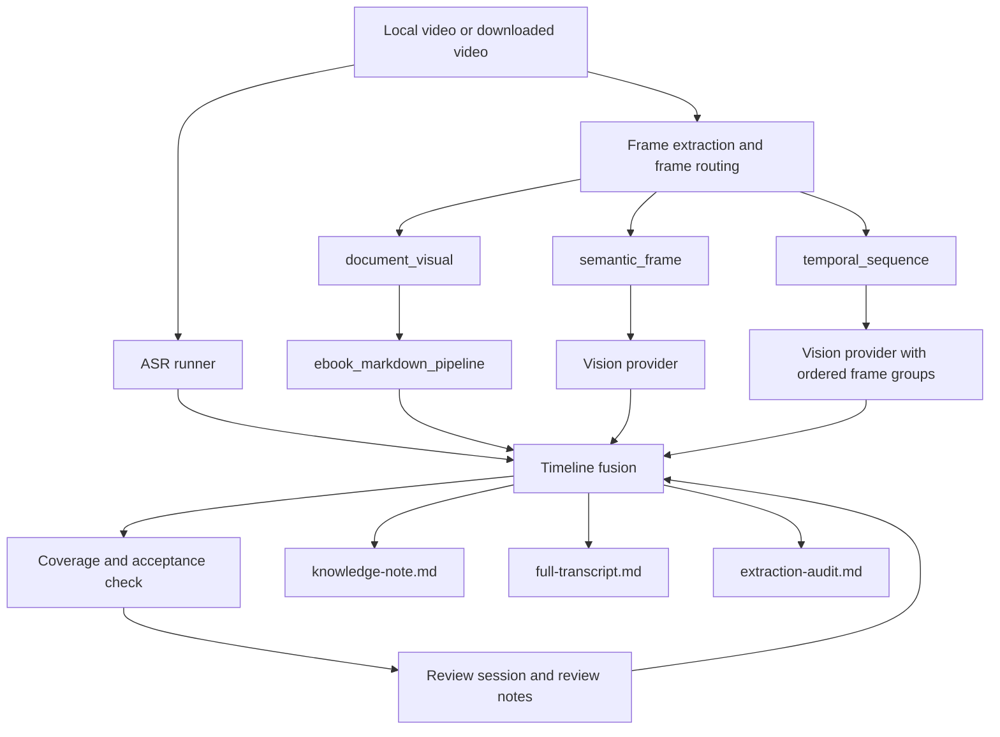

# Next Development Plan: Provider Recovery, Review Completion, and Readable Knowledge Delivery

> Updated: 2026-06-11 15:08:00 | Codex (GPT-5)

## Goal

把 `video-knowledge-pipeline` 从“能定位缺口、能生成审核包”推进到“能稳定处理一个真实知识视频，并输出可直接阅读的层级 Markdown 知识包”。

当前不再扩展新的大工具清单，也不重写已经成型的 pipeline。下一阶段只围绕真实验收缺口开发：

- 修复或切换多模态 provider，让真实视觉理解可以继续执行。
- 把剩余 review queue 做成可批量导入、可审计、可恢复的工作流。
- 继续保持 OCR/图文截图走 `ebook_markdown_pipeline`，多模态只处理非纯图文和连续变化。
- 让最终输出稳定包含：视频概要、层级知识结构、逐字稿与演示记录、表格/图片证据、提取审计。

## Current Verified Baseline

Reference bundle:

- `%WORKSPACE_ROOT%\video-knowledge-pipeline\real-tests\feishu-video-retry-live-asr\phase2-review-preview-bundle`

Latest acceptance state:

| Area | Current state |
|---|---:|
| speech | ok, 68 / 68 |
| visual frames | ok, 68 / 68 |
| visual route | ok, 68 / 68 |
| structured visual | ok, 9 / 9 through human keep-image fallback |
| screen text | weak, 9 / 68 |
| semantic visual understanding | blocked, 17 / 61, missing 44 |
| temporal visual understanding | blocked, 8 / 12, missing 4 |
| review template | prepared, 59 rows |
| review notes | imported, 9 rows |
| export freshness | fresh |
| top-level status | provider_blocked |

Current next action:

- `vision_provider_smoke`
- then `vision-execution-preflight`
- then confirmed `run-multimodal-frame-analysis` / `run-temporal-visual-analysis`
- or import completed human review notes.

## Architecture Boundary

Keep this project as the orchestration and fusion layer:



Non-negotiable boundaries:

- ASR: local SenseVoice/FunASR first, faster-whisper fallback.
- OCR/document screenshots: `ebook_markdown_pipeline` first; weak OCR fallback only as explicitly labeled fallback.
- Multimodal: provider adapter only; no API key in docs, manifest, reports, or tests.
- Human review: import JSON first; no direct external vault writeback.
- Evidence: every visual or temporal claim keeps frame paths.

## Phase 1: Provider Recovery and Provider Switching

### Objective

Make at least one configured multimodal provider pass text, single-image, and multi-image smoke tests on the real bundle.

### Tasks

1. Harden `vision_provider_smoke` output:
   - include provider profile name, model, base URL host only, timeout, proxy hint, and error class;
   - keep raw error details short and secret-safe;
   - write a clear next step for DNS/network/timeout/auth/model mismatch.

2. Add provider profile resolution report:
   - `openai`
   - `gemini`
   - `agnes`
   - `custom_openai_compatible`
   - local VLM HTTP adapter placeholder

3. Add a safe provider switch command or documented flow:

```powershell
.\scripts\video-knowledge.ps1 vision-provider-smoke --provider agnes --bundle-dir <bundle>
.\scripts\video-knowledge.ps1 vision-provider-smoke --provider gemini --bundle-dir <bundle>
.\scripts\video-knowledge.ps1 vision-provider-smoke --provider openai --bundle-dir <bundle>
```

4. If Agnes remains unreachable, do not keep retrying the same profile. Test Gemini/OpenAI-compatible if configured, then record the blocker.

### Files

- `src/video_knowledge_pipeline/vision_provider_smoke.py`
- `src/video_knowledge_pipeline/vision_api.py`
- `src/video_knowledge_pipeline/vision_preflight.py`
- `src/video_knowledge_pipeline/config.py`
- `tests/test_video_pipeline_smoke.py`
- `docs/local-runtime-guide.md`

### Acceptance

- smoke report says exactly whether provider is usable;
- no key leakage in generated artifacts;
- at least one real provider reaches `safe_to_execute=true`, or the blocker is documented as environment/network/auth;
- `python -m pytest -q` passes.

## Phase 2: Close Remaining Visual Gaps by Provider or Review

### Objective

Close the current 44 semantic and 4 temporal missing items through either real model execution or explicit human review import.

### Tasks

1. Keep the full review template workflow:

```powershell
.\scripts\video-knowledge.ps1 prepare-review-session <bundle> --limit 0
```

2. Add split templates for practical review batches:

```powershell
.\scripts\video-knowledge.ps1 prepare-review-session <bundle> --reason semantic_frame_without_analysis --limit 20 --offset 0
.\scripts\video-knowledge.ps1 prepare-review-session <bundle> --reason temporal_sequence_without_analysis --limit 0
```

3. Add an import validation command that checks:
   - unknown timeline indexes;
   - empty correction fields when status requires correction;
   - missing evidence path;
   - duplicate review rows;
   - accepted items that still have unresolved severe quality issues.

4. Make `acceptance-check.md` show review queue by reason:
   - semantic missing;
   - temporal missing;
   - accepted but weak screen text;
   - provider blocked.

### Files

- `src/video_knowledge_pipeline/review_session.py`
- `src/video_knowledge_pipeline/acceptance_check.py`
- `src/video_knowledge_pipeline/knowledge_coverage.py`
- `src/video_knowledge_pipeline/knowledge_note_export.py`
- `tests/test_video_pipeline_smoke.py`

### Acceptance

- `review-notes.template.json` can represent all 59 current open targets;
- importing completed review notes reduces semantic/temporal blockers without pretending they are machine outputs;
- acceptance state changes from `provider_blocked` to either `complete_with_human_review` or the next machine-actionable batch;
- tests pass.

## Phase 3: Real Multimodal Batch Execution

### Objective

Once provider smoke succeeds, execute small confirmed batches and verify quality before large runs.

### Semantic batch flow

```powershell
.\scripts\video-knowledge.ps1 vision-execution-preflight <bundle> --semantic-limit 5 --no-temporal --check-provider
.\scripts\video-knowledge.ps1 run-multimodal-frame-analysis <bundle> --execute --limit 5 --confirm-vision-calls <calls> --confirm-vision-indexes "<indexes>"
.\scripts\video-knowledge.ps1 acceptance-check <bundle>
```

### Temporal batch flow

```powershell
.\scripts\video-knowledge.ps1 run-temporal-frame-groups <bundle> --execute --frame-count 8 --limit 5
.\scripts\video-knowledge.ps1 vision-execution-preflight <bundle> --no-semantic --temporal-limit 3 --frame-count 8 --check-provider
.\scripts\video-knowledge.ps1 run-temporal-visual-analysis <bundle> --execute --limit 3 --frame-count 8 --confirm-vision-calls <calls> --confirm-vision-indexes "<indexes>"
.\scripts\video-knowledge.ps1 acceptance-check <bundle>
```

### Quality rules

- single-frame output must include objects, actions, UI state, spatial relation, non-text information, keep-image reason, confidence;
- temporal output must include event sequence, state changes, operation steps, before/after causality, possible omissions;
- outputs must keep frame paths and must not overwrite OCR, ASR, or human corrections.

### Files

- `src/video_knowledge_pipeline/multimodal_frame_analyzer.py`
- `src/video_knowledge_pipeline/temporal_visual_analyzer.py`
- `src/video_knowledge_pipeline/temporal_frame_groups.py`
- `src/video_knowledge_pipeline/vision_acceptance.py`
- `tests/test_video_pipeline_smoke.py`

### Acceptance

- at least 5 semantic items and 3 temporal items complete through real provider execution;
- `vision-analysis-runs.jsonl` and restore plan are written;
- `knowledge-coverage.json` and `acceptance-check.json` reflect new coverage;
- export remains fresh after re-export.

## Phase 4: Readable Knowledge Package Quality

### Objective

Make final Markdown usable without opening raw timeline files.

### Required outputs

- `exports/knowledge-note.md`
- `exports/full-transcript.md`
- `exports/extraction-audit.md`

### Required `knowledge-note.md` structure

```markdown
# <title>

## 视频概要
## 覆盖情况
## 知识结构
## 分章节笔记
### <chapter>
#### 说了什么
#### 演示了什么
#### 屏幕/图表/公式/代码
#### 证据
#### 仍缺什么
## 图文与必须保留的图片
## 连续演示与操作变化
## 逐字稿与演示记录
## 未解决缺口
```

### Tasks

1. Add chapter segmentation that is evidence-based:
   - time continuity;
   - transcript topic shifts;
   - visual route changes;
   - temporal events.

2. Add table rendering for:
   - timeline index;
   - time range;
   - speech excerpt;
   - visual evidence;
   - model/human source;
   - unresolved risk.

3. Add export quality check:
   - required headings;
   - minimum transcript coverage;
   - no wrapper-only OCR content;
   - unresolved gaps are visible;
   - evidence paths exist.

### Files

- `src/video_knowledge_pipeline/knowledge_note_export.py`
- `src/video_knowledge_pipeline/lecture_outline.py`
- `src/video_knowledge_pipeline/acceptance_check.py`
- `tests/test_video_pipeline_smoke.py`

### Acceptance

- a human can read `knowledge-note.md` as the main result;
- full transcript remains complete and chronological;
- extraction audit exposes missing or weak visual coverage;
- export quality check is included in acceptance report.

## Phase 5: WebUI Review and Agent Handoff

### Objective

Make the static WebUI bundle the human starting point and MCP/CLI the agent starting point, with the same state.

### Tasks

1. Add WebUI links for:
   - acceptance report;
   - review session;
   - review template;
   - review notes;
   - knowledge note;
   - full transcript;
   - extraction audit;
   - provider smoke report.

2. Add copyable commands for:
   - `vision-provider-smoke`;
   - `prepare-review-session`;
   - `apply-review-notes`;
   - `acceptance-check`;
   - `export-knowledge-note`.

3. Keep desktop/browser UI static and local. Do not add a live writeback UI until JSON import/export is stable.

### Files

- `src/video_knowledge_pipeline/webui_bridge.py`
- `src/video_knowledge_pipeline/lecture_package.py`
- `src/video_knowledge_pipeline/mcp_server.py`
- `AGENT_DISCOVERY.md`
- `README.md`
- `tests/test_video_pipeline_smoke.py`

### Acceptance

- opening `review.html` is enough to find the current status, next command, review template, final exports, and provider blocker;
- MCP tool list includes all required continuation tools;
- no duplicate port or Web server config is introduced.

## Phase 6: Integration Back to Research Orchestrator

### Objective

Keep `question-research-poc` slim while letting it call this tool as a stable video source processor.

### Tasks

1. Update bridge contract in `question-research-poc` only after this repo's CLI/MCP contract is stable.
2. Expose outputs as research source artifacts:
   - knowledge note;
   - full transcript;
   - extraction audit;
   - acceptance status;
   - evidence frame directory.
3. Do not reintroduce video processing code into `question-research-poc`.

### Acceptance

- research orchestrator can call video pipeline and ingest resulting Markdown artifacts;
- video extraction remains owned by `video-knowledge-pipeline`;
- no duplicate ASR/OCR/multimodal implementation appears in `question-research-poc`.

## Suggested Execution Order

1. Phase 1: provider recovery and provider switching.
2. Phase 2: review queue validation and import ergonomics.
3. Phase 3: real small-batch multimodal execution.
4. Phase 4: export quality check and chaptered Markdown.
5. Phase 5: WebUI and MCP handoff polish.
6. Phase 6: bridge back to `question-research-poc`.

## Stop Conditions

Pause and reassess if:

- all cloud providers remain unreachable after smoke tests and proxy/auth checks;
- local VLM deployment would require heavy GPU setup beyond current machine capacity;
- review queue becomes faster to finish manually than to automate further;
- export quality issues come from bad ASR rather than visual understanding.

## Final Acceptance Command Set

```powershell
python -m pytest -q
.\scripts\video-knowledge.ps1 vision-provider-smoke --provider agnes --bundle-dir %WORKSPACE_ROOT%\video-knowledge-pipeline\real-tests\feishu-video-retry-live-asr\phase2-review-preview-bundle
.\scripts\video-knowledge.ps1 acceptance-check %WORKSPACE_ROOT%\video-knowledge-pipeline\real-tests\feishu-video-retry-live-asr\phase2-review-preview-bundle
.\scripts\video-knowledge.ps1 export-knowledge-note %WORKSPACE_ROOT%\video-knowledge-pipeline\real-tests\feishu-video-retry-live-asr\phase2-review-preview-bundle --title "feishu-video-retry"
.\scripts\video-knowledge.ps1 refresh-review-html %WORKSPACE_ROOT%\video-knowledge-pipeline\real-tests\feishu-video-retry-live-asr\phase2-review-preview-bundle
```

Stage is complete when:

- tests pass;
- provider is usable or every missing visual item has explicit imported human review;
- semantic and temporal blockers are zero or explicitly accepted as human-reviewed gaps;
- `knowledge-note.md`, `full-transcript.md`, and `extraction-audit.md` are fresh;
- `review.html` points to the current reports and commands;
- no secret appears in docs, reports, manifests, tests, or source.
