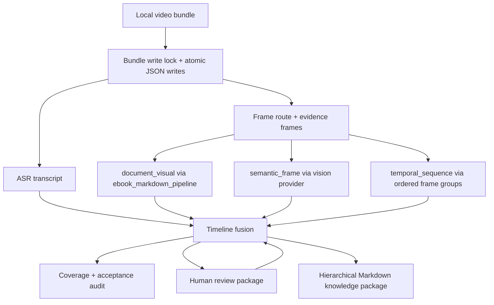

# Phase 8 Real Bundle Hardening And Knowledge Output Implementation Plan

> **For Claude:** REQUIRED SUB-SKILL: Use superpowers:executing-plans to implement this plan task-by-task.

**Goal:** Make `video-knowledge-pipeline` reliably process the current real video bundle into a human-readable, evidence-backed Markdown knowledge package, while hardening bundle writes so manifest and audit artifacts cannot be corrupted by overlapping commands.

**Architecture:** Keep the current orchestration architecture: ASR stays local-first, OCR/document screenshots stay delegated to `ebook_markdown_pipeline`, and semantic/temporal video understanding stays behind provider adapters. This phase does not add new model families; it closes real bundle gaps, improves output quality, and adds write-safety around shared bundle artifacts.

**Tech Stack:** Python package under `src/video_knowledge_pipeline`, pytest regression tests, PowerShell wrapper `scripts/video-knowledge.ps1`, static WebUI bundle, JSON/Markdown bundle artifacts, existing Agnes/OpenAI-compatible/Gemini provider layer.

---

## Current Baseline

Reference bundle:

```text
%WORKSPACE_ROOT%\video-knowledge-pipeline\real-tests\feishu-video-retry-live-asr\phase2-review-preview-bundle
```

Latest observed state on 2026-06-11:

| Area | State |
|---|---|
| Top-level status | `machine_action_available` |
| Next action | `run_multimodal_frame_analysis` |
| Semantic frame understanding | `19 / 61`, missing `42` |
| Temporal visual understanding | `8 / 12`, missing `4` |
| Screen text | weak, but not the primary blocker |
| Human review package | present, but needs regeneration after new vision results |
| Markdown export | present, but needs stronger hierarchy and transcript/demo separation |
| Bundle manifest | currently invalid JSON after overlapping write commands; must be repaired first |

Important constraint:

- Do not run write commands against the same bundle in parallel.
- Do not store or print API keys in reports, manifests, docs, or tests.
- Do not re-route OCR away from `ebook_markdown_pipeline`.

## Target Outcome

By the end of this phase:

1. The real bundle manifest is valid JSON and every bundle write path is protected against partial/colliding writes.
2. Acceptance check, MCP audit, bundle status, and knowledge export can run sequentially and pass without corrupting shared artifacts.
3. Remaining semantic and temporal visual gaps have either model output or explicit human-review records with evidence frame paths.
4. `exports/knowledge-note.md` reads like a usable study document:
   - hierarchical outline;
   - video summary;
   - table of key claims/concepts;
   - transcript with visual/demo notes;
   - retained images/tables where text alone is insufficient;
   - extraction coverage and known gaps.
5. CLI, MCP, and WebUI continue to expose the same workflow without diverging commands or schemas.

## Architecture Sketch



---

## Task 1: Repair The Current Real Bundle Manifest

**Files:**

- Generated artifact: `real-tests/feishu-video-retry-live-asr/phase2-review-preview-bundle/manifest.json`
- Backup artifact: `real-tests/feishu-video-retry-live-asr/phase2-review-preview-bundle/manifest.corrupt-YYYYMMDD-HHMMSS.json`
- Test: no permanent test yet; this is one-time artifact recovery.

**Step 1: Back up the corrupt manifest**

Run:

```powershell
Copy-Item real-tests\feishu-video-retry-live-asr\phase2-review-preview-bundle\manifest.json real-tests\feishu-video-retry-live-asr\phase2-review-preview-bundle\manifest.corrupt-20260611-phase8.json
```

Expected: backup file exists.

**Step 2: Decode the first valid JSON object**

Run a short Python repair script that uses `json.JSONDecoder().raw_decode()` to parse the first object and detect trailing duplicated text.

Expected:

- first object parses;
- trailing content is confirmed to be extra garbage from overlapping writes;
- no API key or secret appears in the manifest.

**Step 3: Rewrite only the parsed object**

Write the parsed object back with UTF-8 and deterministic indentation.

Expected:

```powershell
python -m json.tool real-tests\feishu-video-retry-live-asr\phase2-review-preview-bundle\manifest.json > $null
```

passes.

**Step 4: Run sequential verification**

Run:

```powershell
.\scripts\video-knowledge.ps1 acceptance-check real-tests\feishu-video-retry-live-asr\phase2-review-preview-bundle
.\scripts\video-knowledge.ps1 mcp-audit-bundle real-tests\feishu-video-retry-live-asr\phase2-review-preview-bundle
.\scripts\video-knowledge.ps1 export-knowledge-note real-tests\feishu-video-retry-live-asr\phase2-review-preview-bundle
```

Expected:

- no JSON decode errors;
- all generated reports are fresh;
- manifest remains valid JSON after all three commands.

**Step 5: Commit**

```powershell
git add src tests docs real-tests\feishu-video-retry-live-asr\phase2-review-preview-bundle\manifest.json
git commit -m "fix: repair real bundle manifest"
```

Only commit generated real-test artifacts if that is already the repo convention; otherwise commit code/docs only and leave real artifacts local.

---

## Task 2: Add Bundle Write Locking And Atomic JSON Writes

**Files:**

- Modify: `src/video_knowledge_pipeline/bundle_io.py` or create it if no shared I/O module exists.
- Modify call sites that write `manifest.json`, `timeline.json`, coverage reports, status reports, and MCP args files.
- Test: `tests/test_video_pipeline_smoke.py`

**Step 1: Write failing tests**

Add tests for:

- atomic JSON write writes to a temp file then replaces the target;
- corrupt partial files are not left behind when serialization fails;
- lock acquisition blocks or fails cleanly when another writer owns the bundle;
- sequential write commands can update manifest without extra trailing content.

Expected initial result:

```powershell
python -m pytest tests\test_video_pipeline_smoke.py::test_bundle_json_write_is_atomic tests\test_video_pipeline_smoke.py::test_bundle_write_lock_rejects_overlapping_writer -q
```

fails because helpers do not exist yet.

**Step 2: Implement shared helpers**

Implement minimal helpers:

```python
def write_json_atomic(path: Path, data: Any) -> None:
    ...

@contextmanager
def bundle_write_lock(bundle_dir: Path, operation: str):
    ...
```

Use a lock file under the bundle directory, for example:

```text
.bundle-write.lock
```

The lock metadata should include operation, pid, and timestamp, but never provider config or API keys.

**Step 3: Replace direct writes**

Update write-heavy modules first:

- `src/video_knowledge_pipeline/knowledge_note_export.py`
- `src/video_knowledge_pipeline/bundle_status.py`
- `src/video_knowledge_pipeline/acceptance_check.py`
- `src/video_knowledge_pipeline/mcp_server.py`
- `src/video_knowledge_pipeline/multimodal_frame_analyzer.py`
- `src/video_knowledge_pipeline/temporal_visual_analyzer.py`
- `src/video_knowledge_pipeline/review_session.py`

Expected: bundle-level write commands cannot overlap silently.

**Step 4: Run tests**

```powershell
python -m pytest -q
```

Expected: all tests pass.

**Step 5: Commit**

```powershell
git add src\video_knowledge_pipeline tests
git commit -m "fix: make bundle writes atomic"
```

---

## Task 3: Finish Real Semantic Frame Understanding Loop

**Files:**

- Modify: `src/video_knowledge_pipeline/multimodal_frame_analyzer.py`
- Modify: `src/video_knowledge_pipeline/vision_preflight.py`
- Generated reports: `multimodal-frame-analysis-report.md`, `vision-analysis-runs.md`
- Test: `tests/test_video_pipeline_smoke.py`

**Step 1: Lock the retry behavior with tests**

Add a regression test for transient provider failures:

- first provider call raises retryable SSL/network error;
- second provider call succeeds;
- output records `attempt_count`;
- timeline is updated exactly once.

Expected:

```powershell
python -m pytest tests\test_video_pipeline_smoke.py::test_direct_multimodal_retries_transient_provider_error -q
```

passes.

**Step 2: Run small confirmed batches**

Use small batches to avoid provider instability and easier recovery:

```powershell
.\scripts\video-knowledge.ps1 run-multimodal-frame-analysis real-tests\feishu-video-retry-live-asr\phase2-review-preview-bundle --execute --provider-config "{`"provider`":`"agnes`"}" --limit 3 --indexes "9,15,19" --confirm-vision-calls 3 --confirm-vision-indexes "9,15,19" --image-probe-max-edge 512 --image-probe-jpeg-quality 55 --vision-retries 3 --vision-retry-delay-seconds 5
```

Expected:

- successful items write `visual_understanding`;
- failed items preserve raw failure and do not corrupt timeline;
- evidence frame paths remain original local frame paths;
- compressed probe paths are only transport artifacts.

**Step 3: Recompute status after each batch**

Run:

```powershell
.\scripts\video-knowledge.ps1 bundle-status-report real-tests\feishu-video-retry-live-asr\phase2-review-preview-bundle
.\scripts\video-knowledge.ps1 export-knowledge-note real-tests\feishu-video-retry-live-asr\phase2-review-preview-bundle
```

Expected: semantic missing count decreases or failed indexes stay explicit.

**Step 4: Stop condition**

Stop model execution when either:

- semantic missing reaches `0`; or
- repeated provider failures make manual review faster than more API retries.

**Step 5: Commit**

```powershell
git add src tests docs
git commit -m "feat: stabilize semantic vision execution"
```

---

## Task 4: Finish Real Temporal Sequence Understanding Loop

**Files:**

- Modify: `src/video_knowledge_pipeline/temporal_visual_analyzer.py`
- Modify: `src/video_knowledge_pipeline/temporal_frame_groups.py` if frame grouping needs repair.
- Generated reports: `temporal-frame-groups-report.md`, `temporal-visual-analysis-report.md`
- Test: `tests/test_video_pipeline_smoke.py`

**Step 1: Confirm frame groups exist for missing indexes**

Run:

```powershell
.\scripts\video-knowledge.ps1 run-temporal-frame-groups real-tests\feishu-video-retry-live-asr\phase2-review-preview-bundle --execute --frame-count 8 --limit 4 --indexes "21,26,31,32"
```

Expected:

- each group has 5-12 ordered frames;
- frame timestamps are monotonic;
- group report links all evidence frames.

**Step 2: Run confirmed temporal analysis**

Run:

```powershell
.\scripts\video-knowledge.ps1 run-temporal-visual-analysis real-tests\feishu-video-retry-live-asr\phase2-review-preview-bundle --execute --provider-config "{`"provider`":`"agnes`"}" --limit 2 --indexes "21,26" --confirm-vision-calls 2 --confirm-vision-indexes "21,26" --image-probe-max-edge 512 --image-probe-jpeg-quality 55 --vision-retries 3 --vision-retry-delay-seconds 5
```

Expected:

- each successful item writes `temporal_visual_understanding`;
- output includes event sequence, state changes, operation steps, before/after causality, and possible omissions;
- failed items remain importable through human review.

**Step 3: Repeat for remaining temporal gaps**

Run the same command for `31,32` if provider stability allows.

**Step 4: Verify coverage**

```powershell
.\scripts\video-knowledge.ps1 bundle-status-report real-tests\feishu-video-retry-live-asr\phase2-review-preview-bundle
```

Expected: temporal missing count reaches `0` or only human-review blockers remain.

**Step 5: Commit**

```powershell
git add src tests docs
git commit -m "feat: close temporal visual understanding gaps"
```

---

## Task 5: Regenerate Human Review Package From Fresh Gaps

**Files:**

- Modify: `src/video_knowledge_pipeline/review_session.py`
- Generated artifacts:
  - `review-session.md`
  - `review-fill-guide.md`
  - `review-notes.template.json`
- Test: `tests/test_video_pipeline_smoke.py`

**Step 1: Ensure review rows match current gaps**

Run:

```powershell
.\scripts\video-knowledge.ps1 prepare-review-session real-tests\feishu-video-retry-live-asr\phase2-review-preview-bundle --limit 0
```

Expected:

- no already-filled semantic/temporal items are still listed as missing;
- each remaining item has timestamp, route, transcript excerpt, evidence frames, and JSON fill template.

**Step 2: Add stale-review regression test**

Test that review generation excludes timeline items that already have:

- `visual_understanding`; or
- `temporal_visual_understanding`; or
- accepted human review equivalent.

Expected initial failure if stale rows are still emitted.

**Step 3: Implement stale-row filtering**

Modify review generation to compute rows from current coverage gaps, not from an old cached queue.

**Step 4: Run tests**

```powershell
python -m pytest tests\test_video_pipeline_smoke.py::test_prepare_review_session_excludes_already_filled_visual_items -q
python -m pytest -q
```

Expected: all tests pass.

**Step 5: Commit**

```powershell
git add src\video_knowledge_pipeline\review_session.py tests
git commit -m "fix: regenerate review package from fresh visual gaps"
```

---

## Task 6: Upgrade Human-Readable Markdown Export

**Files:**

- Modify: `src/video_knowledge_pipeline/knowledge_note_export.py`
- Modify: `src/video_knowledge_pipeline/lecture_package.py` if shared section builders belong there.
- Test: `tests/test_video_pipeline_smoke.py`
- Generated artifact: `exports/knowledge-note.md`

**Step 1: Write export structure test**

Assert that exported Markdown contains these top-level sections:

```markdown
# 视频知识提取报告
## 视频概要
## 核心知识结构
## 关键概念与判断表
## 逐字稿与画面记录
## 必须保留的图片/表格/公式/代码
## 提取覆盖率与待复核缺口
```

Expected initial result: fail if current export lacks any required section.

**Step 2: Separate transcript from visual/demo records**

For each timeline item in `逐字稿与画面记录`, render:

- timestamp;
- speech transcript;
- screen text or structured visual when available;
- semantic frame understanding when available;
- temporal sequence understanding when available;
- retained evidence frame links;
- known gap markers.

**Step 3: Add tables where they improve scanning**

Add Markdown tables for:

- concepts/claims;
- visual evidence;
- extraction gaps;
- provider/model run history.

Do not force images into tables if paths are long; use bullet evidence links where readability is better.

**Step 4: Keep summaries honest**

The summary should be derived from available transcript and visual fields. If a channel is missing, add a clearly labeled gap instead of inventing content.

**Step 5: Run export and inspect**

```powershell
.\scripts\video-knowledge.ps1 export-knowledge-note real-tests\feishu-video-retry-live-asr\phase2-review-preview-bundle
```

Expected:

- `exports/knowledge-note.md` is readable without opening JSON;
- it states what the video says and what it demonstrates;
- it separates extracted facts from unresolved gaps.

**Step 6: Commit**

```powershell
git add src\video_knowledge_pipeline tests
git commit -m "feat: export hierarchical video knowledge report"
```

---

## Task 7: Align CLI, MCP, And WebUI Status

**Files:**

- Modify: `src/video_knowledge_pipeline/cli.py`
- Modify: `src/video_knowledge_pipeline/mcp_server.py`
- Modify: `src/video_knowledge_pipeline/webui_bridge.py`
- Modify: `src/video_knowledge_pipeline/bundle_next.py`
- Modify: `AGENT_DISCOVERY.md`
- Modify: `README.md`
- Test: `tests/test_video_pipeline_smoke.py`

**Step 1: Add contract test for next action consistency**

For a fixture bundle, assert:

- CLI status and MCP audit name the same next tool;
- MCP args file points to the same bundle;
- WebUI review page includes the same report links.

**Step 2: Update tool descriptions**

Ensure docs and MCP descriptions keep these boundaries:

- ASR runner handles transcript;
- `ebook_markdown_pipeline` handles document-like screenshots;
- multimodal provider handles semantic frames;
- temporal provider handles ordered frame groups;
- human review imports accepted corrections.

**Step 3: Verify WebUI**

If a local WebUI server is needed, first use the single port configuration rule. For static bundle verification, open:

```text
file:///%WORKSPACE_ROOT%/video-knowledge-pipeline/real-tests/feishu-video-retry-live-asr/phase2-review-preview-bundle/review.html
```

Expected:

- review page loads;
- new export links are visible;
- visual/temporal gaps are not mislabeled as OCR gaps.

**Step 4: Commit**

```powershell
git add AGENT_DISCOVERY.md README.md src tests
git commit -m "docs: align video pipeline operation contracts"
```

---

## Task 8: Full Acceptance Pass And Secret Scan

**Files:**

- Generated reports:
  - `acceptance-check.md`
  - `bundle-status.md`
  - `knowledge-coverage.md`
  - `exports/knowledge-note.md`
  - `mcp-audit-bundle` output
- Test: full pytest suite.

**Step 1: Run full tests**

```powershell
python -m pytest -q
```

Expected: all tests pass.

**Step 2: Run sequential real-bundle checks**

```powershell
.\scripts\video-knowledge.ps1 acceptance-check real-tests\feishu-video-retry-live-asr\phase2-review-preview-bundle
.\scripts\video-knowledge.ps1 bundle-status-report real-tests\feishu-video-retry-live-asr\phase2-review-preview-bundle
.\scripts\video-knowledge.ps1 mcp-audit-bundle real-tests\feishu-video-retry-live-asr\phase2-review-preview-bundle
.\scripts\video-knowledge.ps1 export-knowledge-note real-tests\feishu-video-retry-live-asr\phase2-review-preview-bundle
```

Expected:

- no manifest JSON errors;
- no stale next actions;
- reports are fresh;
- remaining blockers, if any, are human-review blockers with evidence paths.

**Step 3: Scan for secrets**

Run targeted scans without printing secret values:

```powershell
rg -n -e "sk-" -e "api_key" -e "Authorization" src tests docs AGENT_DISCOVERY.md README.md
rg -n -e "sk-" -e "api_key" -e "Authorization" real-tests\feishu-video-retry-live-asr\phase2-review-preview-bundle
```

Expected:

- no real API keys in committed files or generated reports;
- only safe placeholder/env-var references remain.

**Step 4: Final acceptance note**

Append a short update to:

```text
docs/plans/2026-06-09-next-stage-video-knowledge-pipeline.md
```

Include:

- final semantic/temporal counts;
- final acceptance status;
- export path;
- tests run;
- any remaining human-review gaps.

**Step 5: Commit**

```powershell
git add src tests docs AGENT_DISCOVERY.md README.md
git commit -m "test: complete real bundle acceptance pass"
```

---

## Execution Order

Use this order exactly:

1. Repair manifest.
2. Add write lock and atomic JSON writes.
3. Re-run acceptance and MCP audit sequentially.
4. Continue semantic visual batches.
5. Continue temporal visual batches.
6. Regenerate review package.
7. Upgrade Markdown export.
8. Align CLI/MCP/WebUI docs.
9. Run full acceptance and secret scan.

Do not run bundle-writing commands in parallel until Task 2 is complete and tested.

## Stop / Replan Conditions

Replan before continuing if any of these happen:

- provider calls repeatedly fail after configured retries and human review is faster;
- real bundle manifest becomes invalid again after write locking;
- Markdown export starts inventing content not present in transcript, OCR, visual understanding, or review notes;
- WebUI/CLI/MCP disagree about next action;
- tests require broad unrelated rewrites.

