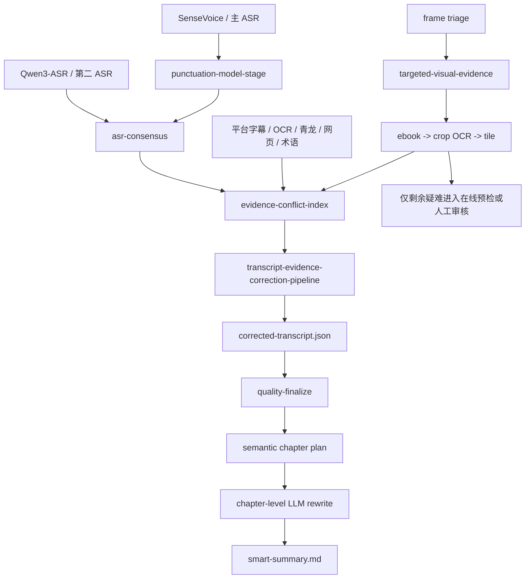

# VKP 质量改进执行链

## 更新记录

- 2026-07-11 16:40:00 | Codex / GPT-5 | 将标点、多 ASR、证据纠错、章节总结和本地视觉疑难路由收束为稳定 CLI/MCP 入口。

## 目标

这组入口解决“模块已经存在，但默认链路没有稳定执行或验收”的问题。底层模型、OCR、章节器和视觉工具继续复用现有实现；新增代码只负责运行边界、编排、质量门禁、状态和恢复。

## 标准链路



## 1. 正式标点模型

```powershell
.\scripts\video-knowledge.ps1 punctuation-model-stage <bundle>
.\scripts\video-knowledge.ps1 punctuation-model-stage <bundle> --execute --promote
```

- 默认 preview。
- 真正执行时通过项目 ASR 虚拟环境子进程加载 FunASR ct-punc，不要求当前 CLI Python 直接安装 FunASR。
- 所有文本块一次加载模型并批处理。
- 去除空白和标点后必须与输入字符完全一致。
- 字符锁或标点质量门禁失败时不允许提升到 corrected transcript。
- raw ASR 永远不覆盖。

## 2. 24 段多 ASR 批量执行

```powershell
.\scripts\video-knowledge.ps1 quality-benchmark execute-variants <manifest>
.\scripts\video-knowledge.ps1 quality-benchmark execute-variants <manifest> --execute --limit 8
.\scripts\video-knowledge.ps1 quality-benchmark execute-variants <manifest> --execute --resume --retry-failed
```

支持的 variant：

- `sensevoice_raw`
- `sensevoice_full_punc`
- `qwen3_asr_1_7b`
- `qwen3_asr_0_6b`
- `fun_asr_nano`

运行器记录 GPU/CPU、模型就绪、计划、失败和 normalized transcript 路径，支持断点续跑。Qwen3-ASR 1.7B 失败不会静默切到 0.6B；0.6B 必须显式选择。只有人工金标上的 CER、专名/数字和过度纠错率确实改善，才允许改默认模型。

GET 笔记（得到大脑更名后的产品）的逐字稿和智能总结只作匿名评测对照，不得导入 VKP 的生产纠错证据链。

## 3. 双 ASR 与证据化语义 patch

```powershell
.\scripts\video-knowledge.ps1 transcript-evidence-correction-pipeline <bundle> \
  --asr-json <primary.json> \
  --secondary-asr-json <qwen3.json> \
  --no-agent-substitute \
  --no-readable-llm
```

- 第二 ASR 只写入 `asr-consensus.json` 和候选证据，不直接覆盖主稿。
- 只有具体文本差异并获得第二 ASR、字幕、OCR、青龙、网页或术语证据的候选进入 `evidence-conflict-index.json`。
- 单纯“包含数字”或低模型置信度不能自动送审。
- 在线 LLM 仍按现有 provider/preflight 边界执行；低置信和高风险数字必须保留复核状态。
- 音频冲突片段只有显式 `--execute-consensus-clips` 才生成。

## 4. 章节级智能总结成品链

```powershell
.\scripts\video-knowledge.ps1 quality-finalize <bundle>
.\scripts\video-knowledge.ps1 quality-finalize <bundle> --execute-llm --provider-config <runtime-json-or-profile>
```

`quality-finalize` 强制顺序：

1. 必须存在 corrected/source-arbitrated transcript。
2. transcript quality gate 不得有 fail。
3. 生成语义章节和章节证据包。
4. 每章 LLM 独立改写。
5. 所有章节齐全后全局安装。
6. `smart-summary-quality-check` 通过才返回 completed。

默认只生成章节 LLM 计划，不调用网络。provider config 和密钥只存在于运行时，不写入 manifest、报告或文档。

## 5. 本地优先视觉疑难闭环

```powershell
.\scripts\video-knowledge.ps1 targeted-visual-evidence <bundle>
.\scripts\video-knowledge.ps1 targeted-visual-evidence <bundle> --execute-ebook --execute-crops --execute-ocr --execute-tiles
```

固定路由：

```text
vision-review-triage
-> document_visual: ebook_markdown_pipeline
-> 仍为空/wrapper-only/低信息量: crop OCR
-> 仍失败: high-resolution tile
-> 仅剩余 semantic/temporal/文档疑难: 在线 vision preflight 或人工审核
```

这个入口不会直接调用在线视觉模型。即使传入 `--allow-online-review`，也只把剩余 indexes 标成可进入既有 preflight 的候选，真实在线调用仍需现有确认参数。

## MCP 工具

- `punctuation_model_stage`
- `quality_benchmark`，action=`execute-variants`
- `transcript_evidence_correction_pipeline`，支持 `secondary_asr_json`
- `quality_finalize`
- `targeted_visual_evidence`

## 验收门槛

- 标点字符锁：100%。
- 多 ASR：所有运行均有明确 completed/failed/blocked/resume 状态。
- 第二 ASR：从不直接 promoted。
- 语义 patch：只有真实多源冲突进入 LLM pack。
- 智能总结：只读 corrected transcript，语义章节覆盖完整时长，章节全部通过才安装。
- 视觉：空结果、wrapper-only、低信息量不得清除 blocker。
- 所有在线调用保持显式边界，当前离线 fixture 和测试不调用云模型。

## Secondary ASR evidence closure (2026-07-20)

After an independently authorized secondary ASR execution has completed, use the stable local-only front door:

```powershell
.\scripts\video-knowledge.ps1 asr-secondary-evidence <bundle> <connector-execution.json> <prepared-suite.json>
```

The command validates all of the following before consuming model output:

- connector task and completed transport/contract gates;
- route ID, route revision, virtual model, provider, model, and destination;
- runtime route/provider/model identity;
- exact uploaded path, byte count, and SHA-256 set.

It then reuses the existing verbose-ASR quality gate, keeps non-blocking segments, normalizes the accepted secondary evidence, builds `asr-consensus.json`, and creates the anonymous adjudication pack. Blocking chunks make the run `degraded`; missing verbose segments make it `failed`; identity drift makes it `blocked`.

The command is postprocessing only. It makes no network request, permits no fallback, creates no automatic patch, and never promotes the secondary transcript. `source-arbitrated-transcript.json` is hashed before and after the closure, and a mismatch forces a failed terminal result. Human-confirmed evidence is still required through the existing adjudication apply command.

2026-07-20 21:02:35 | Codex (GPT-5)
