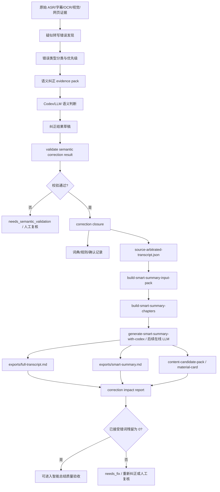

# 转写语义纠错到智能总结质量闭环目标

更新时间：2026-07-06
执行者：Codex / GPT-5
项目：`video-knowledge-pipeline`

## 0. 文档入口

本文件记录“转写语义纠错如何影响智能总结质量”的目标修正。更完整的通用闭环设计见：

- `docs/asr-subtitle-semantic-correction-loop-design-2026-07-07.md`
- `docs/general-asr-subtitle-semantic-correction-loop-detailed-spec-2026-07-07.md`

## 1. 目标修正

这个目标不能只叫“术语仲裁”。

术语、工具名、产品名当然是高优先级纠错对象，但用户真正需要的是：

> 凡是 ASR、平台字幕、自带字幕中可能被识别错，并且能被上下文、画面、OCR/ebook、多模态、网页简介、人工标注或全片语义证明的词语，都应该进入语义纠正流程。高置信纠正结果应进入纠正版 transcript，再影响 `full-transcript.md`、`smart-summary.md` 和内容素材候选。

所以本文档使用更准确的名称：**转写语义纠错闭环**。

`term arbitration` 是其中一个子模块，负责工具名、术语、品牌名、人名、产品名等高价值实体；但整个闭环还要覆盖数字、时间、动作、普通关键词、行业概念、课程步骤、口误/听错词等更广泛的 ASR 错误。

## 2. 背景

当前 VKP 已经具备多层人类可读输出：

| 层级 | 主要产物 | 作用 |
| --- | --- | --- |
| 证据审计层 | `exports/knowledge-note.md`、`exports/extraction-audit.md` | 保留证据、风险、时间线、缺口和处理过程。 |
| 逐字稿层 | `exports/full-transcript.md`、`normalized-transcript.json`、`source-arbitrated-transcript.json` | 告诉用户视频说了什么，是后续总结的主要语料。 |
| 智能总结层 | `exports/smart-summary.md`、`exports/smart-summary.codex.md` | 面向阅读、复用、笔记迁移的成品总结。 |
| 内容素材层 | `exports/content-candidate-pack.*`、`exports/content-material-card.*` | 给内容资产/朋友圈/下游 agent 的候选素材，不允许自动发布。 |

现在的问题不是“有没有识别出一些术语”，而是：

> 如果 ASR/字幕里有错词，且其他证据足以说明它错了，那么最终人类可读文件不应该继续继承这个错词。

只生成 `term-arbitration-codex-pack.json`、`term-arbitration-glossary.json` 或 `term-correction-status` 不够；真正完成的标准是纠正结果进入最终可读输出。

## 3. 核心目标

建立一条可验证的闭环：

```text
ASR / 平台字幕 / 自带字幕 / OCR-ebook / 多模态 / 网页简介 / 全片上下文
  -> 转写疑似错误发现
  -> 按错误类型分流：术语实体 / 数字金额 / 动作步骤 / 普通错词 / 低置信冲突
  -> Codex 代替在线 LLM 做语义纠正判断
  -> 校验纠正结果
  -> 写入纠正版 transcript 和必要词典
  -> 基于纠正版 transcript 生成 smart-summary 输入包
  -> Codex/LLM 生成最终智能总结
  -> 影响报告确认错词不再残留在最终人类可读文件
```

这个目标的关键词是“**纠正最终输出**”，不是“多生成一个中间文件”。

## 4. 哪些词语应该进入语义纠正

| 类别 | 例子 | 证据来源 | 处理优先级 |
| --- | --- | --- | --- |
| 工具名 / 产品名 | `play right m c p` -> `Playwright MCP`，`browser base` -> `Browserbase` | OCR、网页标题、上下文、工具清单 | 最高 |
| 人名 / 公司名 / 品牌名 | 讲师、公司、平台、项目名 | 视频标题、简介、画面文字、网页元数据 | 高 |
| 行业术语 / 课程概念 | 保险、外贸、跨境、电商、量化、浏览器自动化术语 | 全片语义、课件、字幕对比 | 高 |
| 数字 / 金额 / 时间 | `一万刀`、`16k`、年份、比例、步骤编号 | 画面表格、字幕、上下文重复 | 高，但需谨慎 |
| 操作动作 / 步骤词 | 点击、登录、打开、导入、注册、复盘 | 连续帧、多模态、软件界面状态 | 中高 |
| 普通 ASR 错词 | 听起来合理但语义不通的词 | 上下文、语言模型、重复出现 | 中 |
| 标点 / 断句错误 | 句子边界错、列表结构错 | 语义段落、停顿、字幕时间戳 | 中 |
| 低置信冲突 | 多证据互相矛盾 | 人工审核 | 不自动覆盖 |

## 5. 为什么需要大模型语义纠正

ASR 错误不能只靠字符串规则解决，因为：

| 问题类型 | 示例 | 为什么规则不够 |
| --- | --- | --- |
| 英文专名被拆碎 | `play right m c p`、`browser base` | 需要根据上下文判断真实工具名。 |
| 字幕来源本身也可能错 | B站字幕、平台字幕很多也是 ASR | 不能把“自带字幕”默认当真。 |
| 画面比声音更可靠 | 屏幕上写着工具名或金额 | 需要 OCR/ebook/多模态证据参与仲裁。 |
| 普通词语也会影响理解 | 把“获取信任”识别成别的词 | 会直接扭曲课程方法论。 |
| 数字和金额风险高 | `1w刀`、`1500万`、`16k底薪` | 一旦错，智能总结和内容素材会严重误导。 |
| 全片语义才能判断 | 单句看不出，后面反复解释才知道 | 需要跨片段语义记忆和章节上下文。 |

因此第一版不必马上接在线文本 LLM，但必须允许“Codex 暂时代替在线 LLM API”承担语义判断角色。后续真正接入在线 LLM 时，也应复用同一 evidence pack、结果 schema、校验器和影响报告。

## 6. 输入证据

语义纠错不是只看 ASR。它应综合以下材料：

| 输入 | 代表产物 | 用途 |
| --- | --- | --- |
| 本地 ASR | `normalized-transcript.json`、`normalized-transcript.srt` | 提供完整语音文本和时间戳。 |
| 平台字幕/自带字幕 | platform subtitle sidecar、自带字幕导入产物 | 与本地 ASR 互相比对，发现候选错词。 |
| OCR/ebook 图文解析 | `visual_text`、`structured_visual`、ebook pipeline 结果 | 屏幕出现的词、表格、代码、课程标题常比 ASR 更准。 |
| 多模态单帧/多帧理解 | `visual_understanding`、`temporal_visual_understanding` | 判断画面展示的对象、操作、页面状态或动作。 |
| 网页简介/标题/元数据 | 视频标题、简介、合集信息、课程页文字 | 提供人名、课程名、工具名和主题词。 |
| 时间线和打标器 | timeline item、标签、章节/重点/疑难标签 | 给疑似错词赋权，重点片段、工具名片段、数字片段优先。 |
| 已有词典/用户确认 | `term-arbitration-glossary.json`、人工 review notes | 避免重复判断，保护用户已确认术语。 |
| 全片语义上下文 | `smart-summary-input-pack`、章节包、long-video memory | 防止只看局部一句话导致误判。 |

## 7. 目标数据流



## 8. 现有术语仲裁模块在新目标里的位置

当前已有 `term-arbitration-codex`，它仍然有价值，但应该被视作“语义纠错”的专名子模块：

| 现有模块 | 在新目标中的角色 |
| --- | --- |
| `term-arbitration-codex` | 高价值实体纠错：工具名、产品名、品牌名、行业术语。 |
| `validate-term-arbitration-codex-result` | 语义纠错校验器的先行实现，要求 rationale、evidence indexes、candidate id。 |
| `term-correction-closure` | 把高置信纠正写入词典和纠正版 transcript。 |
| `term-correction-impact-report` | 检查已接受 alias 是否还残留在最终输出。 |
| `term-correction-status` | 给 UI/MCP/OpenClaw 暴露下一步动作。 |

后续可以扩展为更通用的命名，例如：

- `transcript-semantic-correction-pack`
- `validate-transcript-semantic-correction`
- `transcript-semantic-correction-closure`
- `transcript-semantic-correction-impact-report`

但第一阶段可以复用现有 term 入口，先把“工具名/术语以外的错词”也纳入 evidence pack 和纠正版 transcript 的设计中。

## 9. 关键产物定义

| 产物 | 责任 | 完成标准 |
| --- | --- | --- |
| `semantic-correction-pack.json` 或现阶段 `term-arbitration-codex-pack.json` | 收集候选错词、原始提及、证据位置、上下文 | 每个候选必须有 `candidate_id`、错误类型、原始文本、建议纠正、时间段和证据索引。 |
| `semantic-correction-prompt.md` 或 `term-arbitration-codex-prompt.md` | 给 Codex/LLM 的语义判断提示 | 明确要求输出 canonical/corrected text、confidence、semantic rationale、evidence indexes。 |
| `semantic-correction-result.codex.md` 或 `term-arbitration-codex-result.codex.md` | Codex 可填写的人类可编辑回复草稿 | 不应被当作已确认结果；必须通过 validate。 |
| `semantic-correction-result.json` 或 `term-arbitration-codex-result.json` | 校验通过后的结构化结果 | 只有通过 schema 和语义最低要求的结果才能进入 closure。 |
| `term-arbitration-glossary.json` | 专名/术语词典 | 只包含通过校验的高置信术语实体。 |
| `source-arbitrated-transcript.json` | 纠正版 transcript | 应成为智能总结优先输入，保留时间戳、原文、纠正文、来源和置信度。 |
| `correction-impact-report.json/md` 或现阶段 `term-correction-impact-report.*` | 影响报告 | 证明已接受错词已从最终人类可读输出中消失。 |
| `exports/smart-summary.md` | 最终智能总结 | 必须基于纠正版 transcript，而不是继续吃 raw ASR。 |

## 10. 纠正结果 schema 应覆盖的字段

每条纠正建议至少应包含：

| 字段 | 说明 |
| --- | --- |
| `candidate_id` | 和 evidence pack 中候选对应。 |
| `correction_type` | `term`、`proper_noun`、`number`、`action`、`concept`、`ordinary_word`、`punctuation`、`segment_boundary` 等。 |
| `original_text` | ASR/字幕原文中的错误或疑似错误片段。 |
| `corrected_text` | 建议写入纠正版 transcript 的文本。 |
| `canonical` | 如果是实体/术语，记录标准写法。普通错词可以为空。 |
| `aliases` | 可被替换的错词形态。 |
| `confidence` | 纠正置信度。 |
| `evidence_indexes` | 支撑判断的证据索引。 |
| `evidence_sources` | ASR、平台字幕、OCR、视觉、网页简介、人工标注等。 |
| `semantic_rationale` | 为什么这样纠正，而不是只说“看起来像”。 |
| `time_range` | 对应视频时间段。 |
| `safe_to_apply` | 是否可自动进入纠正版 transcript。 |
| `needs_human_review` | 是否需要人工确认。 |

## 11. Codex 代替在线 LLM 的边界

当前阶段允许 Codex 作为“在线文本 LLM API 的人工/本地替身”，但必须遵守这些边界：

1. Codex 的输出不是自动可信事实。
2. Codex 必须引用 evidence indexes / 时间段 / 原始提及。
3. 没有 `semantic_rationale` 的结果不能被接受。
4. 没有 `candidate_id` 的结果不能被接受。
5. 高置信覆盖只允许进入纠正版 transcript；原始证据层不得被覆盖。
6. 数字、金额、事实性结论的纠正阈值应高于普通词语。
7. 低置信、冲突、不确定项进入人工 review，而不是静默替换。
8. 后续接在线 LLM 时，仍然必须走同一 validate 和 impact gate。

## 12. 最终人类可读文件如何受影响

### 12.1 `full-transcript.md`

目标：显示纠正版逐字稿。

优先级应为：

```text
source-arbitrated-transcript.json
  > corrected transcript sidecar
  > normalized-transcript.json
  > timeline transcript fallback
```

如果 `source-arbitrated-transcript.json` 存在并通过质量策略，则 `full-transcript.md` 不应继续显示已接受的错误文本。

### 12.2 `smart-summary.md`

目标：基于纠正版 transcript 做综合总结。

`smart-summary.md` 的输入优先级应为：

```text
source-arbitrated transcript
+ smart-summary-input-pack evidence trace
+ smart-summary-chapters citation digest
+ OCR/ebook/visual evidence
+ review gaps / known risks
```

如果智能总结仍然基于 raw ASR，则语义纠错链路对最终质量没有真正生效。

### 12.3 `content-candidate-pack` 和 `content-material-card`

目标：下游内容资产候选也不能继承已接受错词。

内容素材候选必须继承：

- 纠正版 transcript 中的 corrected text；
- 已确认 canonical terms；
- `smart-summary` 章节引用；
- 语义纠错影响报告状态；
- `publication_allowed=false`、`allowed_as_fact=false`、`review_required=true` 的安全边界。

## 13. 状态机

| 状态 | 含义 | 下一步 |
| --- | --- | --- |
| `missing` | 没有语义纠错产物 | 运行疑似错误发现/纠错 pack。 |
| `draft_ready` | 已生成 Codex prompt 和 evidence pack | 让 Codex/LLM 填写纠正结果。 |
| `needs_semantic_validation` | Codex 回复解析失败、无可接受决策或缺语义依据 | 修改 Codex 回复或人工复核后重新 validate。 |
| `validated` | 纠正结果通过预检 | 运行 closure。 |
| `closure_completed` | 词典、确认记录和纠正版 transcript 已写入 | 运行 transcript arbitration / summary input pack / export。 |
| `impact_needs_fix` | 最终输出仍有已接受错词残留 | 重新 closure、重新导出或人工修订。 |
| `impact_passed` | 已接受错词残留清零 | 可以进入智能总结质量验收。 |

## 14. 验收标准

这个目标完成，必须同时满足下面条件：

1. 系统能从 ASR、字幕、OCR/ebook、多模态、网页简介和上下文中发现疑似转写错误。
2. 疑似错误不局限于工具名/术语，也包括数字、动作、普通错词、课程概念和断句问题。
3. `term-correction-status` 或后续通用 `semantic-correction-status` 能告诉 agent 当前下一步是什么。
4. Codex substitute 暴露 prompt、evidence pack、result template、validate 命令、closure 命令。
5. `task-console.html` / `video-workbench.html` 能展示语义纠错入口和 args。
6. `content-asset-status`、`batch-content-asset-status`、`content-handoff-pack` 能把纠错闭环的 MCP args 传给下游 agent。
7. validate 会拒绝缺少语义依据、证据索引、候选 ID 的结果。
8. closure 会生成或更新纠正版 transcript，并记录纠正来源和置信度。
9. `full-transcript.md` 优先读取纠正版 transcript。
10. `smart-summary-input-pack` 明确记录使用的是纠正版 transcript，并带上语义纠错状态。
11. `smart-summary.md` 由纠正版 transcript / evidence pack 生成，不继续基于 raw ASR。
12. impact report 能检查最终人类可读文件里的已接受错词残留。
13. 当最终输出仍有已接受错词残留时，智能总结质量门禁不能通过。
14. 低置信项仍保留为人工复核任务，不自动覆盖。

## 15. 推荐命令链

现阶段先复用术语仲裁命令作为高价值子集入口：

```powershell
# 1. 生成 Codex 语义仲裁包；当前主要覆盖术语/工具名，后续扩展普通错词
.\scripts\video-knowledge.ps1 term-arbitration-codex <webui-bundle>

# 2. 让 Codex/人工填写 term-arbitration-codex-result.codex.md 后，先校验
.\scripts\video-knowledge.ps1 validate-term-arbitration-codex-result `
  <webui-bundle> `
  --input-json <webui-bundle>\term-arbitration-codex-result.codex.md

# 3. 校验通过后写入术语词典和纠正版 transcript
.\scripts\video-knowledge.ps1 term-correction-closure `
  <webui-bundle> `
  --input-json <webui-bundle>\term-arbitration-codex-result.codex.md

# 4. 检查纠正是否真正进入纠正版 transcript / 最终导出
.\scripts\video-knowledge.ps1 term-correction-impact-report <webui-bundle>

# 5. 生成智能总结输入包和章节证据
.\scripts\video-knowledge.ps1 build-smart-summary-input-pack <webui-bundle>
.\scripts\video-knowledge.ps1 build-smart-summary-chapters <webui-bundle>

# 6. 生成/安装 Codex 智能总结
.\scripts\video-knowledge.ps1 generate-smart-summary-with-codex <webui-bundle>

# 7. 重新导出人类可读文件
.\scripts\video-knowledge.ps1 export-knowledge-note <webui-bundle>

# 8. 给下游 agent 检查内容资产和纠错闭环状态
.\scripts\video-knowledge.ps1 content-asset-status <webui-bundle>
```

后续通用化后，推荐新增或迁移到：

```powershell
.\scripts\video-knowledge.ps1 transcript-semantic-correction-pack <webui-bundle>
.\scripts\video-knowledge.ps1 validate-transcript-semantic-correction <webui-bundle> --input-json <result>
.\scripts\video-knowledge.ps1 transcript-semantic-correction-closure <webui-bundle> --input-json <result>
.\scripts\video-knowledge.ps1 transcript-semantic-correction-impact-report <webui-bundle>
```

## 16. UI 和下游 agent 要看到什么

### 16.1 任务控制台 / 工作台

应显示：

- 当前语义纠错状态；
- 错误类型分布：术语、数字、动作、普通词、断句；
- Codex prompt 路径；
- evidence pack 路径；
- Codex result 草稿路径；
- validate args；
- closure args；
- impact report；
- 是否阻塞 smart-summary 质量门禁。

### 16.2 OpenClaw / 内容资产线程

应读取结构化字段，而不是解析命令字符串：

- `semantic_correction_status` 或现阶段 `term_correction_status`
- `semantic_validation_status` 或现阶段 `term_validation_status`
- `next_action_key`
- `optional_next_actions`
- `optional_next_action_artifacts`
- `validation_rejection_reasons`
- `final_export_alias_total` / `final_export_residual_error_total`

现阶段 `term_optional_next_action_artifacts` 至少应能指向：

- `mcp-term-arbitration-codex.args.json`
- `mcp-term-arbitration-codex-validate.args.json`
- `mcp-term-correction-closure-codex.args.json`
- `mcp-term-correction-impact-report.args.json`

## 17. 质量门禁

### 17.1 纠正结果门禁

可接受结果必须满足：

- 有 `candidate_id`；
- 有 `correction_type`；
- 有 `original_text`；
- 有 `corrected_text`；
- 有 `confidence`；
- 有 `semantic_rationale`；
- 有 `evidence_indexes`；
- 不确定项标记 `needs_human_review=true`；
- 不能把低置信项直接覆盖到最终 transcript；
- 数字/金额/事实性词语必须有更强证据或人工确认。

### 17.2 智能总结门禁

`smart-summary.md` 通过质量门禁前，必须满足：

- 覆盖完整视频时长；
- 不是 ASR 大段复制；
- 一句话概览不是关键词拼接；
- 分段总结时间范围完整；
- 关键观点和动作清单覆盖全片；
- 引用 OCR/视觉证据时真实存在对应证据；
- 视觉未执行时明确写“视觉证据未执行/待复核”；
- 语义纠错影响报告通过，或者明确标记为 draft/needs_fix。

### 17.3 影响报告门禁

impact report 应检查：

| 检查对象 | 要求 |
| --- | --- |
| 原始 ASR / timeline | 可以保留原始错词，因为它是证据。 |
| 纠正版 transcript | 不应保留已接受错误文本。 |
| `full-transcript.md` | 不应保留已接受错误文本。 |
| `smart-summary.md` | 不应保留已接受错误文本。 |
| 内容素材候选 | 不应保留已接受错误文本。 |

## 18. 非目标

本目标不包含：

- 自动相信 Codex 或任意在线 LLM；
- 自动发布内容；
- 自动写回 Logseq/Obsidian 正式库；
- 覆盖原始证据；
- 把所有低置信疑似错误强制替换；
- 绕过人工复核；
- 重新开发 ASR/OCR/多模态引擎。

## 19. 当前已具备的基础

截至 2026-07-06，本项目已经具备以下基础：

- `term-arbitration-codex` 能生成 Codex 术语仲裁 evidence pack、prompt 和可填写 result stub。
- `validate-term-arbitration-codex-result` 已承担语义依据、证据索引、候选 ID 等预检职责。
- `term-correction-status` 已能返回 `codex_substitute`，方便 Codex 暂时代替在线文本 LLM。
- `task-console.html` 和 `video-workbench.html` 已能展示术语闭环入口。
- `content-asset-status` / batch / handoff 已能把 Codex 术语闭环 args 暴露给下游 agent。
- `smart-summary-input-pack`、`smart-summary-chapters`、`generate-smart-summary-with-codex` 已形成智能总结证据包和 Codex-first 生成链路。

## 20. 剩余开发重点

下一步应该集中补这些地方：

1. **从术语纠错扩展到通用语义纠错**
   把数字、动作、普通错词、课程概念、断句错误纳入候选发现和 evidence pack。

2. **纠正版 transcript 优先级核验**
   确认 `full-transcript.md`、`smart-summary-input-pack`、`smart-summary.md` 都优先使用 `source-arbitrated-transcript.json`。

3. **影响报告扩大覆盖面**
   确认影响报告同时检查 `full-transcript.md`、`smart-summary.md`、`content-candidate-pack` 和素材卡。

4. **智能总结质量门禁强化**
   当语义纠错影响报告未通过时，`smart-summary-quality` 必须返回失败或 draft 状态。

5. **真实视频回归样例**
   用包含明显 ASR 错词的视频做回归：浏览器自动化工具横评类视频可验证工具名；课程类长视频可验证普通概念、数字和动作步骤。

6. **UI 一键闭环**
   在任务控制台/工作台里让用户看到“生成疑似错误包 -> 填写 Codex 回复 -> 校验 -> 写入 -> 影响报告 -> 重导出”的进度和失败项。

## 21. 完成判定

只有当下面这句话为真，目标才算完成：

> 对一个存在 ASR/字幕错识别的真实视频，VKP 能综合 ASR、平台字幕、自带字幕、OCR/ebook、多模态、网页简介和上下文语义生成高置信纠正判断；这些判断通过校验后进入纠正版 transcript；最终 `full-transcript.md`、`smart-summary.md` 和内容素材候选不再保留已接受错误文本；影响报告证明残留为 0；低置信项仍保留为人工复核任务。

如果只能看到中间词典、状态面板或命令入口，而最终人类可读文件没有改善，就不算完成。
